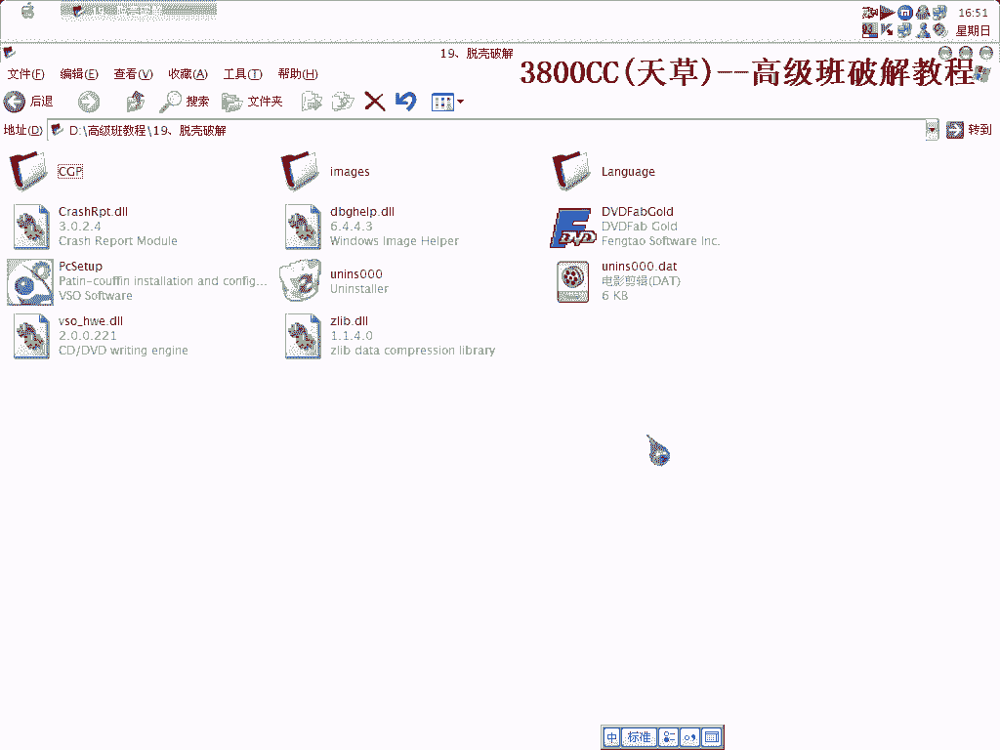
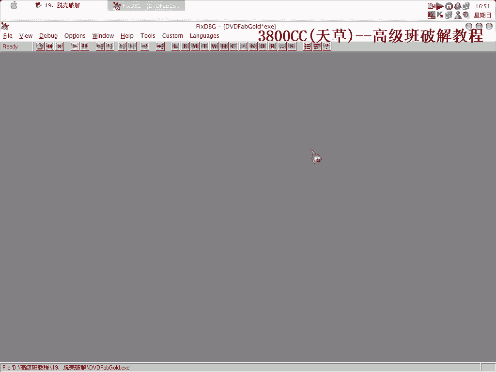
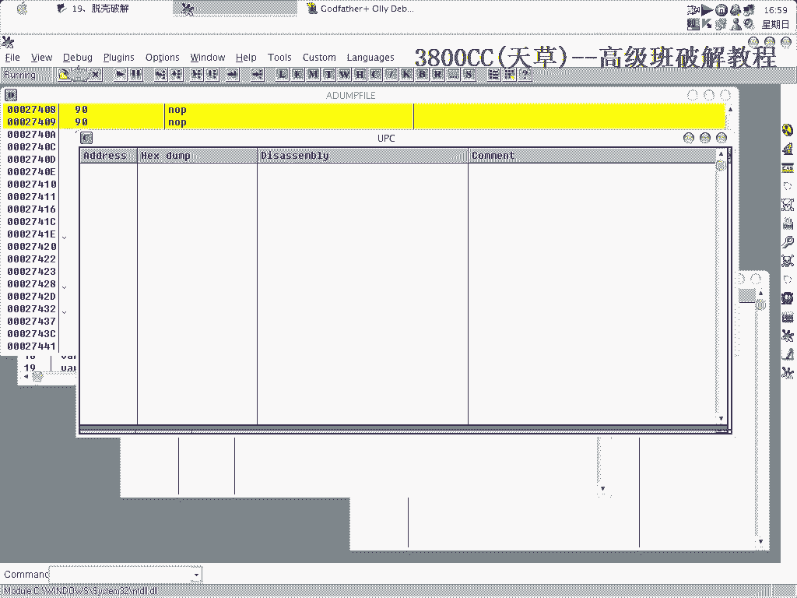
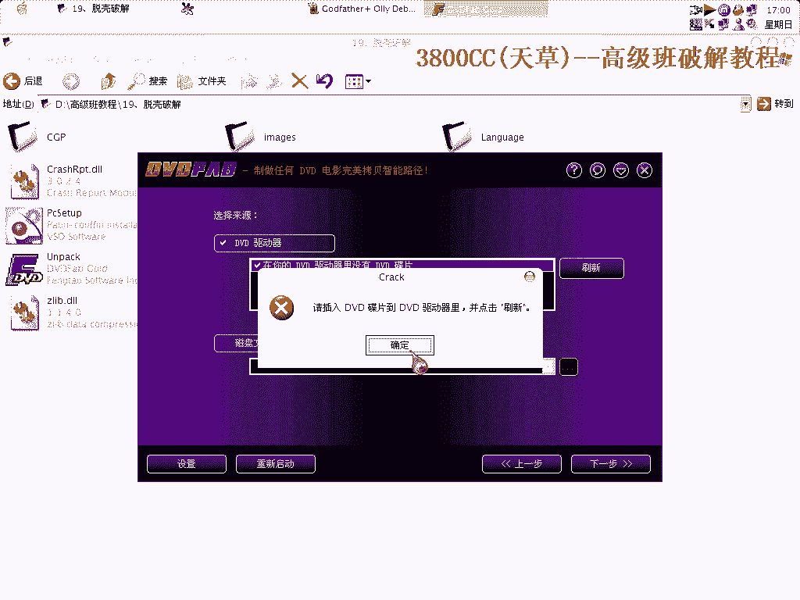
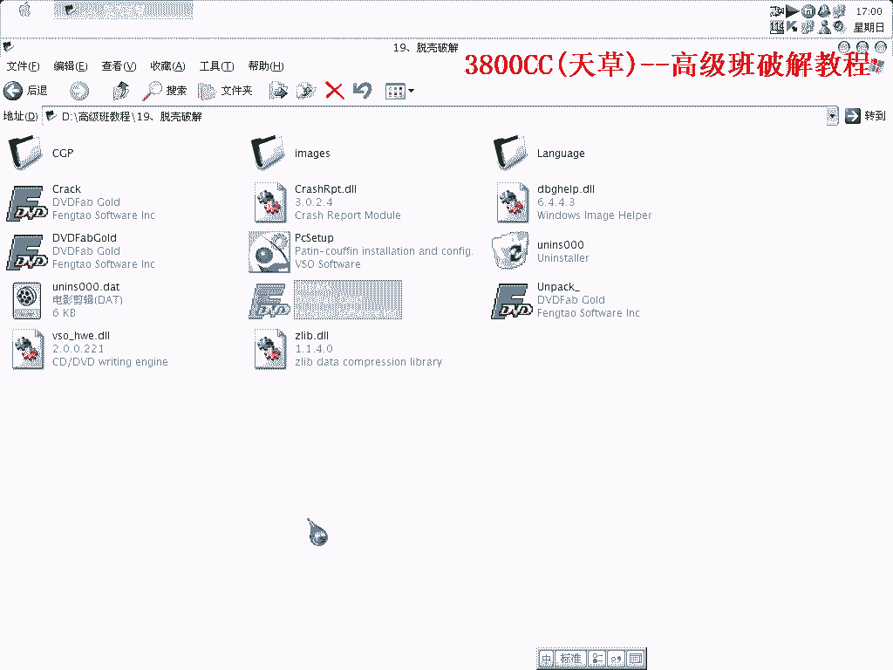

# 天草高级班 - P19：脱壳破解实战 🛡️➡️🔓

在本节课中，我们将学习一个针对特定加壳程序的脱壳与破解实战过程。课程基于Azure Talk的教程，并重点演示如何使用脚本自动化完成脱壳，避免繁琐的手动操作。

## 课程概述 📋

本节课的核心是处理一个没有`int 3`异常的程序。我们将通过忽略所有异常并运行预设脚本的方式，快速定位到程序的原始入口点（OEP），从而完成脱壳。

## 分析程序异常 🔍

首先，我们需要分析目标程序的异常情况。

观察发现，该程序没有`int 3`异常。因此，我们的策略是忽略所有异常，直接运行到最后一次异常发生的位置。

记录下最后一次异常的地址为`AF-46`，这个位置就是程序的OEP。这个过程无需手动演示。

## 使用脚本自动化脱壳 🤖

上一节我们确认了OEP的位置，本节中我们来看看如何利用脚本高效完成脱壳。

我们需要执行的操作是：**忽略所有异常，然后运行脚本**。这个脚本是事先准备好的，因为目标程序没有使用`Stone Cold`保护，所以用此脚本处理非常合适。

当然，手动脱壳也是可行的，但过程会非常劳累。

以下是执行脚本后程序运行至OEP的界面示意：

通过脚本自动化运行，程序顺利在OEP处中断，为后续的修复和转储操作做好了准备。

## 总结 🎯

本节课中我们一起学习了针对无`int 3`异常程序的脱壳方法。核心步骤是**忽略所有异常并运行自动化脚本**，从而快速、准确地定位到原始入口点（OEP）。这种方法相比手动跟踪，极大地提升了效率。