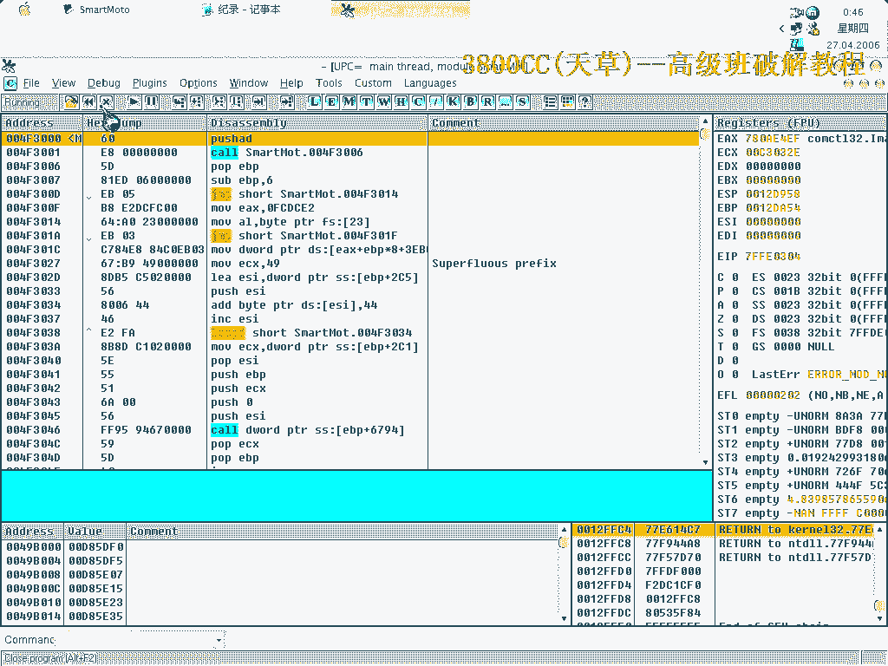
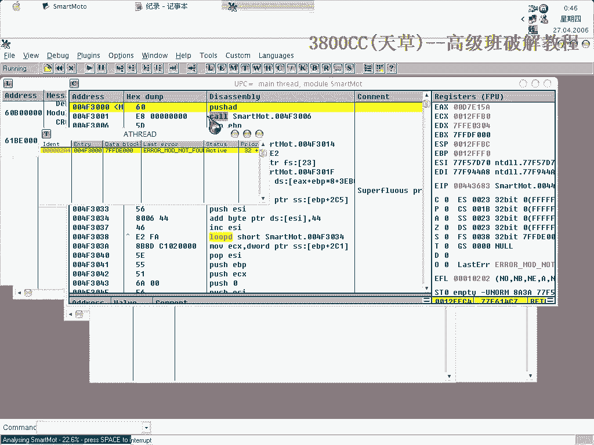
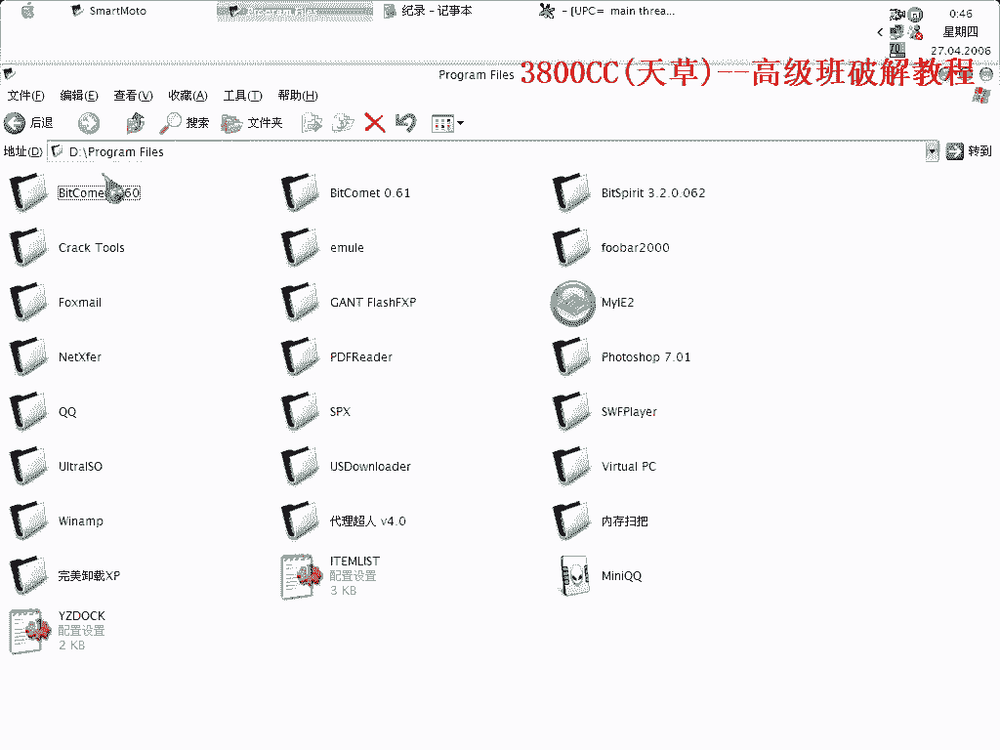
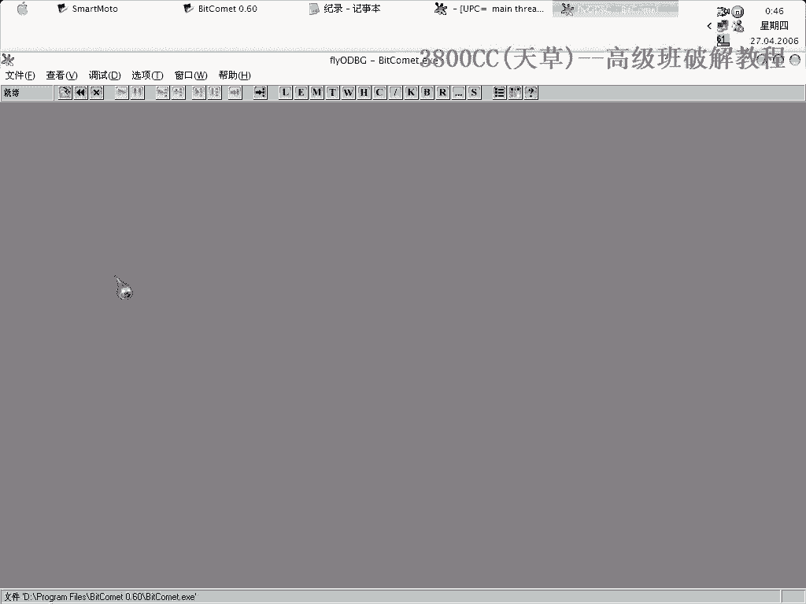
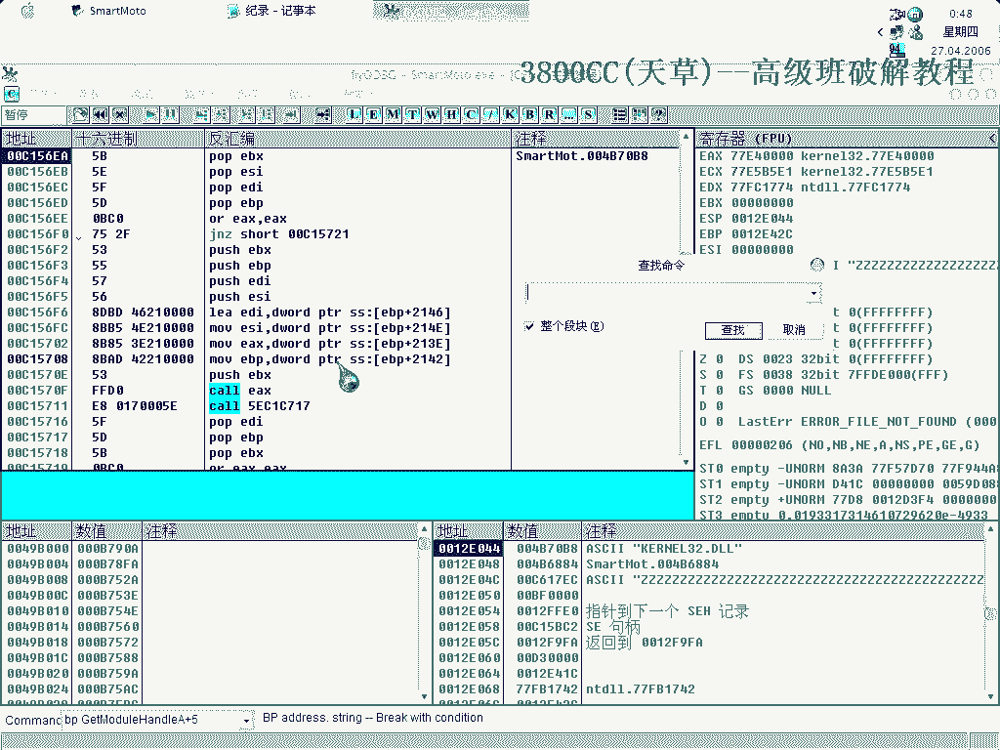
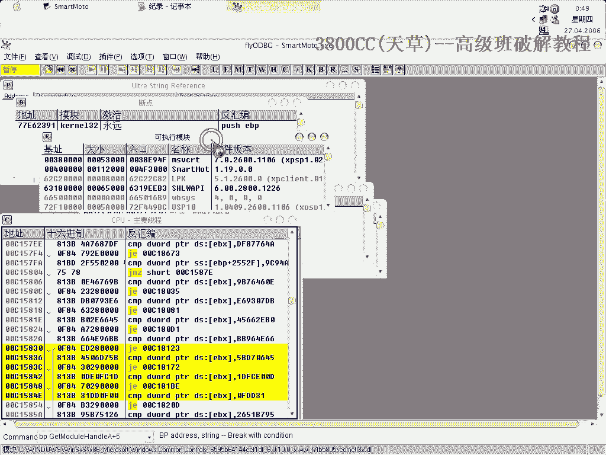
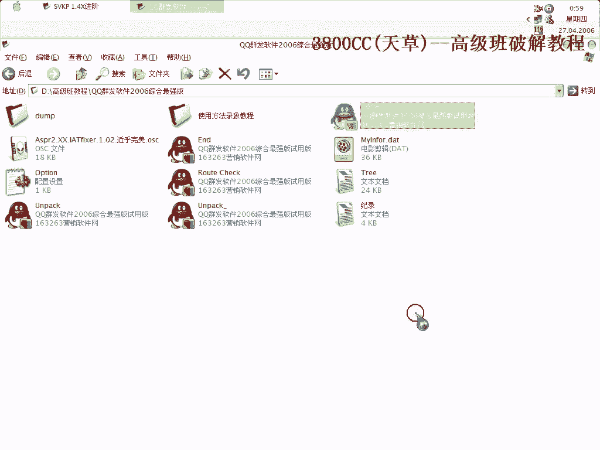

# 天草高级班 - P2：SVKP 1.4X进阶脱壳教程 🛡️➡️📦

## 概述
在本节课中，我们将学习如何对一个使用SVKP 1.4X加壳的程序进行手动脱壳。我们将从定位原始入口点开始，逐步处理反调试函数和加密调用，最终完成输入表修复和区段重建，以获取可正常运行的原程序。

---

## 第一步：定位原始入口点（OEP）

首先，我们需要探测程序的原始入口点。为了快速完成，我们将使用特定工具进行探测。

以下是探测OEP的步骤：

1.  加载加壳程序并激活探测功能。
2.  工具会中断在OEP附近。如图所示，此处即为OEP。
    
3.  确认OEP地址。同时可以观察到，入口点处的7个字节被壳抽取了。这通常是`Push 60`等指令。
    
4.  为了验证，可以单步执行`Push`指令，观察其值被压入的位置，从而确认OEP和被抽取的字节。

---

## 第二步：处理反调试与加密调用

上一节我们定位了OEP，本节中我们来看看如何绕过壳的反调试机制。

在OEP之后，需要查找一个关键特征码。找到的位置会与之前版本有所不同。

以下是关键特征的分析与处理步骤：

1.  在特征位置，可以看到`GN1`、`GNZ`等指令。这些是壳的反调试函数。
2.  与之前处理方法不同，本次需要将程序流程跳转至`KUR`模块的加载处。
3.  接着会遇到反调试函数和DLL加密调用。如图所示，需要修改此处调用，否则会指向`user32`的加密函数。
    
4.  修改方法是将相关调用全部改为`NOP`或直接跳转，从而绕过加密检查。

完成修改并跳转后，即可进行下一步。

---

## 第三步：中断执行与修复准备

处理完反调试后，我们需要让程序执行到OEP的修复点。

以下是设置断点与中断的步骤：

1.  在关键跳转后的地址设置断点。
2.  运行程序，程序会在加密代码执行时中断。有时需要暂停后再继续才能成功断下。
3.  删除硬件断点，让程序继续执行。通常会中断三次。
4.  最终，程序会停在OEP的解释代码处，例如地址`12FSC`。此时单步跟踪，可以看到被抽取的原始字节（例如`49F390`）被恢复。

此时，将EIP设置为OEP，即可准备进行最终的脱壳操作。

---

## 第四步：修复输入表与转储程序

现在程序已到达OEP，我们需要将其从内存中转储并修复。

以下是使用工具进行转储和初步修复的步骤：

1.  使用脱壳工具的“转储”功能，指定OEP地址（例如`436 CC`）。
2.  尝试修复输入表，选择“全部有效”。
3.  初步修复后，运行程序可能会报错或引发异常。这表明还有未处理的加密区段。

---

## 第五步：处理异常与重建区段

上一节修复后程序仍无法运行，本节我们通过处理异常来定位和修复缺失的区段。

程序报错通常是因为访问了被壳加密或混淆的内存区段。

以下是定位和修补区段的步骤：

1.  在调试器中设置“忽略内存访问异常”，让程序运行直到尝试访问无效内存时中断。
2.  中断后，查看引发异常的地址（例如`D47D0D02`）。这指向一个缺失的区段。
3.  尝试手动计算并在转储文件中添加该区段。例如，使用`LoadPE`等工具，根据异常地址计算区段的`RVA`（相对虚拟地址）和大小。
    *   **公式**：`区段RVA = 异常地址 - 映像基址`
4.  添加新区段后，务必保存文件。
5.  最后，使用修复工具“重建PE头”并修正入口点（OEP）。
6.  完成重建后，新的程序文件应能正常运行，且没有跨平台问题。

这个修补区段的技巧在处理如ASProtect等复杂壳时经常用到，可能需要反复查找和添加多个区段。

---

## 总结
本节课中我们一起学习了手动脱壳SVKP 1.4X的完整流程。关键步骤包括：定位并确认OEP、识别并绕过反调试与加密调用、通过中断到达清理后的代码、转储进程并修复输入表，以及最后通过分析异常来定位和重建缺失的代码区段。掌握这些技巧对于处理同类或更复杂的保护壳至关重要。

