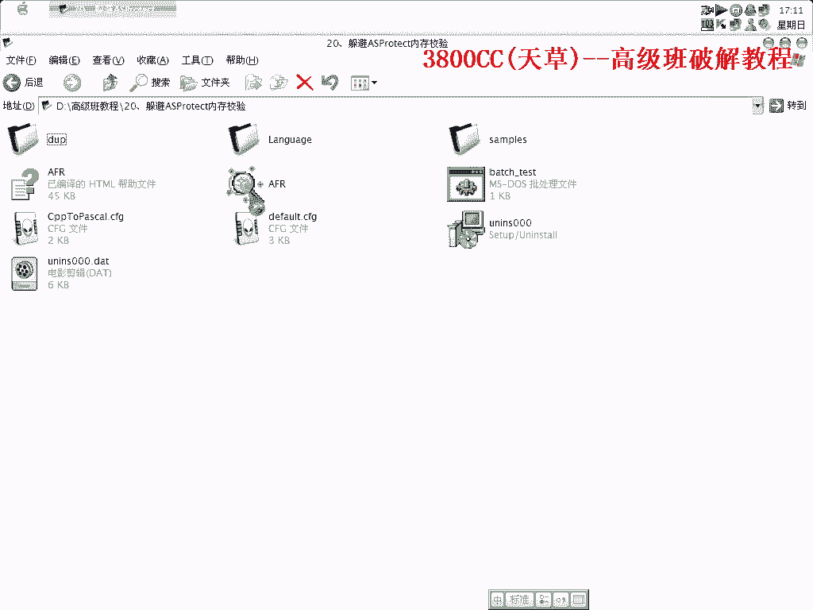
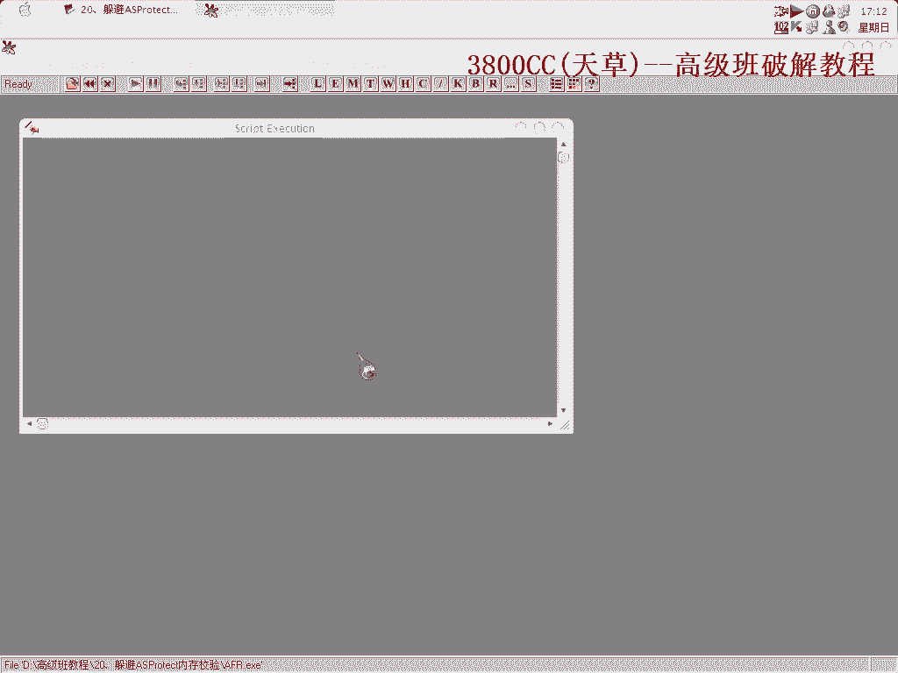
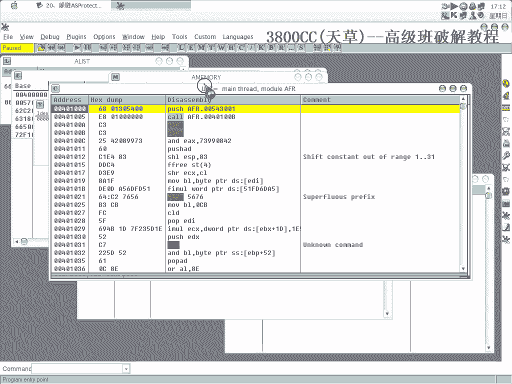
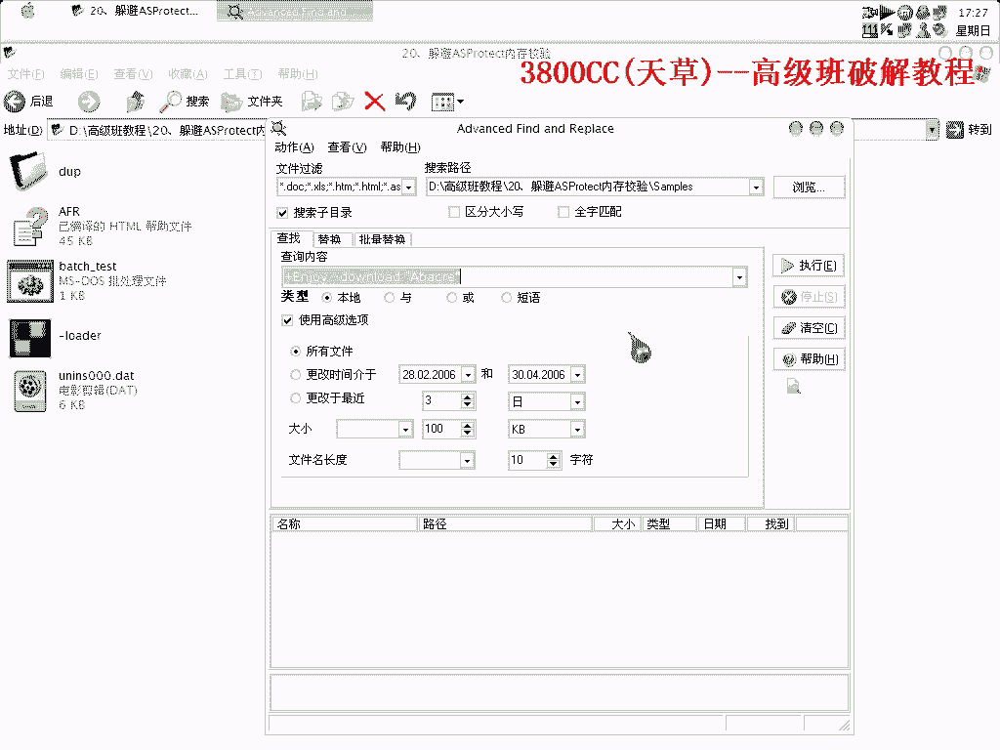

# 天草高级班 - P20：20、躲避ASProtect内存校验 - 白嫖无双 - BV1qx411k7kJ

大家好，這節課呢，我們來人緣還是來不脫口破解它，但是不同的是，我們是需要來躲避S-Protect的一個內存膠原，因為它有CRC膠原內存膠原，很麻煩的一個東西，我們來看一下原程序，這裡有一個什麼。

我還有14天，序話真多，不理它。

我就不信打不開。

首先就忽略Intel 3和指定異常，兩次，然後再打開內存景象，很明顯啊，它這個代碼被偷了，我們來查查支付寸，因為這個有一點特別，看到了，它在這個上面多了這麼一行字，那就搜索支付寸，因為是英文的啊。

我們搜索Day啊，就這裡了，F加十多少多少啊，不管了，雙幾，看到了啊，看到了，這裡有一個Registered Queue啊，我們就在這裡啊，就在這裡，這個地方吧，消耗，影像執行端點，重新來過。

中斷下來了啊，中斷下來了，它不走一下，這個跳轉了啊，這個跳轉了，我們試一下，不要拿跳看一下，會怎麼樣子的，沒任何反應啊，也說那個並不是關鍵跳了，好，希望它跳啊，這裡了啊，這裡。

下面有個Registered Queue啊，這個它跳了啊，我們不能讓它跳，很明顯的是啊，已註冊，已註冊，再另外我們看一下，它這個值是誰給它的啊，看一下這個值是誰給它的，看一下能不能找得到，等一下啊。

這裡，在這個地方消耗影像端點啊，把剛才那個閃掉，好，轉成中，機制，是這麼一個值了啊，上面下一頁硬件，BAT，BAT硬件訪問，這裡呢，是給ECS啊，ECS，再繼續走一下，看一下能不能找得到啊，EP-A啊。

這裡啊，這裡了啊，這裡，EAS-167，看著吧，這樣吧，直接把這個地址換一下吧，176，這個好像在我們有些課裡面有講到過這種思路啊，我們現在來搜索，啊，不是，錯了錯了，點錯了，沒有啊，沒有。

1762631啊，1762631，我們把這個地址記著，ECS裡面的是1762631啊，EAS-A裡面也是這麼一個值，這個不用管它，這個沒有啊，176，2634，1762631啊，這裡也沒有。

看來這裡已經本身就，沒有對它進行放入值了，咳，好，這個地方我們把它改為1吧，啊，對不起，運行看一下，咳，這個地方也有問題，1929，可以啊，可以啊，咳咳，那我們現在用來打補點吧，咳，咳，好的，上機。

選擇它，咳，這裡要記得啊，選上它啊，選上它，虛擬地址模式，我們現在是要把這個，咳，這是55啊，8055，56，57，58，59，60，哦，錯了，56，57，58，59，咳，5A，5B啊，5B啊。

5B原始的400啊，我們要改成01，然後就A，好，我們現在來Save，咳，This is not a good idea，咳，它不認了啊，它不認了，55，51，好，我們來創建一個，它這裡有兩種模式啊。

一個是簡單的loader，一個就是安裝型loader，安裝型loader在前面有一節課程裡面看到過啊，咳，怎麼了，咳，算了，咳，算了，咳，不行嗎，怎麼會不行呢，有點奇怪了，咳，5B啊，原先是00。

現在改成01，咳，這裡能不能使用這個模式啊，試一下，Nopod，對我的房子，咳，不要去，放他媽屁，我操，我已經放入這了，有問題嗎，咳，不行，不行，它檢測到什麼東西了，咳，這個地方我們不能讓它跳啊。

不能讓它跳，那就換一種思路吧，咳，把它給load掉啊，load掉，咳，還是這個要換成這種啊，remove，然後，miniF84，miniF改成90，然後，D呢，484，改90，咳，E呢，48C。

改90啊，然後，F400，改90啊，咳，60，00，改90，61，00，改90，好，5個字節，5個字節，6個，可以，咳，123456，6個字節，好，final5，好，謝謝，謝謝東西，這個，咳，russ。

咳，重新來一點，好，啊，看到了啊，咳，可以，就是有時候可以，有時候不行啊，有時候可以，有時候不行，啊，這就是，它的一個，嗯，內存交易啊，內存交易，那我們得這樣啊，好，把這些斷點都取消掉，F9，F9。

既然它要內存，那我就給它一個內存地址，到到OEP之後，然後在這個地方下，英文寫入斷點，看到了啊，它這個地方在給這個地址啊，給這個地址，0040這個地址啊，那再看一下，咳，再看一下。

它這個地方有一個memory checker，這個是非常好的一個東西啊，004，12345，save一下啊，我們再來看一下，咳，這樣就不會再有了啊，非常完美了，這是其中一種辦法，其中一種辦法，咳，後面。

還有一種辦法，後面會給大家講的，後面會來，就是逃避啊，躲避這個它的內存交易啊，咳，這是一種辦法，好，我這個呢，就保存在這兒的，高級版第二十顆，好，咳，OK了啊，OK了，那這幾顆這個內容啊。

主要就是這一點了，主要就是這一點，教會大家怎麼樣去處理一些突發事件啊，突發事件，像剛才這種，這就是一個突發事件了啊，好了，這集就到這兒，再見。

