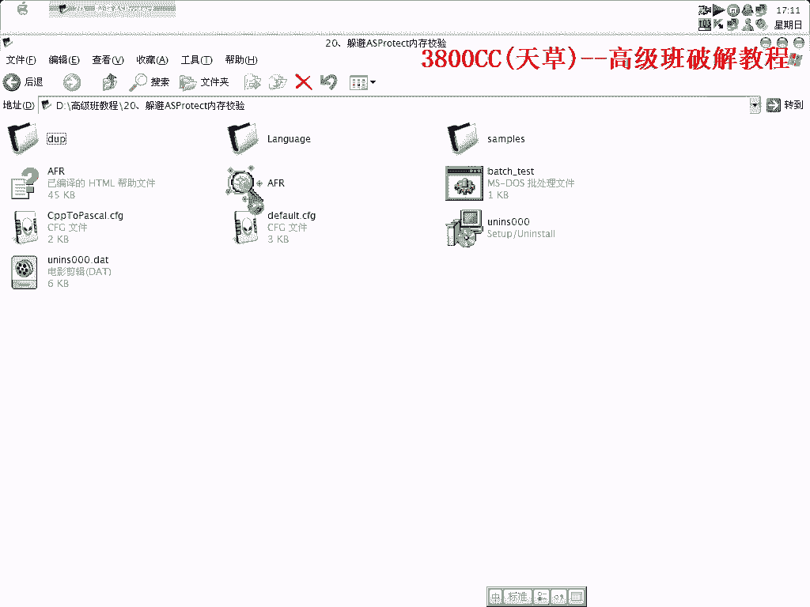
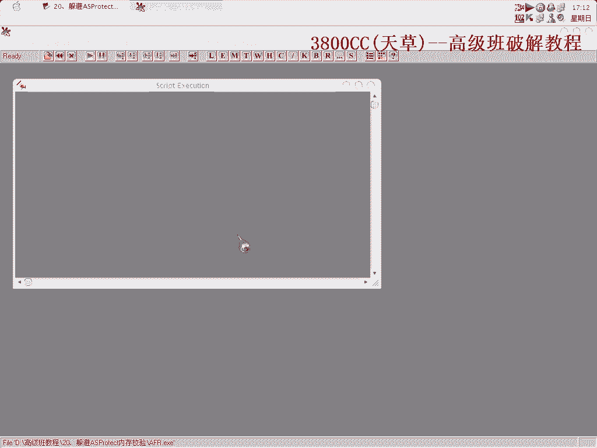
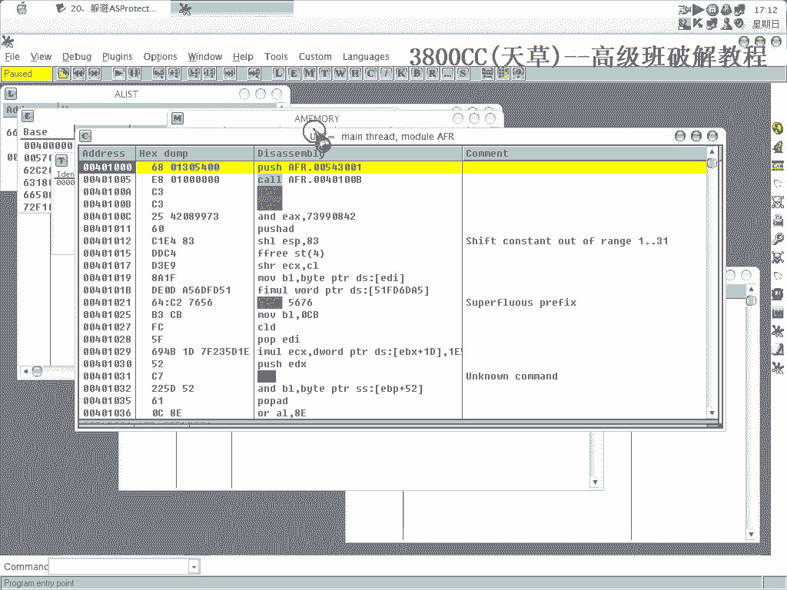

# 天草高级班 - P20：躲避ASProtect内存校验 🛡️

在本节课中，我们将学习如何破解一个受ASProtect保护的软件。与常规破解不同，本次的重点在于**躲避其内存校验机制**，即CRC校验。这是一个比较棘手的问题，我们将通过实践来找到解决方案。



## 初始分析与尝试



首先，我们忽略所有异常并打开目标程序。程序界面显示“我还有14天”，这表明它可能是一个试用版软件。




我们尝试直接运行，但程序无法正常启动。


在调试器中，我们忽略所有异常后，查看内存映射，发现代码段似乎被抽取了。这是一个典型的加壳特征。

## 定位关键字符串

为了找到突破口，我们搜索程序中的字符串。因为是英文程序，我们搜索关键词“Day”。

搜索结果显示了一个地址，附近有字符串“Registered Queue”。这很可能是一个关键判断点。

我们在该地址设置断点并重新运行程序。

程序中断后，我们观察到一个关键跳转。如果执行这个跳转，程序会显示“已注册”状态。我们的目标是**阻止这个跳转发生**。

我们尝试修改跳转条件，但直接修改后程序没有任何反应，说明这并非最底层的校验点。

## 追踪校验值的来源

我们需要找到决定这个跳转的**关键值**是从哪里被写入的。

我们在内存地址上设置**硬件写入断点**，追踪是哪个指令修改了这个关键内存地址的值。

通过单步跟踪，我们发现一个指令将值写入`EAX`寄存器，而这个值最终被用于判断。

我们记录下这个值：`0x1762631`。

## 尝试修改与补丁

我们尝试直接将该内存地址的值修改为`1`，然后运行程序。修改后，程序似乎可以运行了。

于是，我们尝试制作一个内存补丁。在补丁工具中，我们定位到需要修改的字节序列。

原始字节可能是：
```
55 56 57 58 59 60 5A 5B
```
我们需要将其中某个字节（例如偏移处的`0x5B`）从`0x00`改为`0x01`。

然而，当我们保存补丁并应用时，程序检测到了修改并拒绝运行。这表明ASProtect的**内存校验机制**在起作用，它检测到了代码被篡改。

## 实施“躲避”策略

既然直接修改会被检测到，我们就需要换一种思路：**躲避校验**，而不是硬碰硬。

我们不再修改判断值本身，而是修改进行校验的**代码指令**，使其失效。以下是具体步骤：

1.  找到执行校验的几条关键汇编指令。
2.  将这些指令替换为无操作的`NOP`指令（机器码`0x90`）。

例如，我们找到6个字节的校验代码，将其全部替换：
```
原指令： 48 84 ... (示例)
修改为： 90 90 90 90 90 90
```

应用此补丁后，程序成功运行，不再进行内存校验。但这种方法有时不稳定，因为校验可能发生在多处。

## 更稳定的方法：在OEP后处理

为了更稳定，我们采用另一种方法：

1.  让程序正常运行到**原始入口点(OEP)**，即壳解密完原始代码之后。
2.  在OEP之后的代码中，找到写入校验值的内存地址。
3.  在该地址设置**硬件写入断点**。
4.  当程序试图写入校验值时中断，此时我们再修改该值为我们想要的值（例如`1`）。
5.  因为此时壳的校验代码已经执行完毕，我们的修改不会被再次检查。

这种方法利用了时机差，成功地“躲避”了ASProtect的内存校验。

## 总结

本节课我们一起学习了如何应对带有**内存校验**机制的ASProtect壳。

*   我们首先尝试了直接修改关键判断点，但被校验机制阻止。
*   接着，我们学习了通过**修改校验代码为NOP**的方式来使其失效。
*   最后，我们掌握了一种更稳定的方法：**在程序完全脱壳后（OEP之后）**，再拦截并修改关键值，从而巧妙地躲避内存校验。


核心思路在于理解壳的校验逻辑，并选择在合适的时机（校验完成前或完成后）进行操作，避免与其正面冲突。这需要灵活的调试技巧和对程序执行流程的准确把握。