# 天草高级班 - P21：一流QQ挖金子外挂破解教程 💎

在本节课中，我们将学习如何对一个名为“一流QQ挖金子”的外挂程序进行破解分析。课程将重点介绍两种绕过其注册验证机制的方法，并演示如何使用特定工具完成内存补丁的制作。


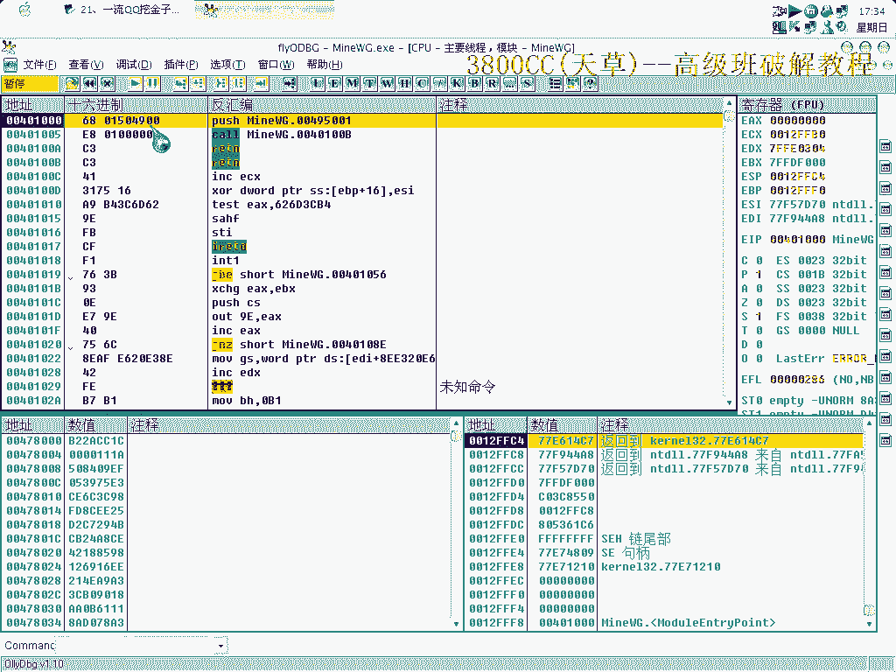

## 课程概述


这个外挂程序最初由姚夏和哈利辛进行了破解分析，但存在一些不稳定的问题。本节课程将作为补充，详细讲解如何稳定地处理其验证流程。程序明显被抽取了代码，我们的目标是找到并修改其关键跳转，以跳过烦人的未注册提示和网页弹窗。

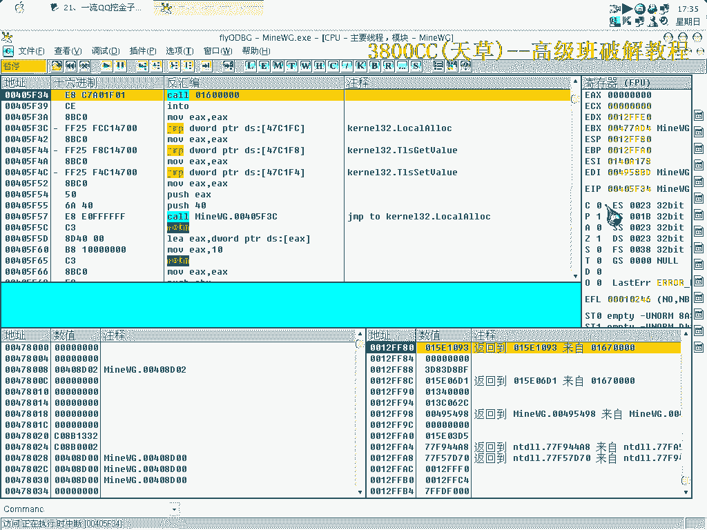

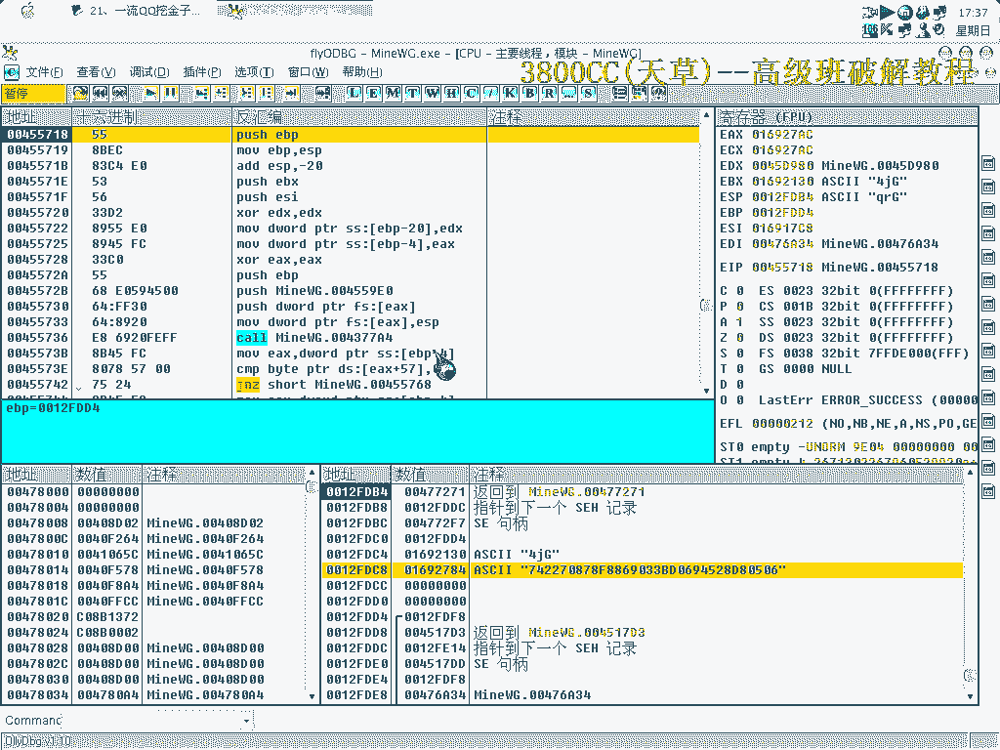

## 分析入口点与关键跳转

首先，我们需要定位程序的原始入口点。通过分析，可以明显看出程序的代码被抽取了。

我们运行程序并删除断点，可以观察到关键的机器码。如果没有注册，程序每次都会打开一个网页，这非常麻烦。通过分析跳转指令，我们找到了导致弹窗和打开网站的关键代码段。


很明显，程序会弹出提示框并打开其网站。我们需要修改这个跳转，将其改为 `NOP` 指令，从而消除注册相关的提示。


## 方法一：使用工具直接修改


这里提供两种处理思路。第一种方法是使用一个外部工具直接进行内存补丁。

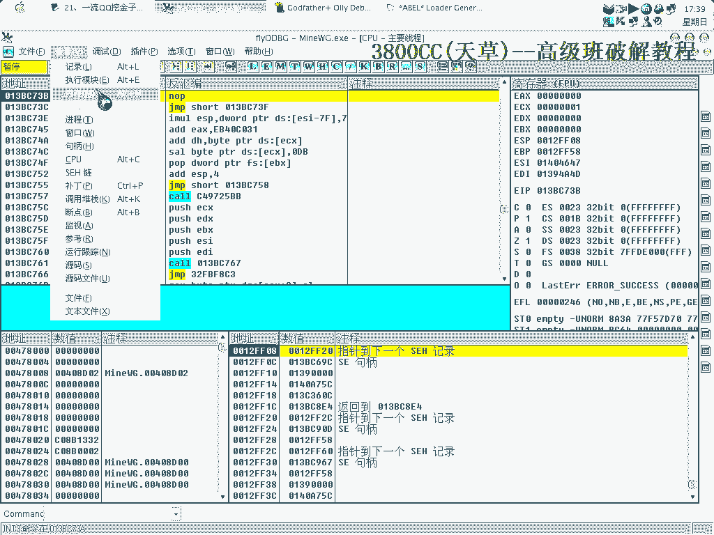

我们将使用一个非常实用的工具。首先，在工具中填入名称，并取消启动提示框。关键步骤是找到目标地址，其指令为 `0F84`。根据上节课的知识，我们需要将其修改为 `90 19`。

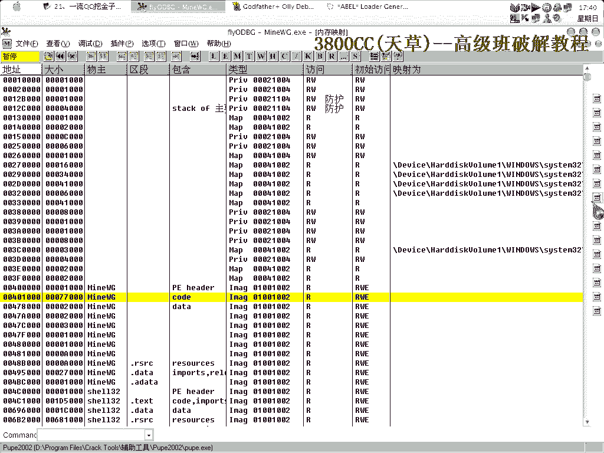


以下是修改的核心操作：
```
原指令：0F84 [目标地址]
修改为：90 19
```

## 方法二：通过内存写入绕过校验

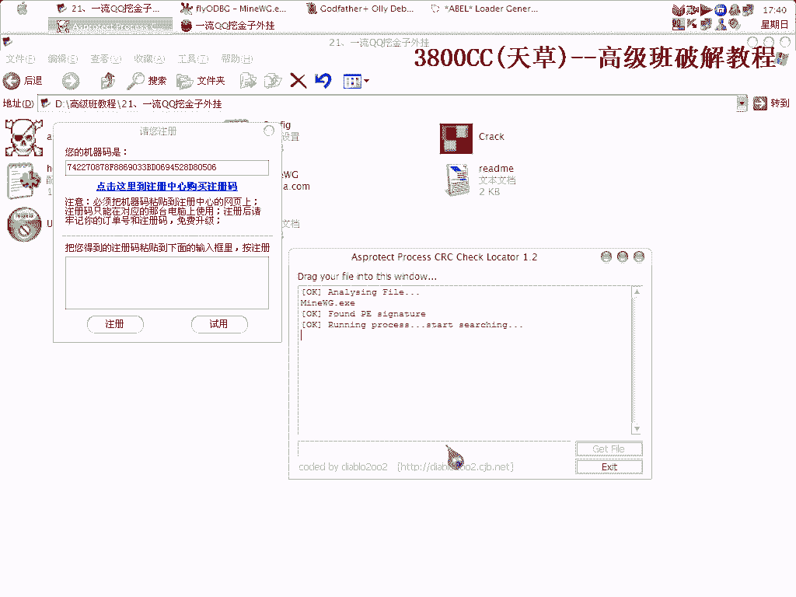

如果第一种方法使用的工具不兼容，我们可以采用第二种思路。这种方法同样在上节课中提到过，即在程序到达原始入口点后，向特定内存地址写入一个值来绕过校验。

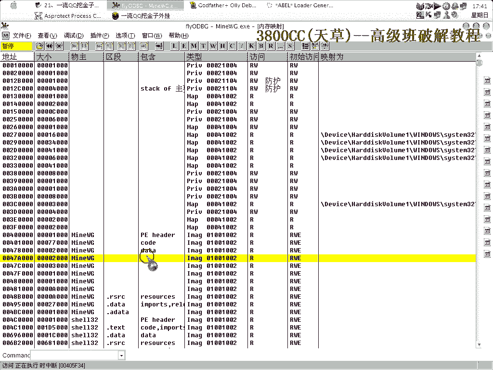

具体操作是，使用 `DVP` 工具创建一个补丁。编辑时，注意虚拟类型设置为 `ENF`，将指令从 `84` 修改为 `90 19`。

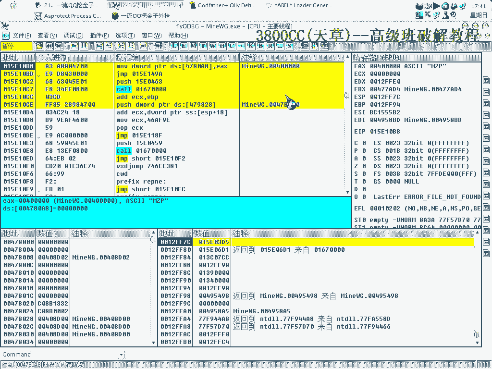

同时，需要指定一个内存地址，例如 `00401234`，并为其写入特定的校验值。核心是写入以下数据：
```
地址：00401234
数据：8B442414C3
```

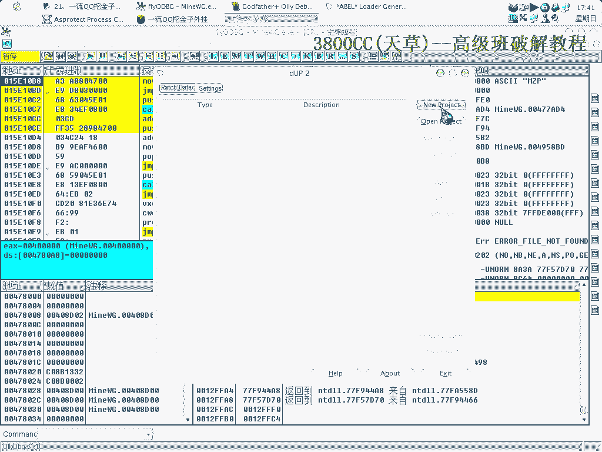

最后，保存补丁并创建执行路径。这种方法通过提供一个内存校验值，来欺骗程序的内存检验机制。


## 方法对比与总结

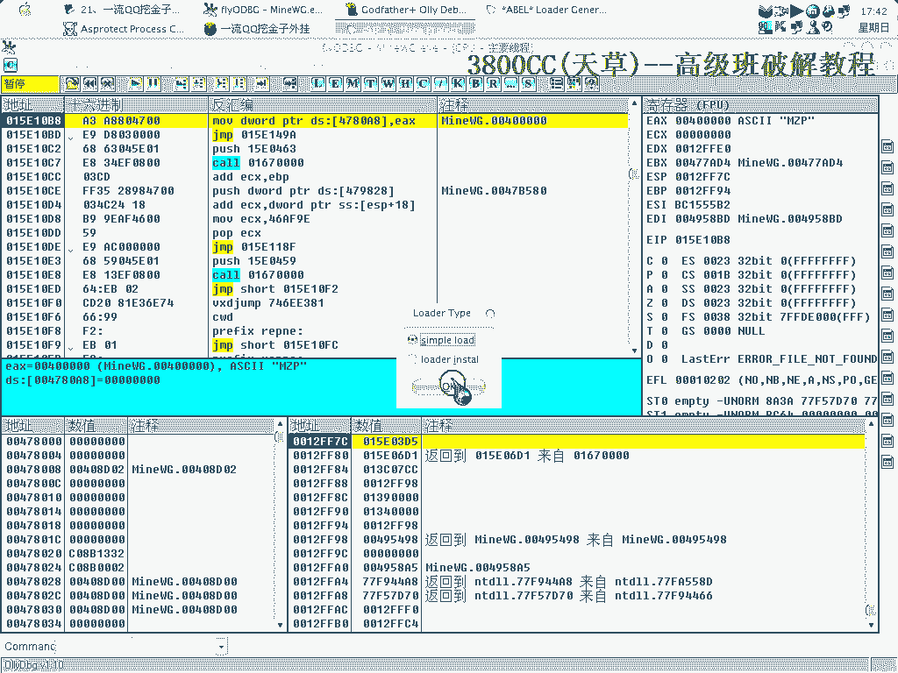


本节课我们一起学习了两种绕过“一流QQ挖金子”外挂注册验证的方法。

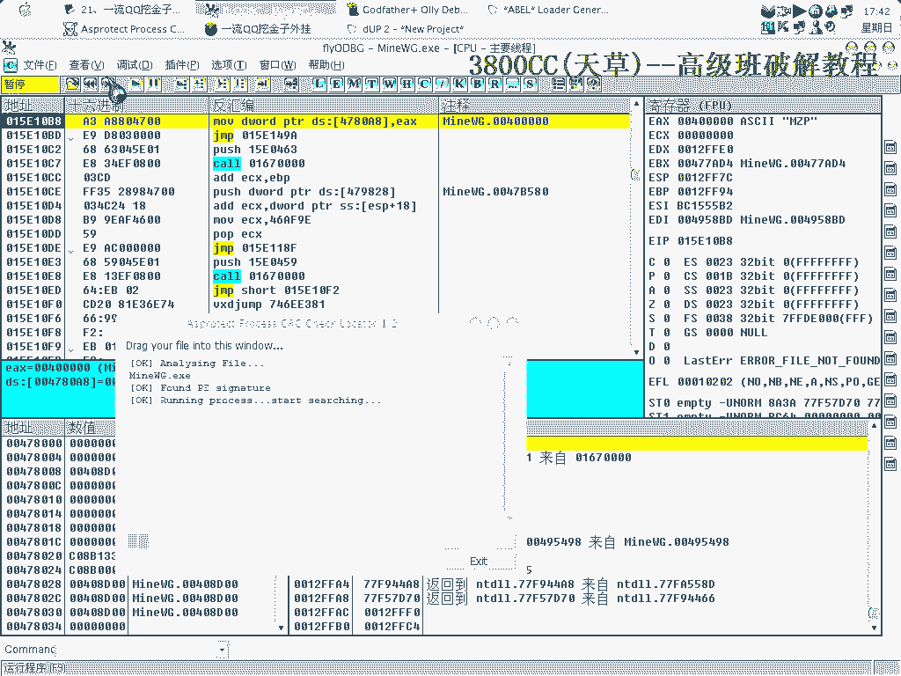

*   **方法一**：直接使用工具修改关键跳转指令。这种方法较为直接。
*   **方法二**：在程序运行时向特定内存地址写入校验值。这种方法适应性更强，在某些情况下更稳定。

两种方法都可以实现破解目的，但使用 `DUP` 工具进行内存写入的方式通常更可靠一些。课程中使用的工具将会提供给大家。


通过本课的学习，你应该掌握了针对此类验证的基本分析思路和两种实用的破解技术。