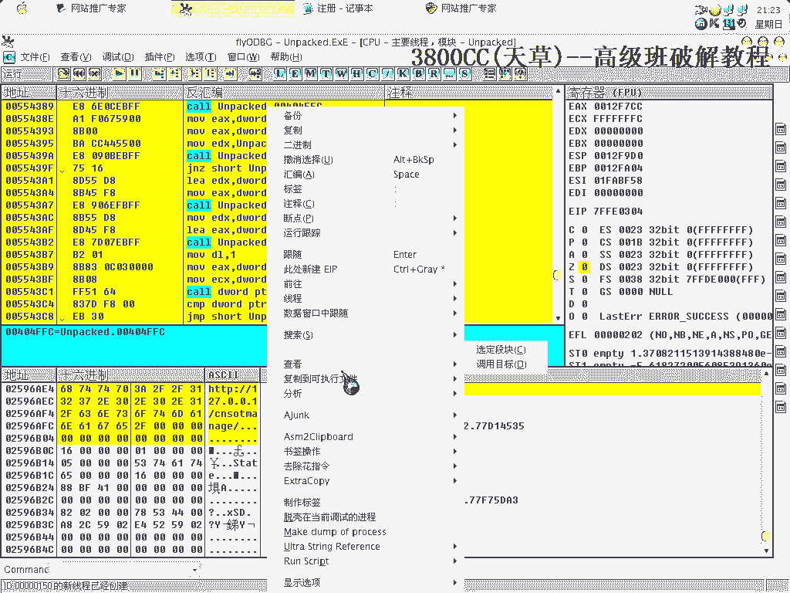
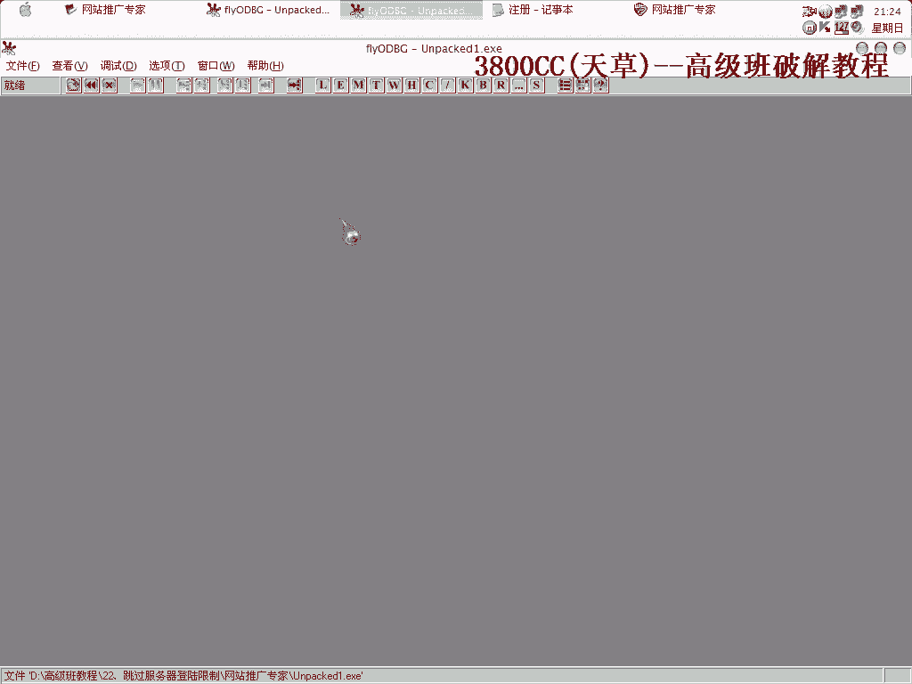

# 天草高级班 - P22：跳过服务器登陆限制 🚫➡️✅

在本节课中，我们将学习如何绕过一款软件的网络登录验证，将其改造为本地验证，从而实现无需有效账号即可登录。核心思路是定位并修改程序中的关键网络验证调用和跳转逻辑。

## 概述

我们将分析一个带有网络验证的程序，通过调试工具找到验证服务器地址、关键判断跳转，并将其修改为指向本地或直接跳过验证，最终实现软件的本地破解运行。

---

## 定位程序入口与界面

上一节我们介绍了课程目标，本节中我们来看看如何开始操作。首先，目标程序已被脱壳，我们可以从程序入口点开始分析。

在调试器中载入程序，定位到程序的入口点（Entry Point）。尝试直接修改或跳过登录框的创建代码，虽然可以移除登录界面，但这可能导致软件功能异常，因此这不是最佳方案。

---

## 查找按钮事件与验证逻辑

既然直接移除界面不可靠，我们需要找到更深层的验证逻辑。以下是查找关键验证点的步骤：

1.  **定位按钮点击事件**：在调试器中运行程序，在登录按钮的事件处理函数上下断点。
2.  **跟踪输入获取**：程序会获取用户名和密码输入框的内容。如果内容为空，程序会提示错误并跳转到错误处理流程。
3.  **发现网络验证调用**：继续单步执行，会遇到一段代码导致程序停滞或进入循环，这通常是一个网络验证的 `CALL` 指令。其所在的代码段末尾往往是验证的关键点。

进入这个关键的 `CALL` 内部进行分析。

---

## 分析并修改网络验证

进入疑似网络验证的 `CALL` 后，我们的目标是找到服务器地址和验证结果判断。



1.  **定位服务器地址**：在代码中查找类似网址的字符串，例如 `http://xxx.xxx.xxx`。这就是程序连接进行验证的服务器地址。
2.  **修改为本地验证**：为了绕过服务器，我们可以将此地址修改为本机回环地址 `127.0.0.1` 或一个无意义的本地地址。在十六进制编辑或调试器中直接修改该字符串。
    ```assembly
    ; 修改前可能类似
    push offset aHttpWwwAuthse_0 ; "http://www.authserver.com/api/login"
    ; 修改后
    push offset aHttp127001      ; "http://127.0.0.1/fakepath"
    ```
3.  **处理验证结果跳转**：修改地址后，程序依然会执行验证并返回结果。我们需要找到根据验证结果进行判断的跳转指令（通常是 `JNZ`, `JZ`, `JE`, `JNE` 等）。
    *   这些跳转决定了程序是走向“登录成功”分支还是“登录失败”分支。
    *   通过分析，强制让程序跳转到成功分支。例如，将一个关键的 `JNZ`（结果非零则跳转至失败）改为 `JMP`（无条件跳转至成功地址），或者直接 `NOP` 掉。




---

## 测试与修复


完成上述修改后，保存程序并运行测试。

1.  **检查修改是否生效**：运行修改后的程序，观察登录行为。如果提示“连接服务器失败”，说明还有网络连接相关的 `CALL` 需要跳过或修改。
2.  **查找遗漏的验证点**：重新调试，在程序提示“验证失败”的地方下断点，回溯找到新的判断跳转点，并应用同样的方法进行修改。
3.  **验证功能完整性**：成功跳过登录后，还需测试软件的主要功能是否正常。本例中，软件的部分功能（如搜索引擎列表）可能依赖服务器数据，因此即使登录成功，那些功能也可能无法使用。这属于软件自身的设计限制。

---

## 总结

本节课我们一起学习了绕过服务器登录验证的基本方法。核心步骤可总结为以下流程：

1.  **定位**：找到程序中的网络验证调用和服务器地址。
2.  **修改**：将服务器地址改成本地地址，并修改关键的条件跳转指令，使验证逻辑总是走向成功。
3.  **测试**：运行修改后的程序，检查登录是否成功以及核心功能是否受影响。


这种方法的核心思想是 **将网络验证转化为本地验证**，通过干预程序的判断逻辑来实现破解。需要注意的是，这种方法适用于学习逆向工程思路，实际应用时应尊重软件版权。