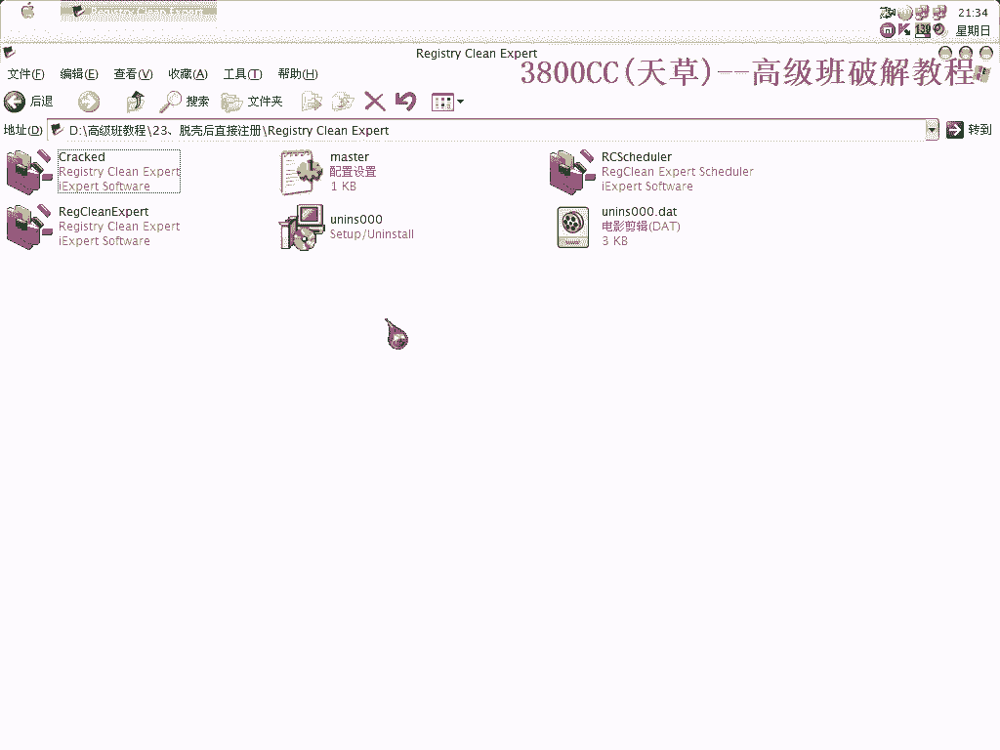
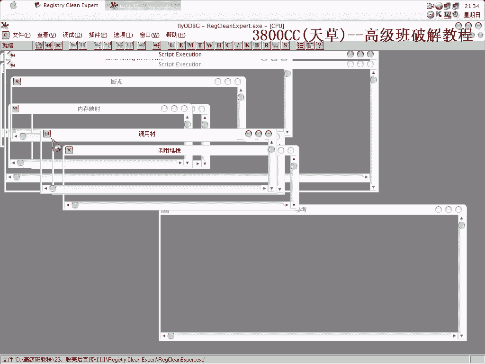
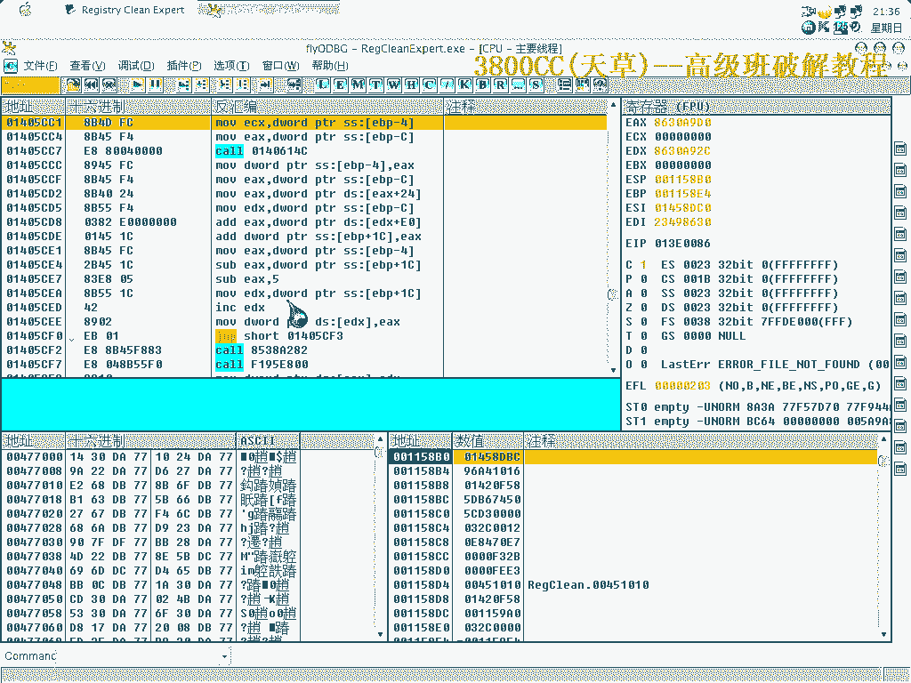
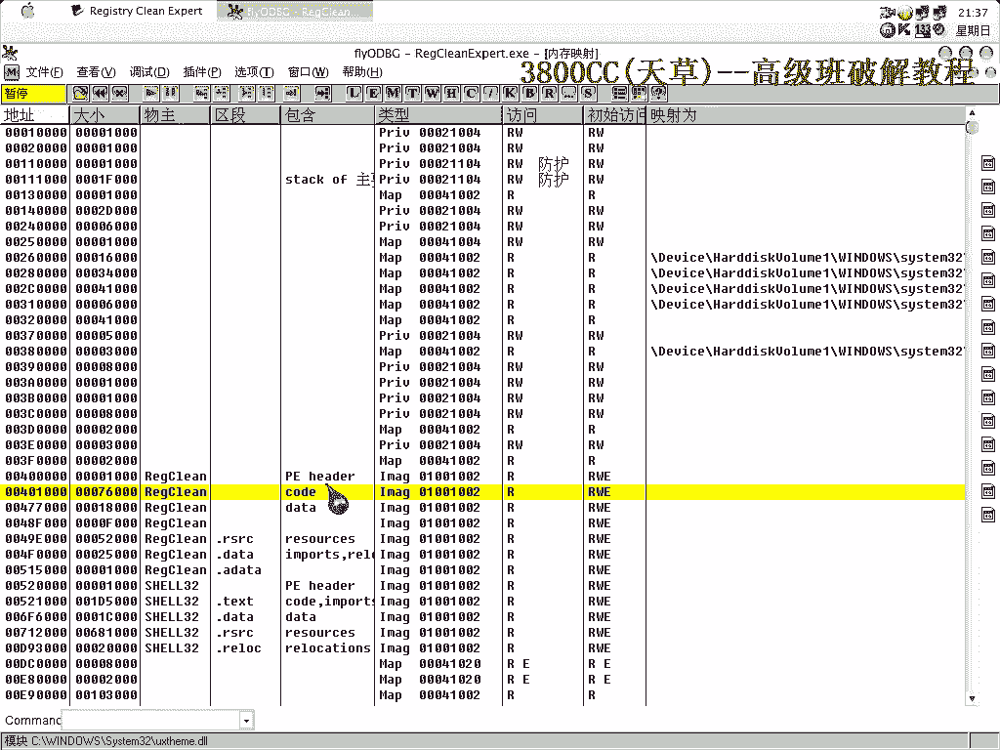
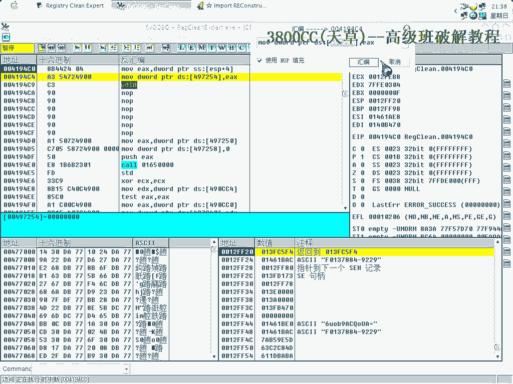
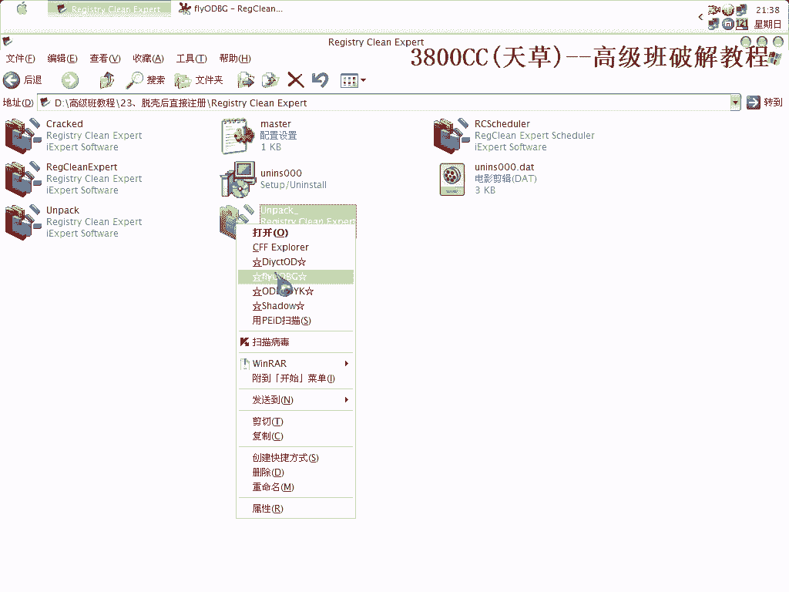
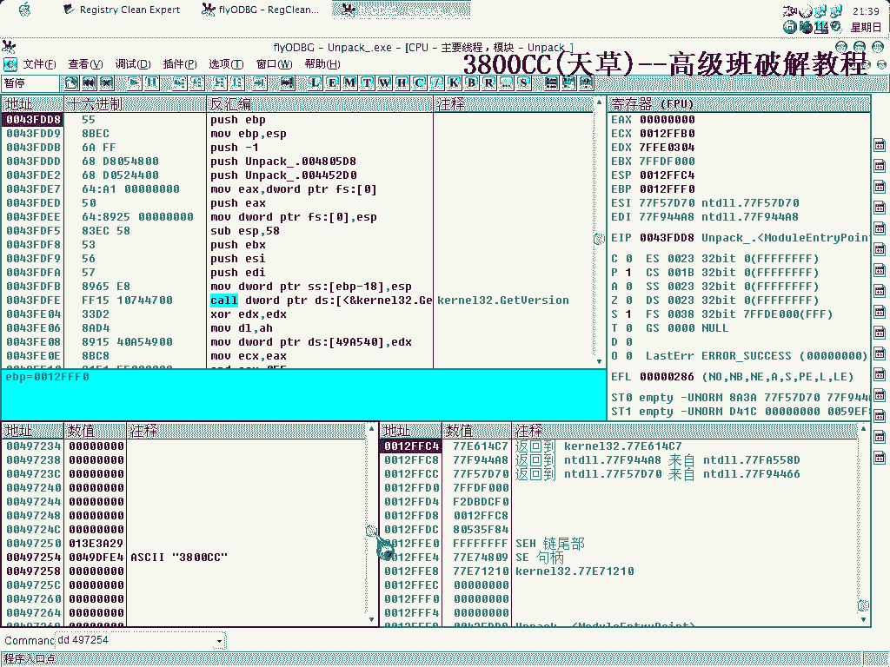
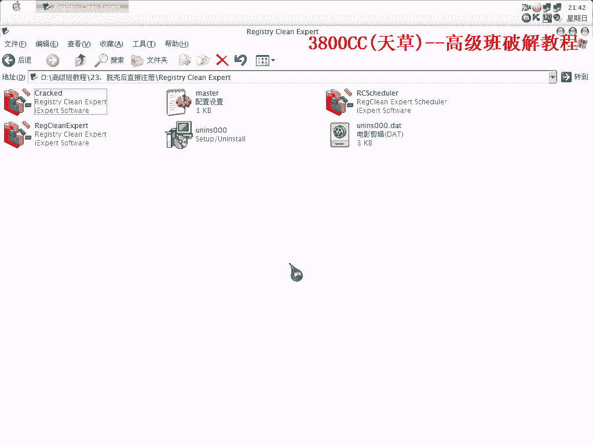

# 天草高级班 - P23：23、脱壳后直接注册 - 白嫖无双 - BV1qx411k7kJ

大家好，这节课呢，还是拖那个，ASProtect这个课，拖课后，我们就直接来注册，怎么样做，可以看一下，先看一下我这个破解来的，注册给我了，所以说ASProtect是非常好玩的一个东西，把这些都删掉吧。

首先呢我们还是到OEP去看一下。

看下有没有Stun Code，有没有Stun Code，啊 非常好 没有，是因为脚本啊，手拖非常麻烦，(读取教材)，(读取教材)，(读取教材)，(读取教材)，(读取教材)，(读取教材)，(读取教材)。

这样一来啊，这高级版里面我介绍了，好几种，关于ASProt课的一个处理方案，自己首先，得总结一下，如果碰到这个课，你首先会采取怎么样去做，我提供了很多方案啊，提供了很多的方案，(读取教材)。

(读取教材)，(读取教材)，(读取教材)，(读取教材)，(读取教材)，(读取教材)，(读取教材)，(读取教材)，(读取教材)，(读取教材)，(读取教材)，(读取教材)，(读取教材)，(读取教材)。

(读取教材)，(读取教材)。

(读取教材)，(读取教材)，(读取教材)，(读取教材)，(读取教材)，(读取教材)，(读取教材)，(读取教材)，这个运行了不少啊，关于这种像。

触可后直接破解的这种，处理手段啊，我在，前面的，S-ProTek 1。2X，1。23，RC4的那一个，也讲过，同样啊，处理手段是一样的，处理手段是差不多的，有一个，右键，又是这么一个东西，又是这么一个。

(读取教材)，(读取教材)，(读取教材)，后面的这几个无效，剪掉，刷去，可以运行啊，可以运行，先别着急了，先别着急，我们把这个异常换过来，削手甲F9，注意看，对战，第二次出现硬盘指纹，我们在1。

23RC4的时候，是第二次出现，硬盘指纹的时候来处理的，我们来看一下，2。11X。

会有什么区别，(读取教材)，先到下面。

找一个，把地址记录下来，(读取教材)，保存为1。

我们来看一下这个1，还是不行，(读取教材)，大家不要，高清的太少了，(读取教材)，我们再一次修，(读取教材)，又是这里了，(读取教材)，我们把这个给取消掉，撤销，(读取教材)，这样就可以了，也就是说。

1。23RC4呢，和这个2。X是有一些区别的，既然我们在，前面那节课里面，就是说给，直接做内存补丁的时候，也是需要三次，也是需要三次，所以，唯一的不同点，就是这些，处理手段是一样的，处理手段是一样的。

在这节课里面就是给大家提一下，这个，就是说首先呢，大家拿到一个OpenType，这个2。X这个课，之后啊，首先看有没有StoneCode，如果有的话，就得自己来补区段，就是我们前面课程里面介绍的。

如果没有的话，就不需要补区段，但是都可以通过这个脚本，来处理前面两步，当然就是没有StoneCode的话，基本上前面两步就，直接被这个脚本给处理了，那后面就是修复的问题了，修复迫切的问题了。

要是有StoneCode的话，后面还有一个补区段，得你自己手动了，然后这就是修复，Rotor Check，然后这就是有可能有织胶液，这都是每个都有，但是要是有StoneCode的话。

Rotor Check是绝对有的，这个大家要记清楚，好，今天这节课程就到这，再见，MING PAO CANADA | MING PAO TORONTO。

