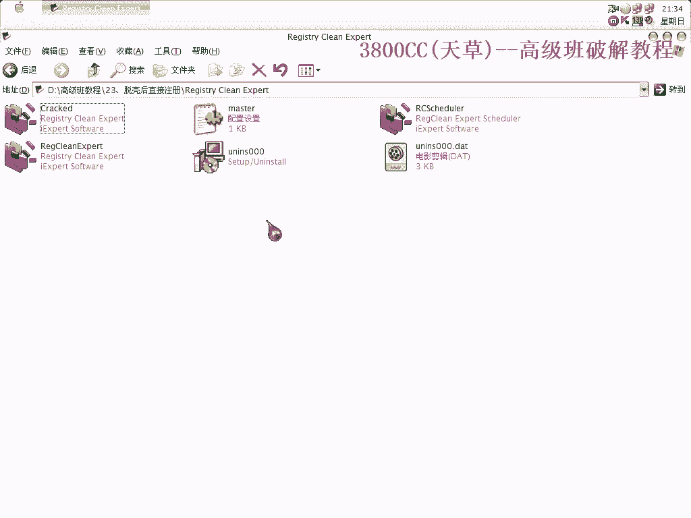
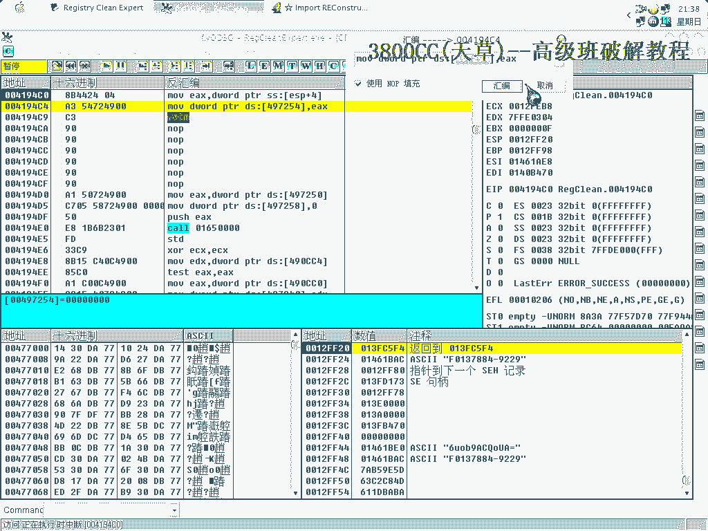
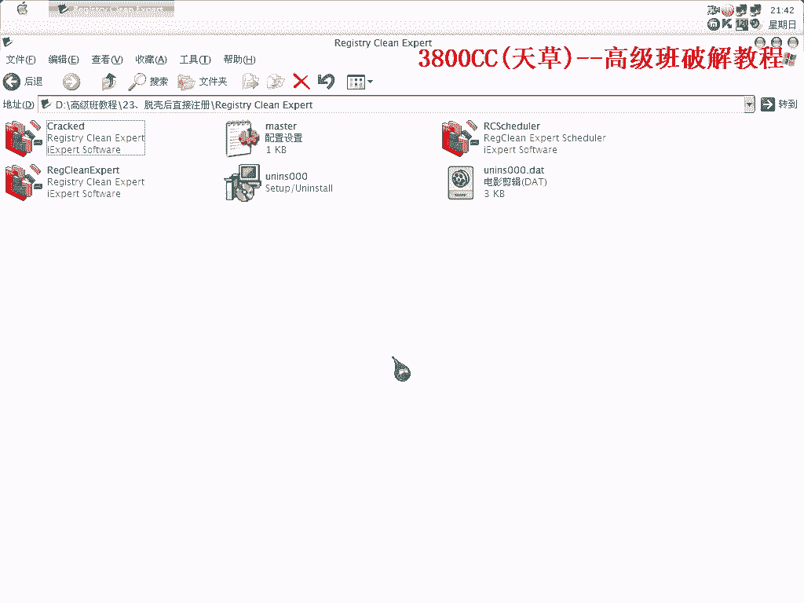

# 天草高级班 - P23：ASProtect 2.x 脱壳后直接注册教程 🔓

在本节课中，我们将学习如何对使用 ASProtect 2.x 加壳的程序，在脱壳后直接完成注册。我们将重点分析脱壳后的关键步骤，并对比其与早期版本（如 1.23 RC4）处理手法的异同。

---

上一节我们介绍了 ASProtect 壳的基本处理方法。本节中，我们来看看针对 2.x 版本，脱壳后如何直接实现注册。

首先，我们到达程序的原始入口点（OEP）进行检查。

检查是否存在 **Stolen Code**。非常好，这里没有。这是因为使用脚本可以高效处理，手动操作会非常麻烦。

以下是处理 ASProtect 壳的几种核心方案总结。当你遇到此类壳时，可以遵循以下决策流程：

1.  **检查 Stolen Code**：首先判断 OEP 处是否存在被窃取的代码。
2.  **使用脚本自动化**：利用脚本处理前期的通用脱壳步骤。
3.  **手动补区段**：如果存在 Stolen Code，则需要手动修补相应的代码区段。
4.  **修复 Import Table**：修复导入表是脱壳后的必要步骤。
5.  **处理资源与校验**：处理可能存在的资源加密和运行校验。

这种脱壳后直接破解的处理手段，在之前讲解 ASProtect 1.23 RC4 的课程中也介绍过，两者的核心思路是相似的。

右键菜单中会出现相关选项。后面的几个无效调用可以剪掉或跳过。程序可以运行，但先不着急。我们需要处理异常，按 `Shift + F9` 跳过异常。

**关键点**：注意观察堆栈。在 1.23 RC4 版本中，我们是在**第二次出现硬盘指纹信息**时进行关键处理的。现在，我们来看 ASProtect 2.11x 版本有何区别。

先向下查找。

找到一个关键地址，并将其记录下来。

保存为断点 1。测试发现，仅一次操作可能还不够。我们再次进行修复操作。关键点又回到了这里。我们取消之前的修改，然后撤销操作。这样一来就成功了。

这说明，ASProtect 1.23 RC4 与 2.x 版本在关键点的触发次数上存在一些区别。在前面的课程中，制作内存补丁也需要三次中断。因此，**唯一的不同点在于关键事件触发的时机**，但整体的处理手段是相同的。

本节课主要向大家强调以下几点：

1.  拿到一个 ASProtect 2.x 加壳的程序后，首先检查 **OEP 处是否存在 Stolen Code**。
2.  如果存在 Stolen Code，就必须手动补区段，正如前面课程所介绍。
3.  如果不存在 Stolen Code，则无需补区段，脚本通常能自动处理前两步。
4.  后续步骤都是修复问题，例如修复导入表。
5.  如果存在 Stolen Code，那么后续肯定需要修复 **Rotor Check**（反调试校验）。
6.  每个版本都可能存在资源加密等问题，但如果有 Stolen Code，则 **Rotor Check 绝对存在**，这一点必须牢记。

---

**总结**

本节课中，我们一起学习了针对 ASProtect 2.x 壳脱壳后直接注册的流程。核心在于判断 **Stolen Code** 是否存在，并以此决定是否需要手动补区段。同时，我们对比了 2.x 与 1.23 RC4 版本在关键断点触发上的细微差别，但整体遵循相似的处理逻辑：使用脚本辅助、修复导入表、处理反调试校验。掌握这个决策树，能帮助你更系统地应对此类加壳程序。