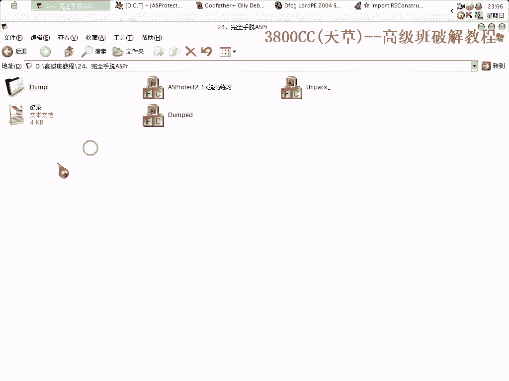
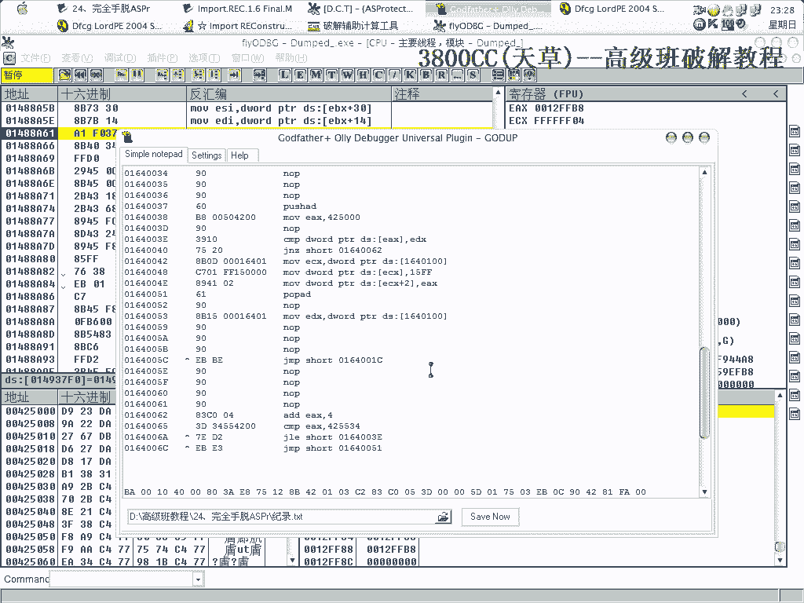

# 天草高级班 - P24：24、完全手脱ASPr - 白嫖无双 - BV1qx411k7kJ

大家好，這幾刻就做了這麼一個動畫，完全熟途，非常痛苦，這是我做的一些記錄都在這，我們首先忽略除了硬的3和指定之外的所有異常，兩次中斷之後，打開了整景象，這就是我們的假OEP了，然後看一下這個對戰。

轉成窗口，這就是IIT的一個起始，2500 IIT了，但是可以看到，這些IIT完全都解碼了，沒有加密，那我們在這裡看+B FF25，先FF25看一下，看就加L，只有這麼一點，還是回到，回到。

10400 10400，我們現在需要看的是FF15，因為我們必須要確認，確認到的是CALL類型還是JUMP類型，大家看到這是CALL類型的，這個樣子看，看得更清楚。

查找所有模塊鍵的調用，這樣看得更清楚，大家看到了，這些API全都是由CALL來調用的，記清楚是FF15。

重新來過，就像我們剛才看到，看到IIT並沒有被加密，只是，代碼被變形了，只是代碼被變形了，那我們就直接到最後一次一場，(調整中)，+F9，這個時候不要返回了，不要返回了，我們這個時候要查找這個，+B。

就是這裡了，我們找到就是這裡了，我們先把它改成，同時，我們用，申請插件這麼一個插件，申請內存空間的這麼一個插件，0，OK 申請它，164，我們到164這個地方去，寫上這些代碼，好，現在來說一下這些代碼。

注意這裡的15000，就是我們剛才看到的，看到了，看到什麼了，看到這裡，FF15。

所有模塊已經調用，看到這裡了，就是說這些API被代碼，IIT被代碼。

代碼變形了。

好，接下來的這個42500。

42500，是，code段後一個區段的起始位置。

好，IIT呢，也是42500，大家不要就是說不要混淆了，這個跟這個現在相同，只是一個偶然，它是code段後面一個段的起始位置，它是IIT的起始位置，這裡要記得是15FF，15FF。

因為它是code類型的，這裡是IIT的一個結束位置，這裡翻下來一看就知道，OK，現在我們，先不著急，先新建一下。

API，好，隱藏一下，OD，我們事先，剛才不是有一個RANTA，畫在這裡了嗎，這個記清楚就可以了，這是我們Stormcloud的一個，OEP地址，隱藏一下，我在第一次的時候沒有隱藏，所以它就有一個錯誤。

也隱藏一下，要不就，好，這個時候，OD提示在運行，機器開始卡，這是一個好的現象，那個文件是我，原先拖好的一個文件，就保留著，我們首先得獲取，首先得獲取，IIT，機器有點卡，不是有點卡，是蠻卡的，現在。

現在開始卡了就沒辦法了，後面還要，進行一些操作，我們就先填1000看行不行，不行，那怎麼辦呢，它就說，這個地方，在這個地方，找不到任何東西，那在哪個地方可以找到東西呢，那自然就是在。

IIT的提示位置開始找，就可以找到東西了，提示位置2500，我們先用它找到這些，IIT，開始卡了，關掉，重新來，嗯，天啊，機器在卡了，嗯，嗯，嗯，嗯，嗯，嗯，嗯。

那個點擊是一下吧，先把這個關掉，這個點擊這個，信不信，這間CPU太高了啊。

這間CPU太高了，這間CPU太高了，這裡找不到，點它，但是，我們可以這個樣子，到0040100，查找ff15。

然後查找一下所有模塊鍵調用，就可以看到，原先的。

原先的都被修復了，都被修復了，這個呢，本身就是靠地址，本身就是靠一個地址，那些，被改成1D500，那些都被修復了，非常完美了。

暫停一下，暫停一下，怎麼卡啊，啊，換一個。

換一個硬碟的IC吧，換一個硬碟的IC吧，這個也是一樣的啊，怎麼卡，怎麼卡，我先把屏幕錄像關掉。

暫停一下，好。

這個地方填5000可以，填5000，這樣就獲取了所有的一個IOT了。

這個時候我們來修。

抓取，抓取，抓取。

好，刷新一下。

區域托克，可以打開。

內存景象開始看一下，確認一下，抓取了一些，抓取了一些，這裡有這麼多。

就，就是說，從最基本的角度來說的話，最基本的角度來說，最好是從，這個D1開始，D1開始，就全部都，全部都抓，全部都抓，但是，我覺得沒那個必要，咱們從130開始抓吧，130，好，130。

這裡，是他，他，130，然後減去，明明是你，1234，F0開始了，明明，你，區域托克，我這回是怎麼關掉，131，接著是131，131這個，抓久不了，這裡抓久不了，那接著是140，140，140。

不對不對不對。

抓取錯了，01140，01140，01140，剛才抓錯了，130抓了，抓131，抓131，下路131，那麼這個大小呢，120，011，011，很累啊這樣，接著是136，嗯，是F6啊，這個沒錯了。

接著是137，這個名字要改一下，7，13，138，7，13，138，820，14，139，139，這是我的房子錯誤啊，拖一個拖一個啊，抓一個，A，我們在抓了之後，放到這個目錄裡面去啊，B，07，B，C。

08，那就C，D，D0，FZ，09，已經添加了10個區段，估計要30多個了啊，1/3，咱們完成了1/3的工作量，應該說我完成31工作量了，非常非常累啊，1，F，不一樣啊，啊，20，再來上一下。

我感覺這個好像算得不對啊，FF，這個沒錯，1000，現在有點暈了，現在有點暈了，122，嗯，那就是101啊，他這是1001，101，這102，啊，名字先不改了，名字先不改了，好累啊，103，30，嗯。

要念書，抓105，嗯，3106，嗯，嗯，106啊，106過了是10B了啊，這個區段抓不了，抓不了，10B，嗯，算了這個，141，141，那就是1014啊，1014，1014，這是1028，1028。

110，嗯，F8，110，1524，1124，嗯，1124，然後這是11B啊，11B，11B，沒錯，只要算錯其中一個啊，就前功盡棄啊，前功盡棄啊，11C，11D，嗯，11E，11F，嗯，嗯。

這就是112，嗯，120，算一下，嗯，121啊，121，10，這個是1161啊，161，122，20，124，122，124，接著是124了，124，OK，不玩了啊。

不玩了，看一下，嗯，不到1164了。

不到1164，現在我們把名字都改一下，這個是13，14，15，16，17，18，19，20，21，22，23，24，25，26，27，28，29，30，31，32，33，34，35，36，37，38。

39，40，41，42，43，44，45，46，47，48，49，50，51，52，53，54，55，56，57，58，59，60，61，62，63，64，75，66，77，78，78，79，80。

80，80，80，80，80，80，80，那現在就登機了(開啟資料處理器)，這樣就有33個取代了，"充建"，(充)，充建這個，(充)，(充)，(充)，(充)，(充)，(充)，(充)，(充)，1。

33啊 看一下，有這麼一個錯誤提示啊 看一下是怎麼回事啊，嗯？遠，(嘆)，OEP沒改過來啊，發錢的時候OEP沒改過來，(咳)，啊 保存，(咳)，(嘆)，(嘆)，嗯？ 其他還沒改過來，什麼回事啊，確定。

然後我剛才改的是這一個，119是，嗯，現在提示 這個，我們需要修復啊，修復，Let's check，走 但不走啊 但不走，(嘆)，這裡我們得F7進去 不然就跑飛了啊，繼續但不走，好 這裡得F7進去。

(嘆)，這個地方就是我們需要修復的啊，Let's check。

(咳)，從這個EX+34開始，(嘆)，但可以。

(咳)，我們來看一下，可以啊，(嘆)，OK 這麼一個東西。

就被我們拖掉了啊，(嘆)。

非常累啊，受不了了，再另外說一下 另外說一下，這個啊 這個殼，是看雪的 看雪的一個傢伙家的，我拖了之後把這個拖殼文件放上去，放上去，放上去之後啊，他要我把那個過程貼出來，沒理他啊，來查一下就知道啊。

是未知的啊 未知的，而且呢 可以來看一下啊，可以看一下兩個，我這裡啊，這一個，我剛剛拖了這個啊，剛剛拖了這個鋪了33個區段，事先拖的那個啊，補了31個區段，也就是說我剛剛拖的多補了兩個區段。

往上補的兩個區段，多往上補的兩個區段，這個無上大雅的啊，就是為了保險起見，就是為了保險起見啊，好 那這節課的課程就到這，到這 就這麼多。

後面，我花了很多很多时间，好，再见。