# 天草高级班 - P24：完全手脱ASPr壳实战教程 🛡️➡️📦

在本节课中，我们将学习如何手动脱去一个名为“ASPr”的强壳。整个过程涉及分析变形代码、修复导入地址表（IAT）以及重建程序区段。我们将使用OllyDbg（OD）作为主要调试工具，通过一系列步骤，最终得到一个可运行的、已脱壳的程序文件。

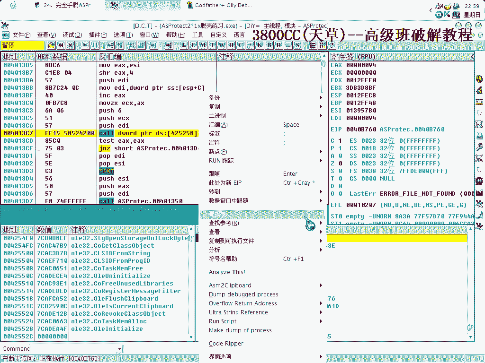

---

## 概述与初始设置

首先，我们忽略除“硬件断点”和“内存访问”之外的所有异常。在程序中断两次之后，我们打开了内存镜像，并定位到了一个“假OEP”。

接下来，我们查看调用表。将视图转换为窗口模式，可以看到IAT的起始地址是`0x2500`。这些IAT条目本身并未加密，但调用它们的代码被变形处理了。

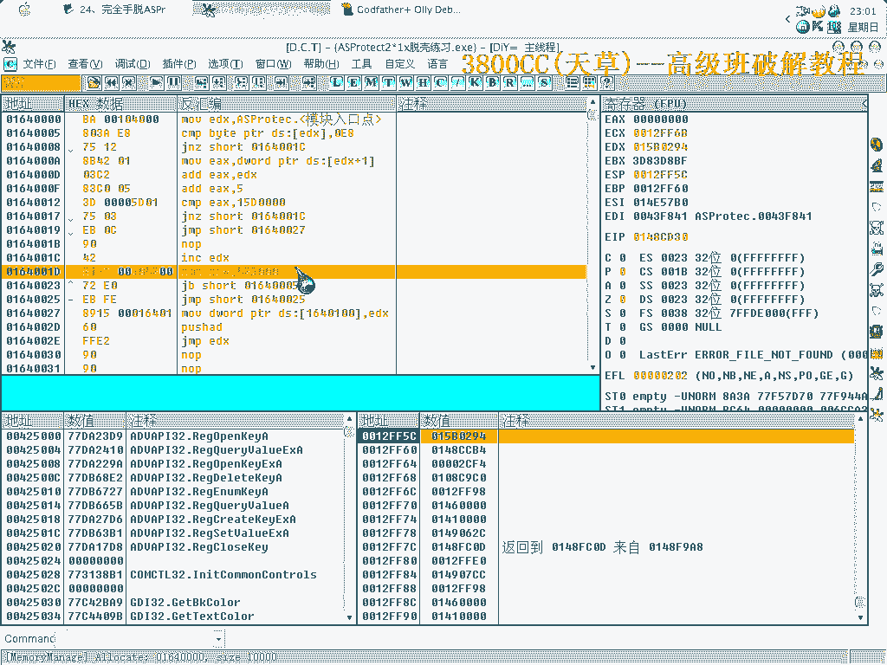

我们需要确认API调用是`CALL`类型还是`JUMP`类型。通过查找所有模块间的调用，可以清晰地看到，所有API都是通过`FF15`（CALL）指令来调用的。

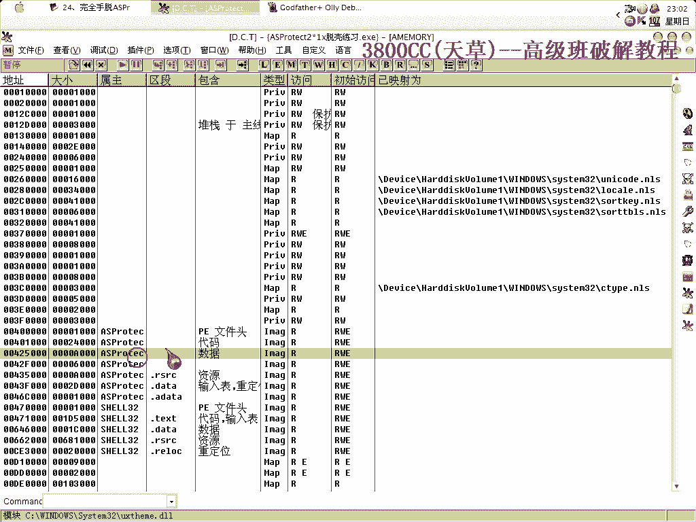

---

## 定位关键代码与申请内存

上一节我们确认了API的调用方式。本节中，我们将定位到变形代码的关键位置并进行处理。

我们直接运行到最后一个异常处，然后按`F9`继续。此时不要返回，我们需要查找`+B`位置的代码。

找到目标位置后，我们使用一个插件来申请新的内存空间。申请的内存地址是`0x164`，我们将在此处写入修复代码。

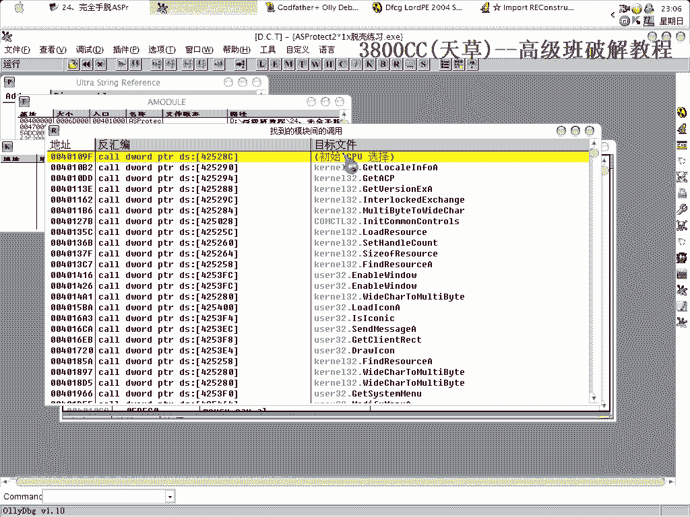

以下是写入`0x164`地址的关键代码及其含义：

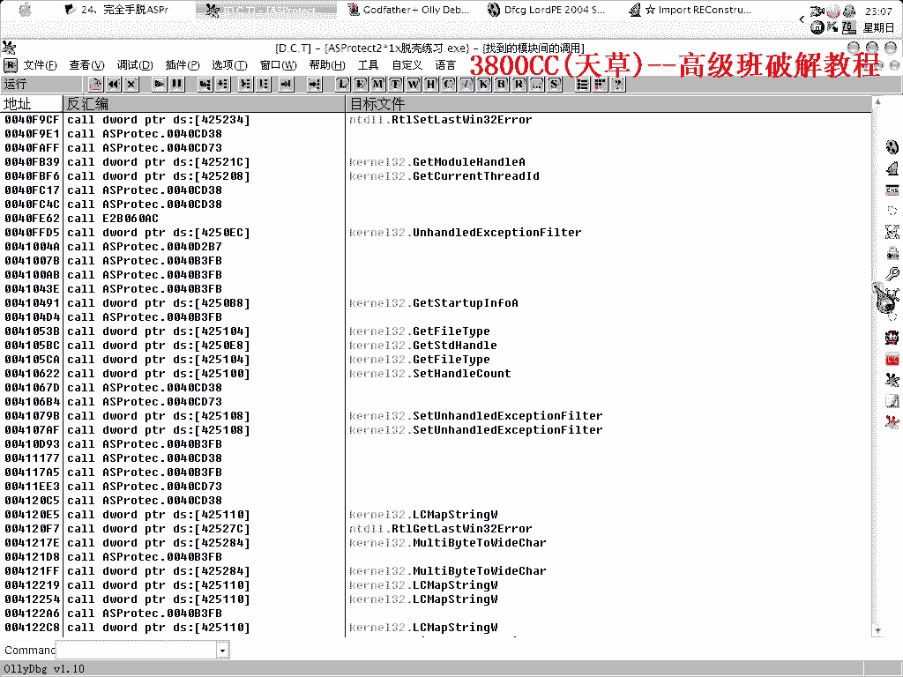

*   **`15000`**：这个地址指向我们之前看到的`FF15`调用指令块，即API调用被代码变形处理的位置。
*   **`42500`**：这是`.code`代码段之后下一个区段的起始地址。同时，它也是IAT的起始地址。注意，这里的`15FF`代表IAT的结束位置。

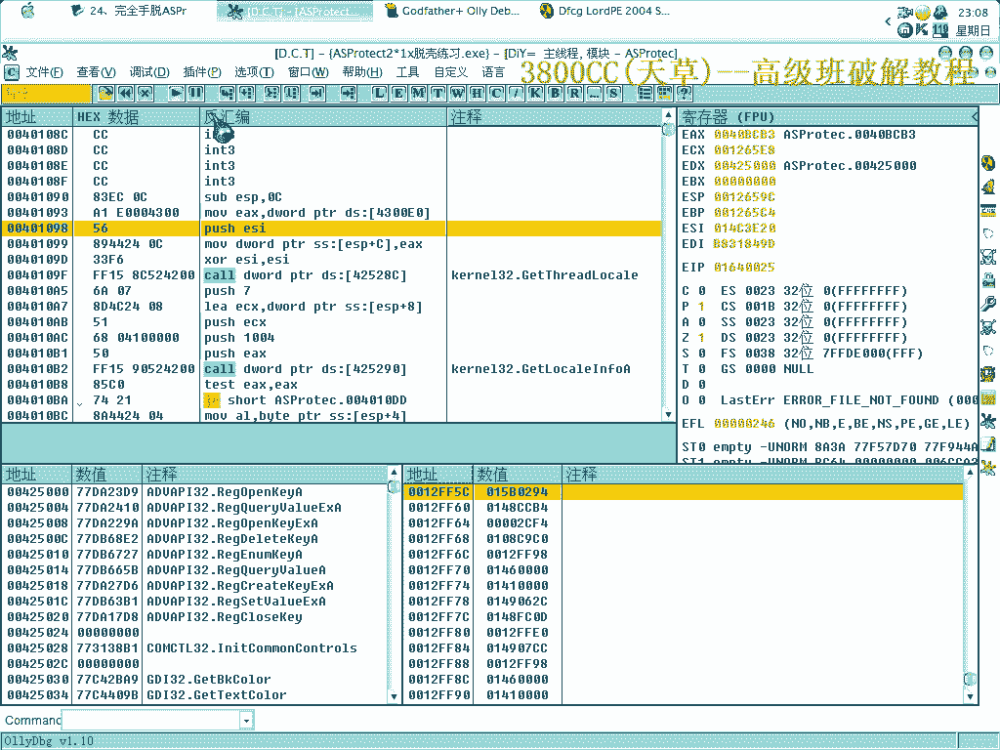

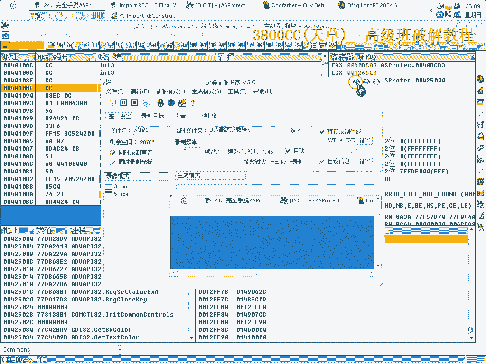

---

## 隐藏OD与获取IAT

写入修复代码后，我们隐藏OllyDbg的调试器状态，以避免被壳检测到。然后运行脚本，程序会开始运行并变得有些卡顿，这是一个正常的现象。

接下来，我们需要获取完整的IAT。由于程序运行缓慢，我们尝试从IAT的提示位置`0x2500`开始查找。如果直接搜索不成功，我们可以换一种方式：在代码起始地址`0x00401000`处搜索`FF15`指令，然后查看所有模块间的调用。此时会发现，原先被变形处理的调用都已经被修复了。

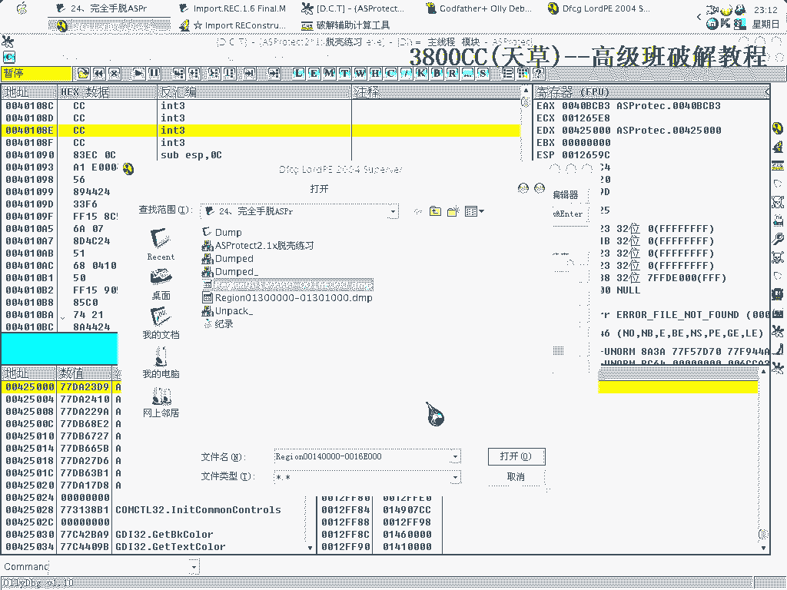

---

## 抓取与重建程序区段

IAT修复完成后，我们还需要处理被壳分散或变形的程序代码段。本节我们将手动抓取并重建这些区段。

以下是抓取区段的操作流程：
1.  使用工具抓取内存中有效的代码块。
2.  从地址`0x130`开始，依次抓取各个区段的数据。
3.  为每个抓取的数据块命名并保存到本地目录。
4.  这个过程需要重复数十次，非常繁琐。例如，抓取地址`0x130`、`0x131`、`0x140`等处的数据，并注意计算每个区段的大小。
5.  最终，我们为本例添加了33个新的区段。

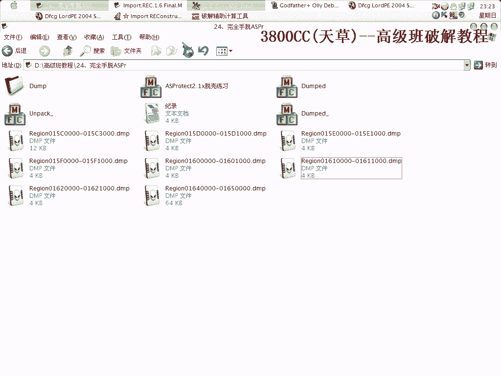

---

## 修复转储文件与最终验证

所有区段抓取并添加后，我们使用工具重建最终的脱壳文件（转储）。在保存时，务必注意修正OEP（原始程序入口点）为正确的值。

保存后运行修复工具（例如Import REConstructor），对刚转储的文件进行IAT修复。修复过程中可能需要按`F7`单步进入某些调用，以确保修复准确无误。

修复成功后，我们就得到了一个完整的、可独立运行的脱壳程序。最后可以查壳验证，确认其为“未知”或已成功脱壳。

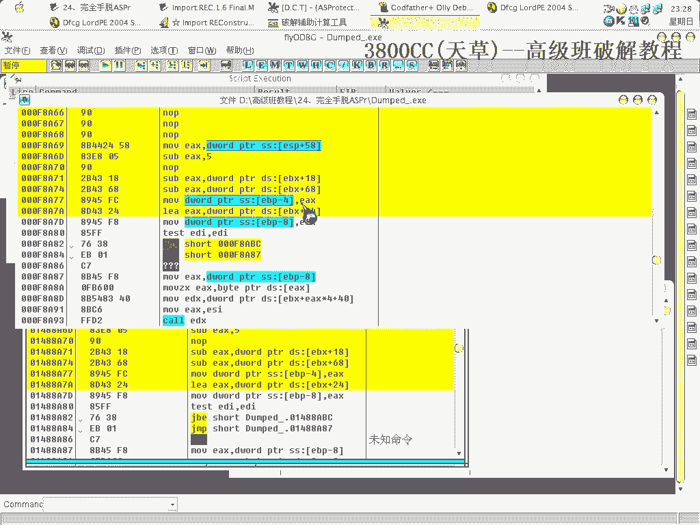

---

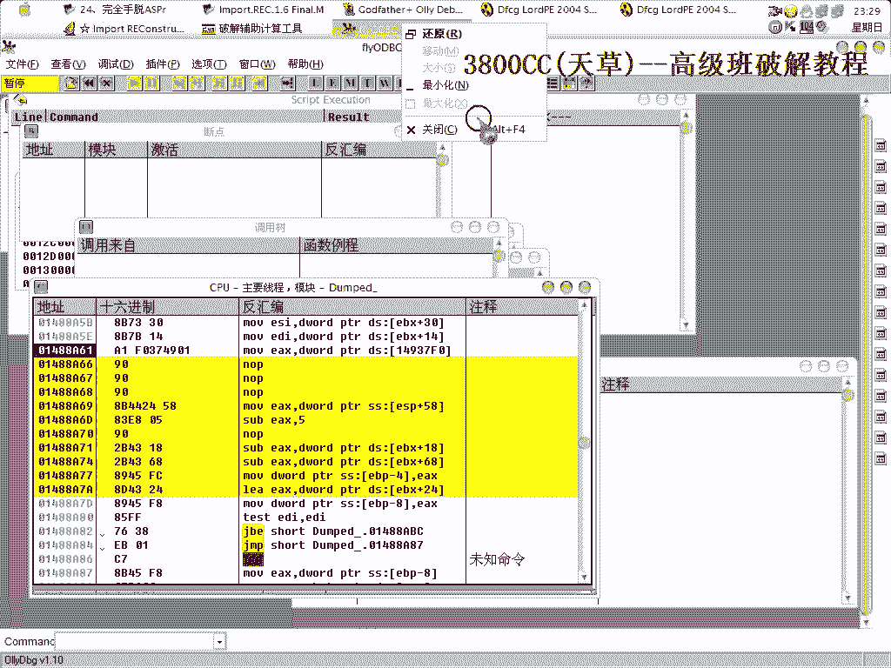

## 总结

本节课中，我们一起学习了手动脱去ASPr强壳的完整流程。
1.  **分析阶段**：我们定位了假OEP，分析了未加密但被变形的IAT，并确认了API的调用类型为`CALL (FF15)`。
2.  **修复阶段**：我们通过编写脚本修复了变形的API调用代码，并成功获取和重建了完整的IAT。
3.  **重建阶段**：我们手动抓取了数十个被壳处理过的程序区段，并将它们添加回转储文件中。
4.  **最终处理**：我们修正了OEP，并使用修复工具完成了最终的文件重建，得到了可运行的脱壳程序。

整个过程技术性强且步骤繁琐，但通过逐步分析、耐心修复和重建，最终能够成功攻克此类强壳。