# 天草高级班 - P25：某商业软件算法分析 🧠

在本节课中，我们将对一个商业软件的注册算法进行逆向分析。课程将详细拆解其注册码的生成过程，从机器码处理到最终注册码的构造，帮助初学者理解算法分析的基本思路和关键步骤。

---

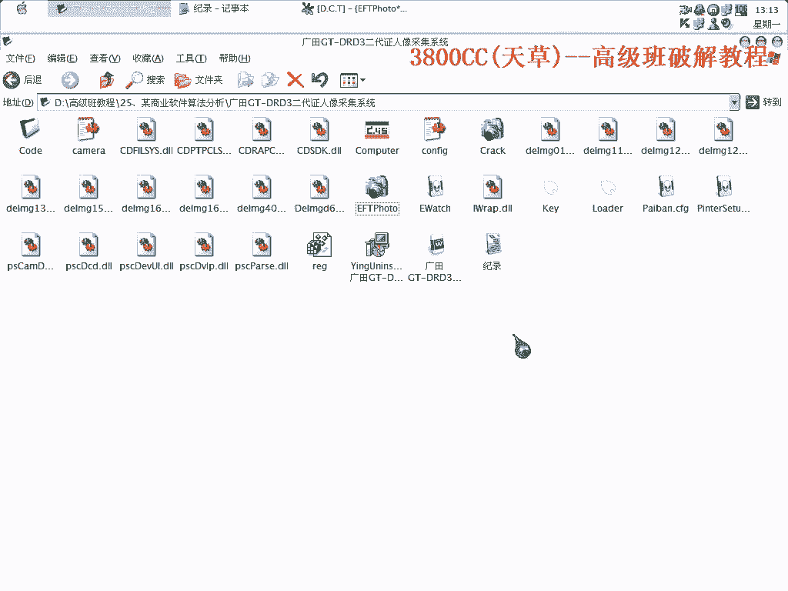

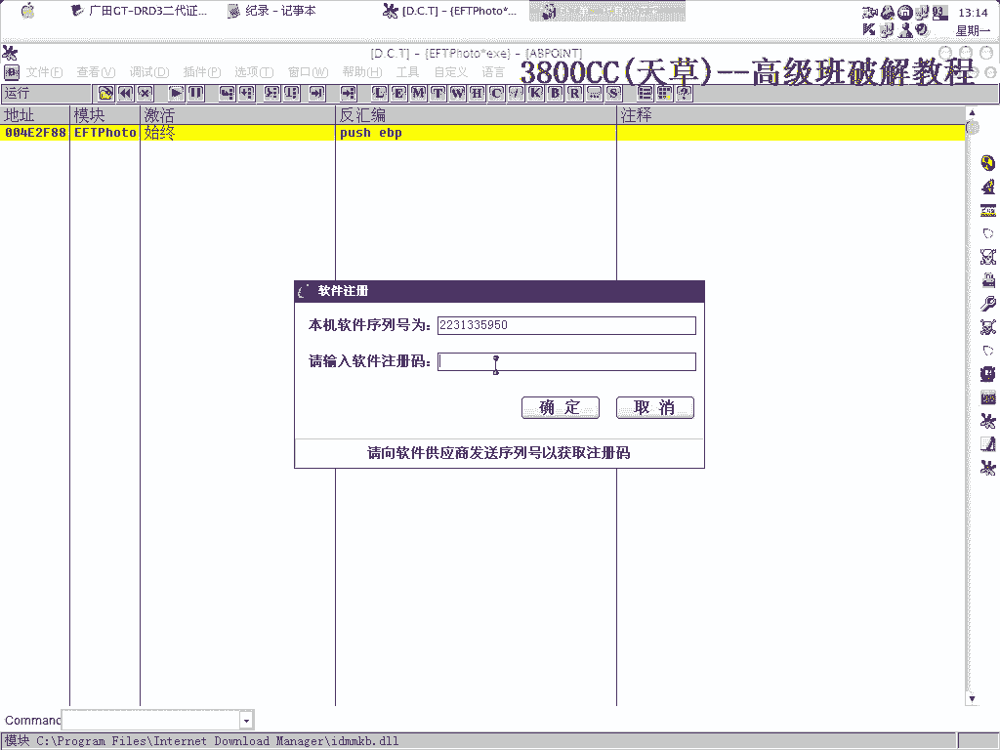

## 软件初步探查 🔍


首先使用查壳工具检查目标软件。该软件使用UPX加壳。按钮事件等基础信息已预先定位，此处不再赘述。


这是当前分析所用的机器码。


原先笔记本的机器码是另一个值，现已更换。为了节约时间，不演示为何要进入特定代码段。首次跟踪时通过弹窗等信息可发现问题，第二次分析便知道需要进入哪些关键调用。

---

## 关键数值与浮点运算 ⚙️

在代码中观察到数值 `0x7B7`，其十进制值为 `1975`。另一个关键数值 `0x0B` 是十六进制，对应十进制 `11`。

进入关键调用后，在堆栈中看到数值 `123124` 和 `3756`。在数据窗口中跟随查看，但该地址暂无有效值。

进行逆向分析时，第一个注意事项是观察关键代码段。其中，**浮点运算指令**的出现是需要重点关注的信号。

跟踪发现，程序将某个值放入了浮点寄存器，随后通过弹栈指令 `FSTP` 将其弹出到 `ESP` 指向的地址。

---

## 算法结构解析 🧩

在代码中看到字符串 `YYYYMMDD`，这通常代表日期格式（年-月-日）。遇到此类格式字符串，往往意味着算法与日期或固定数值相关。

程序获取了固定数值 `19751128`。随后，代码将寄存器 `EAX` 和 `EBX` 清零，说明后续计算会用到它们。寄存器 `ESI` 则保存了 `19751128` 这个值。

程序开始循环处理这个数值的每一位（字节）：
1.  取第一个字节 `0x31`（字符 `'1'`）放入 `BL`。
2.  将 `BL` 与 `0x20`、`0x2D`、`0x2B`、`0x24`、`0x78`、`0x58`、`0x30` 等字符的ASCII码进行比较。
3.  由于 `0x31` 不等于上述任何值，跳转到减法处理部分：`BL = BL - 0x30`。这样，字符 `'1'` 就转换成了数字 `1`。
4.  接着与 `0x39`（数字 `9` 的ASCII码）进行比较。
5.  程序继续获取下一位数字 `'9'`，并进入下一次循环。

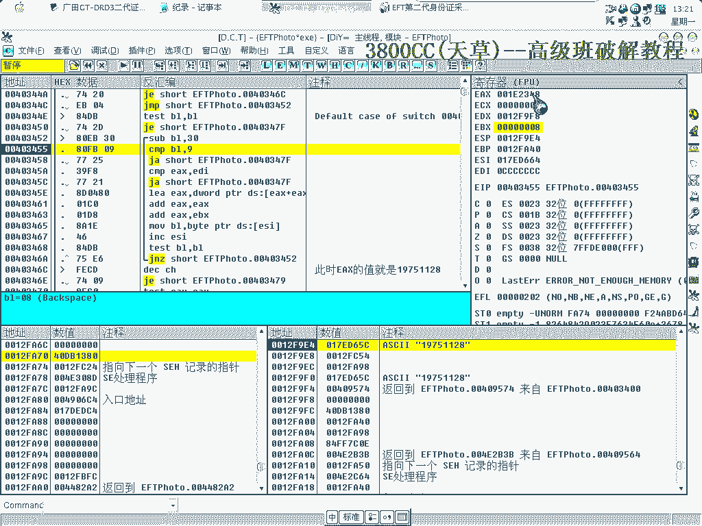

在循环中，`EAX` 的值不断变化。循环结束后，`EAX` 中的值就是 `19751128` 经过初步处理的结果。

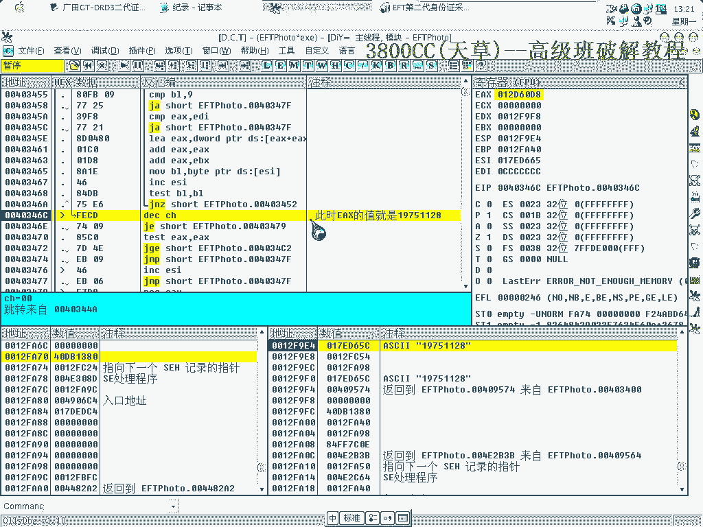


`EAX` 中的结果 `19751128` 被返回。


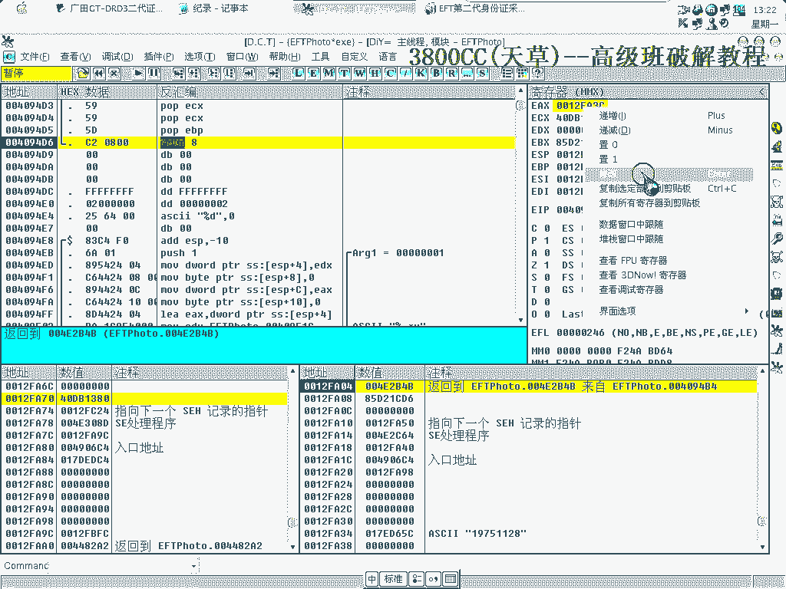

---

## 核心算法步骤分解 🔢

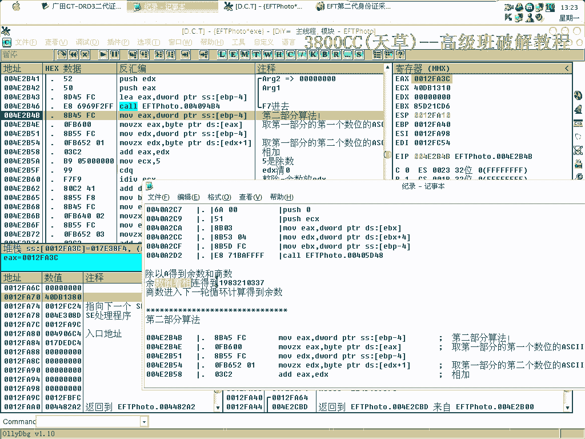

进入下一个关键调用，算法涉及多层处理。

第一轮算法：
1.  **机器码转16进制**：将输入的机器码转换为16进制数值。
2.  **与固定值异或**：将上一步的结果与 `1975`（固定值）的16进制形式进行**异或**运算。
    *   **公式**：`result1 = hex(machine_code) XOR 0x7B7`
3.  **除法与重组**：将异或结果除以 `0xA`（十进制10），得到商和余数。
    *   **公式**：`商 = result1 // 10`, `余数 = result1 % 10`
4.  **字符串构造**：将余数**倒序排列**并连接，形成第一部分的中间结果 `2245139670`。


第二轮算法：
1.  **字符提取与运算**：从第一轮得到的字符串中提取特定位置的字符。
    *   取第一位 `'2'` 和第二位 `'2'`（注意有两个 `'2'`，需通过后续分析确定具体取哪一个）。
2.  **加法与取模**：将两个字符对应的数值相加，然后加上 `0x40`（十进制64），结果存入 `ECX`（例如得到 `0x855`）。
3.  **除法求余**：使用 `CDQ`（扩展符号位）和 `IDIV` 指令，用 `EAX` 除以 `ECX`。
    *   **代码描述**：
        ```assembly
        CDQ          ; 将EAX符号位扩展到EDX
        IDIV ECX     ; (EDX:EAX) / ECX，商在EAX，余数在EDX
        ```
4.  **结果处理**：将得到的余数（在 `EDX` 中）与整数部分（在 `EAX` 中）相加。
5.  **字符转换**：对结果进行一系列转换，包括转大写、加特定数值（如 `0x30`/`0x41`/`0x4F`）等，生成几个关键的字母或数字。

第三轮算法（最终组合）：
1.  **交叉插入**：将前两轮算法产生的多个字符（例如 `B`、`J`、`P`、`0`）按照特定规则插入到第一轮产生的数字串（如 `19832015101033`）中。
2.  **插入规则**：例如，将某个字符插入到数字 `'9'` 之后，将另一个字符插入到数字 `'0'` 的中间位置等，形成最终的注册码。
    *   **过程描述**：这是一个交叉插入的过程，算法固定了插入位置。

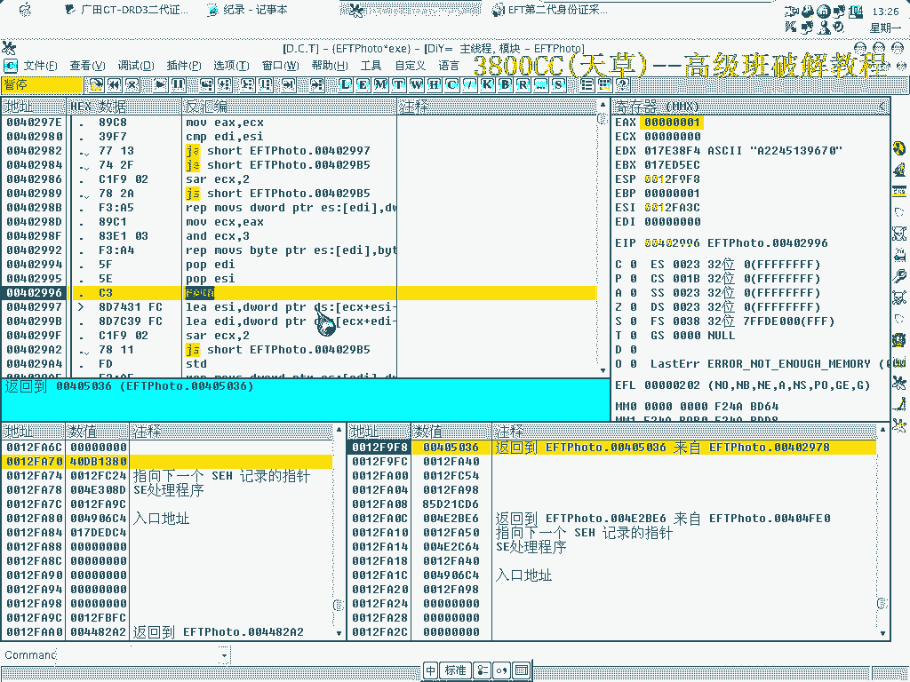

第三部分算法的入口。


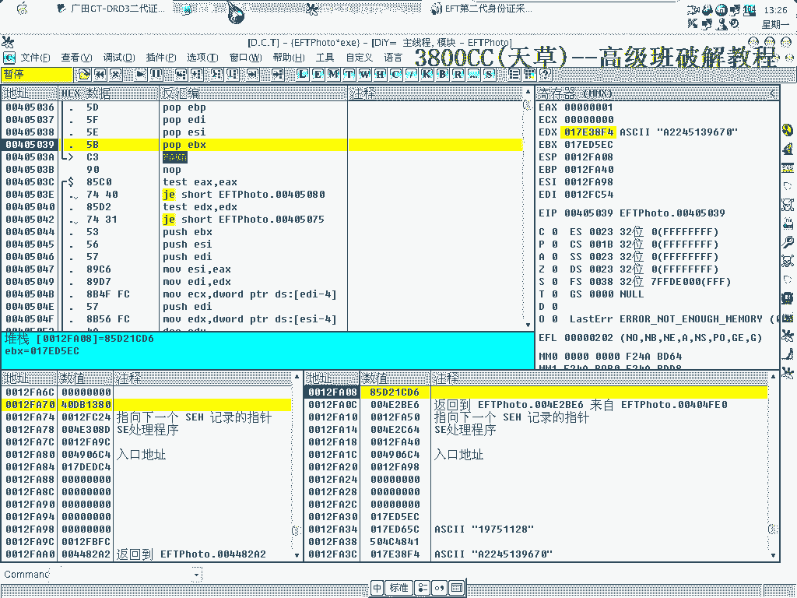


最终注册码的生成逻辑是交叉插入。

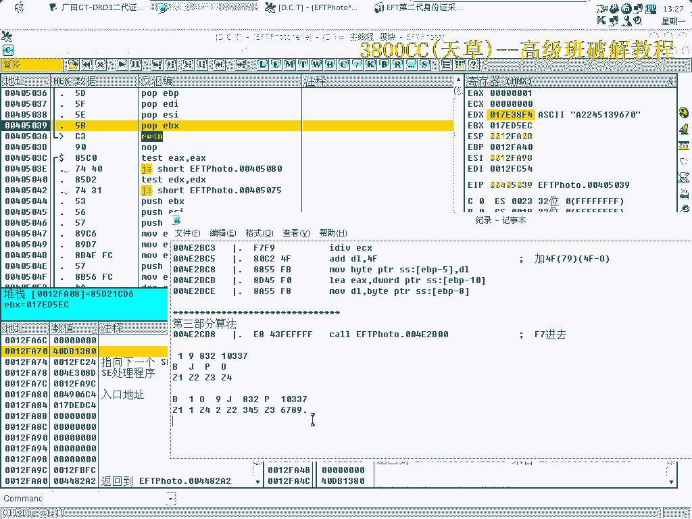

---

## 辅助分析与注册机实现 💻


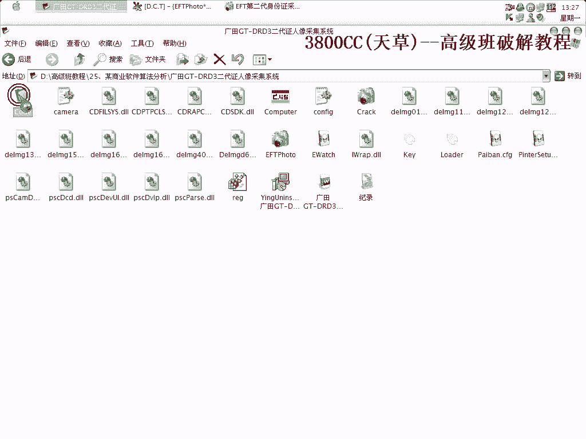

分析时可以使用提供的 `UDD` 备份文件，将其拷贝到 `OD` 的 `UDD` 目录中，这样就能看到预先添加的注释，方便理解。


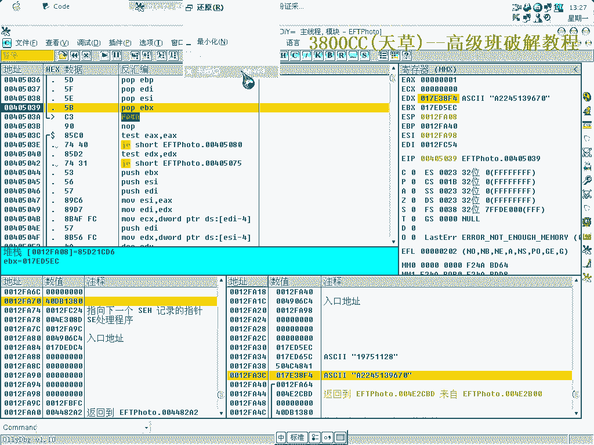

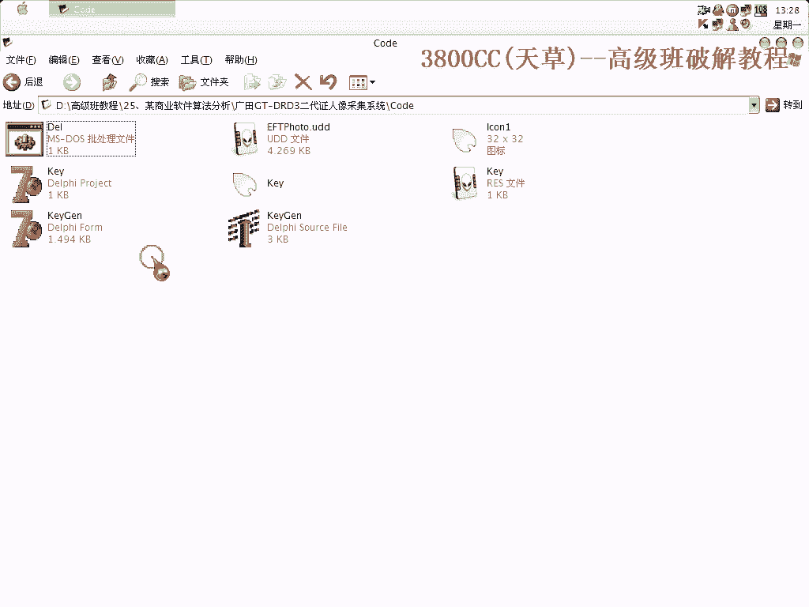


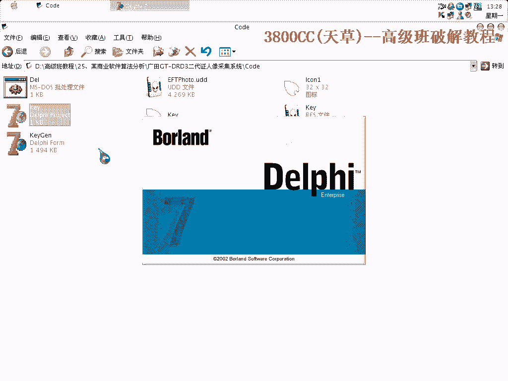

以下是注册机代码的关键逻辑解析：

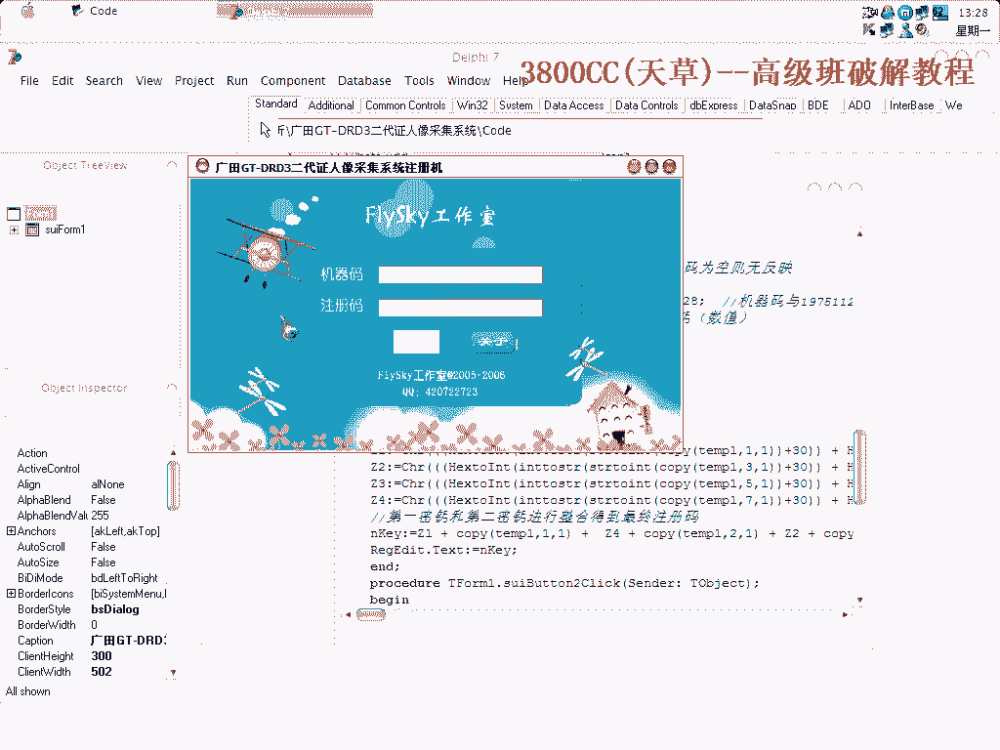

首先定义变量，包括整数变量和字符串变量。如果机器码输入框为空，则不做处理。

**第一步：异或与循环**
1.  将机器码字符串与固定字符串 `"19751128"` 进行逐字符**异或**，结果赋值给整数变量 `MKY`。
    *   **代码逻辑**：`MKY = 机器码 XOR "19751128"`
2.  进行一个循环（`i` 从 `0` 到 `9`），在每次循环中：
    *   将 `MKY` 除以 `10`（`0xA`），得到商 `MKY1` 和余数。
    *   将余数转换为字符，拼接到临时字符串 `Tempo1` 的**前端**（实现倒序）。
    *   将商 `MKY1` 赋值给 `MKY`，进行下一轮循环。
3.  循环结束后，`Tempo1` 中即为第一轮算法生成的数字字符串（如 `"2245139670"`）。

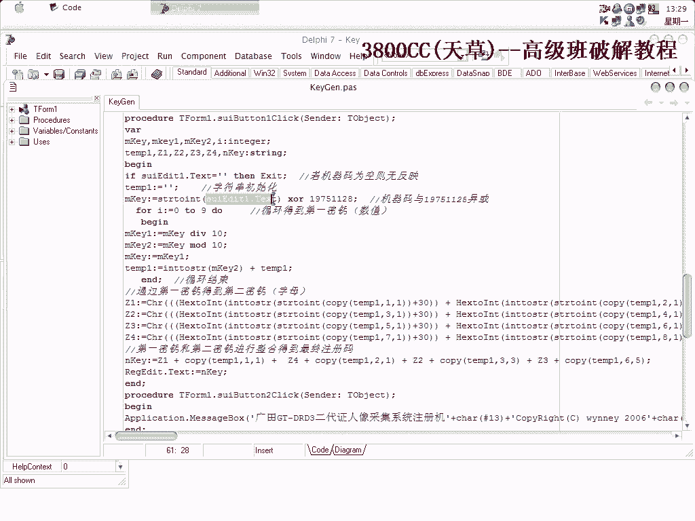


**第二步：字符提取与运算**
这部分对应逆向分析中的第二轮算法，代码非常直接。
1.  使用 `Copy` 函数从 `Tempo1` 中截取特定位置的字符（如第1位、第2位）。
2.  将截取的字符转换为整数，加上固定值（如 `0x30`），然后可能再转换为十六进制或进行其他运算。
3.  分别处理第1&2位、第3&4位、第5&6位、第7&8位以及第9位数字，通过加不同常数（`0x30`, `0x41`, `0x4F`）生成不同的字符（`B`, `J`, `P`, `0`等）。

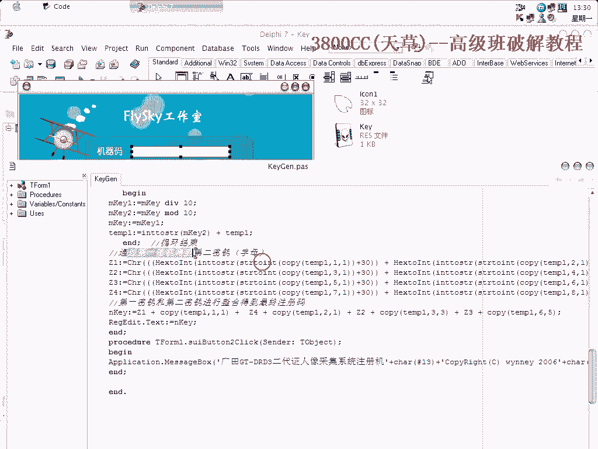

**第三步：交叉插入生成最终码**
将第二步生成的几个字符，按照固定规则插入到第一步生成的数字字符串 `Tempo1` 的特定位置，最终生成完整的注册码。

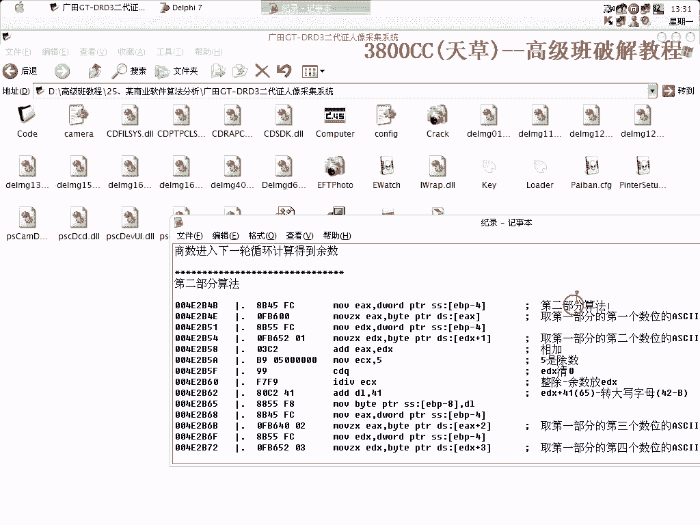


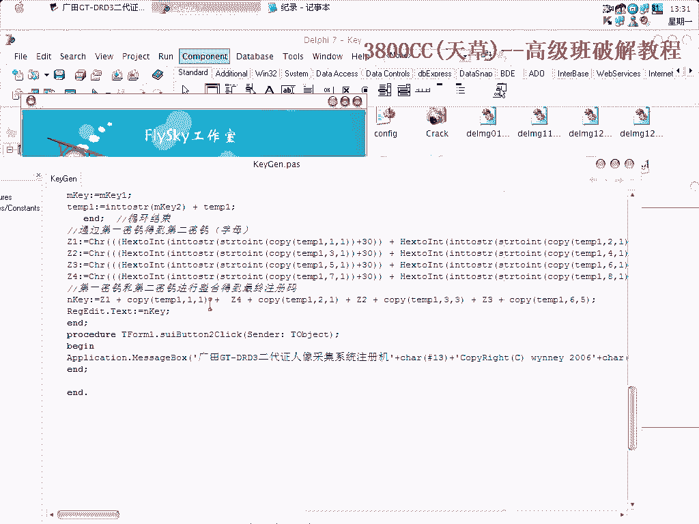

---

## 总结 📝

本节课我们一起学习了对一个商业软件注册算法的完整分析过程。


我们首先进行了基础的查壳和定位。随后，通过跟踪分析，发现了算法核心围绕一个固定日期值 `19751128` 展开。算法主要分为三个部分：
1.  **机器码与固定值异或**，再通过除法和倒序生成数字基底。
2.  **对数字基底进行分段运算**，通过加法、取模、加常数等方式生成几个关键字符。
3.  **将关键字符按固定规则交叉插入**到数字基底中，形成最终注册码。


整个算法的强度较弱，关键点在于识别出固定值、理解字符与数字的转换过程以及掌握交叉插入的规律。通过编写注册机代码，我们完整复现了这一过程。希望本教程能帮助你理解算法分析的基本方法。