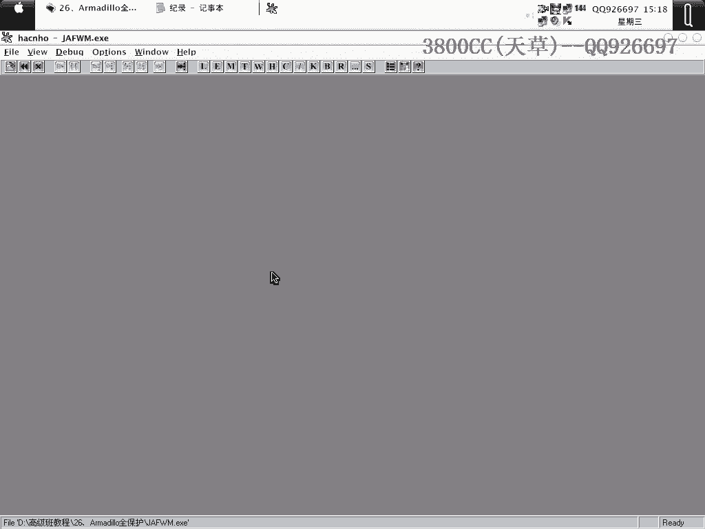
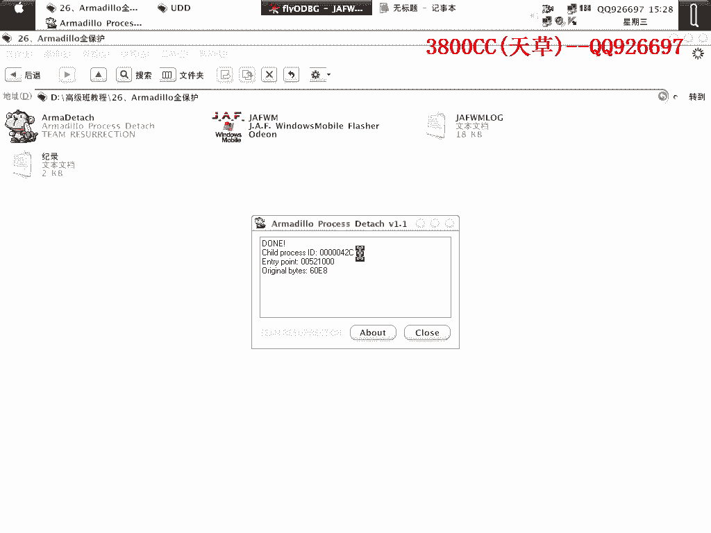
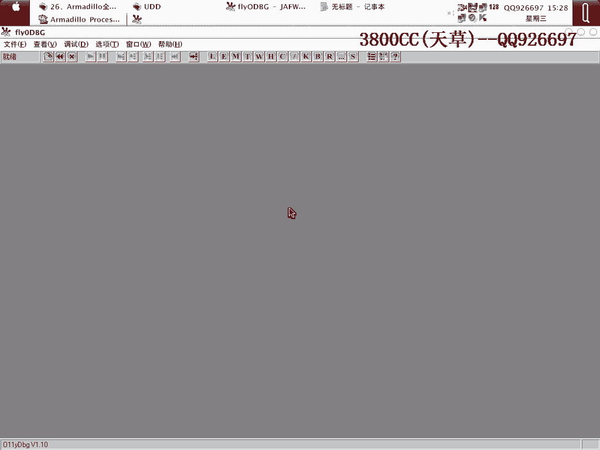
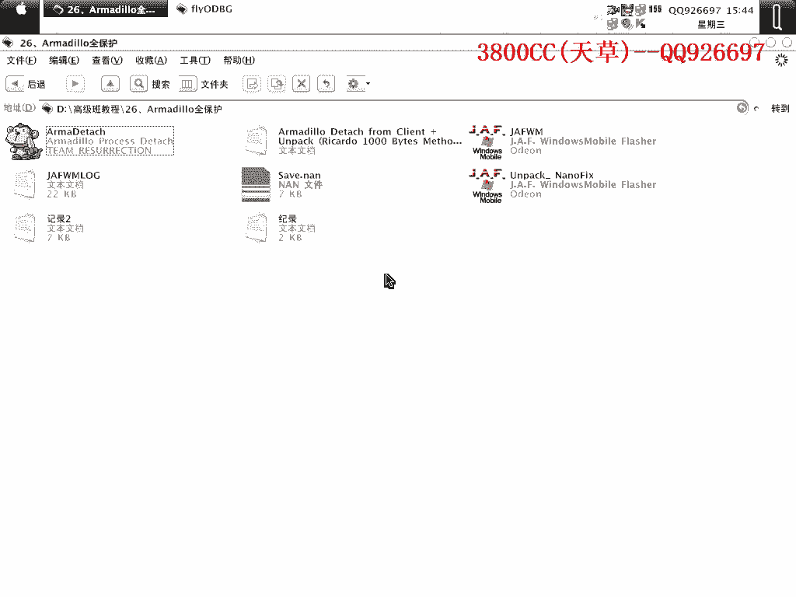

# 天草高级班 - P26：26、Armadillo全保护 - 白嫖无双 - BV1qx411k7kJ

大家好啊，這幾顆我們來做這麼一個動畫，高級版的26顆，這個是我想著後面，後面想著把它給補上來的一個東西，是穿很假的一個殼，這個殼呢，是這麼一個，其實是4點差的，另外呢，它是全保護的，我們可以來看一下。

一般把這個選上可以就是說，如果你用這個來查看它的一些版本，或者保護方式的時候，它提示錯誤的話就把這個選上，把這個選上就，被檢測到的可能性比較小一點，看一下啊，這就相當於，把所有的保護選項都選上了。

所有的保護選項，來看一下，開啟這個有點卡，可以看一下啊，這裡啊，它這裡有總共啊，總體的保護方式提供了4種，然後在一些選項，這個呢，Codeprint，Codeprint就代碼變形了。

等下修復的時候可以看到一些，然後呢，Import Tempor，這個就是說，IAT加密，然後這個CC，這個就是CC，就是遠地質調轉，也就是說，它程序裡面的一些地質，等我們拖完之後，它會繼續，還是像那個。

像原先的，像原先的那個，這個Codeprint是遠地質調轉，遠地質調轉，就是說，等我們拖了殼之後，但是它一些調轉還是往殼裡面跳，但是殼我們一拖了，自然就會出錯。

然後這個Memory Protection呢，Memory就自然就是防止，Protection，就防止內存patching，內存booting，然後這個，這個，等一下大家就可以知道，其實它有點像。

自交驗之類的一些東西，就是說拖掉之後，更有點像那個什麼，附加數據的一些東西，等我們拖掉之後，一些功能無法使用，就是因為這個東西造成的，我們把它關掉，這裡，這裡我們可以就是說，手動，通過手動。

手動我來演示一下吧，就是說手動因為它這個，大家看到了，它加了四種，加了這麼，相當於是五種，六種，相當於六種，六種保護方式，所以我們在，手動拖殼的時候，經常就是說，碰到一些問題，就是說手動的時候。

我會經常，看到了，這個就是，提示我們不行，無法調試，這就是我們手動的原因，隱藏一下，看到了，完全斷不下來，斷不下來，然後，我們就把這個，這個東西，把它放在這裡，然後我們就，把它放在這裡，然後我們就。

把它放在這裡，然後我們就，把它放在這裡，然後我們就，把它放在這裡，然後我們就，把它放在這裡，然後我們就，把它放在這裡，然後我們就，把它放在這裡，然後我們就，把它放在這裡，然後我們就，把它放在這裡。

然後我們就，把它放在這裡，然後我們就，把它放在這裡，然後我們就，把它放在這裡，然後我們就，把它放在這裡，然後我們就，把它放在這裡，然後我們就，把它放在這裡，然後我們就，把它放在這裡，然後我們就。

把它放在這裡，然後我們就，把它放在這裡，然後我們就，把它放在這裡。

然後我們就，把它放在這裡，然後我們就，把它放在這裡，然後我們就，把它放在這裡，然後我們就，把它放在這裡，然後我們就，把它放在這裡。

然後我們就，把它放在這裡，然後我們就，把它放在這裡，然後我們就。

把它放在這裡，然後我們就，把它放在這裡，然後我們就，把它放在這裡，然後我們就，把它放在這裡，然後我們就，把它放在這裡，然後我們就，把它放在這裡，然後我們就，把它放在這裡，然後我們就，把它放在這裡。

然後我們就，把它放在這裡，然後我們就，把它放在這裡，然後我們就，把它放在這裡，然後我們就，把它放在這裡，隱藏一下OD，隱藏一下OD，這個斷點，因為我現在換了一個，SP2的一個系統，這個斷點在，就是說。

換H1，在我那個SP1上面，不至於斷不下來，不至於斷不下來，但是這個SP2這個就斷不下來了，等一下我們用腳本來處理前面的，處理前面的，就可以發現，看到了，我們就首先下這麼一個斷點，先把這個隱藏一下。

重新來過看一下，還是不行，out，這個斷點看一下，因為斷點太多了記不清楚，就這個output，debug stream，還是不行。

我們換用這個OD來看一下，用OD不同的話。

就是說，有一些東西還是不一樣的，至少我在調試這麼一個殼的時候，發現了這麼一個問題，不行不行不行。

這個還是，靠大家在SP1下面去弄吧，這個SP2用這個手動的不行，就是這麼一個過程，這些詳細的過程，我會留給大家，我會留給大家，那我們現在用腳本來處理前面的，而且這個腳本在SP2下面也是非常不好用的。

先把這個bug都刪掉，(咳)，我靠，這個也提示錯誤了，是不是開了屏幕向轉+的原因啊，(咳)，有這麼一些小問題，這裡它有這麼一個提示，提示就安全點，然後shift+F9，啊？不行，SP2系統的確不好用啊。

的確非常非常的不好用，看一下，沒有其他要隱藏的，(咳)，啊，可以了，它這裡是OEP的，幾個字節，首先頭兩個字節是558B，它這裡反過來寫就是8B555，以16進制這樣反過來寫就是8B555了。

558B這個記者，然後呢這個是紫禁城的一個禁城ID，而且這個OEP是4716D4，這個我們有必要做一些記錄啊，00啊，它前面多了一個0啊，4716D4，因為這個是國外的人寫的，它的這一些。

它有這麼一個習慣啊，就是把，在前面多加一個，然後呢開頭是558B，這些都有必要記著，就是OEP的其實，那個那個，頭兩個字節啊，這是OEP的頭兩個字節啊，那我們剛才載入的時候，載入的時候就說可的。

頭兩個字節是6018啊，這要分清楚啊，6018，好，我們在做好這個記錄之後，點確定，這個時候啊，就是我們一個完成了，這前面的一些步驟，就是這個記錄裡面所描述的，記錄前面啊，前面這一些描述的。

就是我們這個用這個腳本來完成，腳本來完成了，好，接下來的用附加，這，這裡啊，這前面所做的啊，就是把紫進程和負進程分離啊，紫進程和負進程分離，大家看到了，現在有兩個進程啊，兩個進程，這個紅進程呢。

代表我們現在就是代表我們的一個負進程啊，負進程，我們剛才看到了紫進程是5D4啊，5D4就是這個黑的啊，就是這個黑的，好，我們點附加，在這個地方啊，這個地方關於這個穿甲的多保護啊，多保護這個。

在國內看血上面，看血上面沒有發現，就是說講這麼多保護的啊，最多也就是講四個保護的，他裡面有些文章裡面提到的就是說，在這個地方呢，按F9再按F12，這個我嘗試過，我嘗試過，在有的有的系統啊。

我在那個XSPE上面啊，用有部分OD啊，跟OD也有關，用部分OD可以斷下來，但是在我這個SPR上面啊，是無論如何都弄不下來的啊，好，我們這裡就用，按F9來代替，這裡替換上啊，OEP的替換上。

大家看到這是4716D4嘛，替換上OEP的前兩字節，5518，不是5518嗎，558B啊，558B，翻了，好，這個就是我們OEP的，好，我們現在來Ctrl+B啊，FF25，來看一下他這一些，右鍵，轉成。

跟隨，類成地址，往上面找，找到IIT的起始位置，起始位置，好，這裡，我們可以把3C，3C，3C，16733C來作為起始地址，但是大家看到了，這個16733C呢，其實是可的地址啊，可的地址。

這個就是我們所說的Cosplay呢，遠地址跳，遠地址跳啊，16，大家看到了啊，他跳到這裡來，但是我們這個現在是，類成地址最多啊，類成的地址系統的，就是說這個程序的，類成地址最多也就是0062的。

0062，他這裡來了一個16733C啊，很明顯，他這個就是遠地址跳了啊，遠地址跳，我們需要修復，當然現在在修復之前，我們需要啊，我們需要修復他的，這個這些遠地址啊，而且要修復一下，他的一個IIT啊。

就是我們剛才所說的，Import，這一個啊，我們這個，首先我們第一步處理的是，這一個啊，是這一個大家看到了啊，我們現在只有這麼一個進程啊，看一下，把這個也關掉啊，大家看到了，那就是首先，只付只只進程。

附近程分離，這個就是我們現在一個，只進程啊只進程，我們第一步處理的就是啊，就是這一個，第一個，把只付只進程附近程啊，這個第八個包呢，這個就是說主子調適器嗎，剛才大家看到他主子，非常厲害，在SPR上面。

我感覺啊是尤其厲害啊，我在SP上面是手動，還成功了啊，還成功還可以成功，然後第一個啊，我們處理的保護選項，就是一個雙進程，我們首先就做的是，把只付進只進程附近程分離啊，只進程附近程分離。

那第二步需要做的，當然自然就是IIT了啊，需要修復他的IIT，這些IIT大家看到啊，這些，這些啊，就是說IIT之間，最多也就是用用用，0000來隔開啊，他這裡也明顯就是，變了啊，變了就是說被弄掉了。

他的IIT就被弄掉，這是我們需要修復的一個內容，那我們現在怎麼來做呢，好，用這一個，打開它，把加格程序投上去，這個要有點卡啊，這個還沒出現，因為拖這個殼，本來機器機有一點卡，有一點卡，卡，把這個，好。

我們把這個記一下啊，等一下，因為開這個也要佔內存啊，也佔內存，OK，打開它，拖進來啊，這裡的啊，就是另外的大家看到了啊，這一載入之後，進程裡面也多了兩個，1 2，這是我們開始的一個啊。

這兩個就是他來載入的，也是分紫禁城和復禁城啊，這個是紫禁城的。

我們需要用的啊，就是他的一個紫禁城，同樣啊，同樣再次打開，好。

同樣用附加的方法，我們要附加的啊，要附加的是這麼一個ID，42C，42C就這一個，點附加，然後 Alt + F9，這裡我們需要啊，需要改的字節，並不是OEP的頭兩個字節，是刻的兩個字節啊，是6018。

因為程序，等一下大家看到這個，為什麼是6018就知道了啊，改一下6018，然後呢，同樣啊，是霍雷索也一場，霍雷索也的一場啊，然後抗流加G，(咳)，在這裡啊，我們在這一個斷點，這個jump這個地方啊。

下硬件執行斷點，然後Shift + F9，好可以斷線啊，大家看到這個對戰這裡，很明顯啊，Multi跳快了，再一次，OK，刪除硬件斷點，Alt + F9返回，這個就是Multi跳了，我們改jump。

改了jump之後啊，我們再，安頓一下，在這個地方，F2，Shift + F9斷下來之後，再返回去，把那個Multi跳撤銷啊，撤銷Multi跳，因為後面，因為他這個是有這麼多檢測的啊。

我們為了就是說保險起見，還是這一步做保險一點，當然他就是說，一些檢測的，檢測就是說保護選項啊，檢測選項，如果不是選的很多的話，這我們就不需要這個，這樣做了，只需要改，改了之後然後進行下一步就OK了。

我們這一回呢，Reverse 抗流加G，Create啊，好來到這裡，我們在這裡下好斷點啊，同樣在斷首也下一個，看他要斷，先斷哪一個啊，他是斷在這個地方的，我們這次是R+F9，單步走啊，往下面走啊。

下面走啊，找最後一個這個，最後一個，Call EC，ECX，當然我們可以單步走了啊，可以單步走，看到了4716D4，就是我們的OEP了，OEP，F7，大家看到這些OEP的，OEP沒有解碼。

但是這個我們這裡的OEP啊，這裡的OEP是解碼了的，前往起點，這裡OEP是解碼了，但是這裡的OEP，OEP是解碼了，但是他的一個IAT沒有解碼，這個呢，OEP沒有解碼，但是IAT解碼。

這個時候我們就需要啊，就需要就是說找到他的IAT了啊，IAT，我們這個樣子，剛才大家看到了啊，這裡啊，右鍵鍵，Lesson中跟隨，我們來到斷首啊，斷首，OET的，IAT的。

我們就可以把它看成是3C3C開頭的啊，這個時候啊，我們來選前面的1到3個啊，1到3個，IAT，右鍵，二進主輻制，然後來到後面，我們後面進行的那一步，打開啊，Alt+M，就是打開六指鏡下啊。

然後把鼠標在最上面那一行點一下，右鍵Ctrl+B，來搜索，黏貼啊，右鍵黏貼搜索，這裡選擇整個區段啊，搜，把它搜，OK，那這裡搜到了就是說這一些，啊，右鍵，長，型啊，大家看到啊，這些IAT就是可以的啊。

就是沒有問題的，我們呢，從這裡3C3C這個地方來，複製，一直複製，一直複製，在這裡呢，多複製一些沒關係啊，只要你保證在後面黏貼的時候，能夠黏貼，我們就複製到23，23這裡來吧，好複製。

我們在這裡來黏貼啊，要記得啊，同樣要從這裡開始，這個你，位置要對齊啊，你對，對歪了之後，這些IAT都都變了啊，都變了啊，繼續往下面拉啊，這裡呢，我們拉過23，因為它複製的時候會按順序來對的，看到啊。

這裡紅色代表剛剛被修改過了的啊，就是說填充了的啊，這裡也被修改了的，這些都被修改了啊，好，嗯，這個時候啊，我們把這個我們剛才複製的複製的二進制全部都留下來，這個是我們可以關掉後面的，關掉後面的。

大家看到了，這個時候我們來請出他，把這個也關掉，把他請出來啊，請出來我們看一下，現在我們的這一個，他這個進程ID是5D4，就是最最首先最開始的一個ID啊，5D4啊，5D4，我們選擇這個5D4啊。

啊這裡CodeSpring呢，因為這個0。95版本的啊，0。95版本，他自動就給你找到了CodeSpring的一個地方，但是不是夠準確的，不夠準確，打開ArtGem啊，大家看一下。

他這裡給你找的是哪一個啊，2EF啊，2EF，002EF，這裡我們看不到啊，看不到的，這個地方呢，而且我們這裡這個地址一般都是正確的啊，我就是說沒有發現他這個地址錯誤的情況，但是這裡啊。

這裡我們這裡有個Code的長度啊，長度，要把它改一下，長度要把它改一下，長度要把它改一下，長度改成2萬，他這裡是1萬，我們點他，Remove，開始修復，有這麼多個修復完了啊，大家看到了。

修復完了之後這裡就變了，剛才這裡沒有變啊，這裡就是說被修復了的啊，好接下來是修復我們的IAT了啊，這裡看到了，大家看到了啊，他這個IAT呢，是原地址跳了啊，原地址跳了啊，原地址跳了。

我們要把它放到我們程序裡面來啊，要放到程序裡面來，至於放到哪個區段啊，你就選一個比較大一點的區段，比較大一點的區段來放，大家看到了，最大的區段當然是Tags。

但是Tags那邊最好是不要往Tags裡面放啊，Tags裡面因為程序的大部分東西都在Tags裡面，他就說不保證有那麼多，那麼長的一個空餘地址給我們放那個IAT了，所以我們在找，這裡有一個5000啊。

放5000裡面也可以啊，放這個裡面也可以，我習慣放在Data段裡面啊，放在Data段，當然這個程序啊，這個程序裡面Data段太短了，太短了，不方便放，這個大家可以自己去試一下，各個程序你可以放不同的啊。

當然可以放不同幾個地址，好，這裡，要件一下啊，大家看到了啊，其實地址我們剛才說了，可以把167。3。3。3啊，167。3。3。3啊，這裡改一下，3。3。3。3，這裡長度呢，我們二話不說，選一選。

懶得去算啊，懶得去算，這裡就是我們要放IAT的一個新的地址啊，新的地址，也就是說我們，他這裡的Modem，讓我們放到這裡面來啊，4D1000，就是放到這個段子裡面，就像他這個Modem我們就這樣吧。

點他，好，這樣修復完了我們來看一下，地址啊，這些都被移過去了，都被移過去了，OK，此時我們可以Download了，可以Download了，右鍵啊，修復一下鏡像啊，大家看到了，剛才就是說這個，這個工具啊。

不是完全可信，我們修改了這麼一個地址，也修改了這麼一個地址啊，當然這個地址，這個地址我們也修改了，這個地址呢，你可以自己自行修改，你想放到其他地方去也可以啊，也可以，好，這個時候我們來打開，來修復啊。

來修復，OEP呢，OEP我們開頭就找到了，17U6D4，看到了啊，RVA也，他也給我們換過來了啊，長度啊，他這是594，594，我們改成1000，因為我們剛才這裡填的是1000啊，點他，同時呢。

在修復這一類殼的時候啊，我們需要啊，需要做一下設置，這個，這三個不要選上啊，不然脫了殼，脫了，脫了殼的程序之後，他會再出現跨平台運行，這三個沒選上的話，就是說跨平台運行，可能性比較小一點，我們再點修啊。

就顯示無效，全部剪掉，因為我們這裡填的是1000嘛，這樣有非常非常多的無效啊，OK，修復，可以運行啊，再來看一下是，顯示什麼啊，他這裡原來顯示是這麼一個東西啊，這麼一個東西。

我們來用FI來查一下就知道啊，嗯，好，這是1+5的，這個是沒有殼的啊，這個也算是，一個種欺騙吧，因為他的這個，他的這一個就是說，大家看一下啊，其實還有一種辦法，還有的話，在手指節這個地方啊。

把55改成54啊，可以把55改54，他這個地方，就是他的一個手指節，558B，我們不用管啊，只要知道是他，他有這麼一個屬性就可以了，就像這類殼我們拖了之後，PID還是會顯示這麼一個，不用管他啊。

那我們運行看一下啊，先看一下原程序，就這一個按鈕啊，他這裡需要連接什麼一些東西，連接不上啊，那再看一下這一個，啊就出現錯誤啊，這個就是我們的這一個啊，這一個啊，看一下是，好，取消啊。

這個時候我們來怎麼呢，他因為有這一個修復的啊，我們來local一下啊，再點他，因為因為是這麼一個按鈕出問題啊，我們就點這個按鈕，大家看到啊，這裡就修復了一些硬的算了，一些硬的算，然後我們再點這個。

AP的，就是修復，修復就是說，修復我們剛才脫殼後修復的文件，好當，再點save啊，把我們的這一個文件給保存一下，文件給保存一下，我們下回修復的時候呢，就直接把他給弄進來就可以了，再來看一下，可以啊。

一樣的其他都一樣，這是因為他需要這是一個狗啊，不然這些也是一樣的啊，沒有其他問題了，沒其他問題，好，那麼這麼一個殼就被我們脫掉了，被我們脫掉了，好我們來另外呢，我們來看一下，來看一下，這裡，名稱為，好。

來看一下，我們脫殼後修復的文件來打開，你看這個入口是VC的一個程序，VC的一個程序，因為一點叉叉穿甲一點叉叉，二點叉叉，他這個入口就是VC的一個特徵，所以PID就無報，然後我們看一下像這樣修復了之後的。

就變成這樣了，這個就相當於我們在穿甲，在那個，那個什麼，S-ProTek那個殼裡面，就說相當於補區段了，只不過我們不是我們手動來補，是他來補，他來補，這個已經對我們的破解啊，什麼的已經沒有什麼任何。

沒有任何影響的，沒任何影響，好了這幾課內容就這麼多啊，內容就這麼多，一些東西呢，我會保存給大家的啊，像這，這個就留給大家看一下，在裡面可不可以運行，那這兩個記錄啊，這一個呢，還有，還有啊，這個腳本。

這個腳本也會留給大家，也沒有其他東西了啊，好了今天這節課就到這再見。

