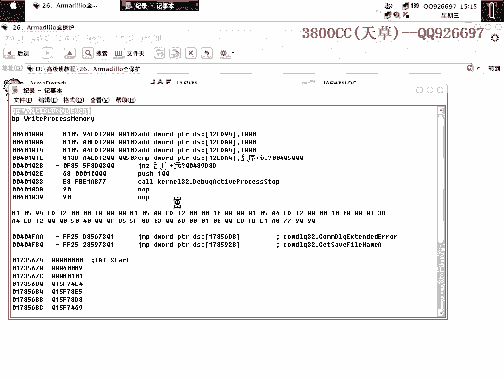
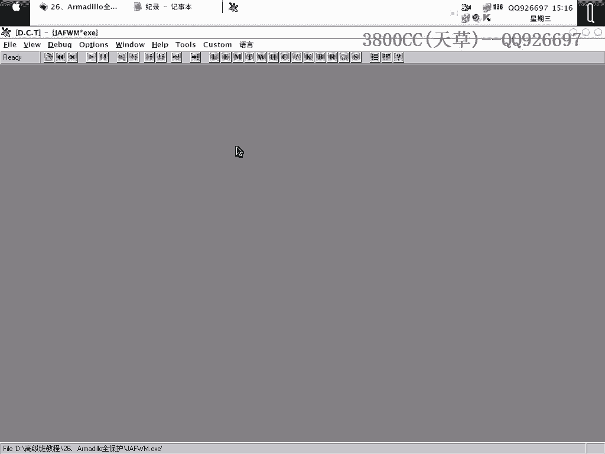
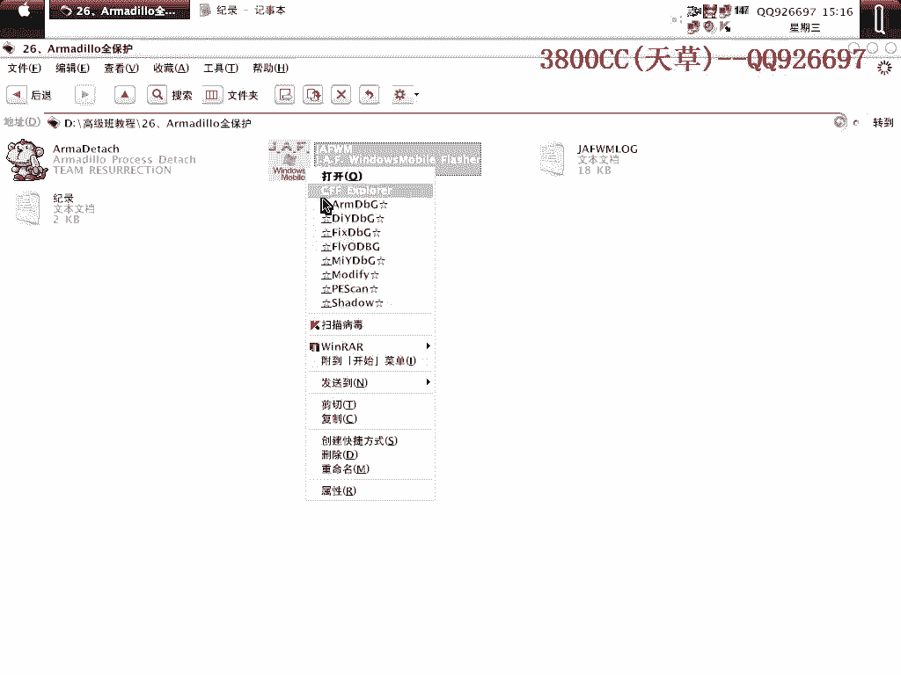
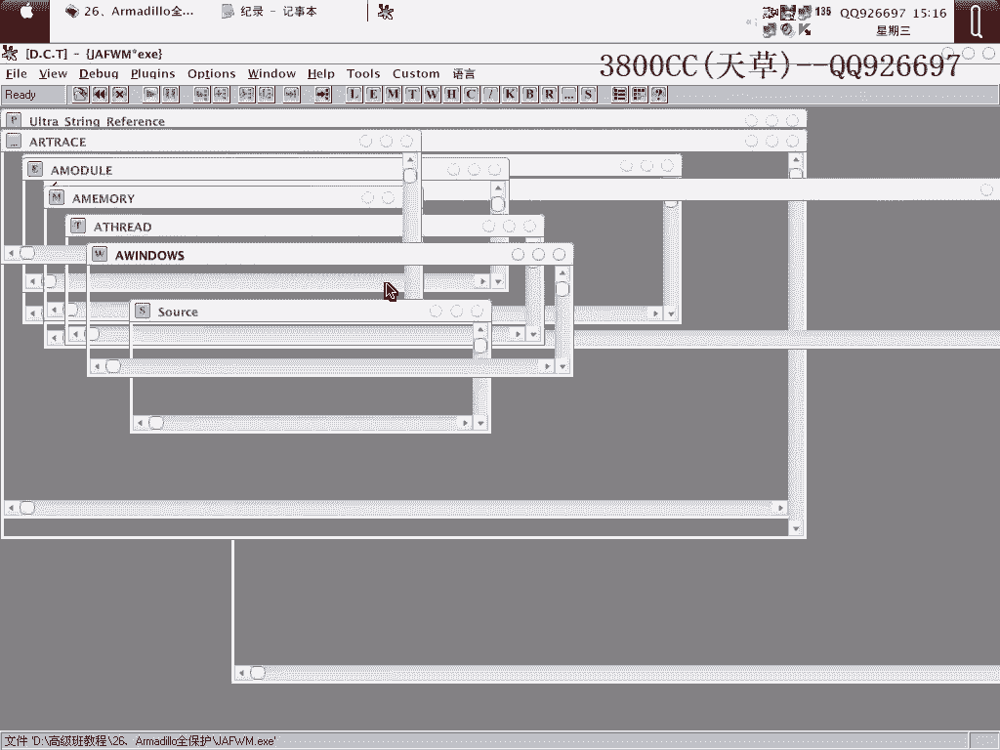
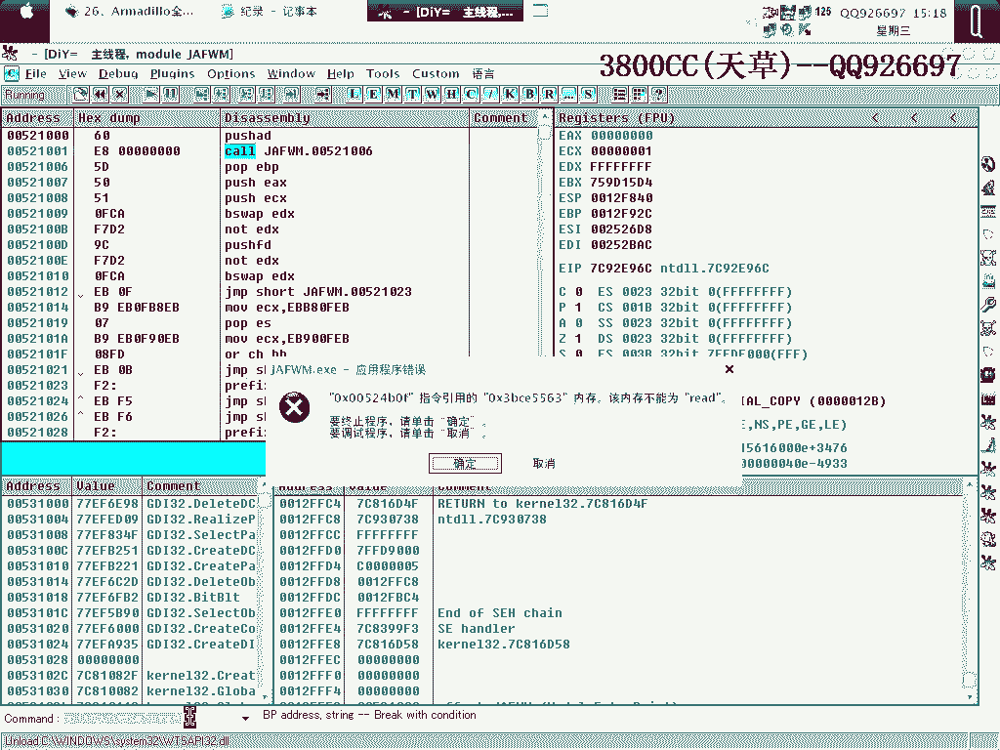
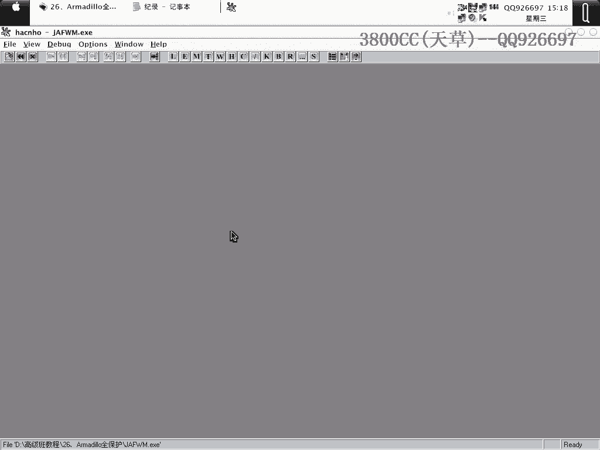
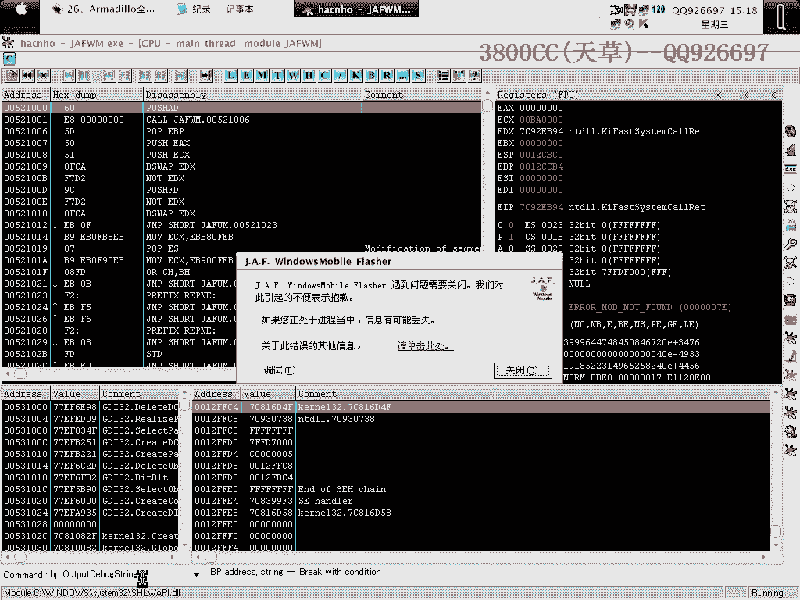
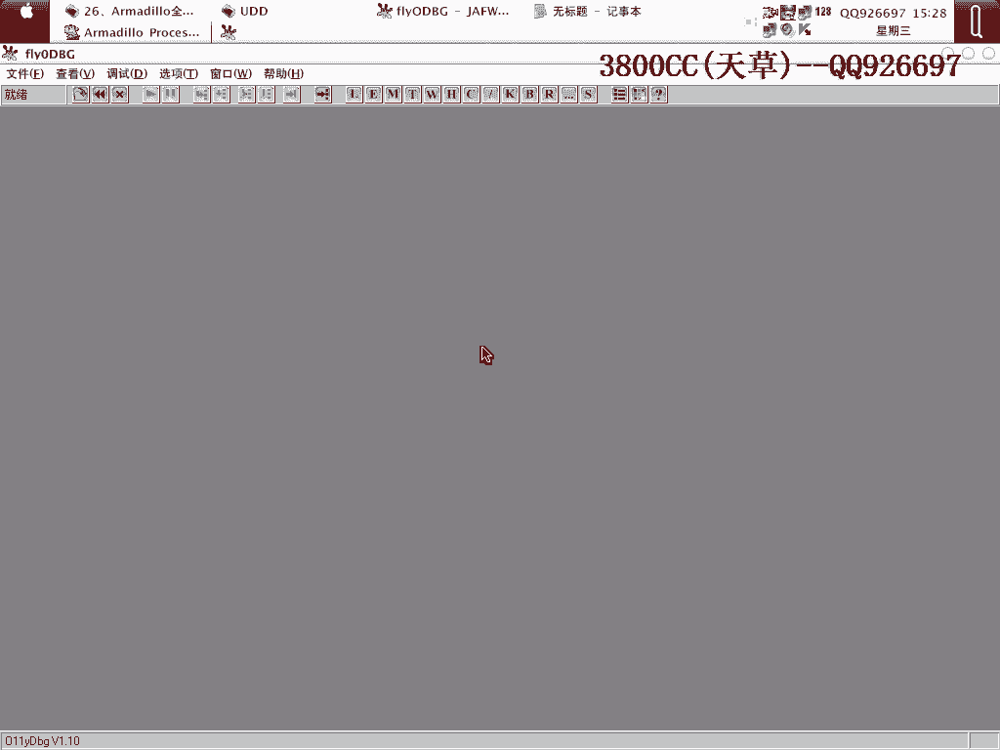
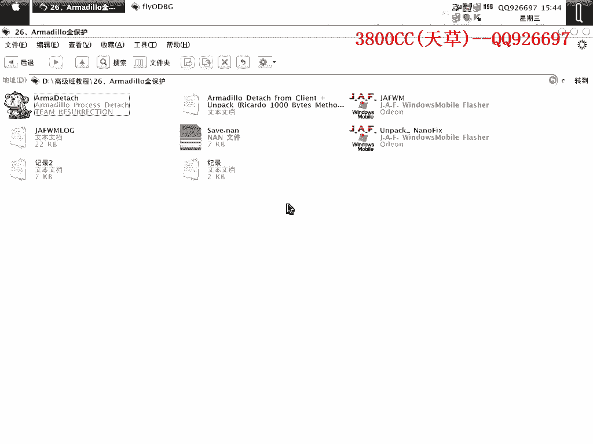

# 天草高级班 - P26：Armadillo全保护脱壳教程 🛡️➡️🔓

在本节课中，我们将学习如何对一个启用了全部保护选项的Armadillo壳进行手动脱壳。Armadillo是一款强大的商业保护壳，其“全保护”模式集成了多种反调试和代码混淆技术，对脱壳过程提出了更高的挑战。我们将逐步分析其保护机制，并演示完整的脱壳与修复流程。

## 概述与保护机制分析

上一节我们介绍了Armadillo壳的基本概念。本节中，我们来看看当启用“全保护”模式时，程序具体集成了哪些防护措施。

该壳程序启用了全部保护选项。在配置工具中查看版本或保护方式时，若提示错误，勾选特定选项可降低被检测的概率。这相当于激活了所有可用的保护功能。

Armadillo全保护模式主要提供了四种核心保护方式，并包含多个子选项：

以下是主要的保护选项及其作用：
1.  **Code Splicing（代码拼接）**：此选项会对代码进行变形。在后续修复时，我们可以看到其效果。
2.  **Import Table Elimination（IAT加密）**：此选项对导入地址表进行加密处理。
3.  **CC（远地址跳转）**：即“Call to Call”，程序内部的一些调用地址，在脱壳后，跳转指令仍然指向壳的地址。由于壳已被脱去，这会导致程序运行出错。
4.  **Memory Protection（内存保护）**：此选项用于防止内存补丁和内存转储。

此外，还有一个关键的保护机制，其作用类似于自校验或附加数据。脱壳后，部分功能无法使用，通常就是由这个机制造成的。

## 手动脱壳尝试与问题

了解了保护机制后，我们首先尝试手动脱壳。由于程序集成了多达五六种保护方式，手动操作经常会遇到问题。

在手动附加调试时，程序会提示无法调试。隐藏调试器后，发现完全无法断下任何断点。我们尝试了多种方法，包括设置特定的断点（如`OutputDebugString`），但在某些操作系统（如Windows XP SP2）上均告失败。

以下是手动脱壳过程中遇到的主要困难：
*   调试器被强力检测，无法正常中断。
*   不同版本的调试器或操作系统环境，行为可能不一致。
*   在SP2系统上，手动脱壳的可行性很低。

因此，我们将转向使用脚本辅助完成前期工作。

## 使用脚本进行前期处理

由于手动脱壳困难，我们使用一个专用脚本来处理初始步骤。这个脚本在SP2系统下也可能不太稳定，但它是必要的起点。

运行脚本后，我们需要记录关键信息：
*   **OEP（原始入口点）**：地址为 `004716D4`。注意，国外编写的工具习惯在地址前加一个`0`，实际是`4716D4`。
*   **OEP起始字节**：前两个字节是 `55 8B`（对应十六进制显示可能为 `8B55`）。
*   **壳的起始字节**：载入时，壳的前两个字节是 `60 18`。务必与OEP的字节区分开。

记录完成后，脚本会执行子进程与父进程的分离。此时在进程列表中可以看到两个进程：父进程和子进程（黑框）。我们需要附加到子进程上进行后续操作。

## 修复IAT与处理远地址跳转

成功分离进程并附加后，我们进入核心的修复阶段。首先需要修复被加密的导入地址表和处理远地址跳转。

在代码中搜索 `FF 25`（间接调用指令），可以找到IAT的调用点。右键选择“跟随表达式”，然后向上查找IAT的起始位置。例如，可能找到地址 `0016733C`。

然而，`0016733C` 这个地址明显超出了程序正常的镜像范围（例如 `0062xxxx`），这就是“远地址跳转”的保护效果。调用指向了壳空间内的地址，脱壳后这些地址将失效。

以下是修复IAT的步骤：
1.  使用工具（如`Armadillo Find Protected`）载入加壳程序，它会自动创建两个进程。
2.  附加到子进程上（进程ID可通过工具查看）。
3.  在特定位置（如`CreateThread`调用处）下硬件执行断点，然后运行程序中断。
4.  单步跟踪，找到程序解压IAT并准备跳回OEP的时机。
5.  在内存映射中，搜索IAT的特征字节（如`3C 3C`），找到已解密的IAT数据块。
6.  将这些正确的IAT数据复制出来。

## 重建IAT与最终脱壳

找到正确的IAT数据后，我们需要在脱壳后的程序中重建它。

首先，使用修复工具（如`ArmaGeddon`）处理代码拼接。工具可能自动定位到相关区域，但需要手动调整代码段的长度（例如，从默认的`1000`改为`2000`），然后进行修复。

接下来，修复IAT的远地址跳转：
1.  在修复工具中，指定原始IAT的地址和长度。
2.  为IAT选择一个新地址，通常找一个有足够空间的区段（如`.data`段），避免放在`.text`段。
3.  执行修复，工具会将远地址调用修正为指向新地址的有效调用。

完成IAT修复后，进行最终的转储操作：
1.  在转储工具中填入之前记录的OEP地址（`004716D4`）。
2.  将IAT的RVA和大小设置正确。
3.  在修复选项中，**不要勾选**前三个选项（如“使用新的输入表”、“追踪真正的调用”等），以增加脱壳后程序的兼容性。
4.  执行转储和修复。

## 处理附加数据与程序校验

脱壳修复后的程序可能仍无法正常运行，点击按钮会报错。这是因为还有“附加数据”或自校验保护未被处理。

此时，需要使用专门的补丁工具（如`Armadillo Killer`或`Anti-Armadillo`）：
1.  载入原版加壳程序。
2.  点击出错的按钮，让工具分析并修复其中的硬编码或校验代码。
3.  再载入我们脱壳修复后的程序，应用刚才生成的修复数据。
4.  保存最终的文件。

处理完成后，脱壳程序的功能应恢复正常。使用查壳工具检查，可能会显示为“Microsoft Visual C++”编译，这是正常的，因为壳的特征已被去除。新增的区段是修复过程中重建IAT所产生的，对破解已无影响。

## 总结与资料

本节课中，我们一起学习了针对Armadillo全保护壳的完整脱壳流程。

我们首先分析了其集成的多种保护机制，包括代码拼接、IAT加密、远地址跳转、内存保护和附加数据校验。然后，我们经历了从手动尝试失败，到使用脚本分离进程，再到逐步修复IAT、处理远地址跳转，最后处理附加数据校验的完整过程。关键点在于耐心地寻找已解密的IAT数据，并正确地将其重建到脱壳后的镜像中。

这个过程涉及多个工具和细致的操作，需要根据实际情况灵活调整。提供的脚本和步骤记录是攻克此类强壳的重要参考。

---
**本节课中我们一起学习了：**
*   Armadillo全保护模式的核心机制。
*   使用脚本辅助进行子进程分离。
*   定位并修复被加密和混淆的IAT。
*   处理远地址跳转保护。
*   使用工具修复脱壳后的附加数据校验。
*   最终完成可运行脱壳文件的生成。