# 天草高级班 - P27：高级班总结 🎓

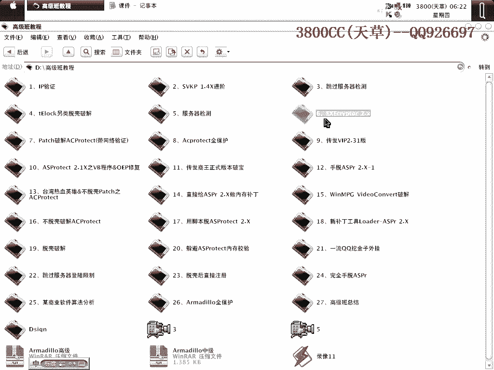

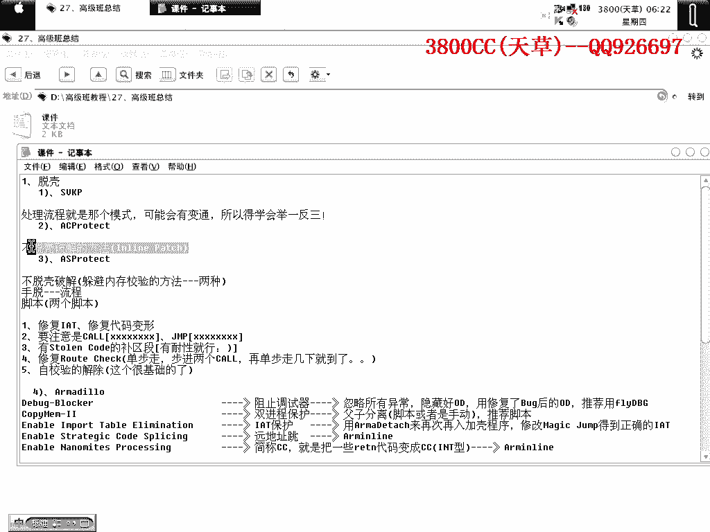

在本节课中，我们将对天草高级班课程的核心内容进行系统性的梳理与总结。课程主要涵盖了多种高级壳的脱壳方法、网络验证的破解思路以及一些重要的学习建议。

---

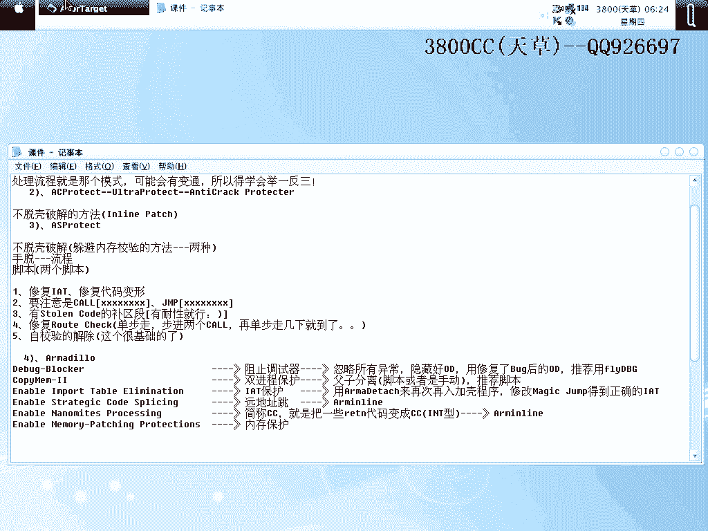

## 一、 高级壳处理总结

上一节我们介绍了课程的整体框架，本节中我们来看看在高级班中重点讲解的几种壳及其核心处理方法。

### 1. SVKP壳
SVKP壳的处理流程存在多种变通模式。在高级班中讲解的SVKP案例与初级课程中的有所不同，因此需要学会举一反三。建议学员自行寻找更多SVKP加壳的程序进行练习。

### 2. AS Protector壳
AS Protector壳（有时也称作Anti-Corrupt）的**不脱壳破解方法**是必须掌握的核心技术。该方法在国内教程中较为少见。

以下是处理AS Protector壳的关键步骤：
*   **躲避内存校验**：课程中介绍了两种方法，需要仔细理解。
*   **手动脱壳流程**：
    1.  处理IAT（导入地址表）。
    2.  寻找两个特征值 `0x85`。
    3.  处理代码变形。
*   **脚本辅助**：课程中提供了一个最佳脚本，可用于自动处理修复IAT和代码变形前两项工作。该脚本已随课程提供。

使用脚本时需注意IAT项的类型：
*   **Call类型**：特征为 `FF 15`。
*   **Jump类型**：特征为 `FF 25`。
识别类型后，只需补充相应的区段即可。

最后是修复 `Load Check`。判断是否为 `Load Check` 的方法是：当补完所有认为必要的区段后运行程序，若出现“Protect Error”或错误地址指向已补区段，即可确定。修复方法是找到特定代码并替换，具体替换代码在课程中已讲解。

### 3. 穿山甲全保护壳
穿山甲全保护壳目前应用广泛，其保护模块需分别处理：

以下是穿山甲全保护壳各模块的处理方法：
*   **Debug Blocker（阻止调试器）**：处理方法为忽略所有异常并隐藏OD。推荐使用修复版OD，例如 **Dbg**，其在调试此类壳时表现稳定。
*   **Comii（双进程保护）**：存在父子进程互相检验。需要进行进程分离，推荐使用脚本处理，以避免手动操作时的时差导致检测。手动方法也必须掌握。
*   **Import Enable（输入表保护）**：使用特定工具载入加壳程序，通过修改 `MultiJump` 来获取正确的IAT。这是脱标准版或此类全保护壳的基础流程。
*   **Crossplane（原地跳转）**：使用专用工具处理。注意：使用 `0.95` 版工具时，若识别出的区段大小为 `0x10000`，建议手动改为 `0x20000` 以确保安全。
*   **CC Protection（代码变形）**：将代码变为 `0xCC`（`int 3` 中断）。脱壳后若点击按钮程序退出，往往是此保护所致。使用对应工具处理，方法在课程中已说明。
*   **Memory Protection（内存保护）**：防止内存补丁。这是后三种保护中重点需要掌握的。

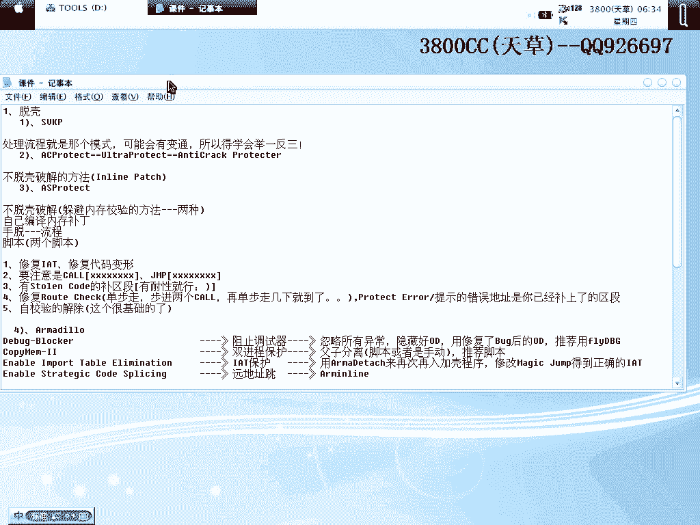

对于AS Protector和穿山甲壳，虽有直接打内存补丁的方法，但需要自行编写大量代码，对当前学员能力要求较高。未来可视大家能力提升情况再作讲解。

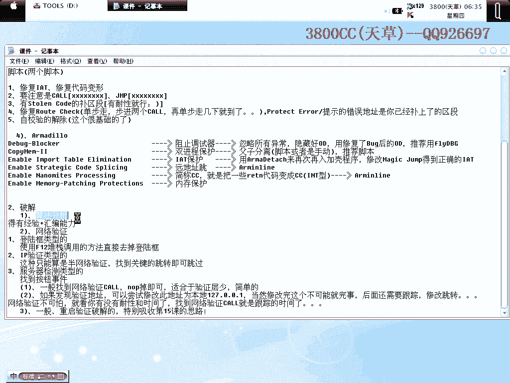

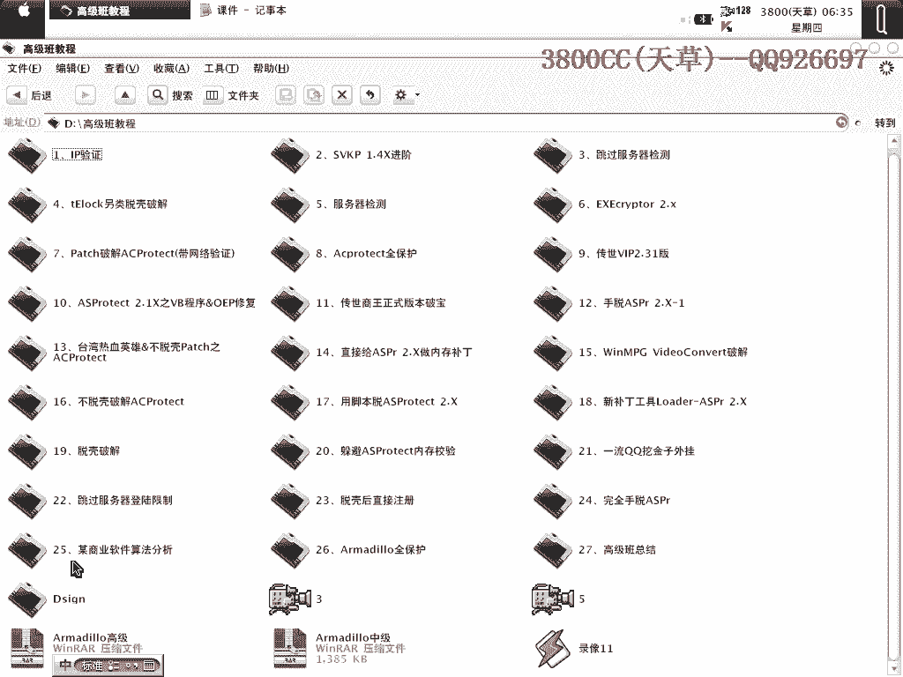

---

## 二、 算法分析与网络验证

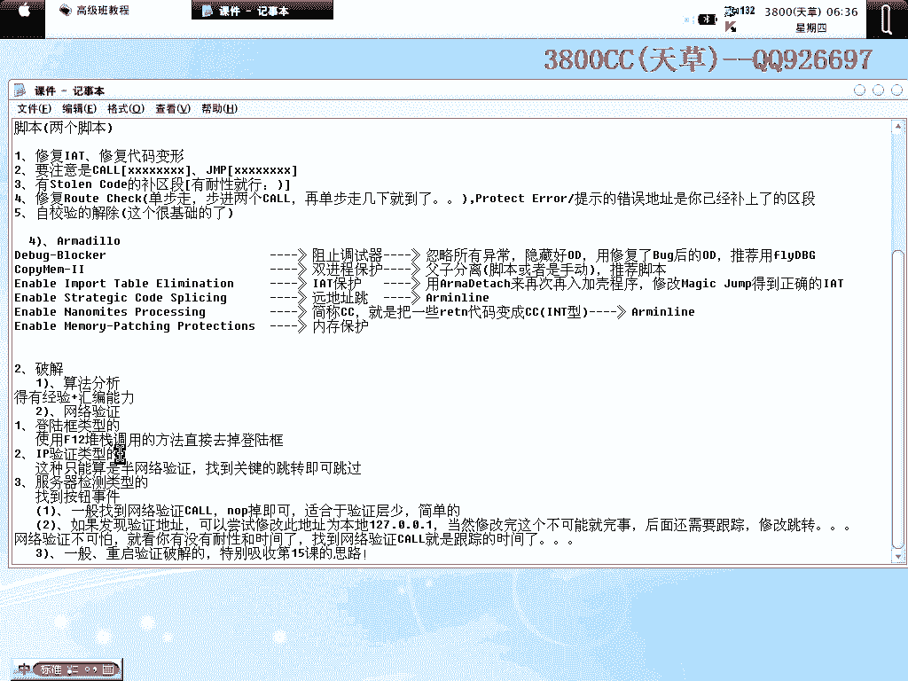

### 1. 算法分析
在初、中、高级班中，均未深入讲解算法分析，仅在一个商业软件案例中略有提及。这主要出于两点考虑：一是学员当前的汇编阅读能力普遍需要锻炼；二是算法分析通过视频教学难度较大。未来将根据大家能力的提升，适当加强此部分内容。

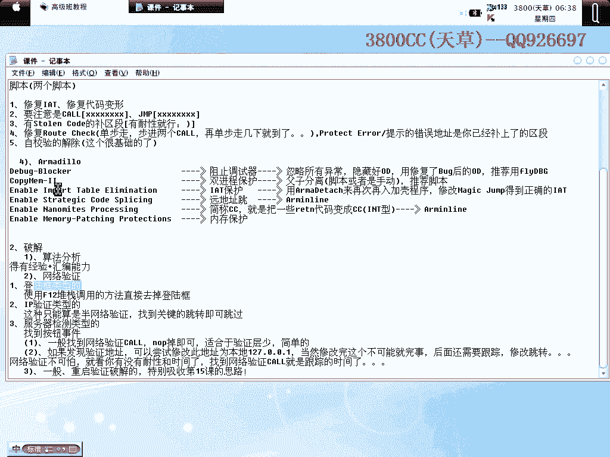

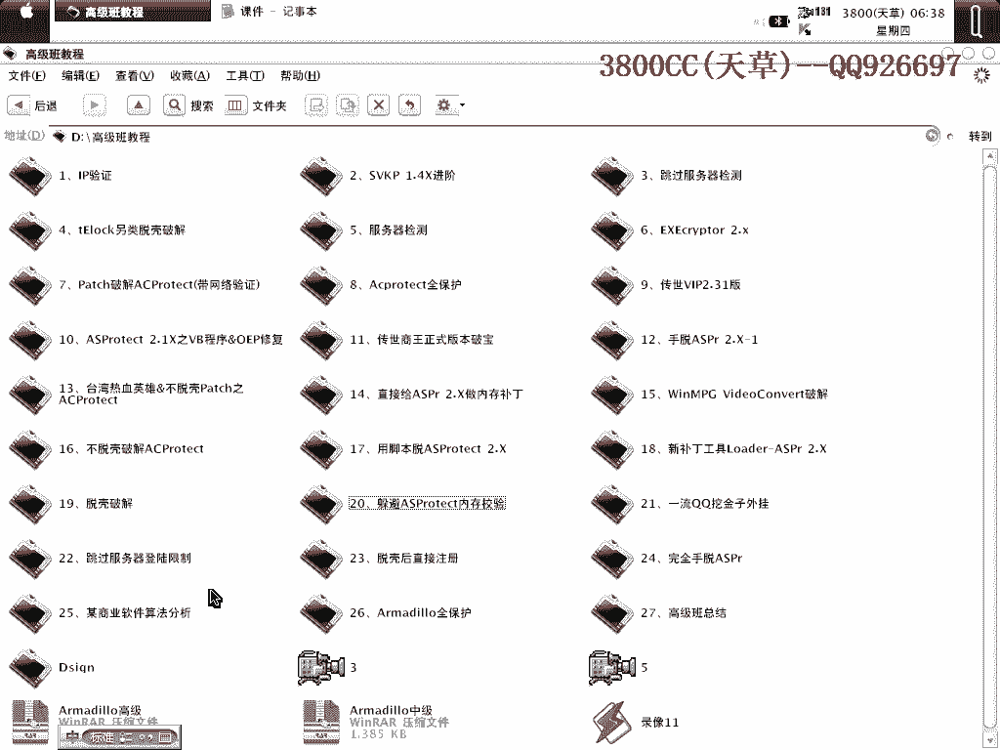

### 2. 网络验证破解
网络验证是许多学员感兴趣的部分，其难度并非想象中那样高，关键在于跟踪。

以下是网络验证的几种常见类型及破解思路：
*   **登录框类型**：多数（约90%）可使用 **F12堆栈调用法** 直接定位并跳过登录验证过程。
*   **IP验证类型**：属于半网络验证，强度不高。只需找到验证IP的跳转指令并修改，使其跳过验证即可。
*   **服务器检测类型**：这是完整的网络验证。软件需与服务器通信并处理返回数据。破解思路如下：
    1.  **找到按钮事件**：根据语言不同（Delphi/BC++/VB/C++）使用不同方法或F12法定位。
    2.  **找到网络验证调用CALL**：跟踪并尝试使其失效。
    3.  **修改验证地址**：尝试将验证服务器地址改为本地地址 `127.0.0.1`，但之后仍需跟踪和修改大量后续跳转。
*   **重启验证类型**：重点吸收第15课的破解思路。该课演示了多种思路的尝试和详尽的记录过程。

**核心建议**：破解网络验证必须有耐心，并**务必做详细记录**。跟踪代码可能很长，不做记录极易前功尽弃。课程中推荐使用 `NotePad` 插件来保存跟踪记录，并注意随时保存，防止OD关闭导致记录丢失。

---

## 三、 学习建议与课程总结

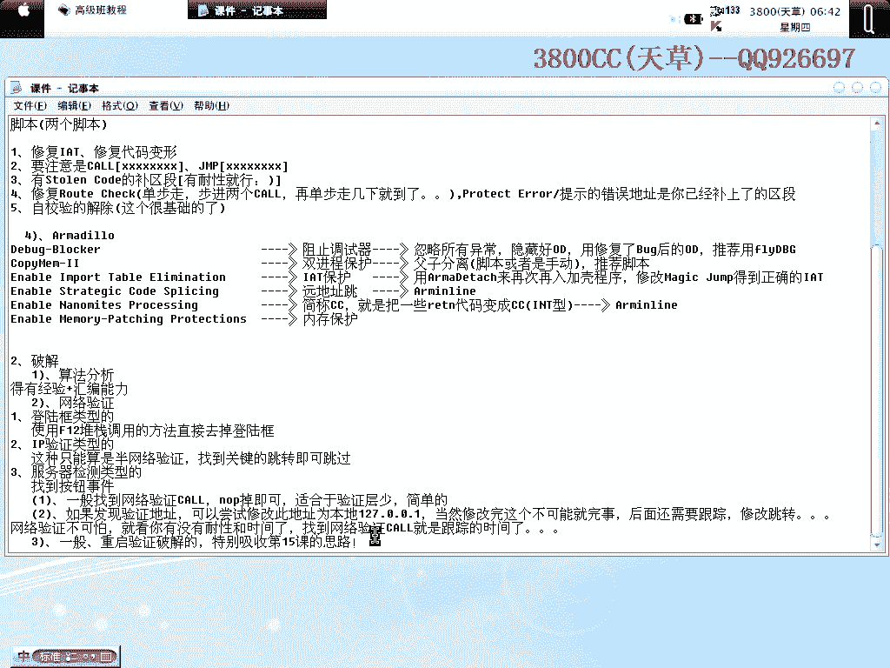

破解最重要的是**思路**。拿到软件不要急于动手，应先试用，寻找疑点和漏洞，整理成文，再逐一尝试。破解是一项需要时间和耐心的工作。

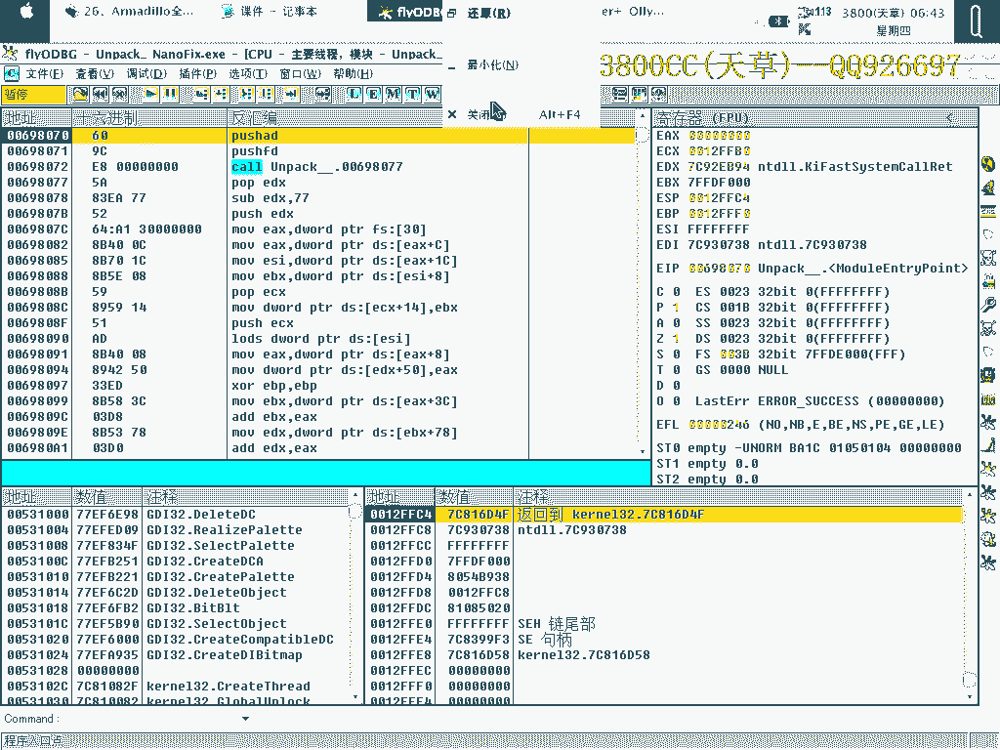

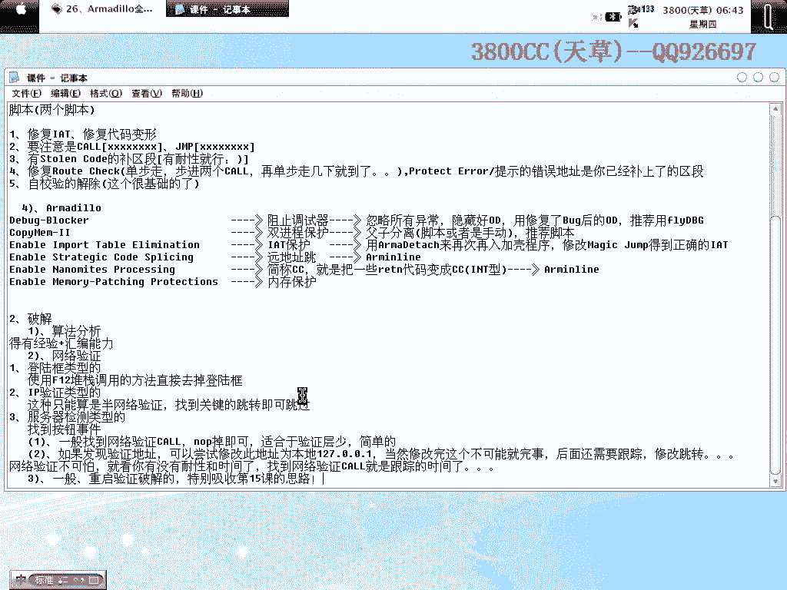

高级班课程至此全部结束。后续会根据学员的需求和基础，不定期更新一些教程。最后提醒大家，学习要循序渐进，跟着教程扎实掌握，不要浮躁。

---

本节课中我们一起学习了高级班涵盖的多种壳的脱壳要点、网络验证的破解分类与思路，并强调了记录与耐心在破解中的重要性。希望学员们能巩固知识，灵活运用。