# 天草高级班 - P3：3、跳过服务器检测 - 白嫖无双 - BV1qx411k7kJ

接著來做一下這節課程，這節課程是跳過服務器的檢測，它這個也相當於涉及到了一個什麼，網絡驗證的一個去掉，可以來看一下，隨便點它在這連接服務器，就這麼一個軟件，可以試用的，我們來看一下。

12SPEC的這個課。

我們先來脫殼。

這個系統有點問題了，準備還原。

這裡我們看一下，找到這裡了，這個是SPEC的一個特徵，所以我就是用Proxylin，因為開始這裡是Proxylin，這個要清楚，到解碼完成之後，這裡就是Proxy OEP了，還是習慣用那個。

用PID來脫殼，嗯。

上這個時候呢，首先的話，首先的話，這就是用F12暫停法，因為它有相關的提示，相關的提示，提示，好，然後就直接運行，點一下它，這個時候呢，我們看能不能把這個框框給它去掉，也就是說是這個，就要用這麼一個框。

我們找到斷首，在斷首，消耗斷點，我這個介紹的方法不太一樣，不太一樣，我這個是用找斷首的方法，之前在初級版和中級版裡面介紹的，用F12暫停法呢，是介紹的是找斷尾，找斷尾，其實都一樣的，都一樣的。

斷尾會返回到另外一個端的斷首，順利停在這裡了，我們看對戰裡面的Rent，右鍵，在返回篇中跟隨，在這裡，也就是說是這個，這個調用剛才的，就是說那個對號框了，對號框了，好，在斷首消耗斷點，去掉剛才那個斷點。

這個斷點，同樣，重載一下，要不就運行，好，斷下來了，F9，F8，這裡看一下，這裡看一下，他這裡的這個EAX，放到EBX裡面去，可以彈幕做一下，這裡沒有跳，他這裡是直接跳到這個調用了。

我們看一下這個跳展可不可以跳過去，可以的，但是大家看到，他這裡3Q，因為這個軟件，你等一下你試一下就知道，如果讓他，就說這個跳轉，讓他跳到這裡來的話，就說想辦法，想辦法讓他提示，試測成功的話。

但是他每次啟動的時候，都要你輸入一下，相當於重新驗證內心，所以就不太方便，不太方便，好，我們重新來加載一下，這個不行的，這裡不行的，下回到這裡來，到這裡來，就有我們跟蹤的代碼。

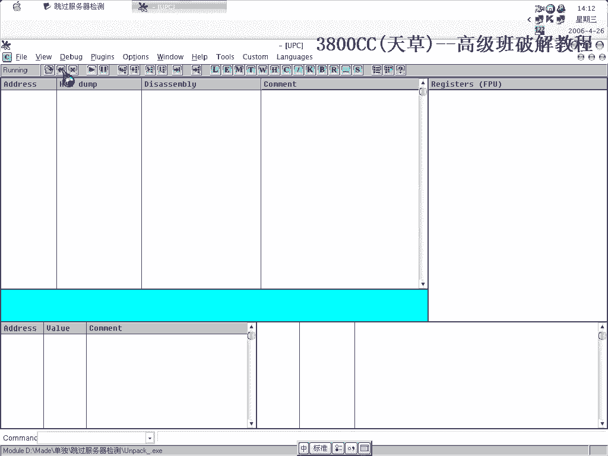

也節約了一個時間問題，這裡，這個跳展很便，這個跳展是一個關鍵的跳轉，那麼這裡看一下，BL和BL，如果就是說BL和BL等於零的話，對零的話，那麼他就跳了，他就跳了，這裡我們要求他跳。

當然我們可以把它改成降波，把他改成降波，但是有那麼一點不太方便的，可以看一下，可以看到，把它改成降波之後，他這個變的字節就變動的太多了，變動太多了，我們看一下上面的銀行代碼，我們看一下上面的銀行代碼。

這裡的，EX EBX，就是說BL裡面的一個最後的一個字節，最後面的這個字節，是EBX的，那麼這個EX給EBX，我們的這裡可以這個樣子，這樣就這樣就保證，這樣一改就保證了EBX為零，那麼BL這樣為零。

跳轉了，我們把它選擇一下，這裡呢給大家說一下。

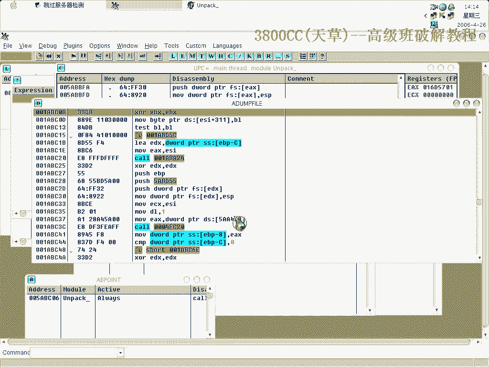

做記錄。

平時就是說在跟蹤的時候做記錄，這裡用到這麼一個插件，這麼一個插件，我這裡呢給大家放好了。

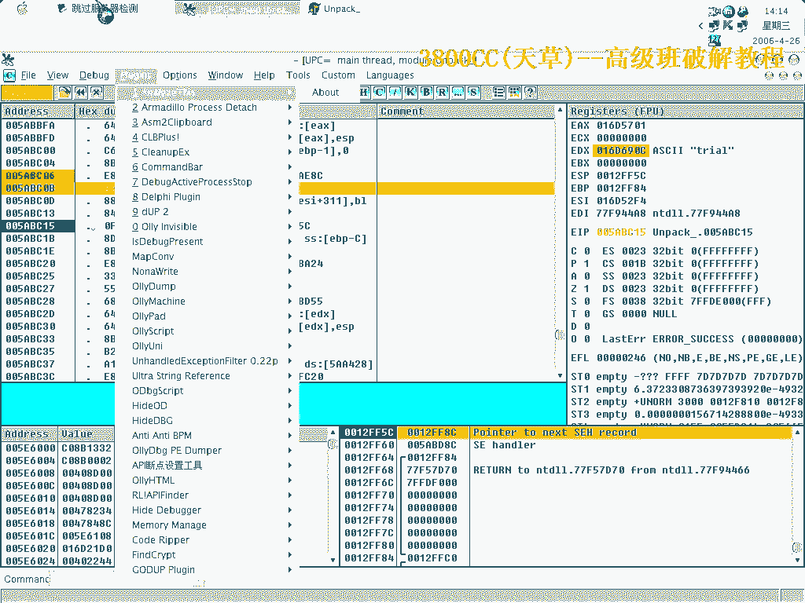

1。2的，這是我們修改的，區條斷點，打開我們剛才的這個，看一下，看一下，看到了啊，他這裡就沒有要求我們輸入了，直接啟動，直接就連接服務器，連接服務器，這裡我們還是用F12暫停，好找到這裡，看得到啊。

看得到這個跟這個剛才的那個，就是說代碼的結構一樣，一個CALL，然後介意，然後JUMP，介意，根據我的一些經驗來看的話，Delphi的像這種有提示框的都是，這麼一個結構，在這裡斷首F2，消耗斷點，重載。

好 同樣返回的，這裡，我們在人員是找斷首，刪除剛才的這個斷點，Remove，再重新來過，找斷首，這個取消掉，這裡是斷首，就是一層一層的找，一層一層的找，一層一層往上面找，因為代碼都是從上面走過來的。

剛才那個斷點沒有，說不行啊。

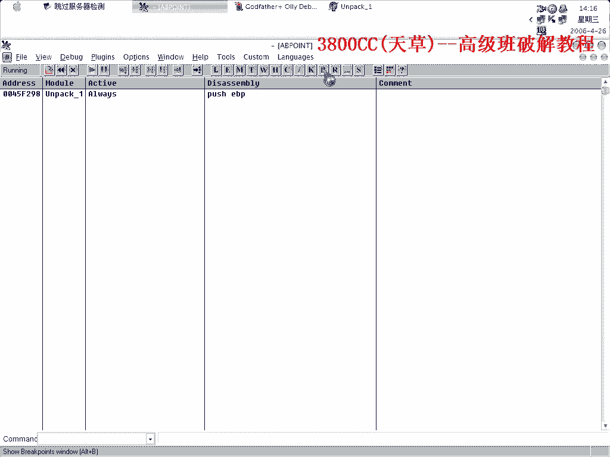

這個不行嗎，來看一下，啊，是這裡啊，這裡剛才下錯了，這邊的斷首。

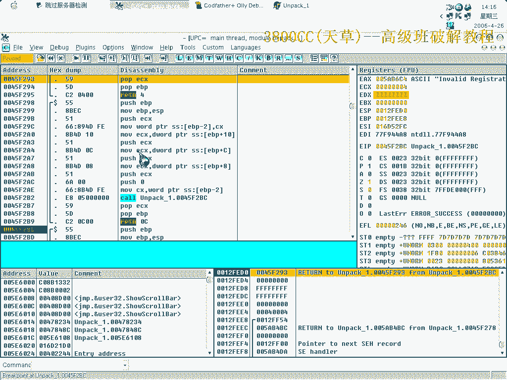

這一個，他不是那麼一層，那一層關係裡面的，不是那一層關係裡面，所以就剛才就斷不下來，同樣找斷首，把這個取消掉，這裡看到了，找到關鍵地方了，錯誤的，同樣找斷首，拿到斷首，這個樣子進行分析，這裡啊。

上面跟這個上面是一段的，你不要看這邊有一個出現，就以為上面是一段，下面是一段，這個rent會rent到這裡，會rent到這裡，可以待會可以看一下，是rent到這兩行，其中一行的，看到了。

他在連接這個服務器了，這裡呢，上面這是循環啊，循環我們就不用循環，直接在這裡下斷點，協約時間，這裡他跳了，跳了我們就先讓他跳，同樣，這個讓他跳了，我們就節約時間，往下面走，這裡沒有跳。

這一行我們單步沒必要過，要不就。

他在這裡來了，我們再往下面走，這裡是，開始連接服務器了，這裡是關鍵了，看一下，看一下他這個服務器，地址，keyword，英文的，這裡有個register和text，我們還是先按他這個樣子，讓他事先跳。

事先跳。

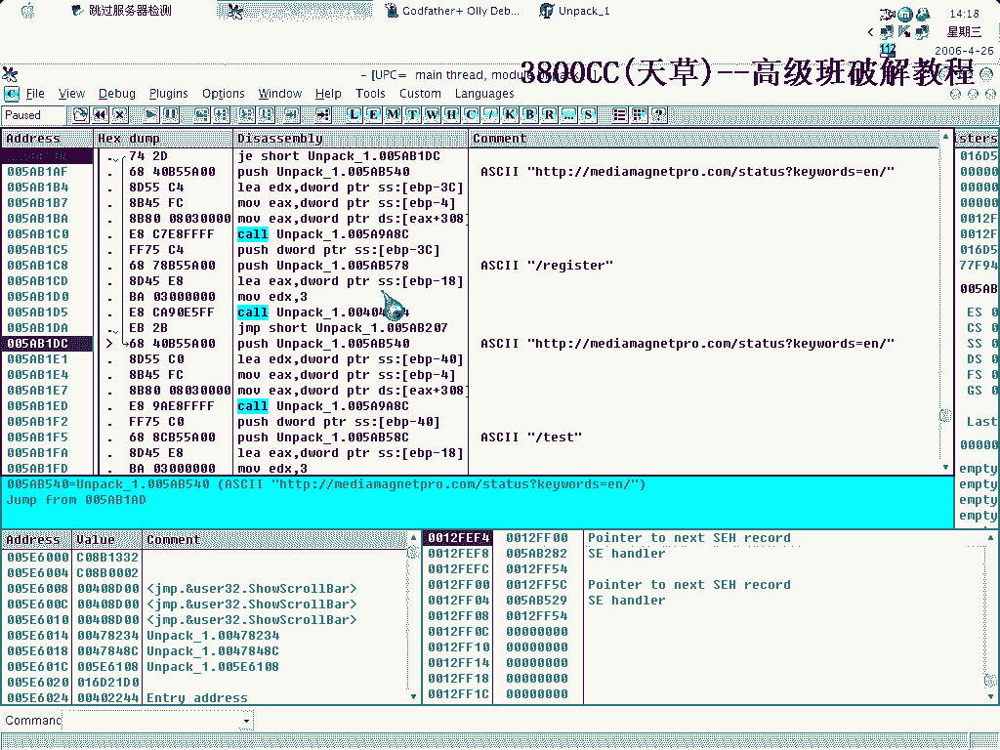

這是一行代碼，這是一行支付卷，當然肯定是加密了的，要是沒有加密不太可能，這裡。

可以看一下，可以看一下，可以看一下，他這裡，這裡就在連接服務器了，連接服務器，相當於網絡驗證部分了，但是我們又看不到了，看不到我們的一個程序介面，直接回九明星。

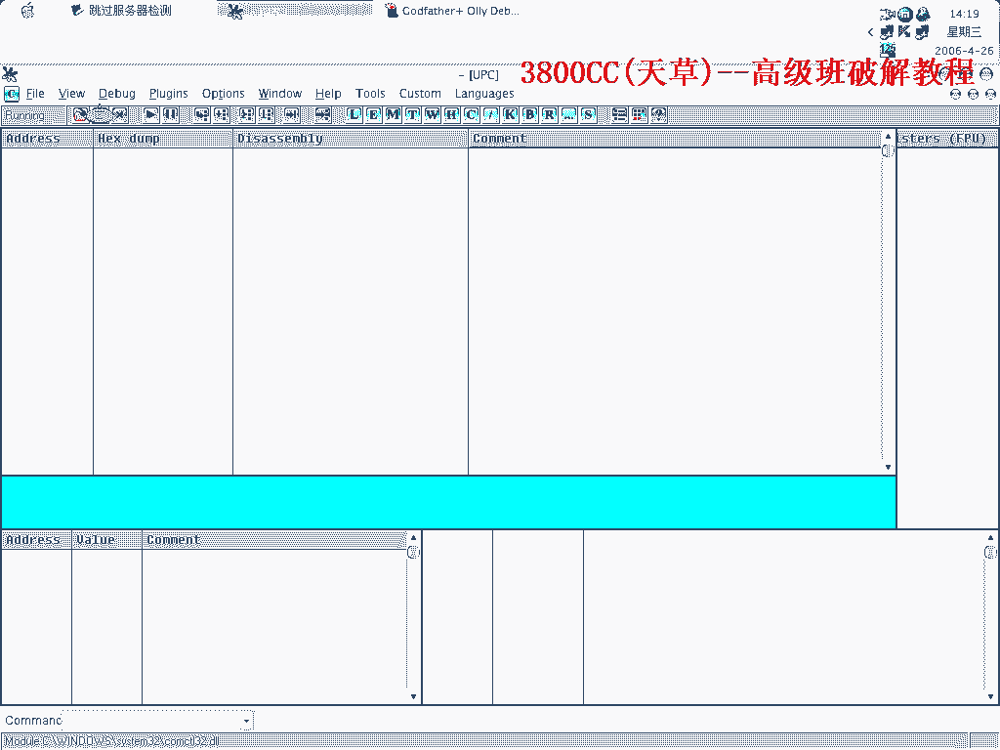

看一下能不能看得到，其實錯誤，其實錯誤，剛才是這麼一個調整。

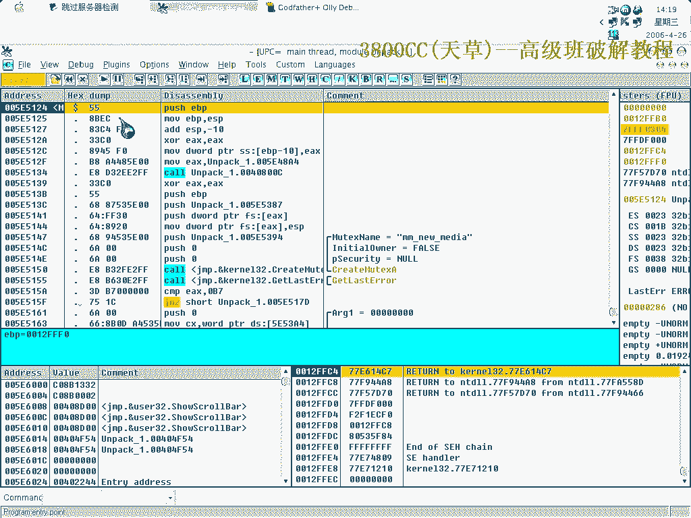

這麼一個調整，我們把這個調整給，路過調看一下，時間不久。

先看一下，還是錯誤，那就說明跟這個調整無關。

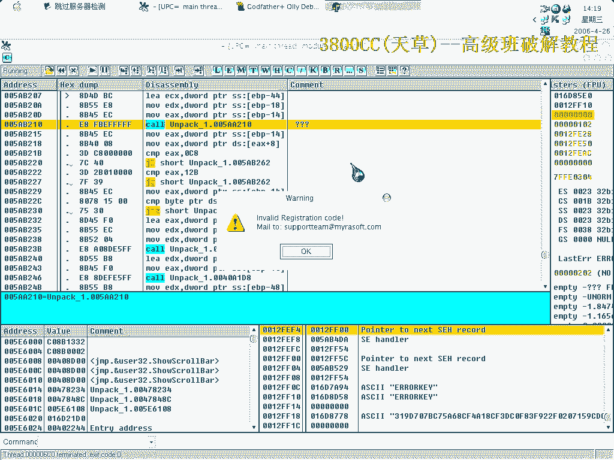

無關，我們就沒必要把這個錄掉了，然後就一起，我們只要找到，找到他調用網絡驗證的那麼一個服務器，那個call的話。

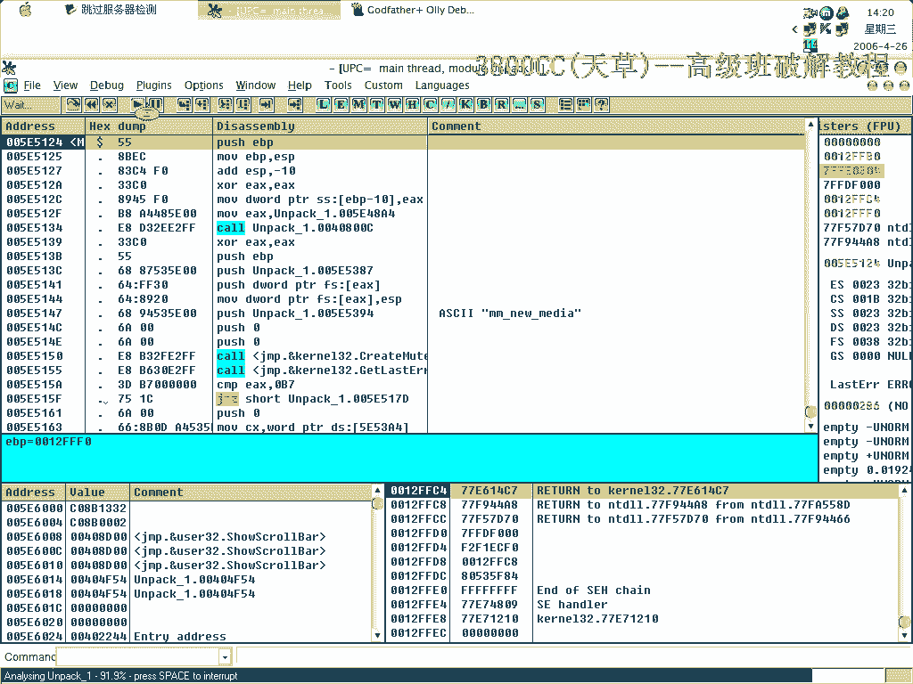

我們就可以把，直接應該就是一般的情況下，直接錄掉就可以了，把它給錄掉，這裡他跳轉了。

跳轉了，因為這個是網絡驗證的一個，網絡驗證的一個，下面的也先跳轉，下面的跳轉，我們要把它錄掉。

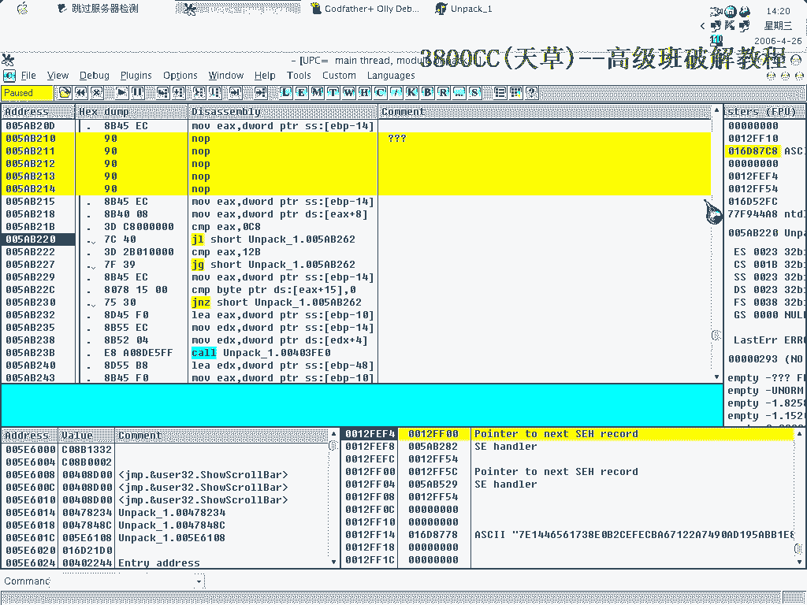

以防不測，這個雖然本身沒有跳，但是還是錄不掉，這個也一樣，本身沒跳，但是還是錄不掉，這個呢我們就不要管了，這裡，調不走，你可以看得到，因為這裡沒有跳的話，這裡會顯示，不block的，就是被阻止了。

被阻止了，好，這裡就是關鍵了，看到了，Standard是標準的意思，專業的，專業的，這個是專業，PRO專業的，然後再看下面，看下面，適用的，我們可以這個樣子來看一下，把它給錄掉，因為它這樣會認為是。

認為是一個專業版，標準版，標準版，像剛才的這些loop的話。

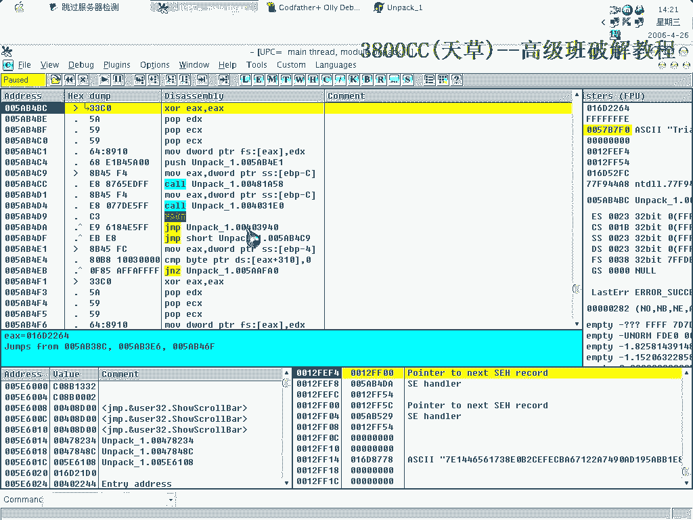

我們做的一些修改的話，我們有必要，有必要，把它給記錄下來。

就是說只要你的OD不關的話，OD不關掉，這個就會在，就一直在這，一直在這。

然後這裡，它是保存的一個記錄，保存一個記錄，你可以Save一下，非常的方便，非常方便，就運行。

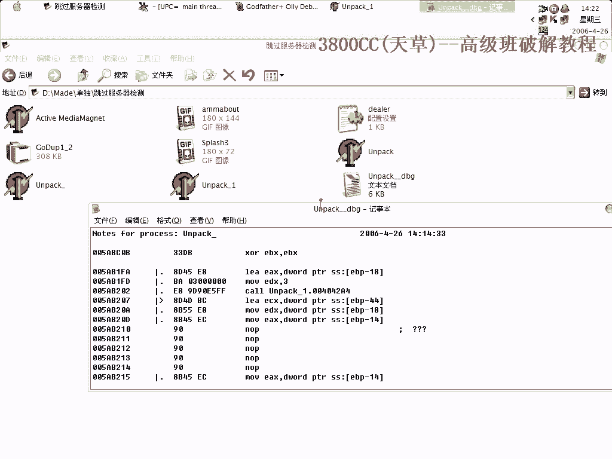

這樣就過來了。

過來了。

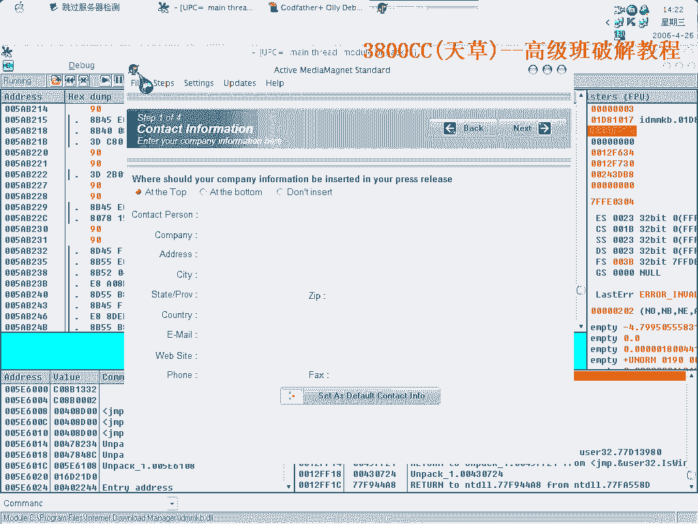

我們把它這個，給印成為一下，印成為一下，它這個只允許一個實例的運行。

已經運行過了，剛才我們這裡是把這裡給錄掉。

我們把這個跳，跳到這裡來，然後累積是PRO，我們把這個給錄掉，這個是專業版的，專業版的意思，我們來看一下，程序會不會顯示，到底是標準版還是專業版，PRO。

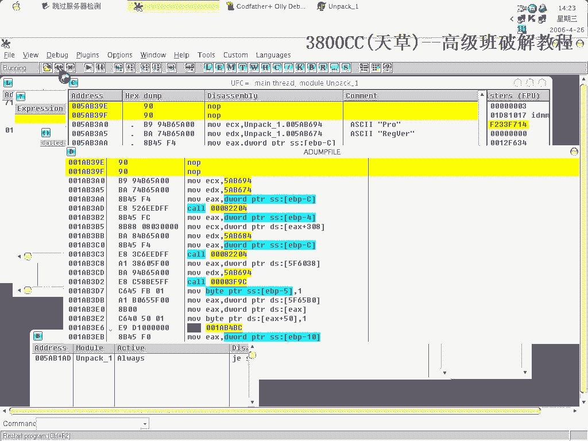

專業的，是標準的，版本不同，版本不同，版本不同，這個Upload看一下，數據庫更新，Operate，Operate，You must upload your，這是標準版的，這是專業的，標準版。

它提示要我們，把它升級為，專業版，看一下我們這個專業版，Upload，已經升級成功了，顯示升級成功了，看一下這個，一樣的，一樣的，我們已經能夠正常使用了，其他的就不管了，其他的就不管了。

你可以看得到，大家可以看得到，它這個Loop掉的是非常多，數據非常多，同樣，自己下去練習，自己下去練習，這個呢像這裡就用到，就用到一個Byte，然後就是說，在手動Patch的時候。

自己手動Patch的時候，要用到，這裡有五個字節，首先用到一個DWORD，再用一個BYTE，然後再用WORD，這個是WORD，自己下去，這個修改的代碼比較多。

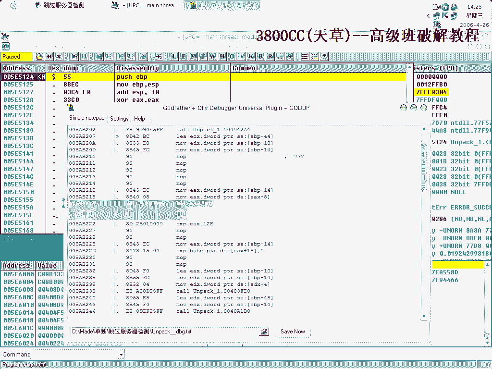

剛好可以，鍛煉一下，可以鍛煉一下你的那個，到底學得怎麼樣，功底，這個我就留著，这期课程就到这 再见。

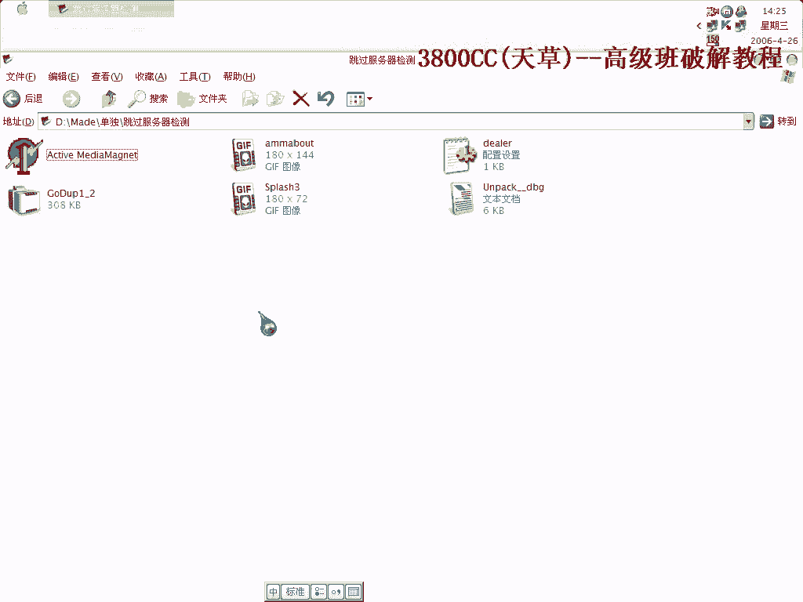