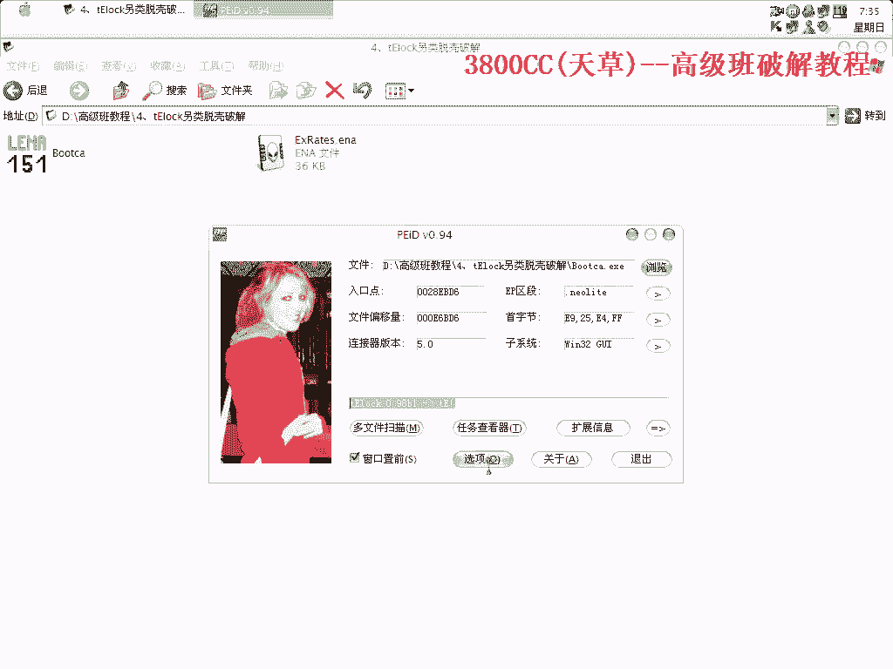
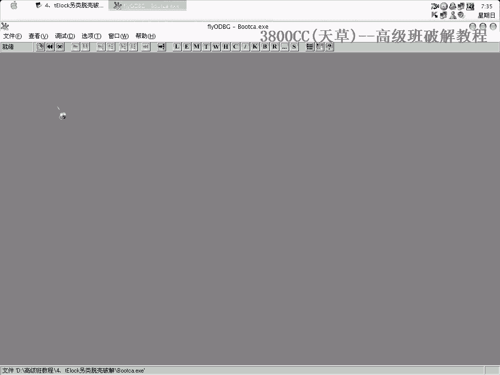
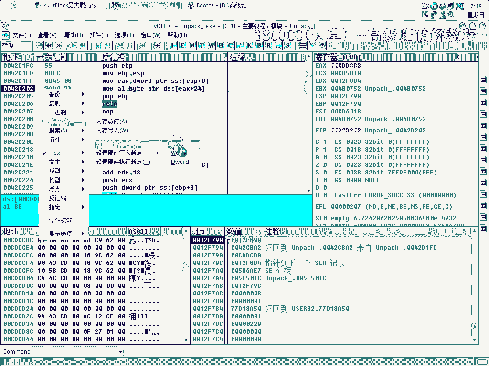
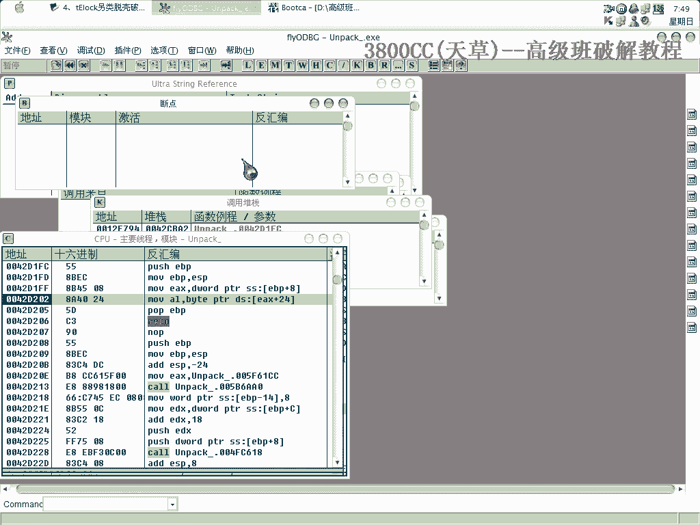
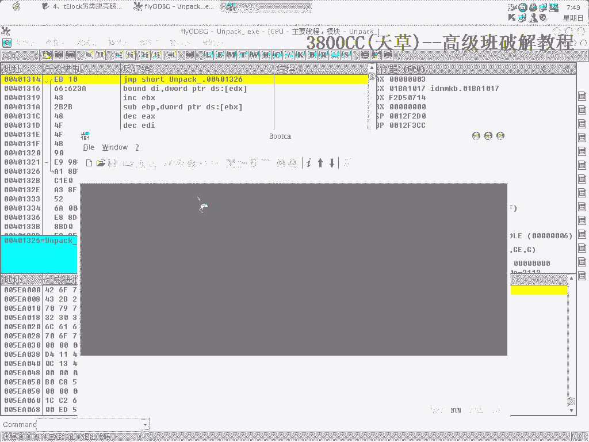
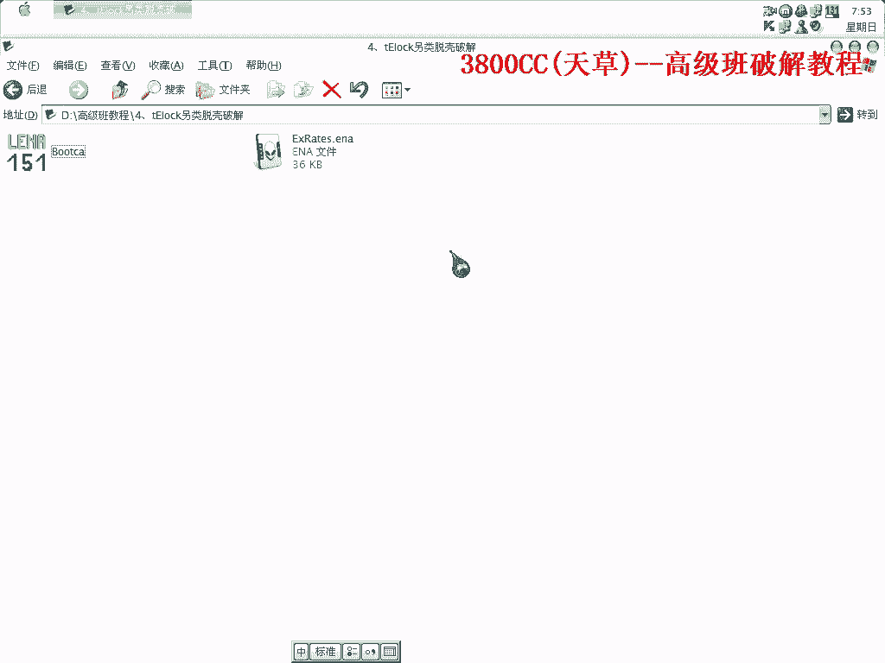

# 天草高级班 - P4：tElock另类脱壳破解教程 🛡️➡️🔓

在本节课中，我们将学习一种针对tElock壳的另类脱壳与破解方法。该方法不依赖传统的寻找OEP和修复IAT的“正规”流程，而是通过一种技巧来定位并修复被混淆的IAT，并最终破解软件的演示版限制。

## 一、 脱壳与定位OEP

上一节我们介绍了壳的基本概念，本节中我们来看看如何绕过tElock的异常并找到程序的原始入口点。

首先，在OD中载入目标程序。忽略所有异常设置，然后使用`Shift+F9`多次运行程序以通过异常。

使用`F9`运行时可能会遇到错误提示，但持续忽略并运行，最终会到达OEP。从入口点的特征可以判断这是一个BC++编写的程序。

## 二、 处理被混淆的IAT

找到OEP后，常规方法是手动查找并修复IAT。我们首先尝试使用Import REC的自动查找功能。

以下是尝试修复IAT的步骤：
1.  在Import REC中附加进程，填入OEP地址并点击“自动查找IAT”。
2.  点击“获取输入表”，会发现存在大量无效函数。
3.  尝试使用等级1或等级3修复，以及相关插件，均无法修复成功。所有函数显示为`Fail`。

这表明tElock对IAT进行了特殊处理，常规方法失效。

## 三、 另类IAT修复技巧

既然自动修复无效，我们需要手动分析并修复IAT。关键在于识别出IAT的真实数据块。

1.  在OD的数据窗口中，右键点击无效的IAT区域，选择“二进制”->“编辑”，可以看到大量空数据（00）。
2.  我们需要找到包含有效API地址的数据块。观察汇编代码，例如一条`mov eax, dword ptr [xxxxxxxx]`指令，其中的地址`xxxxxxxx`可能指向IAT。
3.  在数据窗口中跟随该地址。如果看到以系统DLL基址（如`77xxxxxx`）开头的地址，那很可能就是有效的IAT项。
4.  确定IAT的起始和结束位置。**核心操作**是：复制从IAT起始地址开始，到结束地址后**额外4个字节空数据（00 00 00 00）** 的整个数据块。
5.  在Import REC的窗口中找到对应的RVA地址，将复制的数据粘贴进去。粘贴后，Import REC应立即识别出部分有效的API函数。

重复此过程，处理其他IAT块。例如：
-   第一个块：起始于 `xxxxxxxx`，复制数据并粘贴到Import REC中对应的RVA。
-   第二个块：可能需要地址偏移，例如`xxxxxxxx+5`，同样复制并粘贴。
-   确保每次粘贴的数据末尾都包含4字节的空数据作为分隔。

修复完成后，剪掉所有仍然无效的函数，然后转储并修复文件。修复后的程序应能正常运行。

## 四、 破解演示版限制

程序运行后，我们发现这是一个“演示版”，保存等功能被禁用。破解演示版的关键是找到控制功能开关的标志位。

以下是使用F12堆栈调用法结合数据断点进行破解的步骤：
1.  在OD中运行修复后的程序，尝试点击被禁用的功能（如“保存”）。
2.  程序中断后，在堆栈窗口中右键，选择“反汇编窗口中跟随”。
3.  在代码中寻找关键调用（`call`）。一个重要的经验特征是：在关键判断`call`之后，经常会有对`al`寄存器的测试，例如 `test al, al`。
4.  找到疑似关键`call`后，在其上方或下方设置断点，重新运行并触发功能。
5.  程序中断后，步入（`F7`）该`call`。观察其如何影响`al`的值（通常`al=0`代表失败，`al=1`代表成功）。
6.  分析是哪个内存地址或寄存器（如`[ecx+24]`）的值最终决定了`al`。记下这个地址。

## 五、 定位并修改关键标志

上一节我们找到了影响功能的关键地址，本节中我们来看看如何定位该标志的写入点并永久修改。

1.  在数据窗口中跟随（`Ctrl+G`）上一步找到的关键地址（例如`[ecx+24]`）。
2.  在该地址的字节（`Byte`）上右键，选择“断点”->“硬件访问”->“Byte”。
3.  重新运行程序。程序会在**任何指令**向该地址写入数据时中断。
4.  中断后，观察写入的代码。这通常是程序初始化时设置演示版标志的地方。
5.  将写入的值从`1`（演示版）修改为`0`（正式版）。**注意**：修改时机很重要，必须在程序使用这个值进行判断**之前**完成修改。有时需要回溯到更早的代码，或在写入指令之后直接修改内存。
6.  修改后继续运行程序。此时被禁用的功能应该已经可用。

## 六、 总结

本节课中我们一起学习了针对tElock壳的完整另类处理流程：
1.  **脱壳**：通过忽略异常到达OEP。
2.  **修复IAT**：通过手动识别并复制内存中的有效IAT数据块到Import REC中，解决了自动修复失效的问题。
3.  **破解限制**：使用F12堆栈调用法找到关键判断`call`，再通过硬件访问断点定位并修改决定软件是否为演示版的内存标志位。

这种方法的核心在于灵活运用调试器，直接分析内存数据和行为，绕过壳的保护机制。特别是修复IAT的技巧和利用硬件断点追踪标志位写入点，是处理此类强壳的有效手段。