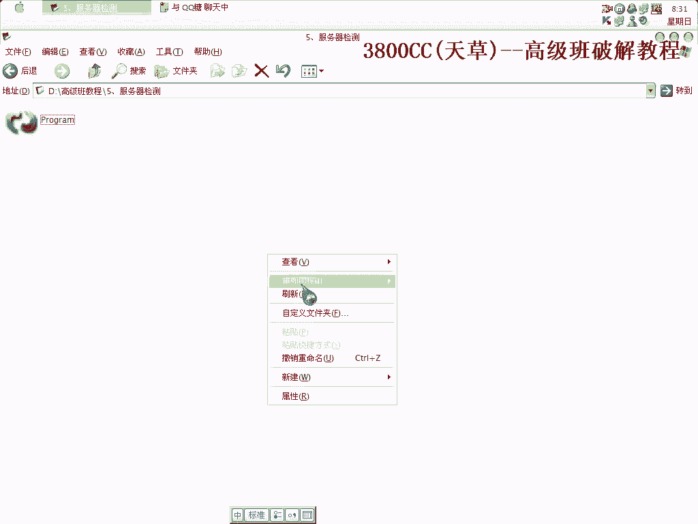
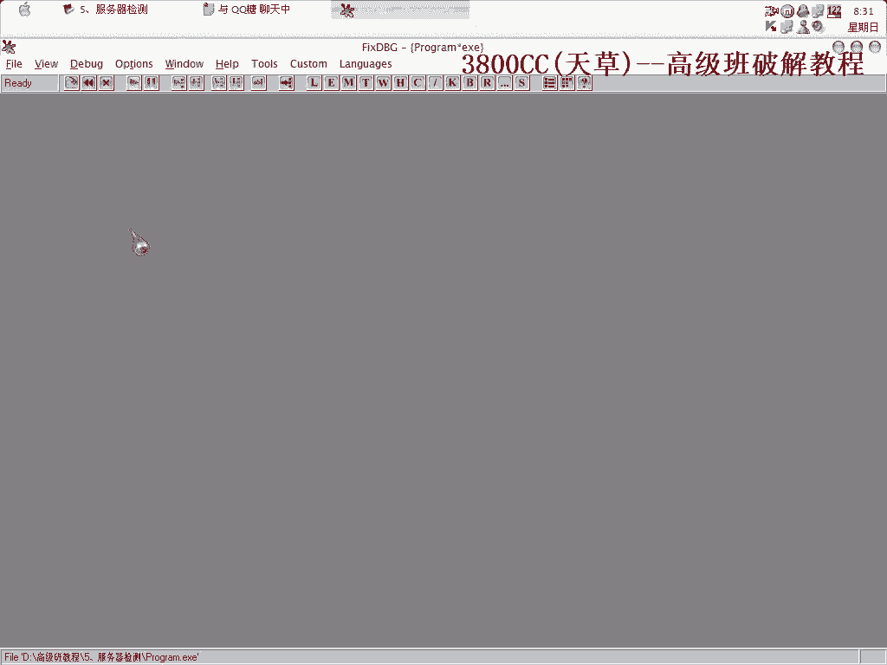
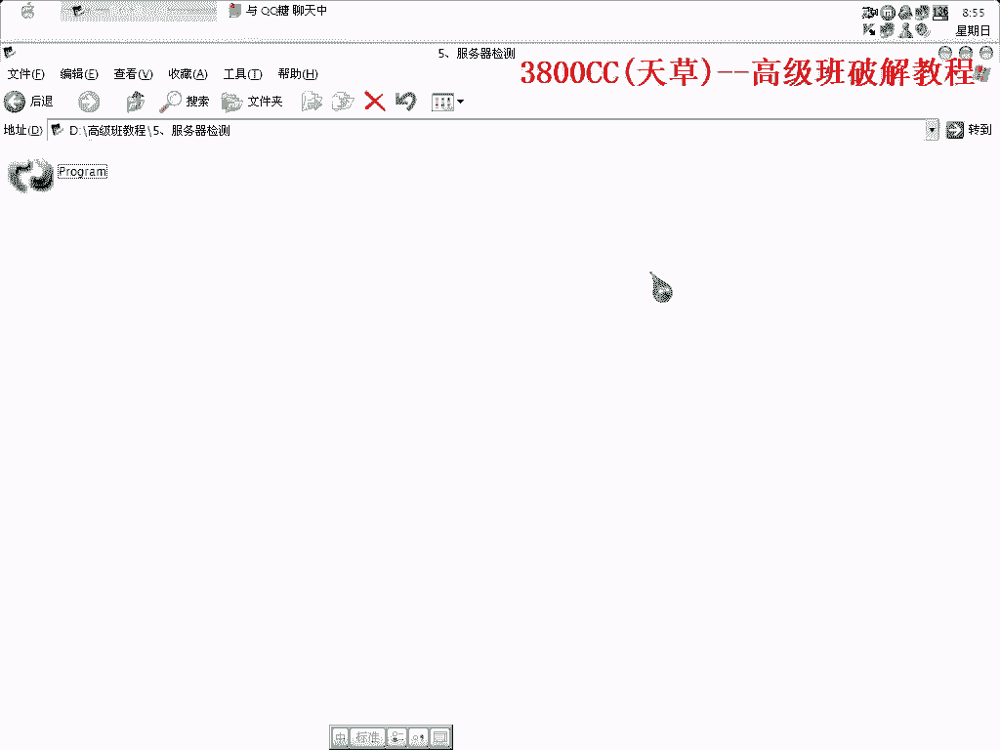

# 天草高级班 - P5：5、服务器检测 - 白嫖无双 - BV1qx411k7kJ

好大家好，这节课呢来讲一个，透过服务器检测的这么一个，这节课，先来看一下，先来看一下，我这里呢就是说我在实验的时候，实验的时候，放入了这一个，可以看一下，它在检测连接服务器，连接服务器，也是网络验证。

也是网络验证，这个地方，我们来看一下，它这个壳，这么一个壳，可能大家没见过。

好我们先来脱壳，先来脱壳吧，(看视频)。

好，那先来看一下，它这个地方你看，这个地方就是program，就是说被这个，SAM板的，所保护的，好我们用单步，F8，单步F8走，大家注意看，虽然说它已经被加壳了，但是这些，API啊。

IAT全部都显示出来，说明它只是一个压缩壳，并不是加密壳，这个地方咱们按键盘按着，下F8端点，short+F9，它就直接运行了，这个地方不能这样，不能这样，F4，这个地方F4，可以断下来。

大家注意看这个，把这个做好记录，做好记录，(看视频)，那我们可以，根据我们单步跟踪的，这么一个思路，我们来下这个端点，看一下行不行，(看视频)，第五次就跑飞了，第五次就跑飞了，那我们来运行四次吧。

F+4次，F+4次，1、2、3、4，可以啊，很快就到了，这就是说我们在使用，那些端点的时候，也是通过一些，前人总结的规律，像这个样子，总结出下这个端点可以，再另外介绍一种方法，可以用ESP-1。

挖的端点，看着啊，这里了，OK，这里介绍了三种方法，其中第二种方法，这个思路思想大家要清楚，有的朋友，可能会问，前面用的那些，端点到底是怎么样来的，就是这样来的，通过单步跟踪调试，发现这个端点。

是最合适的，好，好，修复一下，抓取文件，载入它，这个因为我在前面已经破解过的，所以它就有一个记录了，就这个记录，每次运行之后，首先它会自动连接，在里面第一次运行的时候，它不会自动连接的。

刚才那个是什么错误来着，Not Regist，好我们来查找，就是这个了，这个地方下好端点，端下来了，端下来了之后，这个地方不能让它跳，要让它跳，不然的话会出问题的，它这里有这么一个错误，就是你的。

你的账号，并不是一个完整版的，并不能够保证，并不能够保证，它通过这个邮件地址，通过邮件地址来辨认，你到底是什么版本，什么版本，这个是你的，你使用的这个Q文件在其他机器上使用了，在其他机器上，已经使用了。

这都过了，都过去了，那看一下，我们要让它能，我们要能够登录进去，前面都已经过去了，那就是这个跳的问题了，这个跳转的问题了，我们可以来看一下，把它取下掉，我们可以进去看一下这个跳转，看到了，看到了。

register，这个要学会分析，学会分析，没有跳，然后就成功了，然后就进去了，Audio Flashing，它这个就是说又出了一个新的版本，大家可以，把这个破解之后，然后再去下一个新的版本。

再去下一个新版本，试一下，看一下是否跟这个差不多，我们重新来过，因为我们可以这个样子，我们进行看一下，我们注册成功过之一次之后，它会首先启动之后，它就会开始连接服务器，很明显，很明显，第二次连接的时候。

后面再连接的时候，肯定还是错误，我们得找出，我们得达到一个完美的境界，程序一启动，它就开始连入，连入就是登陆进去，那就是这个问题，我们现在这样，来找一下，看一下程序里面有多少个这样的，调用它的。

我们先set，全部都下段，但是看一下，有些跟我们这个不一样，调用的是call调用的，保护是call调用的，给取消掉，这个不是，这个也不是，这都不是，不是的都取消掉，这里我们要下好段点。

我们一个一个进去看一下，这个没有任何的段点可下，那这个呢，这个段点，这个可以下段点，看到了吧，这个段点都下好了，这个段点可以下，我们要看清楚，我们就是为了找到底哪一个是主要的关键的，主要的关键的调用。

这个，这个，这个，这个有问题，全部都下好，这下好了，下，这一个，它这个结构都是差不多的，结构都是差不多的，这个没什么好下的，结构都差不多，大家看到都是接一或者接N接，要控制，这个，这个就不下了。

这个有问题，这个就不下了，重新再录一下，直接回去运行，像这种方法有点像，有点像我们在，终极版里面的那个，资交业解除心法那一节课里面的，就是把它全部都找出来，看人到底是哪一个主要是控制了他的。

我们来看一下，看一下，他首先就端在这个地方了，首先就端这个地方就说明是这个地方有问题了，是这么一个地方有问题，那这一个呢，他有这么一个东西，可以来看一下，这个应该就是一个可用的邮件地址。

大家可以下去之后可以试一下，用它来试一下，这个应该是可以用的，这个那就是这个这个空来控制，我们再重新来过，好，端在这个口袋了，他现在获取我的一个邮件地址和这个，我的一个机器号机器号，这里呢，不等于0。

不等于0就跳，不等于，我们不能让他跳，不能让他跳，不等于0就跳，那我们得让他返回，不等于0，我们返回为0返回为0，我们可以首先拿到下面来看一下，这里，这里会EX会异获，异获会为0会为0。

但是这个肯定被跳过去了，肯定被跳过去了，这个是因为他本身就跳了吗，我们可以弹幕走一下，好，看到了啊，他这个被跳过去了，跳到这里来之后，然后相减相减相减相减，然后最后呢，又这样又这样一堆啊，好。

此时的EX和EX相减，等于0和EX异获，0和2，与啊，0和2与看一下，还是为0为0之后，然后又又减又减，相减又相减，相减之后这样就不行了，这个地方我们让他跳到这里来看一下，212，让他异获，返回为0。

没跳啊，没跳，咳咳，Copy一下，原先是原先是什么样子的，ASF3，我们把他改成212，啊，复制一下，好，直接运行，直接运行，直接运行，出现了这么一个东西，但是但是看到了看到了，他这个，呃，他这个东西。

他这个界面啊，界面就没有了，界面就没有了，那我们得不能这样改了，不能这样改，重新来，重新来，这里就不能这样改了，嗯，这个地方呢，异获为0，算了吧，嗯，算了还是直接改这里吧，把它给录掉吧。

改了就比较麻烦一点，嗯，这里呢，把这个地方记录一下，记录一下，直接运行，可以的，这个地方又有问题了，好的，这样可以了，可以了，就改这个地方就OK了啊，那在另外另外我们来看一下，怎么样直接来拍起他。

直接来拍起他，不脱颈，看行不行，下这个断点，下这个断点，有了，123，4，啟销，嗯就这里了啊，嗯就这个地方，我们把这个地方记录下来，找一个找一个段吧，找雷厉呢，看一下，嗯，这样，用到这个插件。

三个小三个小特斯，找不到啊，这个地方找不到，找不到空空数据了，啊，拿下来看一下下面有没有空数据这里，但这里不行，因为他是他是每一段总结的啊，中间的这里不行了，啊就这里吧，我们需要拍起这么一个地址啊。

这么一个地址，嗯，9090，然后呢，直接调到这里去，这样，我们先把这个看一下能不能复制，不行，这个不行，上面找一下，看一下，嗯，随便改一个随便改个看一下行不行，这里都不行啊，这个地方难道没有空的。

啊难道没有空的东西空的数据吗，517开头的，7开头的，看一下啊，这个可以，但是担心的担心的是，发他这个，运行之后运行之后这里的数据被抹掉了，我们可以过来看一下，可以过来看一下这个数据会不会被抹掉。

会不会被抹掉，这里去看一下，数据被抹掉没有，没有啊，没有被抹掉，OK了，你调到这里去，看一下，前期就无法运行，像吧，嗯，这里就不用再调了，直接调到这里去吧，像这样直接排解很麻烦的，麻烦了这个排解不了了。

这个排解不了，那就下去可以再试，可以自己可以试一下，因为他这个数据数据地址不太不一样啊，看一下，数据地址不一样，不一样，那不得，不行不行，这个排解不了，那这节课课程啊就这么多。

大家可以下去自己找一下自己找一下，因为我这个被客啊被客有点匆忙啊，有点匆忙，嗯，这里多了一个锐造的，直接就进去了，大家可以先把他给把他这个新版本也下来，看有没有变化啊，看一下有没有变化，好，好。

这是完成，好那这节课就到这，再见。

