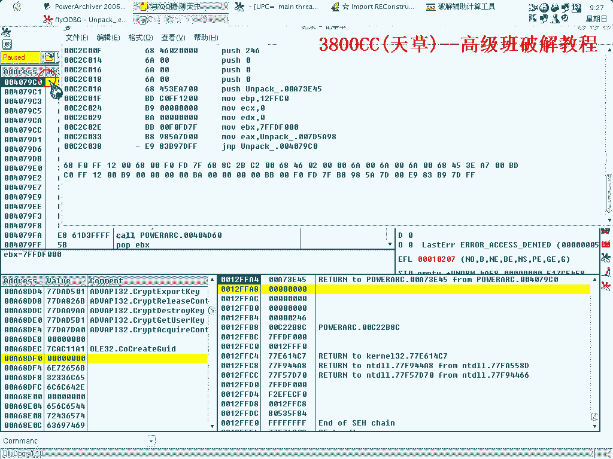

# 天草高级班 - P6：EXEcryptor 2.x 脱壳与破解教程 🔓

在本节课中，我们将学习如何对一个使用 **EXEcryptor 2.x** 壳保护的软件进行脱壳与破解。课程将详细演示从识别加壳程序、定位原始入口点（OEP）、修复导入地址表（IAT），到最终绕过注册验证的完整流程。


## 识别加壳程序与保护机制


上一节我们介绍了课程背景，本节中我们来看看如何识别目标程序及其保护措施。


目标程序是一个压缩软件，使用了 **EXEcryptor 2.x** 壳进行保护。通过查看其进程内存区段，可以发现其特征。


该壳版本并非最新，但保护机制已足够复杂。它采用了一种名为 **Callback Tempo** 的技术，通过多次回调检测来干扰调试器（如OD）的正常工作，并完成自身的解密。


## 使用OD进行动态分析并定位OEP

了解了保护机制后，我们使用OllyDbg（OD）载入程序，开始动态分析。

程序载入后，其保护措施会立即生效。我们首先需要处理其对OD的检测。在内存中定位到关键的回调函数地址 **006F010**。


以下是具体的操作步骤：
1.  在OD中设置系统断点。由于壳的干扰，每次中断都像是一次性的（One Shot），我们需要删除无关断点。
2.  在之前记录的 **006F010** 地址处下断点并中断程序。
3.  中断后，单步跟踪（F7/F8），关注 `CALL` 指令和 `JMP` 指令，逐步接近程序的原始代码。
4.  经过多次 `F9`（运行）和跟踪，最终会跳转到一个看起来像正常程序代码的区域，此处即为程序的 **原始入口点（OEP）**。在本例中，OEP位于类似 **00A7xxxx** 的地址。

成功定位OEP后，即可进行脱壳。但请注意，这仅仅是开始，后续还有修复工作。

## 修复导入地址表（IAT）与程序映像

成功脱壳后，我们得到了程序的原始代码，但此时程序还无法运行，因为导入地址表（IAT）被壳修改了。

我们需要使用 **Import REC** 等工具来修复IAT。
1.  在Import REC中附加到进程，填入找到的 **OEP地址**（例如 `7940`）。
2.  点击“获取导入表”，软件会自动搜索IAT的起始位置和大小。例如，IAT起始于 `68258`，大小约为 `B9C` 字节。
3.  点击“修复转储”，选择刚才脱壳保存的程序文件。修复工具会生成一个修复后的新文件（通常名为 `*_dumped.exe`）。


然而，直接运行修复后的程序可能会立刻崩溃或退出。这是因为在OEP处，程序的**寄存器**和**堆栈**状态与原始加壳程序运行时不一致。程序运行依赖于这些正确的初始环境。

## 重建程序运行环境

为了解决运行环境问题，我们需要手动重建OEP处的寄存器与堆栈状态。

具体方法是：在OD中运行原加壳程序，在到达OEP时，记录下所有通用寄存器（EAX, ECX, EDX, EBX, ESP, EBP, ESI, EDI）的值，以及堆栈顶部的若干个`DWORD`值。

然后，我们通过编写一小段**汇编代码**，在修复后的程序开头（例如新建一个代码段）来精确设置这些值。代码逻辑是“反着”将堆栈值压入，再设置寄存器。



例如，重建代码可能类似如下结构（具体值需根据记录修改）：
```assembly
PUSH 12FFA0
PUSH 12FF0C
...
MOV EAX, 12FC04
MOV EBX, 0012F000
...
JMP 真正的OEP地址
```
这段代码的作用是模拟壳在跳转到OEP前所做的现场布置。


我们可以使用 **LordPE** 或 **CFF Explorer** 等工具，在修复后的程序中新建一个区段，将上述汇编代码的机器码写入，并将程序的入口点（Entry Point）修改为这个新区段的起始地址。这样，程序会先执行我们的“环境初始化”代码，再跳转到真正的OEP。


完成此步骤后，脱壳修复的程序应能正常运行，但会显示未注册。

## 分析并绕过注册验证

程序运行后，我们进入破解阶段。该程序采用重启验证，直接跟踪注册流程可能较复杂。

一个技巧是：在注册框中尝试输入，程序可能会生成或校验一个特定的关键值。我们可以在OD中搜索这个错误提示字符串或相关常量来定位关键判断点。

例如，通过搜索，我们定位到一个关键比较指令：
```assembly
CMP DWORD PTR [71AC70], 00A65D2C
```
此指令将内存地址 `[71AC70]` 中的值与固定值 `00A65D2C` 进行比较。这个固定值很可能就是注册成功与否的“钥匙”。

我们的目标是让这个比较成功。有以下两种思路：
1.  **暴力修改**：直接修改该判断处的汇编代码，例如将 `CMP` 改为 `MOV`，或强制让跳转实现。
    ```assembly
    MOV DWORD PTR [71AC70], 00A65D2C  ; 直接写入正确值
    JMP 验证成功地址                   ; 或强制跳转
    ```
2.  **追溯算法**：查找是哪个函数向 `[71AC70]` 写入了数据，分析其生成算法。但此壳代码混淆严重，分析难度大。


在本例中，我们采用第一种方法。在关键判断点写入机器码，直接设置正确的比较值并引导程序走向成功分支。写入的机器码需要精确计算，例如：
```
C6 05 7071AC00 A6
C6 05 7471AC00 5D
C6 05 7871AC00 2C
C6 05 7C71AC00 00
```
这段代码分四次向 `71AC70` 开始的地址写入双字 `00A65D2C`。

应用此补丁后，程序的注册验证即被绕过。

## 总结与注意事项

本节课中，我们一起学习了针对 **EXEcryptor 2.x** 壳的完整脱壳与破解流程。

1.  **识别与分析**：通过内存区段和反调试行为识别目标壳。
2.  **动态脱壳**：使用OD绕过反调试，耐心跟踪定位程序的原始入口点（OEP）。
3.  **修复与重建**：使用工具修复IAT，并手动编写代码重建程序运行所需的寄存器与堆栈环境，这是使脱壳程序能运行的关键。
4.  **破解验证**：通过搜索字符串定位关键判断点，并采用打补丁的方式修改程序逻辑，绕过注册验证。


请注意，课程中使用的一些辅助工具（如特定的内存修改工具）可能会被安全软件报毒，这通常是工具行为引起的误报，请在使用时自行判断。


本课程内容较为综合，涉及脱壳的多个难点，希望你能通过练习掌握其中的思路和方法。