# 天草高级班 - P7：Patch破解ACProtect(带网络验证) 🔓

在本节课中，我们将学习一种针对带有网络验证的ACProtect壳程序的破解技术。我们将不采用传统的脱壳方法，而是直接通过Patch（打补丁）的方式绕过其网络验证，实现程序的破解。本教程将详细展示整个分析、定位和修改的过程。

---

## 课程概述

本节课的目标是破解一个带有网络验证的游戏外挂程序。我们将演示如何在不脱壳的情况下，通过分析程序流程、定位关键验证点，并直接修改内存或文件数据来绕过验证。这种方法对于处理某些复杂的保护壳尤为有效。


---

## 尝试传统脱壳


上一节我们介绍了课程目标，本节中我们先来看看如果尝试用传统方法脱壳会遇到什么情况。

我们首先尝试使用脱壳工具处理目标程序。

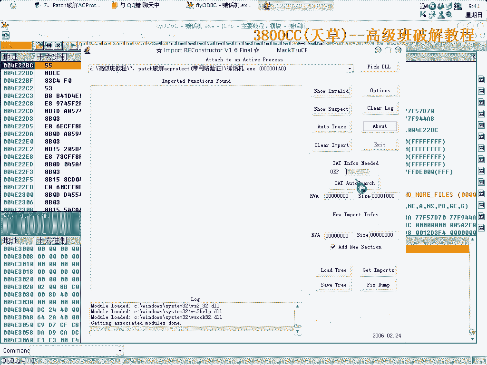


运行脱壳工具后，程序似乎很快到达了OEP（原始入口点）。


然而，当我们尝试运行修复后的程序时，却发现无法正常工作。


这表明修复过程可能存在问题。我们尝试手动修复导入表。

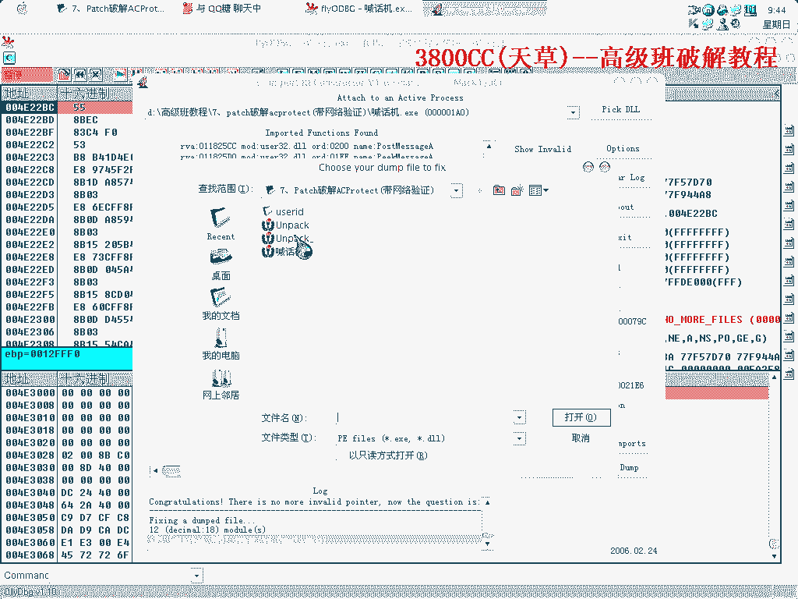


在修复过程中，我们遇到了一些无效的指针，需要将其修改为正确的函数名，例如 `MacOS Pulse`。


但修复过程并不顺利，某些项无法简单地修复。这说明了完美脱壳的难度。因此，我们决定放弃脱壳，转而采用更直接的Patch方法。

---

## 定位关键验证代码


既然脱壳遇到困难，本节中我们来看看如何在不脱壳的情况下，从程序内部定位网络验证的关键跳转。

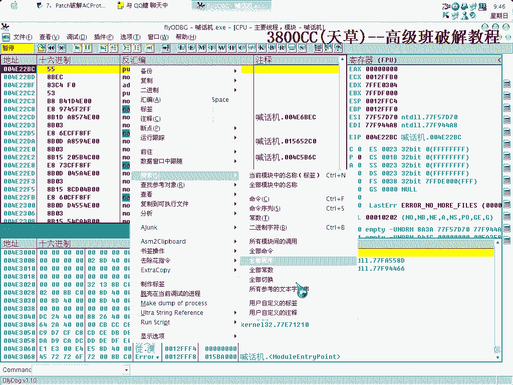

我们让程序运行起来，并在其内部搜索相关的提示字符串。

以下是搜索字符串的步骤：

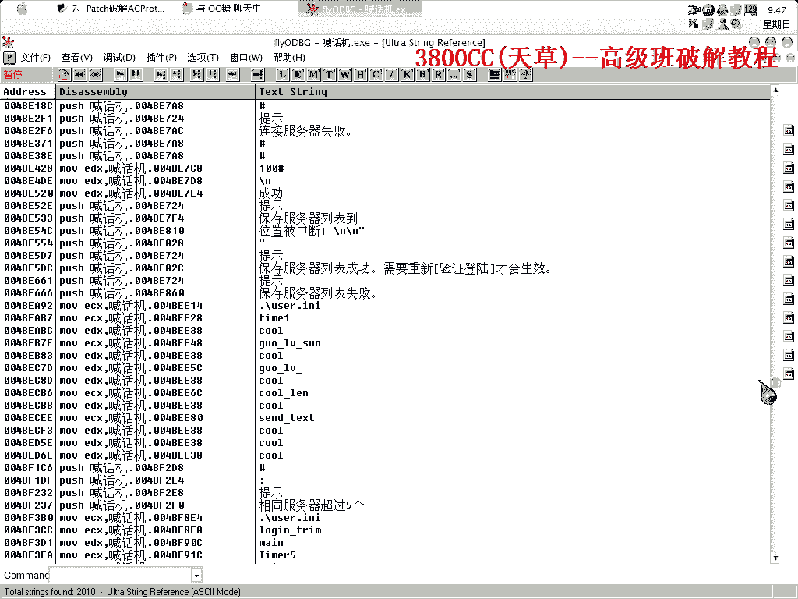

1.  在反汇编窗口中，使用字符串搜索功能。
2.  首先尝试搜索英文，但本程序包含中文提示。
3.  我们搜索到了“验证失败”等关键字符串。


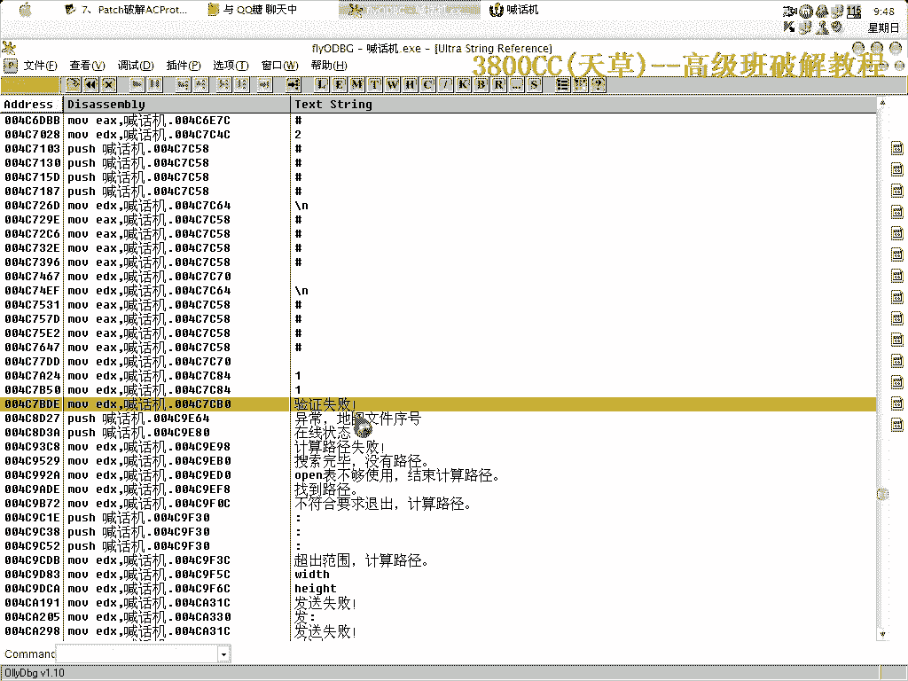


在“验证失败”的代码上方，通常存在一个条件跳转指令。这个跳转决定了程序是走向验证成功还是失败的分支。


我们记录下这个关键跳转的地址。对于只有一层网络验证的程序，修改此处跳转往往就能绕过验证。

---

## 分析壳的解码循环

上一节我们找到了验证跳转，但那是程序运行后的逻辑。本节中我们来看看如何在程序解码阶段就介入，这是本方法的核心。

我们重新加载程序，并在解码循环处下断点。通过多次 `Shift+F9` 跳过异常，我们来到了一个循环解码的区域。

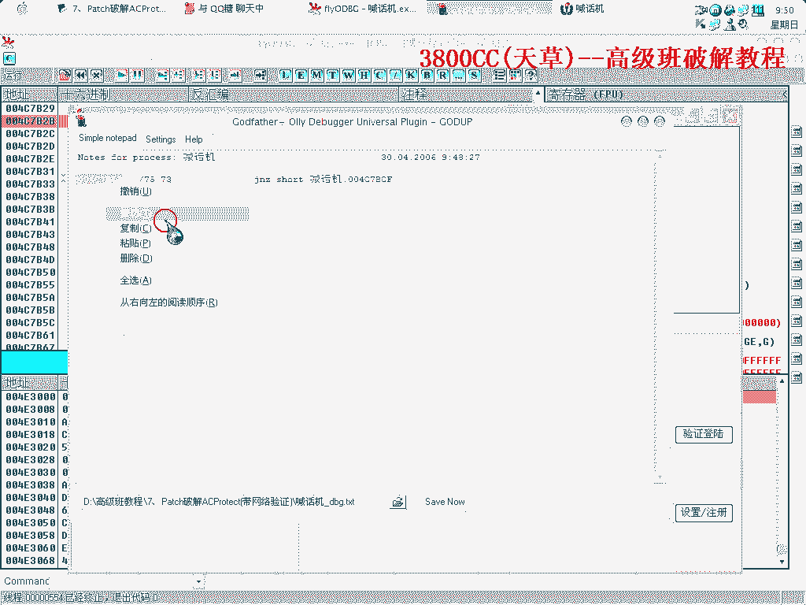

这个循环是ACProtect壳进行代码解码的地方。解码完成后，程序才会跳转到OEP执行。这个解码循环的出口，就是我们的突破口。


我们观察到一条关键指令：
```
Move Word PTR DS:[...], 9090
```
这条指令会将某个地址的数据修改为 `9090`（即NOP指令的机器码）。同时，我们注意到一个名为 `R1 TM8` 的地址需要被考虑进去。

---

## 实施Patch

经过前面的分析，我们已经找到了关键点。本节中我们来看看如何制作并应用我们的补丁。

补丁的原理是：在壳的解码阶段，就强制修改内存中验证跳转处的指令，使其直接跳转到验证成功的流程。

以下是制作补丁的步骤：

1.  使用补丁制作工具（如Loader）。
2.  在“添加”数据时，填入我们找到的关键地址。
3.  在地址后需要加上偏移 `R1 TM8`。
4.  写入的数据是 `9090`，即两个NOP指令，用于覆盖原有的条件跳转。

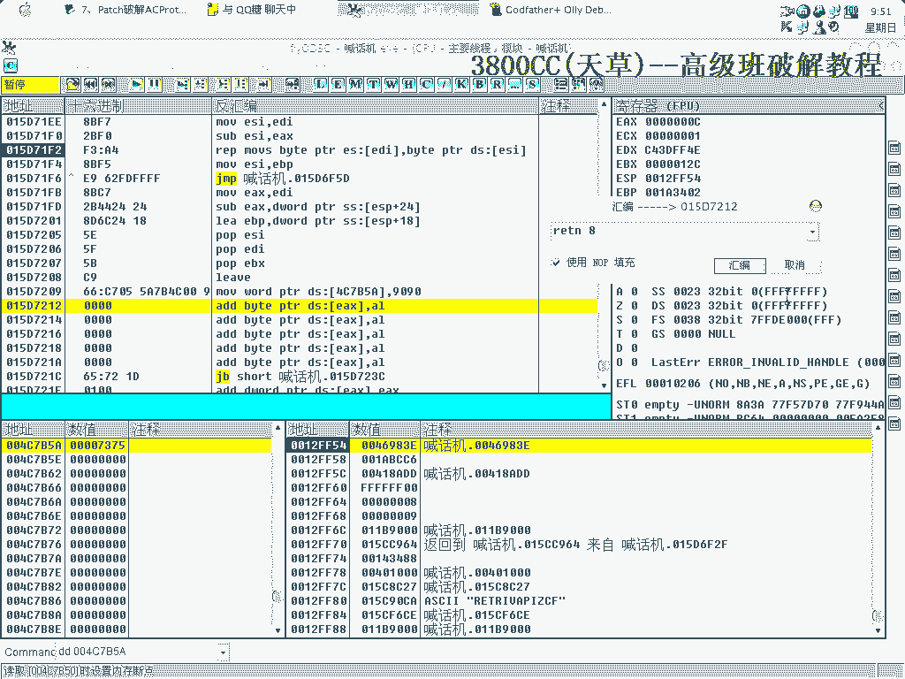


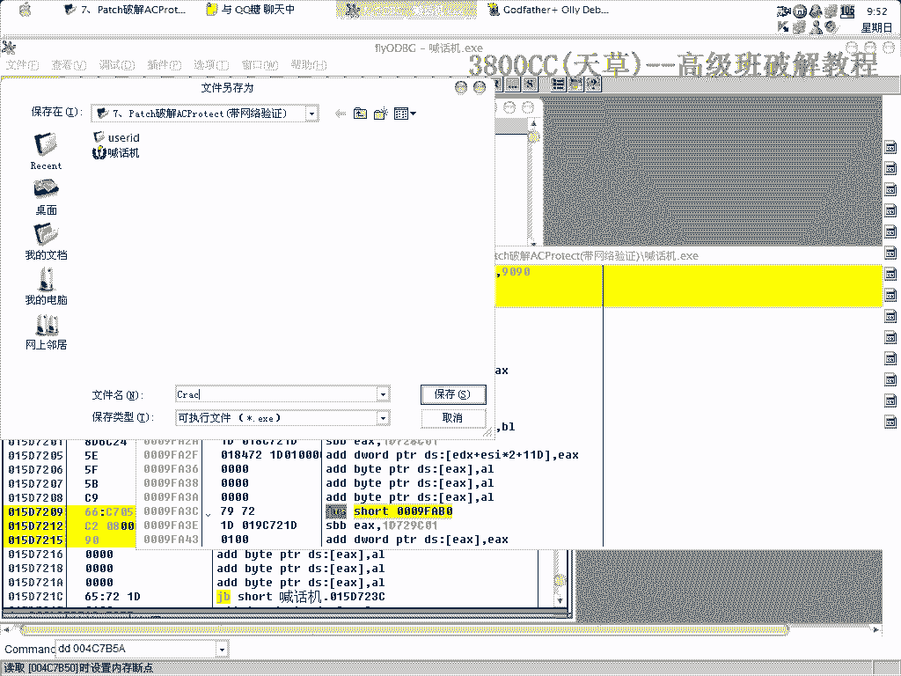


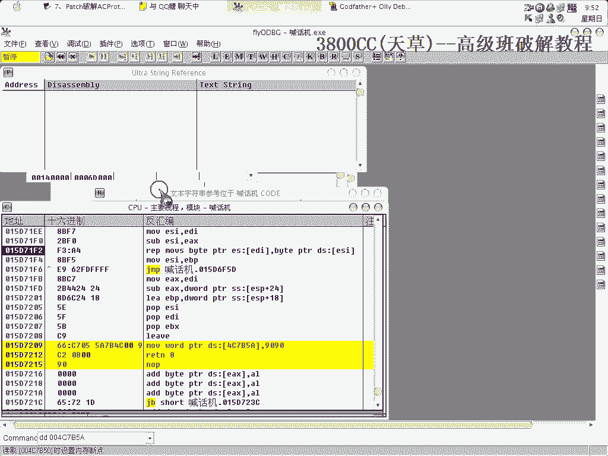

如果有多个需要修改的验证点，就重复此步骤添加多个地址。

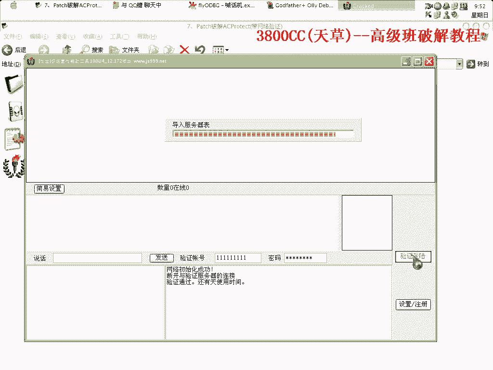

应用此补丁后运行原程序，补丁会在解码阶段自动修改内存，从而绕过网络验证。

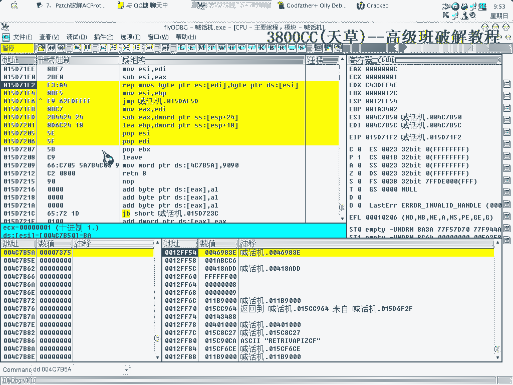


---

## 课程总结


本节课中我们一起学习了针对带ACProtect壳及网络验证程序的Patch破解技术。

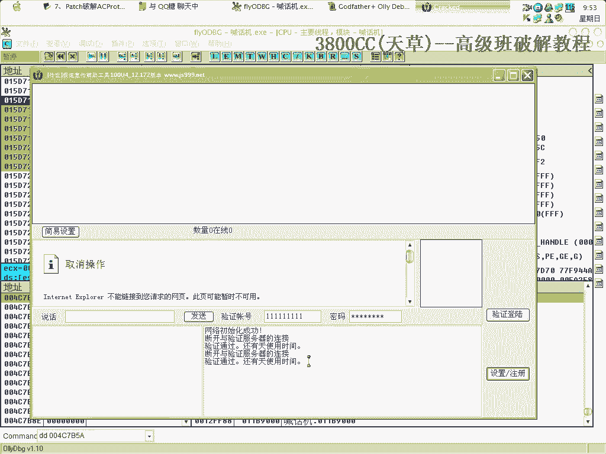

我们首先尝试了传统脱壳并发现了其难度，进而转向直接分析。通过定位程序内的验证失败字符串，我们找到了关键跳转。更进一步，我们深入壳的解码循环，发现了可以在解码过程中动态修改代码的漏洞。最后，我们利用这个漏洞制作了一个内存补丁，在程序运行时自动将验证跳转修改为NOP，从而成功绕过了网络验证。

这种方法的核心思想是 **“以子之矛，攻子之盾”**，利用壳自身解码和修改代码的机制，来达成我们的破解目的。它避免了复杂的脱壳和修复过程，对于某些特定保护非常有效。

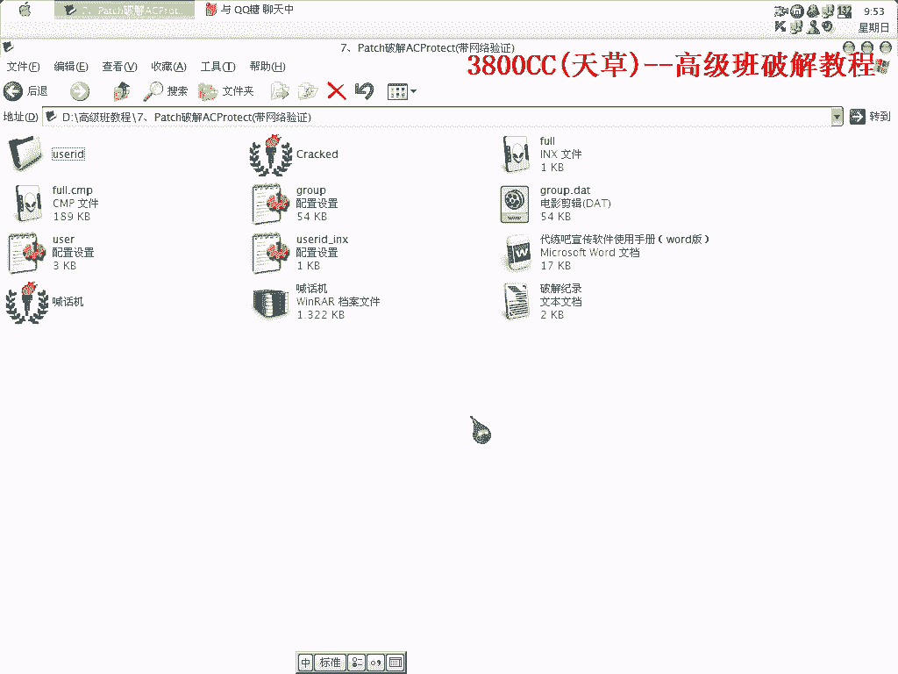


**出品人：宋佩岩**