# 天草高级班 - P8：Acprotect全保护脱壳实战 🛡️➡️📦

在本节课中，我们将学习如何对一个施加了Acprotect（此处原文为S-ProTek/Ace Pro Tech）全保护的软件进行手动脱壳。我们将使用OllyDbg（OD）作为调试工具，并详细讲解定位原始入口点（OEP）、修复被偷取的代码以及重建导入地址表（IAT）的完整过程。

## 初始设置与异常处理

首先，我们启动目标程序并使用OllyDbg附加进程。为了顺利调试，需要对OD进行一些设置。

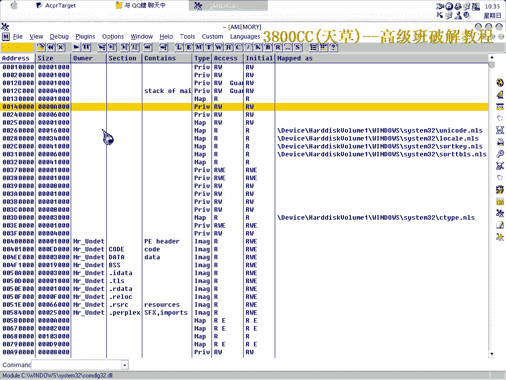

以下是需要进行的初始设置步骤：
*   忽略OD中的所有异常选项。
*   隐藏调试器，以避免被保护机制检测。

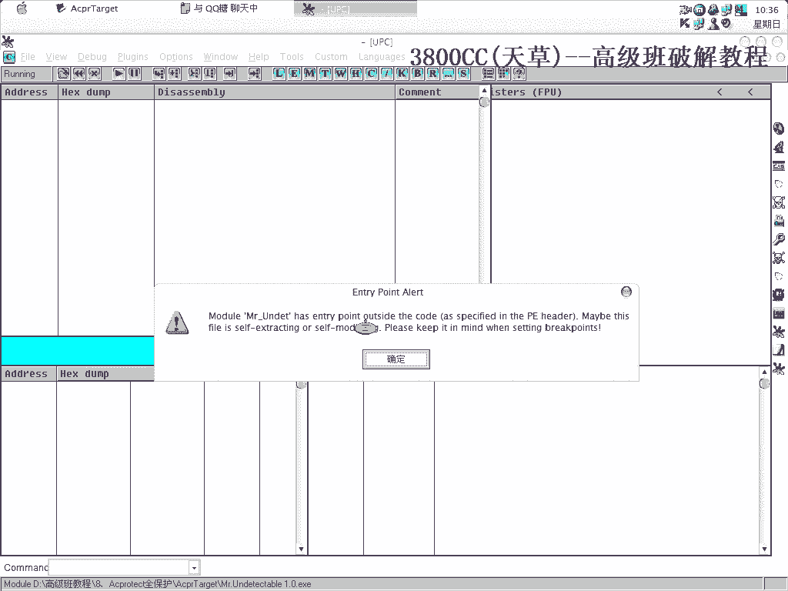

设置完成后，运行程序。OD可能会被强制关闭，这表明保护强度很高。我们重新附加，并确保断点设置成功。

## 定位被偷取的OEP

上一节我们完成了调试器的设置，本节中我们来看看如何找到真正的程序入口点。通过多次在系统领空（如`ntdll`模块）中断并返回，我们可以逐步接近OEP。

以下是定位OEP的关键操作：
1.  在系统API调用处（如图中位置）下断点。
2.  运行程序（F9）中断后，将寄存器窗口的数值**清零**（`zero`）。
3.  重复“运行->清零”的过程数次。
4.  删除断点，继续运行，程序最终会跳转到被偷取的OEP区域。

此时可以看到，OEP的代码并非原始代码，而是被保护程序修改过的。

## 分析被破坏的IAT

找到OEP后，下一步是检查程序的导入地址表（IAT）状态。IAT存储了程序调用外部函数（如系统API）的地址，是脱壳后修复的关键。

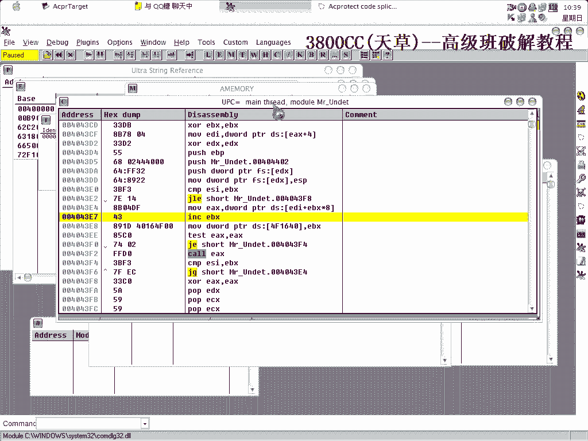

在内存映射窗口中查看，可以明显发现IAT区域被破坏。原始IAT的地址（例如`0x401468`）处没有有效数据，这表明保护程序使用了“Stolen Code”和“IAT Redirection”技术。

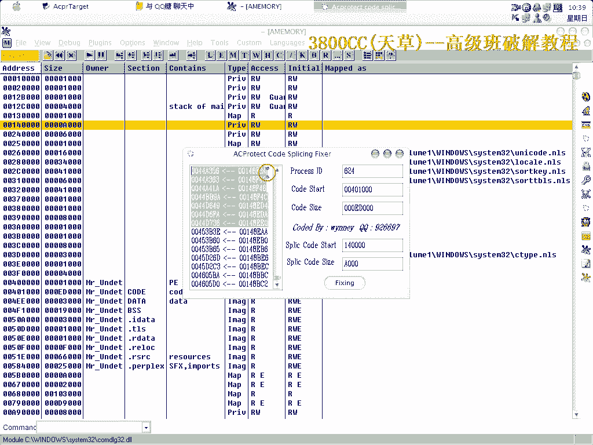

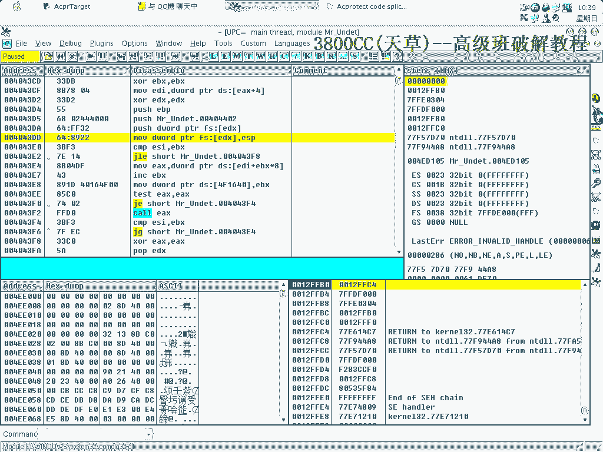

## 寻找并修复Stolen Code

为了修复程序，我们需要找到被偷取并转移到其他位置的原始代码片段（Stolen Code）。这需要更精细的跟踪。

以下是寻找Stolen Code的步骤：
1.  在疑似代码转移的指令（如`jmp`或`call`）处下硬件执行断点。
2.  运行程序，跟踪跳转目标。
3.  遇到保护程序的反调试陷阱（如对`GetTickCount`等API的特殊处理）时，通过修改标志位或跳过检查来规避。
4.  最终会到达一片存放着原始OEP代码的区域，这就是Stolen Code。

找到后，需要将这些二进制代码复制下来。使用OD的二进制复制功能（`Copy -> Binary`），然后返回到原始的OEP地址，进行二进制粘贴（`Binary Paste`），覆盖被破坏的代码。

## 使用工具重建IAT

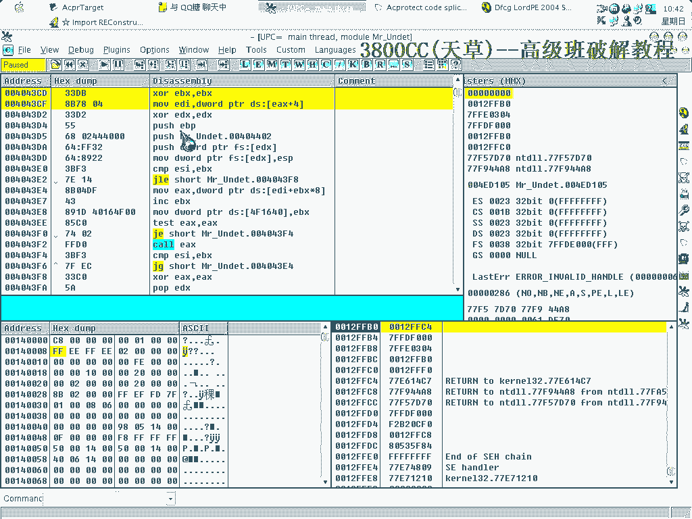

代码修复后，我们需要修复IAT。这里使用一个专用的修复工具（如`Imports Reconstructor`）。

以下是使用工具修复IAT的流程：
1.  在OD中查看进程ID和代码段（`.code` section）的地址范围。
2.  打开修复工具，填入当前进程ID。
3.  在工具的“IAT Info”中，填入原始IAT的地址（如`0x401468`）和大小。
4.  点击“Get Imports”按钮，工具会尝试分析并列出所有导入函数。
5.  如果列表正确，点击“Fix Dump”按钮，并选择之前修复了Stolen Code的程序副本进行修复。

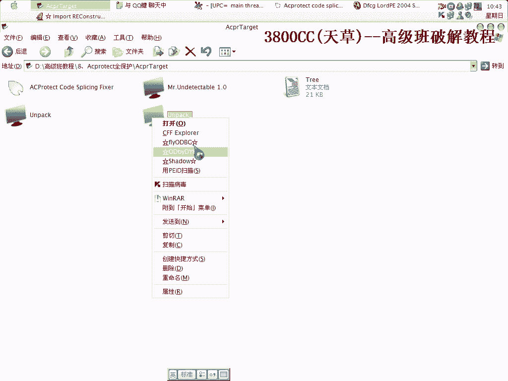

**注意**：填入的OEP地址（RVA）必须准确，否则修复会失败。如果修复后的程序无法运行，需要检查OEP地址和IAT地址是否正确，并重复上述步骤。

## 处理修复过程中的问题

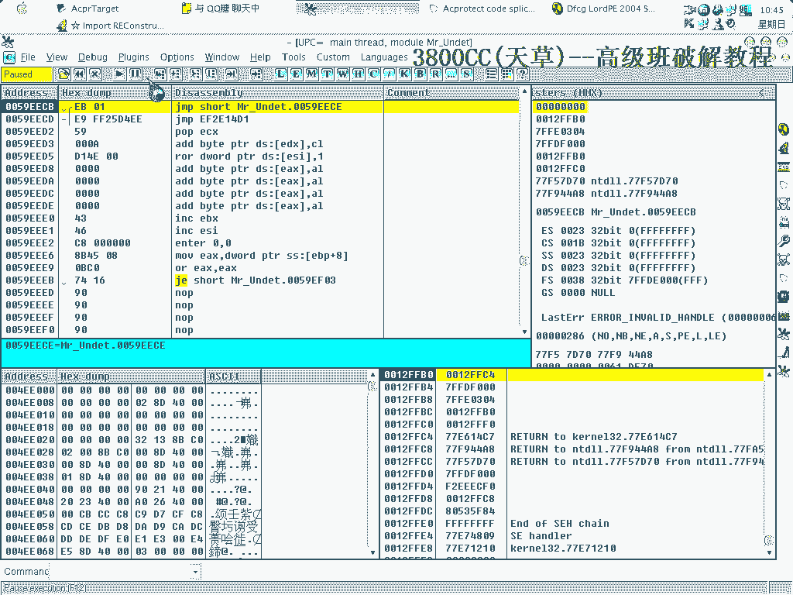

修复过程可能不会一次成功。常见问题包括地址填写错误、或运行环境干扰导致地址变化。

例如，在操作过程中，如果发现粘贴的二进制代码有误（如某个字节错误），会导致程序行为异常。此时需要重新跟踪，再次复制正确的Stolen Code。

另一个问题是，运行了屏幕录像软件等外部程序可能导致内存地址发生变化，使得之前找到的地址失效。这种情况下，需要关闭可能干扰的程序，重新开始脱壳流程。

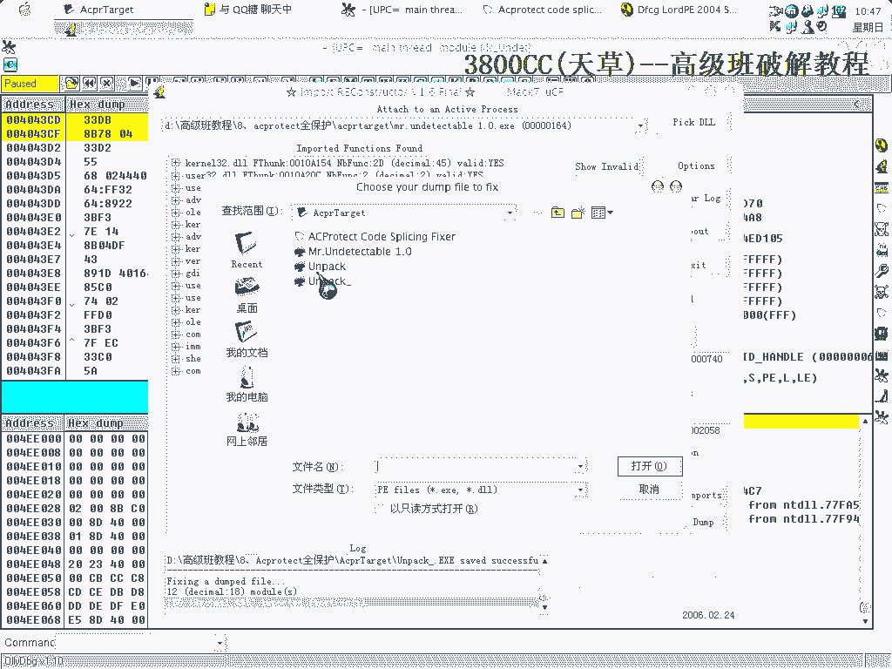

关键是要保持耐心，仔细核对每一步的地址和数据。

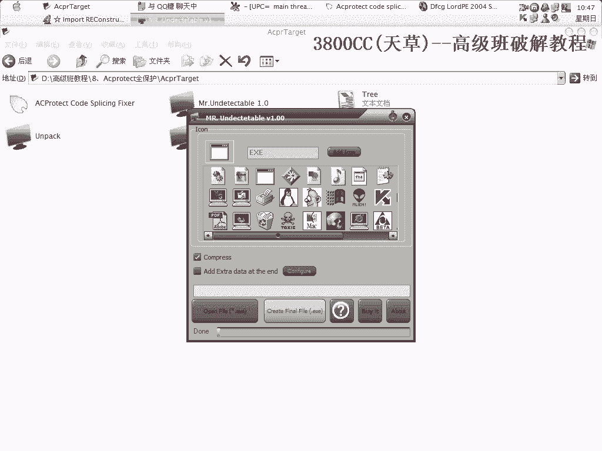

## 最终修复与验证

经过多次尝试和修正，最终成功修复了IAT。修复工具生成了一个可运行的程序副本。

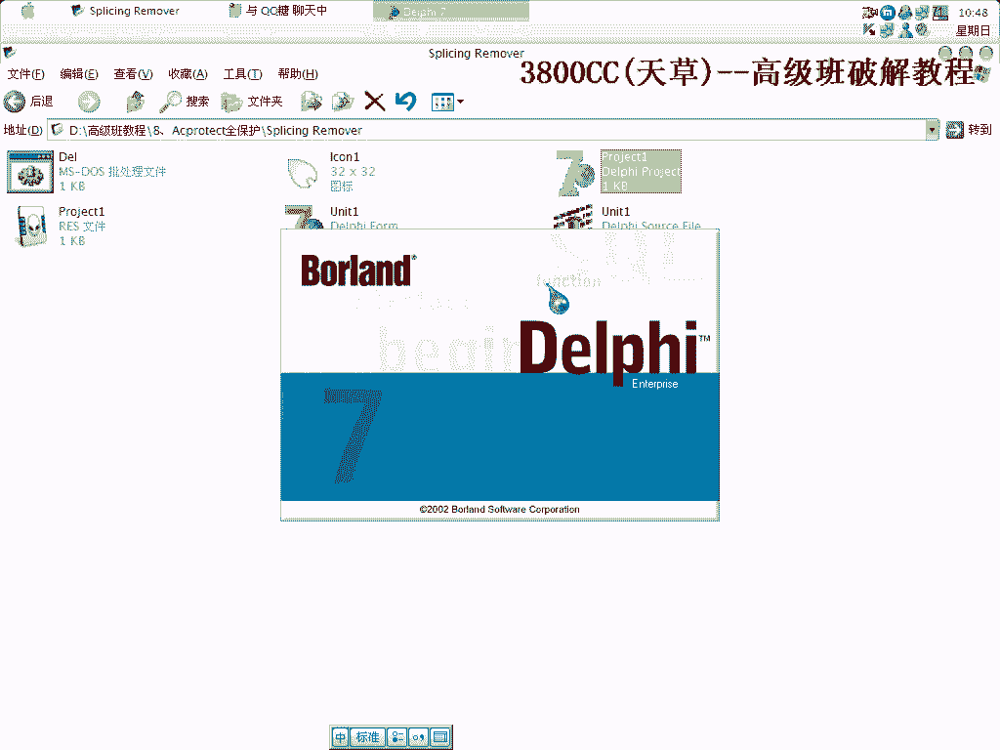

为了验证脱壳是否完全成功，可以使用查壳工具（如`PEiD`或`DIE`）检查修复后的文件。结果显示为“Microsoft Visual C++”或其他原始编译器信息，表明外壳已被成功去除。

本节课中我们一起学习了手动脱去Acprotect全保护外壳的完整流程。我们主要经历了以下几个阶段：调试器设置与反反调试对抗、定位被偷取的OEP、分析被破坏的IAT、手动修复Stolen Code、使用工具重建IAT，以及处理修复过程中的各种问题。掌握这个流程需要大量的练习和对Windows PE结构的深入理解，希望本教程能为你的学习提供清晰的路径。

