# 天草高级班 - P9：传世VIP 2.31版破解教程 🔓

在本节课中，我们将学习如何对“传世VIP 2.31版”软件进行破解分析。课程将引导你定位关键代码、理解验证逻辑，并最终绕过其充值限制。

---

## 课程概述与目标 🎯

本节课的目标是破解“传世VIP 2.31版”。该软件在未充值状态下会提示“账号尚未充值”。我们将通过逆向工程，定位并修改其验证逻辑，实现“白嫖”使用。


软件界面如下：


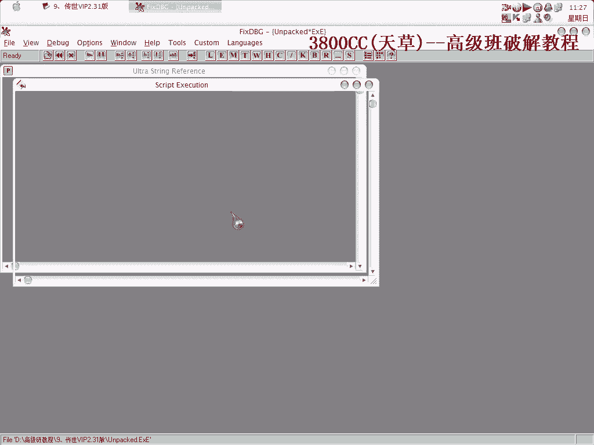

课程结束后，请记得将系统还原。

---

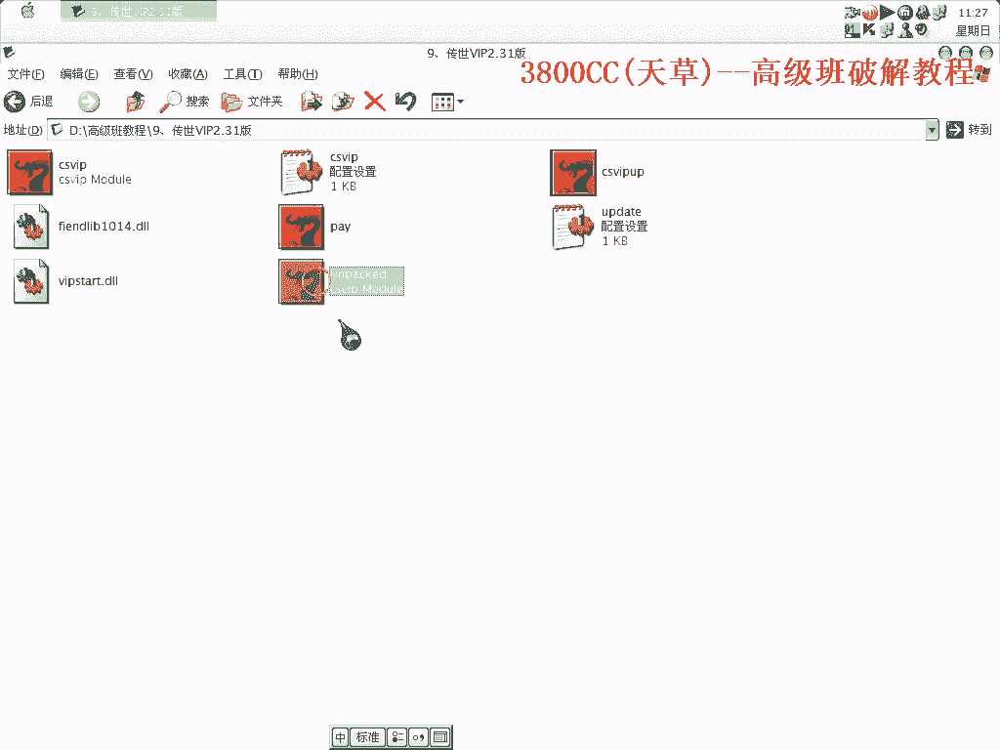

## 初步分析与尝试 🧐

首先，我们尝试使用常规的破解方法。在上一节课程中，我们学习了使用特定工具（如L12堆栈工具）来跳过登录框。本节中，我们来看看这种方法是否适用。

运行程序并附加调试器后，我们定位到程序的入口点（OEP）。然而，我们发现这里出现的并非传统的登录框，而是在成功登录后弹出的另一个验证窗口。


因此，直接跳过登录框的L12堆栈方法在此处无效。我们需要寻找新的突破口。

---

## 定位关键验证字符串 🔍

既然无法绕过初始界面，我们需要深入程序内部查找关键线索。上一节我们分析了入口点，本节中我们来看看如何定位验证逻辑。

我们可以在程序的字符串中搜索与登录或充值相关的提示信息。例如，搜索“登陆提示”或“充值”等字符串。

在字符串列表中，我们找到了“登陆提示”。但需要注意的是，程序中有多处“登陆提示”，我们需要找到后面紧接着进行验证判断的那一处。


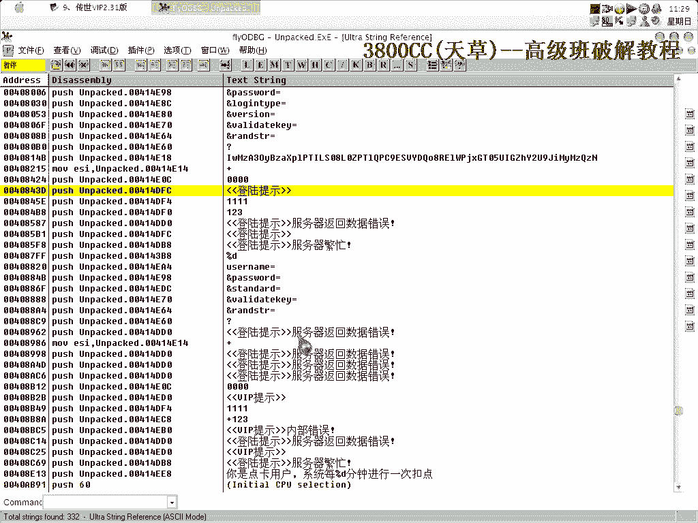

我们选择最可能的一处“登陆提示”，然后向上查找代码段的起始位置（函数头部）。

---

## 分析验证逻辑与数据获取 💻

找到疑似验证函数后，我们需要分析其逻辑。函数会获取我们输入的用户名和密码。这里有一个细节：我上次输入的是大写“CC”，但程序内部可能仍按小写处理。

以下是获取登录信息的代码示意：
```assembly
; 假设的汇编代码片段，用于获取用户名
mov eax, [user_name_address]
```

同时，程序会调用一个DLL（动态链接库）来进行进一步的验证或数据交互。我们需要分析这个DLL的作用。


由于记忆有些模糊，我们直接使用调试器附加到进程，并在这个验证函数上下断点，动态跟踪数据的流向和判断条件。

---

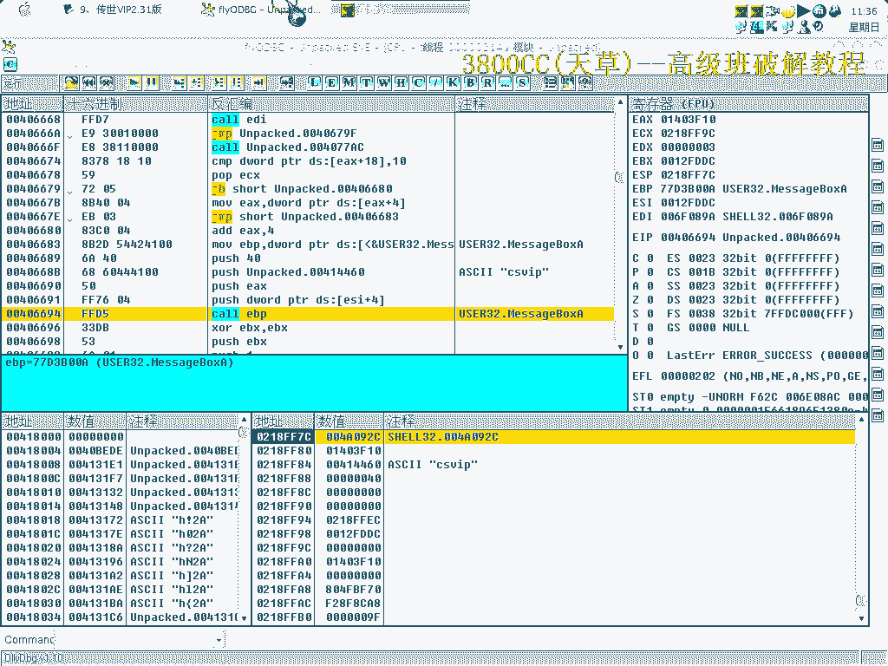

## 动态调试与关键跳转修改 ⚙️

通过动态调试，我们一步步执行程序。当程序执行到验证函数时，观察寄存器和堆栈的值。

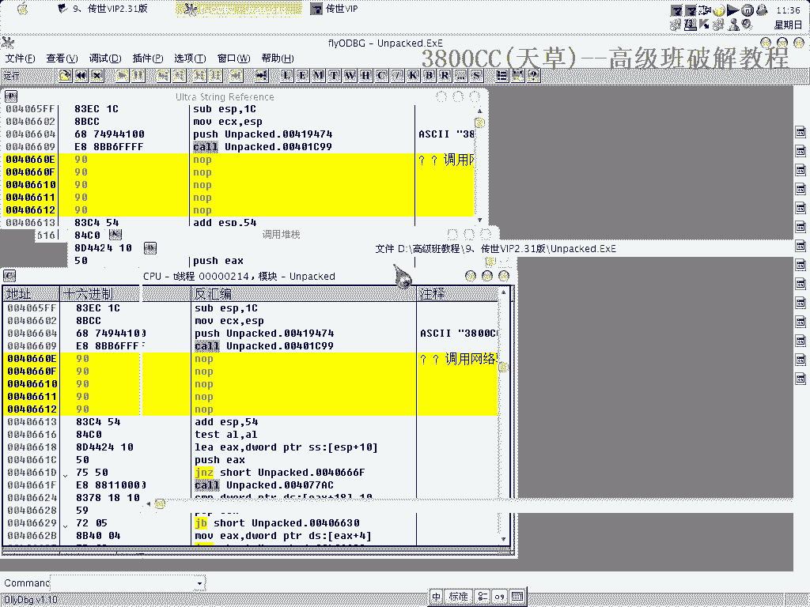

我们发现了一个关键的比较指令（CMP）和紧随其后的条件跳转指令（JE 或 JNZ）。这个跳转决定了程序是走向“充值成功”的流程，还是弹出“未充值”的提示。


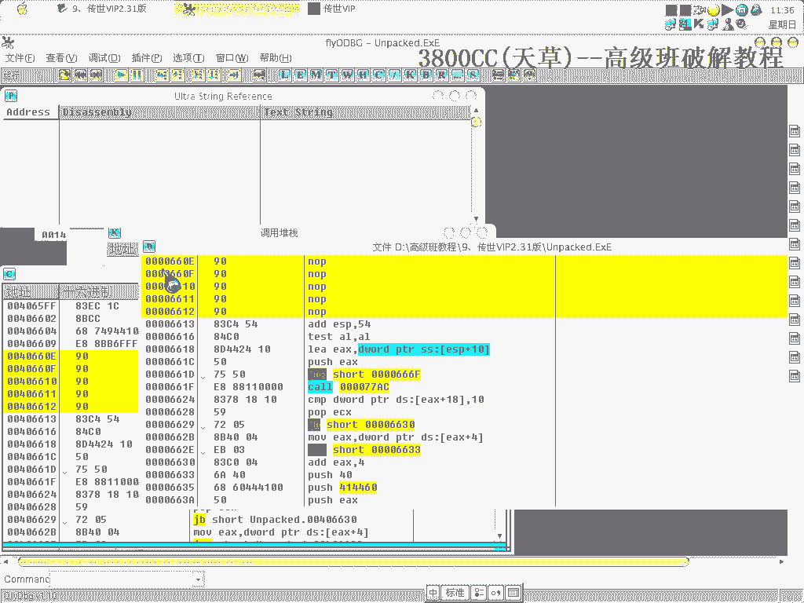

我们的目标就是修改这个关键跳转。例如，如果原指令是`JNZ`（结果不为零则跳转到失败流程），我们可以将其改为`JZ`（结果为零则跳转），或者直接改为无条件跳转`JMP`，从而绕过充值检查。

修改指令的示例如下：
```assembly
; 原指令：若不满足条件则跳转到失败提示
JNZ 0x0045ERROR

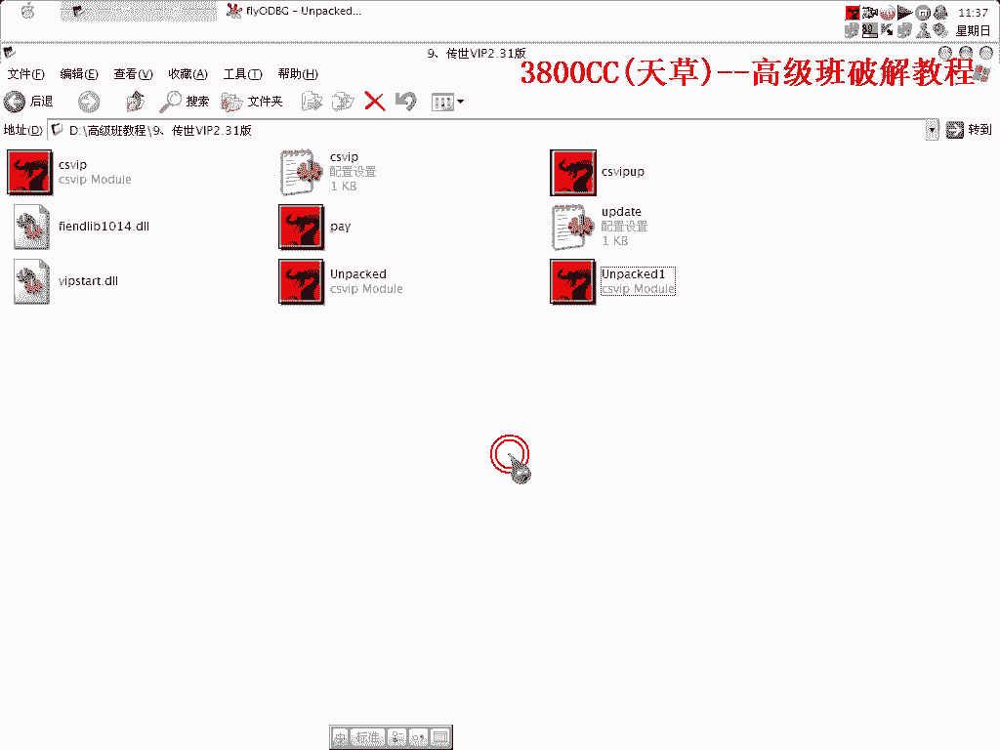

; 修改为：无条件跳转到成功流程
JMP 0x0045SUCCESS
```

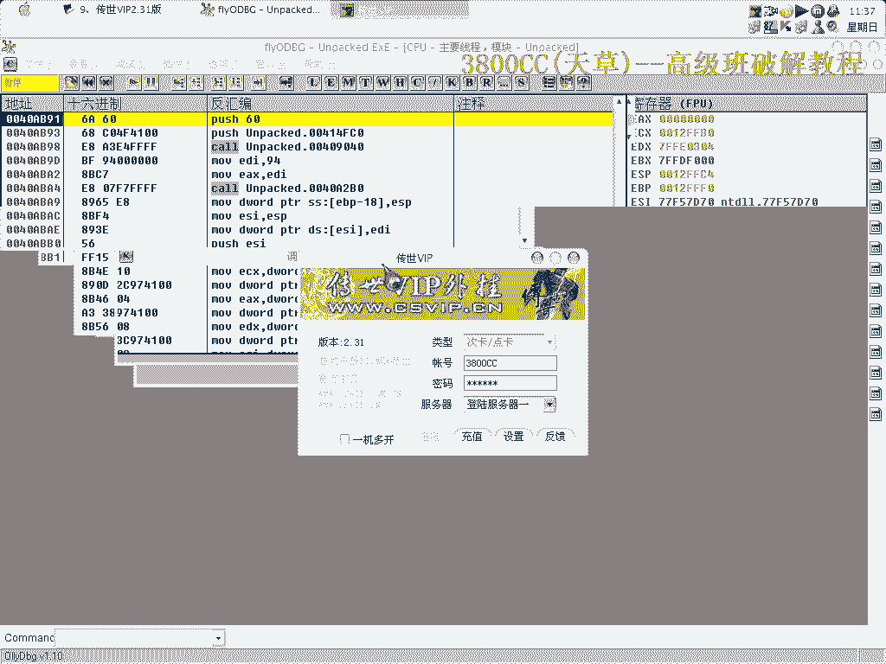

在内存中直接修改该指令的机器码，并保存到可执行文件。

---

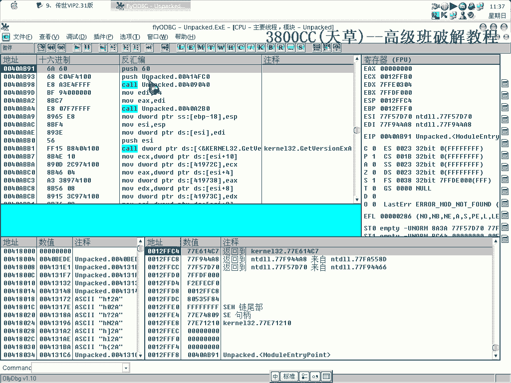

## 测试与验证 ✅

修改完成后，我们保存文件并重新运行程序。使用之前注册但未充值的账号进行登录。

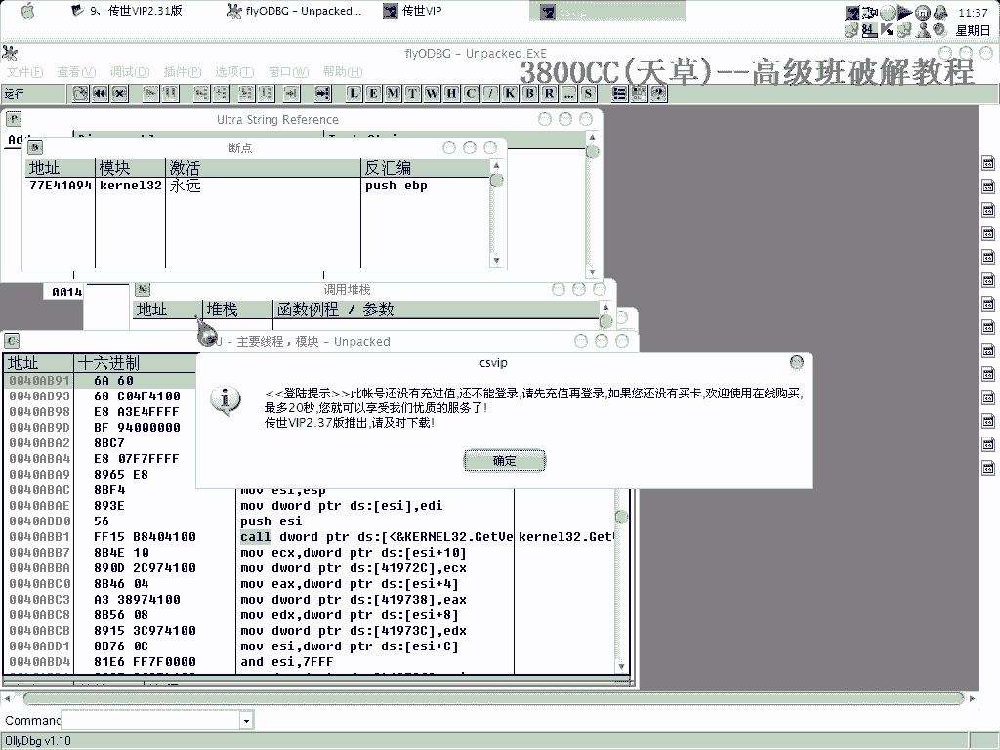

如果破解成功，程序将不再弹出“账号尚未充值”的提示，而是能够正常进入软件的所有功能界面。

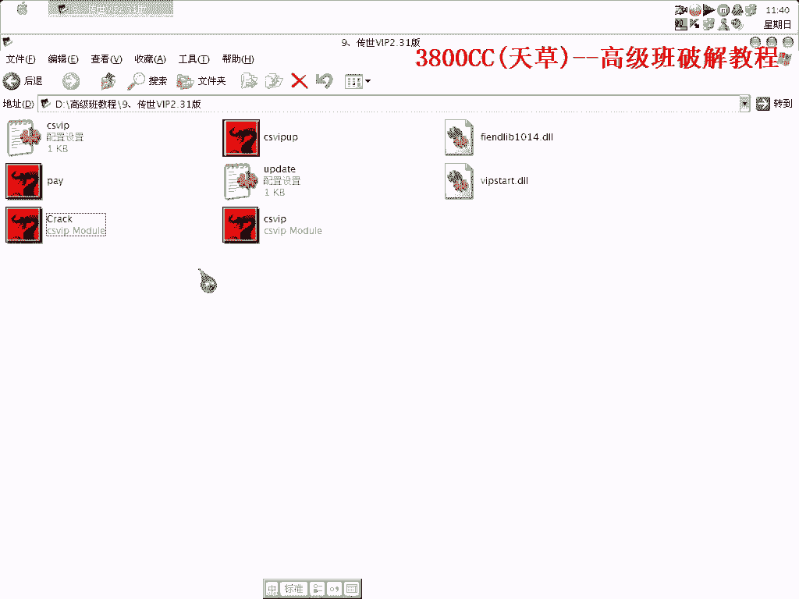

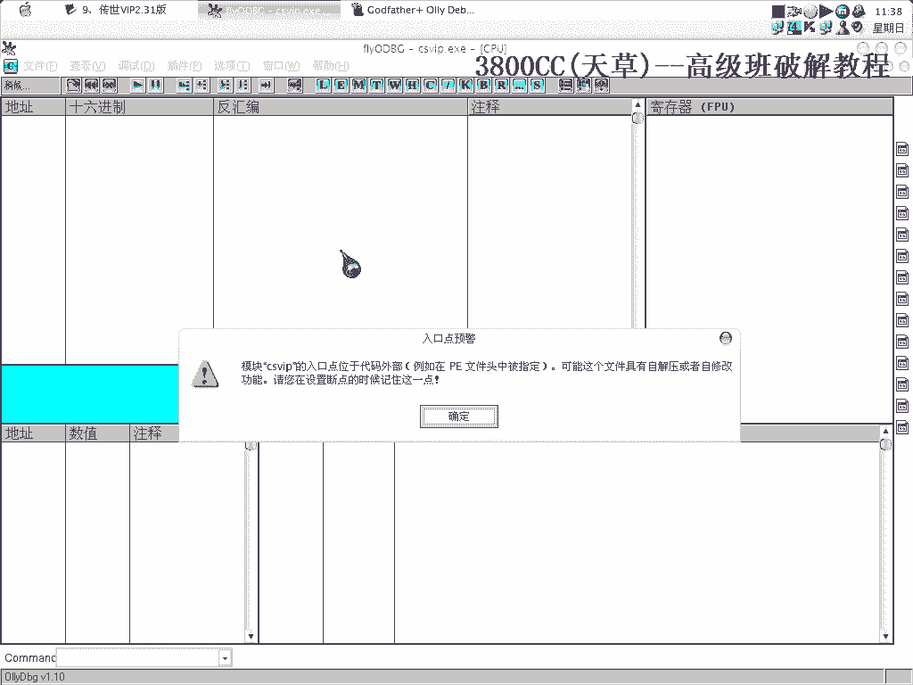

请务必进行多项功能测试，以确保破解完整，没有其他暗桩或后续验证。


---

## 课程总结 📝

本节课中，我们一起学习了针对“传世VIP 2.31版”的破解流程。

我们首先尝试了常规方法并发现其局限性，进而通过**字符串定位法**找到关键验证函数。接着，我们使用**动态调试技术**分析了验证逻辑，并定位到**核心的条件跳转指令**。最后，通过**修改该跳转指令**，我们成功绕过了软件的充值验证。


核心破解思路可以总结为：**定位验证点 -> 分析判断逻辑 -> 修改关键跳转**。

请记住，本教程仅用于逆向工程技术学习。请在法律允许的范围内使用这些知识，并尊重软件开发者的劳动成果。