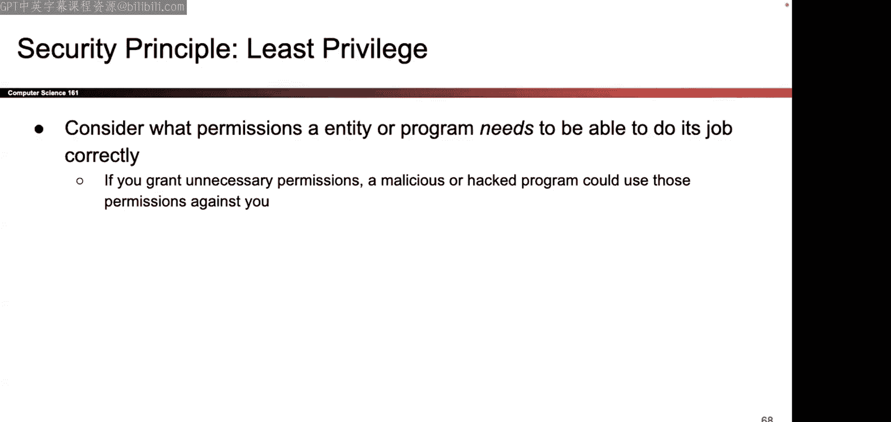
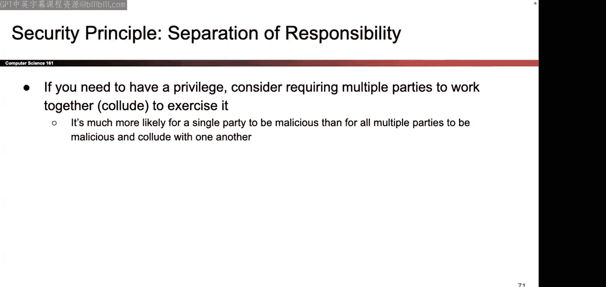
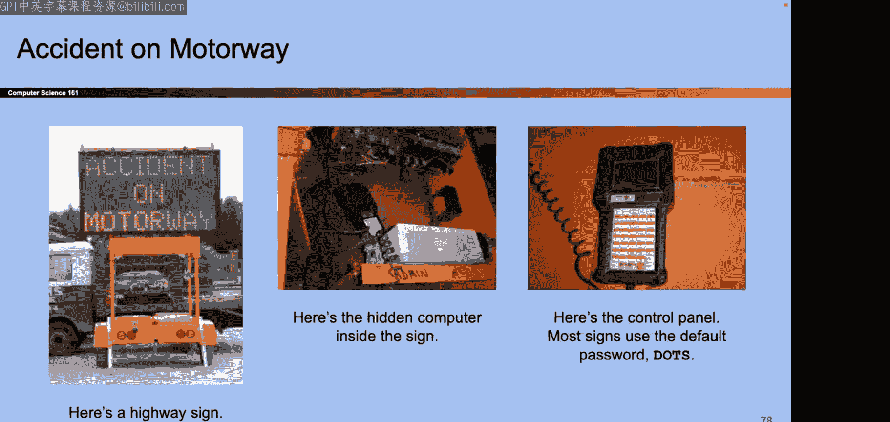
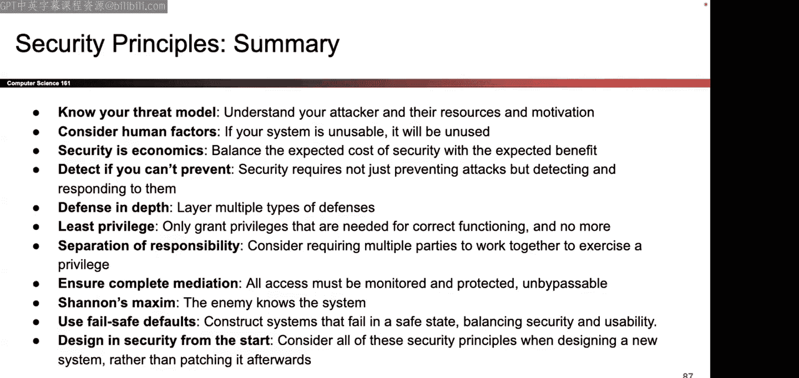

# 001：课程介绍与安全原则 🛡️


在本节课中，我们将学习CS161课程的基本信息、课程结构以及计算机安全领域的一些核心原则。课程内容分为两部分：第一部分是课程后勤安排，第二部分将介绍一系列重要的安全设计原则。

## 课程概述与后勤安排

本节我们将介绍CS161课程的基本信息、课程结构、先修要求以及各项课程政策。

### 课程内容与结构

本课程旨在教授一种不同的编程哲学：从对抗性的角度思考问题。我们将学习如何评估威胁的重要性，并探讨现实世界中的工具和协议。课程内容不仅仅是理论，还会展示实际可用的工具。

课程主要分为四个单元：
1.  **内存安全**（约3周）：讨论针对代码的攻击，以及为何应避免使用C语言等编写代码。
2.  **密码学**（约2-3周）：探讨在攻击者试图窃听或篡改通信的情况下，如何安全地从A点向B点发送信息。
3.  **Web安全**（约2-3周）：讨论针对Web的攻击。
4.  **网络安全**（约2-3周）：讨论针对互联网的攻击，并区分Web与互联网的不同。

课程还将教授一些非常有价值的实用工具：
*   **第一单元**：将学习X86汇编语言，并大量使用GDB调试器，这将极大提升你的调试能力。
*   **密码学单元**：即使不成为密码学软件开发者，学习如何分析密码学工具也很有用，可以帮助你判断一个产品或方案是否可靠。
*   **Web安全单元**：会涉及一些Web开发相关内容。
*   **网络安全单元**：会提供网络协议的概述。

### 先修要求

以下是本课程的重要先修要求：
*   **CS61C**：这是最重要的先修课程。项目一涉及利用C程序漏洞，因此需要对C程序的工作原理、内存布局和汇编代码有很好的理解。如果缺乏这些知识，课程会非常困难。
*   **CS70**：密码学单元涉及大量数学和理论，需要能够理解数学证明和符号语言。
*   **CS162/CS169**：项目二需要从头开始设计和编写大量代码，因此具备编写和组织大型代码库的经验会很有帮助。
*   **学习新语言的能力**：项目二将使用Go语言，因此需要具备快速学习新编程语言的能力。

如果你不确定自己是否准备好，可以参加下周一（第二讲）的课程，评估自己对内容的熟悉程度。

### 课程政策与资源

以下是关于课程注册、参与方式、评分和学术诚信的重要信息。

#### 注册与参与
*   **注册**：课程名额由系里控制，教学团队无法手动添加学生或提供选课代码。请关注系里的名额更新，并准备备选方案。
*   **讲座**：每周一、三晚上举行。可以现场参加、在线参加或观看录像。
*   **讨论课**：由助教主持，从下周开始。可以选择喜欢的时段参加，不考勤。
*   **办公时间**：为高效帮助更多学生，当等待人数较多时，**现场咨询的学生将获得优先帮助**，在线咨询可能需要等待更长时间。

#### 作业与考试
*   **作业**：包括家庭作业和三个项目。项目二是工作量最大的部分，需要从头设计一个安全系统。
*   **考试**：有两场考试（期中、期末）。有固定的考试时间和一个备用考试时间。**备用时间仅用于解决真正的时间冲突**，并非可随意选择。
*   **项目二评分说明**：项目二的设计类似于带回家的考试。你需要设计一个能抵御攻击的系统，而教学团队将在提交后运行攻击测试。因此，大多数学生的得分在60%-70%区间，**获得满分并不常见**，评分时会考虑这一点。

#### 延期与支持
*   **延期政策**：非常宽松。任何作业都可以因任何理由申请延期。
    *   在截止日期前提交的、**少于或等于3天的延期请求将自动批准**。
    *   超过3天的延期可能需要审核。
    *   鼓励在遇到压力、疾病或其他课程冲突时提前申请延期。
*   **DSP（残障学生项目）**：如果你因残疾在学习中遇到障碍，请通过DSP申请合理的便利措施。获得批准后，请尽快通过AIM系统将住宿信发送给教学团队。
*   **健康与资源**：你的健康和幸福比这门课更重要。如果你感到压力过大，请与我们沟通。此外，作为伯克利学生，你可以利用校园内的心理咨询等服务（如Tang Center）。

#### 学术诚信
*   **基本原则**：不要作弊。详细政策在课程网站上。
*   **严禁行为**：不得持有、查看或讨论他人（包括往届）的作业解决方案。
*   **寻求帮助**：如果你在截止日期前感到巨大压力并可能做出错误决定，**请务必先与我们沟通**，我们会尽力提供帮助。一旦发生学术不端行为，将按照学校政策处理，可能导致作业得零分甚至负分，并上报学生行为办公室。
*   **道德准则**：课程会讲解攻击技术，但**仅允许在拥有权限的系统（如你自己的系统或获得明确授权的系统）上进行测试**。未经授权攻击他人系统是违法的。

#### 课堂环境
我们致力于创造一个相互尊重、包容的学习环境。请尊重他人的身份和观点，在交流中保持礼貌和专业。

#### 幻灯片颜色说明
部分幻灯片背景为蓝色。这表示幻灯片内容是一个故事或背景信息，用于阐述某个安全理念。**你需要理解其中的核心理念，但不需要记忆故事的具体细节（如事件发生的具体年份）**。

---

## 安全设计原则 🔐

上一节我们介绍了课程的后勤安排，本节中我们来看看一系列核心的安全设计原则。这些原则将帮助你以安全的角度思考和设计系统。

### 1. 了解你的威胁模型 🐻

首先，我们通过一个故事引入第一个原则。

**故事**：两个徒步者在森林里遇到一只熊。一个人急忙穿鞋准备逃跑，另一个人却不慌不忙。第一个人问：“你在干什么？熊会吃掉我们的！”第二个人回答：“我不需要跑得比熊快，我只需要跑得比你快就行。”

**原则**：在考虑防御之前，必须首先定义**威胁模型**。你需要思考：
*   **攻击者是谁**？（个人、犯罪组织、国家机构？）
*   **他们的动机是什么**？（金钱、政治、报复、乐趣？）
*   **他们能做什么，不能做什么**？（例如，我们通常假设攻击者可以反复尝试、拥有公开知识、并且可能很“幸运”。）

威胁模型决定了你需要防御的强度和方向。防御的目标不一定是做到完美，而是让攻击者转向其他目标或认为攻击你不值得。

**相关概念：可信计算基**
威胁模型有助于确定系统的**可信计算基**——即系统中所有安全所依赖的、必须保持正确的部分。理想情况下，TCB应尽可能小，以降低被攻破的风险。

### 2. 考虑人的因素 👥

安全系统最终是由人使用和构建的，因此必须考虑可用性。

**故事**：当出现“发送信息到互联网可能被他人看到，是否继续？”的弹窗时，大多数人会选择“是”并勾选“不再显示”。另一个关于SSL证书验证的错误信息复杂难懂，用户只想让它消失以便继续浏览。

**原则**：如果安全机制难以使用或令人厌烦，用户就会规避它，甚至选择不安全的行为。设计安全系统时，必须考虑用户体验。例如，一个物理安全密钥被设计成钥匙的形状，就是利用了人们天生会保护钥匙的心理，提高了它的实际安全性。

### 3. 安全是经济学 💰

安全措施需要成本，因此需要进行成本效益分析。

**故事**：购买保险箱时，防护等级（TL-15, TL-30, TXTL-60）越高，价格越昂贵。你需要决定为你的财产购买多贵的保险箱。

**原则**：几乎所有的安全问题都涉及权衡。更高的安全性通常意味着更高的成本（金钱、性能、便利性）。你需要根据你要保护的价值和面临的威胁来决定投入多少安全资源。例如，“零日漏洞”在黑市上价格极高，攻击者只会将其用于高价值目标。

### 4. 检测、防御与响应 🚨

无法永远防止攻击发生，因此需要多层策略。

**原则**：
*   **威慑**：在攻击发生前阻止它（如设立警告标志）。
*   **预防**：在攻击发生时成功阻止它。
*   **检测**：发现攻击正在进行或已经发生。
*   **响应**：攻击发生后，如何恢复和减轻损失。

即使无法预防（如地震），也可以通过检测和响应（如应急储备）来管理风险。例如，应对勒索软件攻击，保持数据备份就是一种有效的响应措施。

### 5. 纵深防御 🏰

不要只依赖单一防线。

**故事**：古城君士坦丁堡拥有多层城墙、护城河等防御工事。攻击者必须突破所有防线才能进入。

**原则**：通过部署多层、不同类型的安全控制措施来保护系统。即使一层防御被突破，其他层仍能提供保护。但需要注意，增加防御层也会增加成本和复杂性，其收益可能递减。

### 6. 最小权限原则 🔑

只授予执行任务所必需的最低权限。

**故事**：一个视频流媒体应用需要从网络下载文件并保存到本地。它本应只被允许访问特定的下载文件夹和特定的网络地址，但如果获得了整个文件系统和全网络访问权限，一旦该应用恶意，危害就大得多。

**原则**：无论是程序、用户还是账户，都应该仅被授予完成其功能所必需的最小权限。这限制了在发生泄露或被利用时造成的损害范围。

### 7. 权限分离 🤝

对于关键操作，要求多人协作完成。

**故事**：核导弹发射控制台的两个开关相距很远，必须由两个人同时操作才能发射。

**原则**：将关键权限或操作分割给多个主体，要求他们共同协作才能完成敏感操作。这降低了单点腐败或失误导致灾难性后果的风险。

### 8. 完全仲裁 ⛔

确保所有对受保护资源的访问都必须经过一个统一的检查点。

**故事**：一个可以绕过的路障无法有效控制车辆进出。所有车辆都应通过同一个检查站。

**原则**：系统应有一个单一的、不可绕过的**引用监视器**来仲裁所有访问请求。这保证了安全策略被一致地执行。这个监视器本身必须是安全的（属于TCB的一部分）。

**时间维度上的完全仲裁**：
以下是一个存在竞态条件漏洞的伪代码，它没有在“时间”上做到完全仲裁：
```pseudocode
1. balance = get_balance_from_server() // 读取余额，例如 $5
2. if (amount_to_withdraw > balance) { error; return; } // 检查：想取 $5，通过
3. new_balance = balance - amount_to_withdraw // 计算新余额 $0
4. set_balance_on_server(new_balance) // 写入新余额
5. dispense_cash(amount_to_withdraw) // 吐钞 $5
```
**攻击**：如果用户同时在两台ATM上发起取款请求，且时机恰当，两个请求可能都通过第2步的检查（因为读取的都是原始余额$5），然后分别执行第3-5步，导致用户仅用$5取出了$10。这说明检查（第2步）和实际操作（第3-5步）不是原子性的，在时间上存在被绕过的可能。

### 9. 避免隐蔽式安全 🙈

不能依赖系统设计的“秘密”来保证安全。

**故事**：高速公路信息板的维护密码通常是公开的默认密码（如“DOTS”）。依赖“没人会去查手册”的想法是危险的。



**原则**：根据**香农箴言**，应“假定敌人了解系统”。公开的信息（如协议标准、默认密码、开源代码）不能被当作安全屏障。安全应依赖于强密码、密钥等真正的秘密，而不是算法的隐蔽性。把钥匙藏在脚垫下就是隐蔽式安全。


### 10. 故障安全默认 ⚡



当系统出现故障或断电时，应默认进入安全状态。

**故事**：一栋大楼的电子门锁在断电时，是应该全部锁死还是全部打开？锁死可能困住人，打开可能造成未经授权的进入。

**原则**：设计时需要权衡故障时是“默认拒绝”（更安全）还是“默认允许”（更可用）。正确的选择取决于具体场景和保护对象的价值。

### 11. 安全始于设计 🏗️

在项目开始时就将安全考虑进去，而不是事后补救。

**原则**：在系统设计初期就融入安全思考，远比在开发完成后才尝试“修补”安全漏洞要高效和彻底。事后添加安全措施通常成本更高，且难以保证完整性。



---


## 总结 📚

本节课中我们一起学习了CS161计算机安全课程的框架和一系列核心安全原则。

我们首先了解了课程的目标、结构、先修要求以及重要的课程政策，包括宽松的延期政策和对学术诚信的严格要求。


接着，我们深入探讨了11个关键的安全设计原则：
1.  **了解威胁模型**：明确防御对象。
2.  **考虑人的因素**：安全必须可用。
3.  **安全是经济学**：进行成本效益分析。
4.  **检测与响应**：预防失败后的关键。
5.  **纵深防御**：部署多层保护。
6.  **最小权限**：只授予必要的访问权。
7.  **权限分离**：关键操作需多人协作。
8.  **完全仲裁**：所有访问必须经过统一检查。
9.  **避免隐蔽式安全**：不依赖“秘密”本身。
10. **故障安全默认**：定义故障时的安全状态。
11. **安全始于设计**：将安全融入开发生命周期。




这些原则为我们在后续课程中分析具体攻击和设计防御措施奠定了重要的思想基础。下节课，我们将开始更技术性的内容。