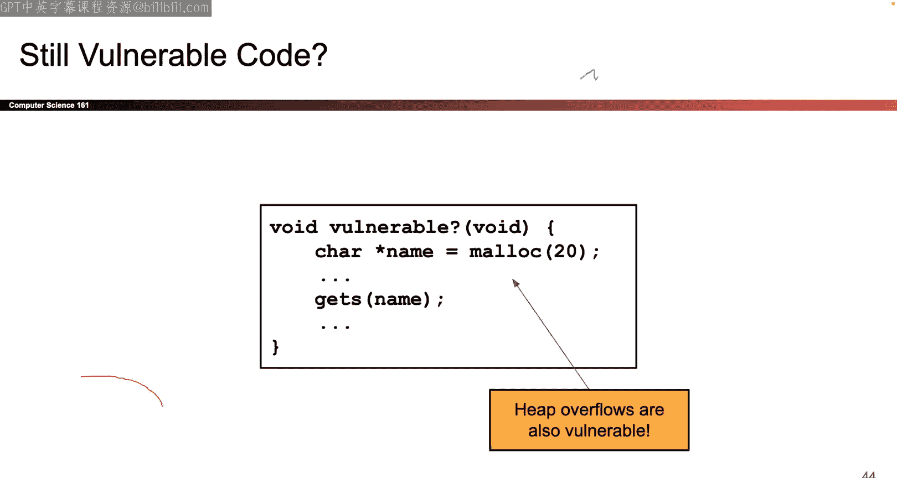
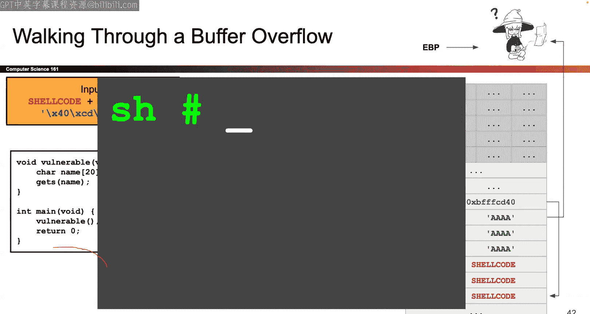
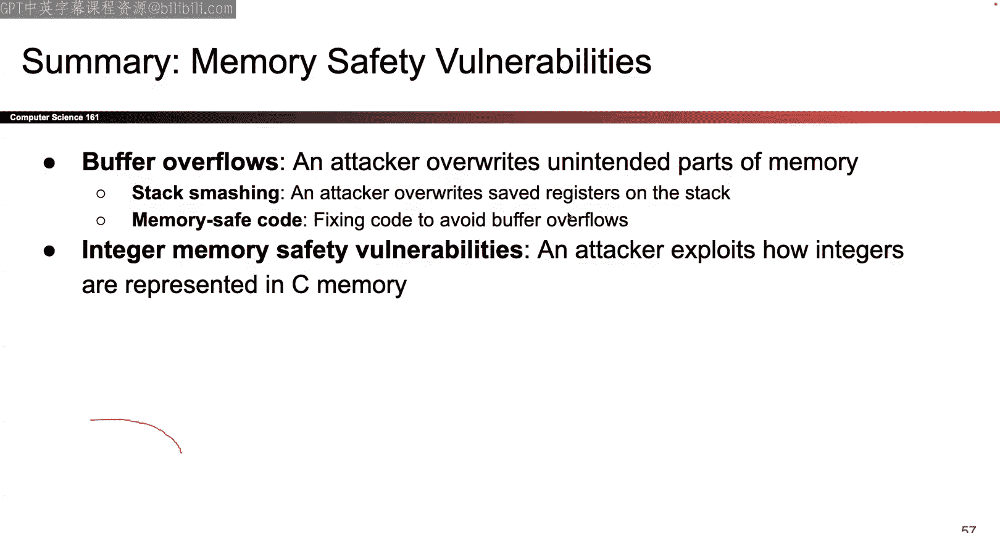

# 003：内存安全漏洞


## 概述
在本节课中，我们将要学习C语言程序中常见的内存安全漏洞。我们将从一个简单的类比开始，理解边界检查缺失的核心问题，然后深入探讨栈溢出攻击的原理、实现方式及其危害。最后，我们会了解整数溢出等其他相关漏洞。通过学习，你将理解为什么这些漏洞如此危险，以及它们在实际系统中如何被利用。

---


## 从机场终端到C语言：一个类比

上一节我们快速回顾了x86汇编中函数调用的基础知识。本节中，我们来看看如何利用C语言程序的漏洞发起攻击。

想象一下机场值机柜台使用的老旧电脑。当乘客输入姓名时，例如“Alice Smith”，信息会显示在终端上。但如果乘客不小心输入了过长的名字，比如“Alice Smith HHHHHHHH”，会发生什么？

由于这些老旧的系统没有在“姓名”行和“舱位等级”行之间设置明确的边界，过长的姓名会“溢出”到下一行，覆盖掉原本的“经济舱”信息。

这个类比的核心漏洞在于：**系统无法区分不同信息块之间的边界**。如果一段信息过长，它就会不受控制地流入相邻的区域。

事实证明，**C语言中也存在完全相同的边界缺失问题**。

---

## C语言中的边界缺失

C语言是一种底层语言，它赋予程序员直接操作硬件的权力。从C语言的视角来看，内存只是一个巨大的字节序列。它没有“这是一个数组的结束”或“那是另一个变量的开始”的概念。

以下是一个最基本的例子。假设我们有一个字符数组：
```c
char name[20];
```
如果我们尝试访问`name[25]`，C语言会怎么做？

它不会崩溃，也不会报错。在C语言看来，这完全是合法的语法。C编译器不关心数组的边界，就像老旧的机场电脑不关心你的姓名在哪里结束一样。从编译器的角度看，那里仍然有内存，所以它就把那个字节交给你。

这很糟糕，因为如果你的代码有错误，程序可能会以奇怪的方式运行。而对我们安全课程来说，我们要思考的是：**攻击者如何利用这个漏洞？**

---

## 利用 `gets` 函数

让我们看一个更有趣的例子，它使用了一个C标准库函数：`gets`。

`gets` 函数的作用是从用户那里收集输入。它会一直读取用户输入的字符，直到遇到换行符（即用户按下回车键），然后将这些字符写入传入的参数（一个内存地址）中。

关键问题在于：**`gets` 函数不知道应该在哪里停止写入**。它不会在写满20个字符后停止，它只会在用户按下回车键时停止。

考虑以下代码：
```c
char name[20];
char instructions[20] = "none";
gets(name);
```
我们来画一下内存布局图。假设每个“格子”代表4个字节：
```
[ 指令数组 instructions ] (20字节)
[ 姓名数组 name        ] (20字节)
```
当调用 `gets(name)` 时，C语言会说：“从`name`的地址开始写入”。它会将用户输入的第一个字符放在`name[0]`，第二个放在`name[1]`，依此类推。

但是，C语言无法知道`name`在哪里结束，`instructions`在哪里开始。如果用户输入超过20个字符，`gets`会继续向上（向更高内存地址）写入，覆盖掉`instructions`数组的内容。

例如，攻击者可以输入：“Alice Smith HHHHHHHH feed me lunch”。前20个字符‘H’会填满`name`数组，随后的字符“feed me lunch”就会覆盖`instructions`数组。

---

## 更危险的覆盖：权限变量

同样的漏洞可以用于覆盖更敏感的数据。假设我们有一个决定用户权限的变量：
```c
char name[20];
int authenticated = 0;
gets(name);
```
这里，`authenticated`变量可能用于控制访问权限（0表示未认证，1表示已认证）。

内存布局可能如下：
```
[ authenticated 变量 ] (4字节)
[ 姓名数组 name      ] (20字节)
```
如果攻击者输入超过20个字符，例如“Alice Smith HHHHHHHH\x01”，那么在第20个字符之后，他们可以写入一个字节`0x01`（数字1）。这样，原本为0的`authenticated`变量就被改成了1，攻击者可能因此获得未授权的特权访问。

---

## 覆盖命令字符串

攻击者还可以覆盖程序要执行的命令。考虑以下代码：
```c
char line[512];
char command[16] = "ls -l"; // 列出文件
gets(line);
// ... 后续代码执行 command
```
内存中，`command`数组紧挨着`line`数组。如果攻击者通过`gets(line)`输入超过512个字符，他们就可以覆盖`command`的内容。

攻击者可以将`command`从“ls -l”覆盖为“rm -rf /”（删除所有文件）或其他恶意命令。当程序后续执行这个命令时，就会造成破坏。

---

## 覆盖函数指针

一个更强大的攻击目标是**函数指针**。函数指针是存储在内存（通常是栈上）的一个地址，该地址指向一段可执行的代码。

考虑以下代码：
```c
char name[20];
void (*funcPtr)() = benignFunction; // 指向无害函数的指针
gets(name);
funcPtr(); // 通过指针调用函数
```
内存布局：
```
[ 保存的返回地址？] (稍后解释)
[ 函数指针 funcPtr ] (4字节)
[ 姓名数组 name    ] (20字节)
```
如果攻击者通过`gets(name)`输入足够长的数据，他们不仅可以覆盖`name`，还可以覆盖`funcPtr`。

攻击者可以将`funcPtr`的值覆盖为另一个函数的地址，例如一个恶意函数的地址。当程序执行`funcPtr()`时，它就会跳转到恶意函数并执行其中的代码。

你可能会觉得这个例子有点刻意，因为需要恰好把函数指针放在数组旁边。但事实上，**每个C程序都有一个极其重要的、类似函数指针的东西，而且它总是在栈上**。这就是我们接下来要讲的。

---

## 栈溢出攻击的核心：返回地址

在上一讲关于函数调用的内容中，我们了解到，当调用一个函数时，会在栈上创建一个新的栈帧。这个栈帧中包含了：
1.  函数的局部变量（例如我们的`name`数组）。
2.  函数的参数。
3.  **保存的帧指针（SFP）**：调用前`EBP`寄存器的值。
4.  **返回地址（RIP/EIP）**：调用后下一条要执行的指令的地址。

这个**返回地址**，本质上就是一个“函数指针”。当函数执行完毕准备返回时，处理器会从栈上取出这个地址，放回指令指针寄存器（EIP），然后跳转到那个地址继续执行。

因此，每个函数调用都会在栈上留下一个关键的“跳转目标”——返回地址。如果我们能覆盖它，就能控制程序接下来的执行流。

这就是**栈溢出攻击（Stack Smashing）**的核心。

---

## 栈溢出攻击实战

让我们构建一个具体的攻击。假设有以下易受攻击的函数：
```c
void vulnerable() {
    char name[20];
    gets(name);
}
```
当`vulnerable`函数被调用时，栈帧大致如下（地址从低到高增长）：
```
[ 返回地址 (RIP) ] <-- 函数返回时将跳转到这里
[ 保存的帧指针 (SFP) ]
[ 局部变量 name[20] ] <-- gets 开始写入的地方
```
攻击者的目标是：覆盖**返回地址（RIP）**，使其指向攻击者准备好的恶意代码（shellcode）。

攻击步骤：
1.  **放置Shellcode**：攻击者首先需要将一段恶意机器代码（shellcode）放入内存。这段代码可以执行任何操作，例如启动一个shell。
2.  **计算地址**：攻击者需要知道shellcode在内存中的确切地址。
3.  **构造输入**：攻击者通过`gets`函数输入一串精心构造的数据：
    *   前20个字节：填满`name`数组（可以用任意字符，如‘A’）。
    *   接下来4个字节：覆盖**保存的帧指针（SFP）**（同样用垃圾字符填充）。
    *   最后4个字节：覆盖**返回地址（RIP）**。这里要写入**shellcode的地址**。



由于`gets`会持续写入直到遇到换行符，攻击者可以输入足够长的字符串来完成这一切。



当`vulnerable`函数执行完毕并返回时，它会从栈上读取被覆盖的返回地址，然后跳转到shellcode所在的地址，从而执行攻击者的恶意代码。

**内存布局示例**：
```
[ RIP: 0xDEADBEEF (恶意地址) ] <-- 被覆盖
[ SFP: 0x41414141 (AAAA)     ] <-- 被覆盖
[ name: “AAAA...AAAA”        ] <-- 被填满
[ ... shellcode ...          ] <-- 可能也在栈上，在name之前或之后
```
（注意：地址`0xDEADBEEF`是示例，实际是shellcode的地址。另外，由于“小端序”字节序，地址在内存中可能是反向存储的。）

---

## 整数溢出漏洞

缓冲区溢出并不总是通过`gets`这样明显的函数发生。有时，它隐藏在整数运算中。

**例1：有符号/无符号不匹配**
```c
void copy_data(char *src, int length) {
    char buffer[64];
    if (length > 64) return; // 检查长度
    memcpy(buffer, src, length); // 复制
}
```
`memcpy`的第三个参数类型是`size_t`，这是一个**无符号**整数。而`length`参数是**有符号**的`int`。

如果攻击者传入`length = -1`：
*   `if (length > 64)` 检查：`-1 > 64`？**不成立**，所以不会提前返回。
*   调用`memcpy`时，有符号的`-1`被当作参数传递。但`memcpy`将其解释为无符号数，`-1`的二进制表示作为无符号数是一个巨大的正数（约42亿）。
*   结果：`memcpy`试图从`src`复制约42亿字节到只有64字节的`buffer`中，造成严重的缓冲区溢出。

**例2：整数环绕**
```c
void allocate_and_copy(unsigned int length) {
    char *buffer = malloc(length + 2); // 多分配2字节
    if (!buffer) return;
    memcpy(buffer, user_data, length);
}
```
如果攻击者传入`length = 0xFFFFFFFF`（最大的32位无符号整数）：
*   `length + 2` 会发生整数溢出。`0xFFFFFFFF + 1 = 0`，`0 + 1 = 1`。
*   `malloc(1)` 只分配了1字节的内存。
*   `memcpy(buffer, user_data, 0xFFFFFFFF)` 却试图复制海量数据到这个1字节的缓冲区，导致溢出。

这些漏洞表明，即使程序员试图进行边界检查，微妙的类型转换或整数运算错误也可能使检查失效。

---

## 现实世界的影响与总结

本节课中，我们一起学习了内存安全漏洞的基础。

我们从机场终端的类比开始，理解了边界缺失的核心问题。然后看到C语言由于其设计哲学（不进行运行时边界检查）而天然存在这个问题。

我们深入探讨了最经典的攻击方式——**栈溢出（Stack Smashing）**。通过覆盖栈上的返回地址，攻击者可以劫持程序的控制流，并执行自己注入的恶意代码（shellcode）。

此外，我们还了解了其他导致缓冲区溢出的途径，例如**有符号/无符号整数不匹配**和**整数溢出**。这些漏洞在真实世界的软件（如Linux内核）中屡见不鲜，并造成过严重的安全事件。

关键要点在于：C语言将内存安全的重担完全交给了程序员。虽然通过极度谨慎的编程（使用安全函数、仔细检查整数运算）可以避免这些漏洞，但在实践中，人类难免犯错，这使得内存安全漏洞长期位居最常见安全漏洞榜单前列。



在接下来的课程中，我们将继续探索更多类型的漏洞以及相应的防御机制。