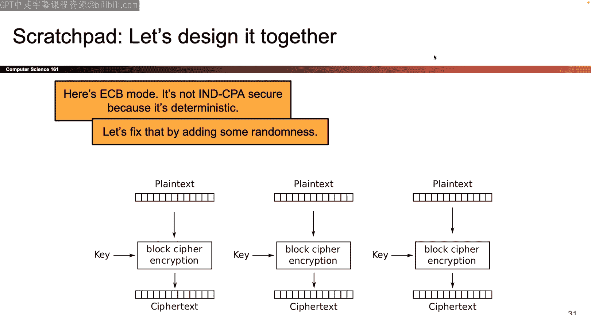

# 007：分组密码与一次性密码本


## 概述
在本节课中，我们将学习两种重要的加密方案：**一次性密码本**和**分组密码**。我们将从一次性密码本开始，探讨其完美的安全性以及在实际应用中的局限性。接着，我们将引入分组密码的概念，了解其作为现代加密核心构建模块的工作原理、安全属性以及其自身存在的限制。最后，我们会初步接触如何将分组密码组合成更强大的加密模式。

## 一次性密码本

上一节我们回顾了课程路线图，明确了今天将专注于对称密钥下的保密性目标。本节中，我们来看看第一个加密方案：一次性密码本。

在深入一次性密码本之前，我们需要快速回顾**按位异或**操作。

**按位异或**接收两个比特（0或1）作为输入，输出一个比特。其规则是：如果两个输入比特不同，则输出1；如果相同，则输出0。
```
0 XOR 0 = 0
0 XOR 1 = 1
1 XOR 0 = 1
1 XOR 1 = 0
```
以下是异或运算的一些有用性质：
*   **交换律**：`X XOR Y = Y XOR X`
*   **结合律**：`(X XOR Y) XOR Z = X XOR (Y XOR Z)`
*   **自反性**：`X XOR X = 0`
*   **恒等性**：`X XOR 0 = X`
*   **抵消性**：`X XOR Y XOR X = Y`。这个性质特别方便，因为两个相同的`X`会相互抵消。

关于异或运算另一个很酷的特性是，你可以在等式两边进行异或操作，等式依然成立。例如，如果 `y = x XOR 1`，那么两边同时异或1：`y XOR 1 = x XOR 1 XOR 1`。利用自反性，`1 XOR 1`抵消为0，于是得到 `y XOR 1 = x`。

现在，让我们正式介绍一次性密码本方案。对于任何加密方案，我们需要确定几件事：密钥是什么、如何加密以及如何解密。

在一次性密码本中：
*   **密钥**：一个与消息等长的、完全随机的比特序列（例如，通过反复抛硬币生成）。Alice和Bob都知道这个密钥。
*   **加密算法**：将消息`M`和密钥`K`进行**按位异或**。第一个消息比特与第一个密钥比特异或，得到第一个密文比特，依此类推。
    ```
    C = M XOR K
    ```
*   **解密算法**：Bob收到密文`C`后，利用他知道的密钥`K`，再次进行按位异或操作。
    ```
    M = C XOR K
    ```

我们需要验证这个方案是否总是有效。证明如下：
```
M_decrypted = C XOR K          // 解密定义
            = (M XOR K) XOR K  // 代入加密定义 C = M XOR K
            = M XOR (K XOR K)  // 结合律
            = M XOR 0          // 自反性：K XOR K = 0
            = M                // 恒等性
```
直观上，加密时异或一次`K`，解密时再异或一次`K`，两个`K`相互抵消，就得到了原始消息`M`。

接下来，我们需要评估其安全性。我们使用上节课定义的实验（游戏）来测试：攻击者Eve提供两个消息`M0`和`M1`，Alice随机选择其中一个加密后发送密文`C`给Eve，Eve需要猜出加密的是哪一个消息。如果Eve无论采用什么策略，猜对的概率都无法超过1/2，那么这个方案就是保密的。

对于一次性密码本，我们可以分析Eve可能采取的策略。假设真实世界是Alice加密了`M0`，那么`C = M0 XOR K`。Eve知道`C`和`M0`，她可以推导出 `K = C XOR M0`。同样，如果真实世界是Alice加密了`M1`，Eve可以推导出 `K = C XOR M1`。因此，Eve可以计算出两个可能的`K`值。

然而，关键在于密钥`K`是完全随机选择的。对于Eve计算出的两个可能的`K`值，她无法判断哪一个更可能是真实的密钥，因为两者在全体可能的密钥空间中出现的概率完全相同。因此，Eve没有获得任何额外信息来帮助她做出优于随机猜测的判断。这个粗略的证明草图表明，一次性密码本在使用正确时，不会泄露任何信息，是**完美安全**的。

既然一次性密码本如此完美，为什么我们不直接使用它呢？问题在于其使用规则：**每次加密新消息都必须使用一个全新的、与消息等长的随机密钥**。这带来了两个主要问题：
1.  **密钥分发困难**：Alice和Bob每次通信前都需要安全地共享一个新的长密钥。如果他们已经有能力安全共享这个密钥，为什么不直接共享消息本身呢？这显得多此一举。
2.  **不切实际**：为每条消息生成并分发新密钥的效率极低，不适合现代通信。

因此，一次性密码本虽然在理论上完美，但在实践中很少使用，通常只出现在历史场景（如冷战时期的间谍活动）中。

最后，我们必须强调一次性密码本的一个致命禁忌：**绝对不要重复使用密钥**。如果使用同一个密钥`K`加密两个不同的消息`M0`和`M1`，攻击者Eve将获得两个密文：
```
C0 = M0 XOR K
C1 = M1 XOR K
```
如果Eve将两个密文异或：
```
C0 XOR C1 = (M0 XOR K) XOR (M1 XOR K) = M0 XOR M1
```
攻击者由此得到了`M0 XOR M1`。这泄露了两个原始消息中哪些比特相同、哪些比特不同的信息，严重破坏了保密性。这种使用相同密钥两次的方案被称为“两次密码本”，是不安全的。

## 分组密码

由于一次性密码本不实用，我们需要寻找更实用的加密方案。本节中我们来看看**分组密码**，它是构建现代加密方案的核心模块。

分组密码仍然属于对称密钥加密的范畴，其目标是保密性。它定义了一族函数，包含一个加密算法`E`和一个解密算法`D`。

一个分组密码由以下要素定义：
*   **固定长度的密钥**：长度为`k`比特。一旦选定算法，`k`就固定了（例如128位）。
*   **固定长度的明文分组**：长度为`n`比特（例如128位）。明文必须恰好是`n`比特才能被加密。
*   **加密算法** `E`：接收密钥`K`和明文`M`，输出密文`C`。
    ```
    C = E(K, M)
    ```
*   **解密算法** `D`：接收密钥`K`和密文`C`，输出原始明文`M`。
    ```
    M = D(K, C)
    ```
    正确性要求：对于所有密钥`K`和明文`M`，都有 `D(K, E(K, M)) = M`。

理解分组密码的另一种方式是将`E`看作一个**函数族**。每个特定的密钥`K`选择出族中的一个特定函数`E_K`。一旦固定了`K`，`E_K`就变成了一个接收`n`比特输入、产生`n`比特输出的函数。

### 正确性：双射要求
要使解密正常工作，对于每个固定的密钥`K`，加密函数`E_K`必须是一个**双射**（或称置换）。这意味着：
*   **单射**：不同的明文必须映射到不同的密文。如果`M1 ≠ M2`，则`E_K(M1) ≠ E_K(M2)`。
*   **满射**：每个可能的`n`比特密文都必须是某个明文的加密结果。

双射保证了每个密文都能被**唯一地**解密回其对应的明文。如果函数不是双射（例如，两个不同的明文映射到同一个密文），那么解密时就会产生歧义，无法确定原始明文是哪一个。

### 安全性：伪随机置换
分组密码的安全性要求是：对于不知道密钥`K`的攻击者来说，函数`E_K`的行为应该**看起来像一个完全随机的双射**。

我们可以通过一个“区分游戏”来形式化这个想法：
1.  挑战者随机选择一把密钥`K`，计算函数`E_K`（通过运行算法代码）。
2.  挑战者另外纯粹随机地生成一个双射函数`F`（随机排列所有输入到输出的箭头）。
3.  挑战者将这两个函数（一个来自`E_K`，一个来自随机生成）提供给攻击者Eve。
4.  Eve的目标是区分哪个函数是`E_K`，哪个是随机函数。

如果对于所有高效的Eve，她正确区分的概率都无法显著超过1/2（即随机猜测），那么我们就说这个分组密码是一个**伪随机置换**。这意味着，尽管`E_K`是确定性的算法，但在不知道`K`的观察者眼中，其输入输出关系是无法预测的，就像是随机排列的一样。

一个直接的攻击方法是**暴力破解密钥**：尝试所有可能的`K`，计算对应的`E_K`，看哪一个与挑战者给出的函数匹配。如果密钥长度是`k`比特，那么需要尝试`2^k`次。对于现代常用的`k=128`，`2^128`是一个天文数字，在宇宙寿命内都无法完成计算。因此，只要密钥足够长（如128位或256位），暴力攻击在实践中是不可行的。

### 效率与实例
分组密码还需要是高效的，意味着加密和解密操作应该足够快，以便在实际中使用。现代分组密码通常使用在处理器上成本低廉的操作，如异或、比特移位、查表等。

一个著名的分组密码实例是**高级加密标准**（AES）。它是在一场公开竞赛中胜出的算法。AES有几种变体，主要区别在于密钥长度（AES-128, AES-192, AES-256），但其分组长度固定为128比特。AES内部进行了多轮的字节替换、行移位、列混合和轮密钥加操作，这些操作混合了明文和密钥的比特，使得最终的置换看起来是随机的。尽管AES没有形式化的安全证明，但经过20多年的广泛分析和应用，尚未发现有效的攻击方法，因此被全球广泛信任和使用。

## 分组密码的局限性

上一节我们介绍了强大的分组密码，但分组密码本身就能提供我们想要的保密性吗？本节中我们来看看分组密码单独使用时面临的挑战。

我们使用之前定义的CPA保密性游戏来测试分组密码（例如AES）：
1.  Eve可以查询加密预言机（使用固定但未知的密钥`K`）。
2.  Eve提交两个明文`M0`, `M1`。
3.  挑战者随机选择`b ∈ {0,1}`，加密`C* = E_K(M_b)`并发送给Eve。
4.  Eve可以继续查询加密预言机（但不能查询`C*`的解密）。
5.  Eve输出对`b`的猜测。

**攻击策略**：由于分组密码是**确定性的**（相同的密钥和明文总是产生相同的密文），Eve可以轻松赢得这个游戏：
*   在步骤2，她提交`M0`和`M1`。
*   在步骤4，她简单地请求加密预言机为她加密`M0`和`M1`，得到`C0 = E_K(M0)`和`C1 = E_K(M1)`。
*   她将收到的挑战密文`C*`与`C0`和`C1`比较。哪个匹配，`b`就是哪个。

Eve总是能赢，因为确定性加密泄露了信息：如果攻击者看到两个相同的密文，他就知道对应的明文也相同。这不符合我们对保密性的要求——攻击者不应该学到任何关于明文的信息，包括它们是否相同。

因此，**任何确定性的加密方案都无法通过CPA保密性游戏**。分组密码本身是确定性的，所以它不满足CPA安全。

此外，分组密码还有另一个实际限制：它只能加密**固定长度**的分组（如AES是128位）。对于更短或更长的消息，它无法直接处理。

## 构建更好的方案：加密模式初探

既然分组密码本身不够用，但又是很好的构建模块，我们该如何利用它呢？本节中我们初步探索如何将分组密码组合起来，形成**加密模式**，以加密任意长度的消息并尝试引入随机性。

最简单的想法是**电子密码本**模式：
1.  将长消息分割成若干个长度为`n`（分组长度）的块：`M1, M2, ..., Ml`。
2.  用同一个密钥`K`，独立地加密每个块：`Ci = E_K(Mi)`。
3.  将所有密文块连接起来作为最终密文。

然而，ECB模式仍然是**确定性的**。相同的明文块会产生相同的密文块。这不仅导致它在CPA游戏中失败，在实际中也会泄露模式信息。一个著名的例子是加密一张图片（如企鹅），由于相同颜色的像素块被加密成相同的密文块，加密后的图像仍然会显示出原始图像的轮廓。

ECB模式的不安全性告诉我们，仅仅使用分组密码并分割消息是不够的。我们需要引入**随机性**来打破确定性。但需要注意的是，简单地添加随机性（例如在密文末尾附加随机数据）并不能自动保证安全。随机性必须以智能的方式融入加密过程，才能实现CPA安全。

我们将在接下来的课程中学习如何通过更复杂的加密模式（如CBC、CTR等）来正确地引入随机性或“新鲜值”，从而构建出真正满足CPA安全要求的加密方案。

## 总结
本节课中我们一起学习了：
1.  **一次性密码本**：一个理论上完美安全的方案，通过明文与随机密钥的异或实现。但其要求每次加密使用全新的、等长的密钥，导致密钥分发不切实际，且密钥重用会完全破坏安全性。
2.  **分组密码**：一个固定密钥长度、固定分组长度的加密函数族（如AES）。其核心安全属性是**伪随机置换**——对于不知密钥者，其行为如同随机排列。分组密码是高效且被广泛分析的。
3.  **分组密码的局限性**：由于其**确定性**，单独使用的分组密码无法通过CPA保密性安全游戏，因为攻击者可以通过重加密来区分消息。此外，它只能处理固定长度的分组。
4.  **加密模式初探**：我们看到了最简单的ECB模式，它通过分割和独立加密来处理长消息，但因其确定性同样不安全。这引出了对需要引入随机性的、更安全的加密模式的需求。



我们了解到，虽然一次性密码本和基础的分组密码各有其优点和缺陷，但它们为构建现代实用的加密方案奠定了重要的理论基础。在接下来的课程中，我们将基于分组密码，探索如何构造能够抵抗更强攻击（如CPA攻击）的加密模式。