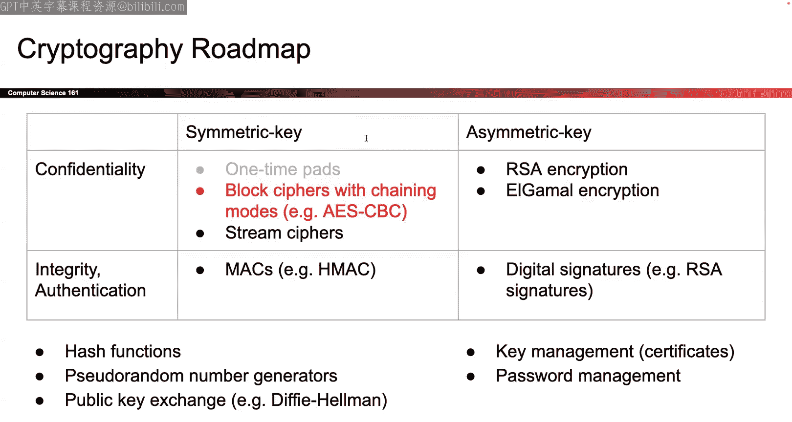

# 008：分组密码操作模式 🛡️

在本节课中，我们将要学习如何利用分组密码来加密比单个分组更长的消息。我们将探讨两种主要的操作模式：密码分组链接（CBC）模式和计数器（CTR）模式。这两种模式都通过引入随机性来解决确定性加密方案的安全问题，从而实现不可区分的选择明文攻击（IND-CPA）安全。

---

## 分组密码回顾 🔄

上一节我们介绍了分组密码的基本概念，本节中我们来看看如何将其应用于实际加密。

分组密码接收一个固定长度的密钥（K位）和一个固定长度的明文（M位），经过一系列混淆操作后，输出一个密文。我们可以将其视为一个函数族：一旦选定密钥，它就定义了一个从明文到密文的映射。

分组密码的安全性定义是：如果攻击者无法区分分组密码的输出与一个随机排列的输出，那么该分组密码就是安全的。然而，这并不意味着它自动满足我们最终想要的IND-CPA安全。因为分组密码是确定性的：加密相同明文五次会得到完全相同的密文五次。这正是我们今天要解决的问题。

---

## 电子密码本（ECB）模式及其问题 ❌

我们首先看到一种简单的可能性：如果消息更长，可以简单地多次使用分组密码。这被称为ECB模式。

**过程如下：**
1.  使用相同的密钥。
2.  将消息分割成块。
3.  将每个块分别通过分组密码加密。
4.  将所有密文块连接起来，得到最终密文。

**公式表示：**
对于消息块 `M1, M2, ..., Mn`，密文 `Ci = E_K(Mi)`，最终密文为 `C1 || C2 || ... || Cn`。

但ECB模式不是IND-CPA安全的。因为它仍然是确定性的：如果你加密相同的东西10次，你会得到相同的输出10次。我们之前看到的企鹅图片加密后轮廓依然可见，就证明了这一点。所以我们需要改进它。

---

## 引入随机性：密码分组链接（CBC）模式 🧩

我们已经知道，确定性的方案是行不通的，因为加密相同明文两次会得到相同密文，这会使攻击者在IND-CPA游戏中获胜。因此，我们需要在方案中引入随机性，使得加密相同明文两次时，输出看起来每次都不同。

以下是CBC模式的核心思想：

1.  **初始化向量（IV）**：首先，选取一个随机值，称为初始化向量（IV）。这是一个“花哨的术语”，指的是一串随机比特。
2.  **处理第一个块**：将第一个明文块与IV进行异或（XOR）操作，然后将结果输入分组密码进行加密，得到第一个密文块。
3.  **链式处理**：对于后续的每个明文块，将其与前一个密文块进行异或操作，然后再进行加密。
4.  **输出**：将所有密文块连接起来，同时**必须将IV作为密文的一部分发送**，否则接收方无法解密。

**加密公式：**
设消息被分割为块 `M1, M2, ..., Mn`，IV为 `C0`。
对于 `i = 1` 到 `n`：
`Ci = E_K(Mi XOR C_{i-1})`
最终密文为：`IV (C0) || C1 || C2 || ... || Cn`

**解密公式：**
接收方已知IV（即 `C0`）和所有密文块 `Ci`。
对于 `i = 1` 到 `n`：
`Mi = D_K(Ci) XOR C_{i-1}`
其中 `D_K` 是分组密码的解密函数。

**解密原理说明：**
解密时，我们首先用密钥解密当前密文块，得到 `Mi XOR C_{i-1}`，然后再与 `C_{i-1}` 异或，即可恢复明文 `Mi`。因为异或操作的性质：`(A XOR B) XOR B = A`。

**为什么需要发送IV？**
接收方需要知道加密时使用的随机值（IV），才能通过异或操作“抵消”掉它，从而恢复原始明文。从解密公式也可以看出，计算 `M1` 时需要用到 `C0`（即IV）。

---

### CBC模式的特性分析 ⚙️

在深入安全讨论前，我们先分析CBC模式的一些操作特性。

**效率与并行性：**
*   **加密不可并行**：要加密第 `i` 个块，必须等待第 `i-1` 个块加密完成，以获取其密文 `C_{i-1}` 用于异或。因此，加密过程是串行的。
*   **解密可以并行**：解密任何块 `Mi` 时，只需要当前密文块 `Ci` 和前一个密文块 `C_{i-1}`。由于所有密文在解密开始时都已获得，因此所有块可以同时独立解密。

**填充（Padding）：**
分组密码要求输入长度固定（例如128位）。如果消息总长度不是分组长度的整数倍，最后一个块就不完整，无法直接加密。
*   **解决方法**：在消息末尾添加额外的字节（即填充），使其长度达到分组长度的整数倍。
*   **注意事项**：填充方案必须设计得当，使得接收方在解密后能够明确无误地识别并移除填充部分，还原出原始消息。简单地填充零或一可能造成歧义。这将在作业中深入探讨。

---

### CBC模式的安全性 🔒

我们不会在此进行形式化证明，但可以描述其安全性的直观理解和关键前提。

**安全性的直观论证：**
CBC模式的安全性依赖于分组密码的一个核心性质：对于不知道密钥的攻击者，分组密码的输出看起来是随机的、不可预测的。在CBC链中，每个密文块的输出都作为随机化要素输入到下一个块的加密中。即使攻击者知道公开的IV，只要他不知道密钥，就无法预测任何分组密码的输出，从而无法获得关于明文的任何信息。

**关键安全前提：IV必须是随机且不可预测的，并且每次加密都必须使用新的IV。**

**IV重用会带来严重问题：**
1.  **相同消息**：如果使用相同IV加密相同消息，会得到相同的密文，直接泄露了“消息重复”这一信息。
2.  **不同消息**：即使消息不同，重用IV也会泄露信息。考虑两个消息，它们的前几个块相同。如果使用相同IV加密它们，由于CBC的链式结构，在第一个出现差异的块之前，所有对应的密文块都将是相同的。攻击者通过观察密文，就能推断出“这两个消息的前面部分相同”。

**总结**：CBC模式在正确使用时（随机且唯一的IV）是IND-CPA安全的。它解决了ECB模式的确定性缺陷，但加密过程无法并行化。

---

## 另一种思路：计数器（CTR）模式 🎯

上一节我们介绍了通过链式结构引入随机性的CBC模式，本节中我们来看看一种完全不同的、受一次性密码本启发的模式。

我们回想一次性密码本（OTP）具有完美的保密性，但其核心问题在于密钥不能重用，且长密钥难以安全分发。CTR模式的灵感在于：**能否用分组密码来廉价地生成大量看似随机的“一次性密码本密钥”？**

答案是肯定的。因为对于不知道密钥的攻击者，分组密码的输出是随机的。

**CTR模式加密过程：**
1.  **随机数（Nonce）**：选取一个随机值，称为Nonce（作用类似于IV，但有时要求略有不同，本课程中可互换使用）。
2.  **生成密钥流**：将 `Nonce || 计数器` 作为输入，用分组密码加密。计数器通常从0开始递增。
    *   即：`Pad_i = E_K(Nonce || i)`，其中 `i=0,1,2,...`
    *   每个 `Pad_i` 在攻击者看来都是随机的比特串。
3.  **执行“一次性密码本”加密**：将生成的每个 `Pad_i` 与对应的明文块 `Mi` 进行异或，得到密文块 `Ci`。
    *   `Ci = Mi XOR Pad_i`
4.  **输出**：发送Nonce和所有密文块。

**CTR模式解密过程：**
解密过程与加密过程完全对称！
1.  接收方收到Nonce和密文。
2.  使用相同的密钥，用完全相同的步骤重新生成密钥流 `Pad_i = E_K(Nonce || i)`。
3.  将密文块 `Ci` 与 `Pad_i` 异或，恢复明文块 `Mi`。
    *   `Mi = Ci XOR Pad_i`

**注意**：在CTR模式中，分组密码**始终运行在加密模式**，无论是加密还是解密。因为它在这里的角色不是直接加密消息，而是生成伪随机的密钥流。

---

### CTR模式的特性分析 ⚙️

**并行性：**
*   **加密和解密都可以高度并行**：因为每个 `Pad_i` 的生成只依赖于Nonce和计数器 `i`，与明文或其他密文无关。所有块的处理都可以同时独立进行。

**填充：**
*   **无需特殊填充**：如果最后一个明文块不完整（比如只有半块数据），在生成对应 `Pad_i` 后，只取 `Pad_i` 的前半部分与半块明文异或即可。多余的 `Pad_i` 比特直接丢弃。接收方执行相同操作。这比CBC模式需要填充更加灵活。

**安全性：**
*   **核心前提**：Nonce必须是随机且唯一的。
*   **Nonce重用的灾难性后果**：如果重用Nonce，意味着两次加密使用了完全相同的密钥流 `Pad_i`。那么，攻击者获得两个密文 `C1 = M1 XOR Pad` 和 `C2 = M2 XOR Pad` 后，可以计算 `C1 XOR C2 = (M1 XOR Pad) XOR (M2 XOR Pad) = M1 XOR M2`。这直接泄露了两个明文的异或值，结合自然语言统计特性，很可能恢复出明文本身。这比CBC模式下的IV重用后果更严重。

**CTR模式总结**：它本质上是一个使用分组密码生成密钥流的一次性密码本变体。它具有并行性好、无需填充的优点，但Nonce重用会导致完全的安全崩溃。

---

## 操作模式对比与总结 📊

本节课我们一起学习了两种重要的分组密码操作模式。

**CBC与CTR模式对比：**
| 特性 | CBC模式 | CTR模式 |
| :--- | :--- | :--- |
| **核心思想** | 通过密文反馈链引入随机性 | 用分组密码生成伪随机密钥流，模拟OTP |
| **加密并行性** | 否（串行） | 是（高度并行） |
| **解密并行性** | 是 | 是 |
| **填充** | 需要 | 不需要 |
| **IV/Nonce重用后果** | 泄露消息前缀相等性等信息 | 灾难性，导致密钥流重用，明文可能被恢复 |
| **常用场景** | 历史较长，应用广泛 | 现代协议中更常见，因其效率和灵活性 |

**至关重要的共同点：**
1.  **随机性来源**：两者都通过IV/Nonce引入加密所需的随机性。
2.  **安全使用前提**：**IV/Nonce必须每次加密都随机生成且唯一**。这是实现IND-CPA安全的生命线。
3.  **仅提供保密性**：这两种模式**只解决了保密性（Confidentiality）问题**，即防止窃听者Eve读取内容。它们**并不提供完整性（Integrity）或真实性（Authenticity）**。这意味着攻击者Mallory可以在传输途中修改密文，而接收方Bob无法察觉。我们将在后续课程中解决这个问题。

**最后的提醒：**
引入随机性是获得IND-CPA安全的必要条件，但并非充分条件。必须像CBC或CTR那样，以精心设计的方式利用随机性。仅仅在方案中加入“随机”二字，并不保证其安全。