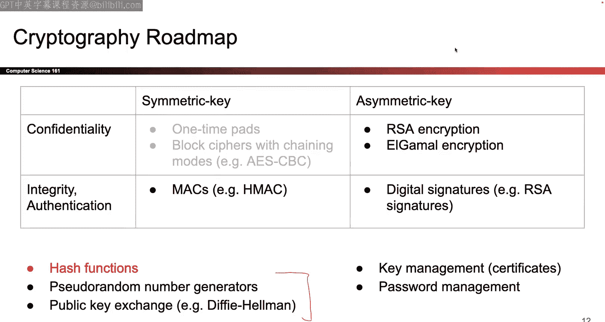

# 009：密码学哈希与消息认证码


## 概述
在本节课中，我们将要学习如何确保消息的完整性。我们将从密码学哈希函数开始，了解其作为构建模块的特性，然后利用它来构建消息认证码算法，最终实现既能保证消息机密性又能保证消息完整性的认证加密方案。

---

## 哈希函数：数字指纹

上一节我们介绍了用于保证消息机密性的加密方案。本节中，我们来看看如何保证消息的完整性。首先，我们需要一个基础工具：密码学哈希函数。

密码学哈希函数 `H` 接受一个任意长度的输入 `M`，并输出一个固定长度 `n` 比特的字符串。其形式化定义如下：
```
H: {0, 1}* -> {0, 1}^n
```
哈希函数是确定性的，即相同的输入总是产生相同的输出。同时，计算过程是高效的。

### 核心安全属性
哈希函数之所以有用，是因为它具备以下三个关键的安全属性：

1.  **单向性**：给定一个哈希输出 `y = H(x)`，对于攻击者而言，在计算上不可行地找到**任何**输入 `x'`，使得 `H(x') = y`。这就像我给你一个指纹，你无法找出拥有这个指纹的人是谁。
2.  **抗碰撞性**：对于攻击者而言，在计算上不可行地找到两个不同的输入 `x` 和 `x'`，使得 `H(x) = H(x')`。这就像你无法找到两个拥有完全相同指纹的人。
3.  **雪崩效应**：输入 `M` 中任何微小的改变（即使只改变一个比特），都会导致输出哈希值发生不可预测的、巨大的变化。大约一半的输出比特会翻转。

### 常见哈希函数示例
以下是历史上出现的一些哈希函数：
*   **MD5**：输出128比特。**已被攻破**，不应在任何安全场景中使用。
*   **SHA-1**：输出160比特。**已被攻破**，不应使用。
*   **SHA-2**：一个算法家族，输出长度可选（如256, 512比特）。目前仍被认为是安全的，但需注意“长度扩展攻击”。
*   **SHA-3**：较新的标准，设计上有所不同。

### 哈希能提供完整性吗？
在某些受控场景下，哈希可以用于验证完整性。例如，软件发布者可以计算其程序的哈希值并公开发布。用户下载程序后，自行计算哈希并与官方值比对。如果一致，则说明文件未被篡改。

然而，在经典的通信模型中，**仅靠哈希无法提供完整性**。考虑爱丽丝向鲍勃发送消息 `(M, H(M))`。攻击者马洛里可以截获消息，将 `M` 替换为她自己的 `M'`，并计算 `H(M')` 发送给鲍勃。鲍勃验证 `H(M') == H(M')` 会通过，从而接受了被篡改的消息。问题的关键在于，**哈希算法是公开的，任何人都能计算任何消息的哈希值**，缺乏秘密成分来阻止伪造。

---

## 消息认证码：带密钥的哈希

既然单独的哈希不够，我们需要引入秘密成分。这就是消息认证码。MAC 算法使用一个共享的密钥 `K` 来为消息 `M` 生成一个认证标签 `Tag`。

MAC 算法也是确定性的。验证算法通常是重新计算 MAC 并检查标签是否匹配。

### EUF-CMA 安全：MAC 的安全目标
我们通过一个“游戏”来形式化定义 MAC 的安全性，称为“存在性不可伪造性 under 选择消息攻击”。

1.  **学习阶段**：攻击者马洛里可以反复查询一个“预言机”：提交任何消息 `M_i`，并获得对应的有效标签 `Tag_i = MAC(K, M_i)`。
2.  **挑战阶段**：最终，马洛里输出一个消息-标签对 `(M*, Tag*)`。
3.  **获胜条件**：如果 `Tag*` 是 `M*` 的有效 MAC 标签，并且 `M*` 从未在**学习阶段**被查询过，则攻击者获胜。

一个安全的 MAC 算法要求，即使攻击者拥有上述强大的查询能力，其获胜的概率也**可以忽略不计**（接近于零）。

### HMAC：一个具体的 MAC 构造
HMAC 是一个广泛使用的 MAC 算法，它基于一个密码学哈希函数 `H`（如 SHA-256）构建。其核心思想是：**将密钥与消息混合后再进行哈希**，使得不知道密钥的攻击者无法伪造有效的标签。

HMAC 的简化构造思想如下（实际构造更复杂以抵御长度扩展攻击）：
```
HMAC(K, M) = H( (K ⊕ opad) || H( (K ⊕ ipad) || M ) )
```
其中 `opad` 和 `ipad` 是固定的常量。本质上，HMAC 的安全性可以归约到其底层哈希函数的安全性：如果能攻破 HMAC，就能攻破底层的哈希函数。

### MAC 提供的安全属性
*   **完整性**：是的。在共享密钥的双方之间，HMAC 能有效保证消息不被篡改。
*   **真实性**：在只有两方共享密钥的场景下，是的。因为能生成有效标签的人必定是拥有密钥的其中一方（爱丽丝或鲍勃）。如果多方共享密钥，则只能确定消息来自这个团体，无法确定具体发送者。
*   **机密性**：**不提供**。MAC 的输出可能会泄露关于消息 `M` 的信息。MAC 的安全定义并不包含保密性要求。

---

## 认证加密：同时获得机密性与完整性

现在，我们手头有了两种工具：
1.  加密方案（如 AES-CBC）：提供**机密性**，但不提供完整性。
2.  MAC 方案（如 HMAC）：提供**完整性和真实性**，但不提供机密性。

我们的目标是同时获得两者。有两种主要思路：组合现有方案，或设计全新的方案。

### 思路一：组合加密与 MAC
以下是两种直观的组合方式：

**1. 加密然后认证**
1.  加密：`C = Encrypt(K_enc, M)`
2.  认证：`T = MAC(K_mac, C)`
3.  发送：`(C, T)`

**2. 认证然后加密**
1.  认证：`T = MAC(K_mac, M)`
2.  加密：`C = Encrypt(K_enc, (M, T))`
3.  发送：`C`

#### 为何“加密然后认证”更优？
关键在于接收者鲍勃的验证顺序。
*   在“认证然后加密”方案中，鲍勃必须先**解密** `C` 得到 `(M, T)`，然后才能验证 MAC `T`。这意味着攻击者可以发送任意伪造的密文，**鲍勃都会先用密钥解密它**。这可能会在解密环节引入新的侧信道攻击或漏洞。
*   在“加密然后认证”方案中，鲍勃先验证密文 `C` 上的标签 `T`。只有验证通过后，他才会解密 `C`。这避免了攻击者强迫接收者解密任意数据的能力。

因此，**“加密然后认证”是更稳健、更推荐的方式**。

#### 密钥复用警告
在组合方案中，一个至关重要的原则是：**不要在不同算法间复用同一个密钥**。即，加密密钥 `K_enc` 和 MAC 密钥 `K_mac` 应该是两个独立生成的密钥。

原因在于，不同算法（如 AES 和 HMAC）的内部操作可能以意想不到的方式相互作用，如果使用相同密钥，可能导致原本安全的组件组合在一起变得不安全。为简化分析、避免此类潜在风险，最佳实践总是为不同用途使用独立密钥。

### 思路二：认证加密原语
除了组合方案，密码学家还设计了专门的**认证加密**算法，如 AES-GCM、ChaCha20-Poly1305。这些算法在一个统一的框架内，同时提供机密性、完整性和真实性。

**优点**：使用单一算法和密钥，简化了操作，通常性能也更高。
**缺点**：如果算法实现或使用不当（如 IV 复用），可能同时丧失所有安全属性。

在实践中，基于组合的“加密然后认证”和使用认证加密原语都是可行的选择，选择哪一种取决于具体的应用场景、性能要求和实现复杂度。

---

## 总结
本节课中我们一起学习了如何为通信提供完整性保护。

1.  我们首先引入了**密码学哈希函数**，它能够为任意数据生成一个固定长度的“指纹”，并具备单向性、抗碰撞性和雪崩效应等安全属性。但哈希本身无法在开放信道中防止消息被篡改。
2.  为了引入对抗篡改的秘密能力，我们定义了**消息认证码**。MAC 使用共享密钥为消息生成认证标签，其安全性由 EUF-CMA 游戏定义。我们介绍了 **HMAC** 这一具体构造，它将密钥与消息混合后哈希，从而提供完整性和真实性（在两方场景下），但不提供机密性。
3.  最后，为了同时满足机密性和完整性，我们探讨了**认证加密**。我们比较了“加密然后认证”和“认证然后加密”两种组合方式，指出前者因验证优先而更安全，并强调了**避免在不同算法间复用密钥**的重要性。此外，我们还简要介绍了专为认证加密设计的原语。



至此，我们拥有了保护通信机密性与完整性的全套工具。在接下来的课程中，我们将探索更多的安全主题。