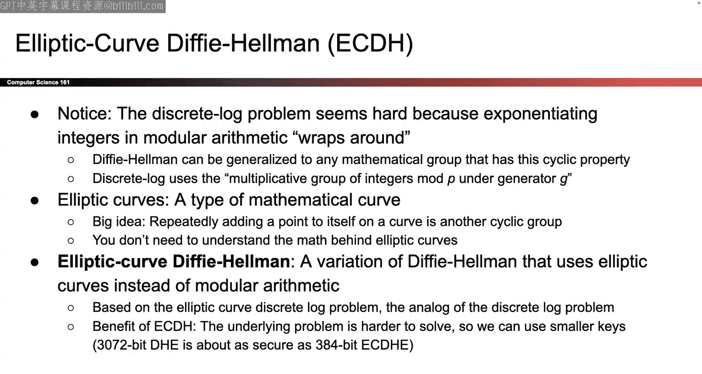

# 010：伪随机数生成器与迪菲-赫尔曼密钥交换

在本节课中，我们将学习两个关键概念：如何安全地生成随机数，以及通信双方如何在不安全的信道上协商出一个共享的密钥。这两个问题是我们之前课程中多次提及但尚未解答的。首先，我们将探讨伪随机数生成器，这是一种利用少量真随机性生成大量看似随机数据的算法。接着，我们将深入迪菲-赫尔曼密钥交换协议，它解决了爱丽丝和鲍勃如何神奇地获得共享密钥的问题。

---

## 伪随机数生成器

上一节我们讨论了哈希函数和消息认证码，它们用于确保消息的完整性和真实性。本节中，我们来看看密码学中另一个基础需求：随机性。许多密码学方案，如初始化向量和密钥，都需要随机值。但如何在计算机中安全地生成这些随机数呢？

### 随机性的含义与熵

首先，我们需要明确“随机”在密码学中的具体含义。它意味着生成的数值是不可预测的。为了更精确地衡量不可预测性，我们引入**熵**的概念。熵衡量了攻击者猜测某个值的困难程度。

*   **高熵**：事件结果难以猜测。例如，一枚公平的硬币（正反面概率各50%）具有高熵。
*   **低熵**：事件结果相对容易猜测。例如，一枚99%概率正面、1%概率反面的硬币具有低熵。

熵的单位通常是比特。一次公平的抛硬币事件大约提供**1比特**的熵。如果熵源质量差，整个密码系统可能会被破坏。

### 真随机数的生成

在计算机中生成真正的随机数，必须依赖物理世界中的不可预测事件。以下是几种方法：

*   设计专门产生不可预测输出的电路。
*   测量极细微的时间尺度事件，例如按下键盘的精确微秒。
*   利用用户行为，如鼠标移动轨迹。

然而，物理熵源可能存在**偏差**（例如，鼠标移动可能更倾向于某个方向），导致熵值降低。解决方法是**组合多个熵源**，将它们的熵值相加，从而获得更高的总体不可预测性。

但真随机数生成成本高昂且速度慢。我们需要一种更廉价、高效的方法来生成大量“随机”数据。

### 伪随机数生成器

这就是**伪随机数生成器**的用武之地。PRNG是**确定性算法**，其内部操作是可预测的，但它的输出在攻击者看来是随机的。其核心思想是：输入少量真随机数作为“种子”，通过算法扩展出大量看似随机的输出。

我们可以将PRNG视为一个具有三个方法的对象：

1.  **`seed`**：用真随机比特初始化PRNG的状态。
2.  **`reseed`**：在后续阶段注入更多真随机性。
3.  **`generate`**：生成伪随机比特序列。

PRNG的正确性要求它高效且安全。安全性主要体现在其输出应满足以下性质：

#### 计算不可区分性

一个安全的PRNG，其输出应与真随机序列在计算上不可区分。我们可以通过一个游戏来定义：

*   **挑战者**生成两个序列：一个来自真随机源（如抛硬币），另一个来自PRNG（使用未知种子）。
*   **攻击者**的目标是区分哪个序列来自PRNG。

如果攻击者无法以显著高于随机猜测（50%）的概率成功区分，则称该PRNG是**计算不可区分于随机**的。

另一种等价的定义是：即使攻击者知道PRNG之前生成的部分输出，也无法预测其**未来的**输出。

#### 回滚抵抗性

这是一个额外的、理想的安全属性。它意味着即使攻击者在某个时间点**完全掌握了PRNG的内部状态**，也无法逆向推导出**之前**生成的随机数。并非所有安全PRNG都具备此属性，但它能提供更强的安全保障。

### HMAC_DRBG：一个PRNG实例

一个常见的PRNG构造是**HMAC_DRBG**。其核心思想是反复调用HMAC函数来生成随机序列。

1.  使用种子初始化一个密钥`K`和值`V`。
2.  每次生成输出时，计算 `V = HMAC(K, V)`，并将`V`（或部分）作为输出。
3.  同时更新`K`为 `HMAC(K, V || 0x00)`，为下一次生成做准备。

由于其基于HMAC，而HMAC的输出在不知道密钥的情况下是难以预测的，因此可以证明HMAC_DRBG是安全的。同时，由于哈希函数的单向性，攻击者无法从当前状态回推出之前的状态，因此它也具备**回滚抵抗性**。

**重要提示**：必须使用经过严格安全分析的PRNG。历史上，不安全的PRNG曾导致SSL协议漏洞、赌场老虎机被破解等严重问题。

### 随机数的应用：唯一标识符

随机数不仅用于密钥和IV。一个有趣的应用是生成**唯一且不可预测的标识符**。例如，在文件系统中为每个文件分配一个随机名称。只要随机值的空间足够大（如128位），发生碰撞（两个文件同名）的概率就微乎其微。

---

## 流密码：解锁一次性密码本

在讨论了PRNG之后，我们可以利用它来实现一个实用的**流密码**，从而解决一次性密码本密钥分发难题。

**核心思想**：
爱丽丝和鲍勃预先共享一个**主密钥**。当他们需要通信时：
1.  双方使用主密钥作为种子，输入同一个PRNG。
2.  PRNG生成一个长的**密钥流**。
3.  双方使用这个密钥流作为“一次性密码本”的密钥，通过异或操作来加密/解密消息。

为了避免重复使用相同的密钥流，可以引入一个公开的**初始化向量**，将其与主密钥一起作为PRNG的种子。这样，每次通信都能产生不同的密钥流。

**CTR模式本质上就是一种流密码**。它将计数器加密后产生的输出块作为密钥流。

**流密码的优势**：
*   **效率**：可以高效地加密长数据流。
*   **随机访问**：在某些实现中（如CTR模式），可以直接解密数据的任意部分，而无需解密整个文件，这对于大文件非常有用。

---

## 迪菲-赫尔曼密钥交换

现在，我们来解答第二个核心问题：爱丽丝和鲍勃最初是如何获得那个共享的秘密密钥的？答案是**迪菲-赫尔曼密钥交换**协议。

### 直观类比：混合颜料

假设爱丽丝和鲍勃想得到一个共同的秘密颜色，但通信信道是公开的。他们可以这样做：
1.  约定一个公共颜色（如黄色）。
2.  各自选择一个秘密颜色（爱丽丝选红色，鲍勃选青色）。
3.  各自将公共颜色与自己的秘密颜色混合，得到混合色（爱丽丝得橙色，鲍勃得绿色）。
4.  交换混合色。
5.  各自将自己的秘密颜色与收到的对方的混合色再次混合。
6.  最终，双方都会得到**黄色+红色+青色**这个相同的颜色。

而窃听者伊芙只能看到橙色和绿色，她很难从中分离出原始的秘密红色和青色，因此无法得到最终的混合色。

### 数学原理：离散对数问题

DH协议将上述类比转化为数学问题，其安全性基于**离散对数问题**的困难性。

**设定**：
1.  双方公开约定一个大质数 `p` 和一个生成元 `g`。
2.  **离散对数问题**：给定 `g^a mod p`，计算出 `a` 是计算上不可行的。

**协议步骤**：
1.  爱丽丝生成私钥 `a`，计算公钥 `A = g^a mod p`，发送给鲍勃。
2.  鲍勃生成私钥 `b`，计算公钥 `B = g^b mod p`，发送给爱丽丝。
3.  爱丽丝收到 `B` 后，计算共享密钥 `s = B^a mod p = (g^b)^a mod p = g^(ab) mod p`。
4.  鲍勃收到 `A` 后，计算共享密钥 `s = A^b mod p = (g^a)^b mod p = g^(ab) mod p`。

最终，爱丽丝和鲍勃得到了相同的共享密钥 `g^(ab) mod p`。而窃听者伊芙只能看到 `A` 和 `B`，但由于离散对数问题的困难性，她无法计算出 `a` 或 `b`，因此也无法计算出 `g^(ab) mod p`。

### DH协议的性质与局限

*   **临时性**：DH协议可以生成**临时密钥**。一旦共享密钥计算完成，双方可以立即丢弃私钥 `a` 和 `b`。即使未来私钥泄露，过去的通信也无法被解密，这提供了**前向安全性**。
*   **主动攻击漏洞**：DH协议只能抵抗被动窃听，无法防止主动攻击者马洛里进行**中间人攻击**。
    *   马洛里可以拦截并替换双方交换的公钥。
    *   导致爱丽丝实际上与马洛里协商了一个密钥，鲍勃也与马洛里协商了另一个密钥。
    *   马洛里可以解密并阅读所有消息，而爱丽丝和鲍勃却以为他们在安全通信。
*   **认证缺失**：基础的DH协议不提供身份认证。通信双方无法确认正在与谁进行密钥交换。

要解决中间人攻击和认证问题，需要将DH协议与数字签名等认证机制结合，这将在后续课程中讨论。

---

## 总结

本节课中我们一起学习了两个重要的密码学基础模块。

首先，我们探讨了**伪随机数生成器**。它通过确定性的算法，利用少量真随机种子，生成大量在计算上不可区分于真随机的序列。我们介绍了其安全属性（计算不可区分性、回滚抵抗性），并以HMAC_DRBG为例说明了其构造。PRNG使得高效实现流密码成为可能，从而在实践中间接地实现了一次性密码本的思想。

其次，我们深入讲解了**迪菲-赫尔曼密钥交换协议**。该协议巧妙地利用离散对数问题的计算困难性，允许双方在不安全的信道上协商出一个共享的秘密密钥。我们通过颜料混合的类比理解了其原理，并分析了其优势（如支持前向安全）和局限性（易受中间人攻击、缺乏认证）。

理解PRNG是构建安全密码系统的基础，而DH协议则是现代密钥协商的基石。在接下来的课程中，我们将学习如何为DH协议添加认证，以构建更完整的安全通信方案。