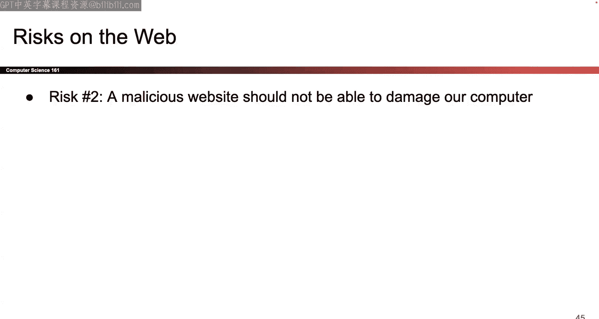
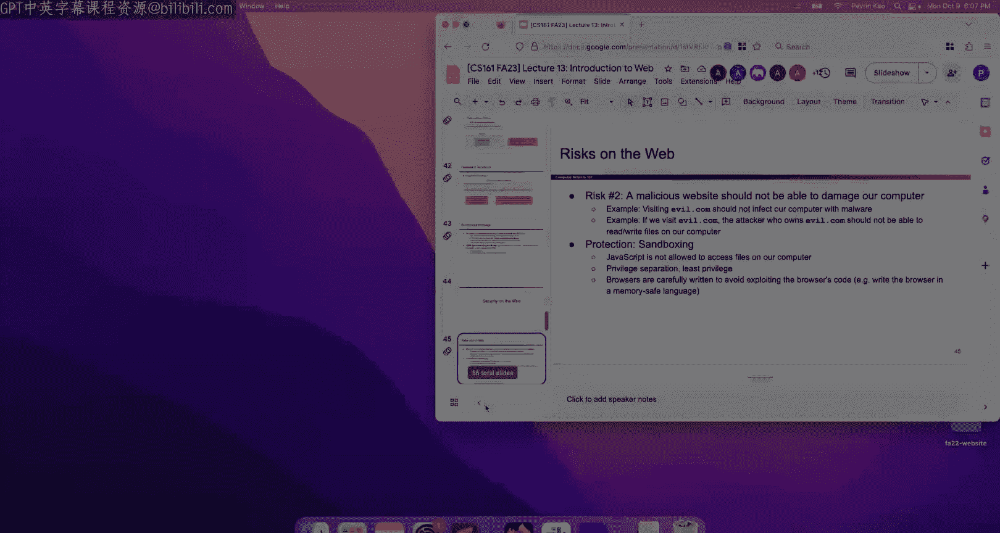
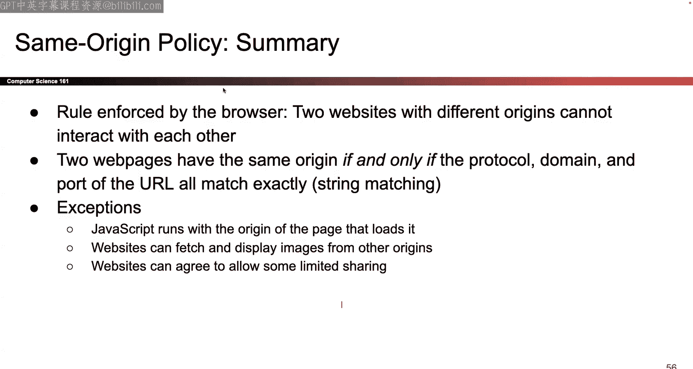

# 013：Web安全入门

## 概述

在本节课中，我们将要学习Web安全的基础知识。我们将从Web的基本概念开始，了解其工作原理，并探讨其安全模型。课程将涵盖URL、HTTP协议、网页构成语言（HTML、CSS、JavaScript）以及最重要的安全策略——同源策略。这些知识是理解后续Web攻击与防御的基础。

---

## Web的起源与设计哲学

上一节我们介绍了课程的整体安排，本节中我们来看看Web的起源及其设计哲学。

Web的设计初衷并非以安全为核心。其早期设计主要关注可用性，用于大学和研究机构之间的资源共享。设计者并未从一开始就考虑如何抵御攻击者。这违背了我们第一节课提到的安全原则：**应从设计之初就考虑安全性**。如果事后才试图修补安全漏洞，设计会变得复杂且笨拙。Web就是一个典型的反面教材，它是在没有充分考虑安全性的情况下设计的，因此我们会看到许多奇怪的攻击方式，并不得不使用同样奇怪的防御手段。

Web的概念可以追溯到许多年前，其核心思想是将网络视为一系列资源或对象的集合。这些资源可以是网页、PDF、图像或视频，它们分布在不同的计算机上。Web的目标是提供一种方法来定位和访问这些分布在不同计算机上的资源。

---

## Web 1.0 模型

以下是Web 1.0的简化模型，它足以帮助我们理解最常见的漏洞：

*   **服务器**：网络上分布着许多服务器（例如UC Berkeley的服务器、Netflix的服务器），每个服务器都存储并提供一组资源（文件）。
*   **浏览器**：用户通过浏览器连接到服务器，请求特定的资源（例如“请给我CS161的作业”或“请给我某部电影”）。
*   **通信**：浏览器和服务器之间通过特定的协议（如HTTP）进行通信，交换数据。

这个模型是简化的。现代Web服务器不一定完全按照文件系统的方式组织资源，但此模型对于理解基本概念和漏洞已经足够。

**Web与互联网的区别**：
*   **Web**：指浏览器和服务器之间交换数据的**协议**（如HTTP）。我们关心**交换什么数据**以及**数据的格式**。
*   **互联网**：指数据从一点传输到另一点的**底层网络**。我们关心数据**如何通过物理或逻辑通道传输**。网络单元将详细讨论这部分内容。

---

## URL详解

为了精确地定位网络资源，我们需要理解URL的各个组成部分。URL是一个字符串，用于唯一标识整个Web数据网络中的单个项目。

一个典型的URL结构如下：
`http://example.com:8080/path/to/file?name=value#fragment`

以下是URL各部分的分解：

*   **协议**：`http`
    *   位于双斜杠 `://` 之前。
    *   指定数据传输的方式。本单元我们主要关心两种：
        *   `http`：无加密的旧版本协议。
        *   `https`：添加了加密的安全版本协议。
*   **域名**：`example.com`
    *   位于双斜杠之后、下一个斜杠之前。
    *   用于标识世界上某个特定的服务器。
*   **端口**：`:8080`
    *   位于域名之后，用冒号分隔。
    *   用于指定服务器上的特定应用程序（当服务器运行多个服务时）。如果未指定，HTTP默认使用端口80。
*   **路径**：`/path/to/file`
    *   位于域名（及端口）之后的第一个斜杠之后。
    *   用于标识服务器上的特定资源（可以想象为服务器文件系统上的文件路径）。
*   **查询**：`?name=value`
    *   以问号 `?` 开始。
    *   用于向服务器传递参数，触发服务器进行某些计算。可以将其视为向服务器上的某个“函数”传递参数。多个参数用 `&` 连接，例如 `?name1=value1&name2=value2`。
*   **片段**：`#fragment`
    *   以井号 `#` 开始。
    *   **不会发送给服务器**，仅由浏览器使用，通常用于指示浏览器滚动到网页的特定部分。

**URL编码**：
由于URL中有许多特殊字符（如 `/`, `?`, `#`, 空格），如果想在路径或查询中使用这些字符的字面量，需要进行编码。方法是使用百分号 `%` 后跟该字符的ASCII码（十六进制形式）。
*   例如，空格（ASCII 32，十六进制20）编码为 `%20`。
*   井号 `#`（ASCII 35，十六进制23）编码为 `%23`。
*   注意：攻击者可能利用URL编码来混淆恶意请求，增加检测难度。

---

## HTTP协议

理解了如何定位资源后，我们需要知道浏览器和服务器如何“交谈”。这就是HTTP协议的作用。协议是一套双方约定的通信规则，确保通信有序进行。

HTTP是一种**请求-响应**协议：浏览器发出一个请求，服务器返回一个响应。这是一对一的关系。

**HTTP请求**包含以下关键部分：
1.  **路径**：来自URL的路径部分。
2.  **方法**：表示请求的类型。最主要的有两种：
    *   **GET**：用于**获取**数据，不应修改服务器状态。请求的“数据”部分应为空。
    *   **POST**：用于**提交**数据，通常会导致服务器状态**改变**（如更新密码、发布帖子）。请求可以包含“数据”部分。
3.  **数据**：仅当方法为POST时，才可以包含要发送给服务器的数据。

此外，请求还可以通过URL的**查询参数**向服务器传递信息。

**常见场景**：
*   在浏览器地址栏输入网址并按回车，通常触发的是**GET**请求。
*   在网页表单中填写信息并点击提交按钮，通常触发的是**POST**请求。

**HTTP响应**包含以下关键部分：
1.  **状态码**：一个数字，表示请求的结果。
    *   `200 OK`：成功。
    *   `404 Not Found`：未找到请求的资源。
    *   `403 Forbidden`：无权访问请求的资源。
2.  **数据**：服务器返回的实际内容（如HTML网页、图片数据等）。

---

## 网页构成：HTML， CSS， JavaScript

服务器返回的通常不是渲染好的图片，而是让浏览器自己构建页面的指令。这主要涉及三种语言。

**HTML**：超文本标记语言。它用于定义网页的**结构和内容**，使用标签来组织元素。
*   **链接**：`<a href="https://example.com">点击这里</a>`
*   **表单**：`<form action="/submit" method="POST">...</form>` 用户提交表单时，会向指定路径发送POST请求。
*   **图片**：`` 浏览器会自动发起GET请求来加载此图片。
*   **内嵌框架**：`<iframe src="https://other-site.com"></iframe>` 用于在一个网页内嵌入另一个网页。

**CSS**：层叠样式表。它用于控制网页的**样式和外观**（颜色、字体、布局等）。本课程不会深入讨论，但需知道它也是网页的一部分。

**JavaScript**：一种编程语言。它是实现网页**交互性**的关键。
*   **关键特性**：JavaScript是**客户端**语言，代码在用户的**浏览器**中执行，而不是在服务器上执行。
*   **能力**：可以修改网页内容、弹出对话框、发送网络请求等。
*   **安全意义**：浏览器必须安全地执行来自任何网站的JavaScript，这要求浏览器本身是安全的（无内存安全漏洞）并对JavaScript的运行进行**沙箱隔离**，限制其访问用户计算机的其他部分。

**渲染过程**：服务器发送原始的HTML、CSS和JavaScript代码给浏览器。浏览器负责解析这些代码，执行JavaScript，并最终将页面渲染显示出来。这一切都发生在客户端。

---

## Web威胁模型

了解了Web的工作原理后，我们来看看可能出问题的地方。以下是三个主要的风险领域：

1.  **服务器被入侵**：攻击者控制了Web服务器，从而可以返回恶意内容给所有访问者。防御措施属于通用的服务器安全范畴（如使用内存安全语言、及时更新补丁）。
2.  **访问恶意网站**：用户访问了攻击者控制的网站，该网站可以发送恶意JavaScript在用户的浏览器中执行。防御主要依靠浏览器的**沙箱机制**，限制网页代码的权限，防止其危害用户计算机的其他部分。
3.  **网站间恶意交互**：这是本课程Web安全部分关注的重点。当用户同时打开多个网站标签页（例如一个银行网站，一个恶意网站）时，恶意网站的JavaScript可能会试图窃取银行网站的数据或冒充用户进行操作。为了防止这种攻击，浏览器实施了**同源策略**。

---

## 同源策略

同源策略是浏览器的一项核心安全策略，用于限制一个源（网站）的文档或脚本如何与另一个源的资源进行交互。

**“源”的定义**：一个“源”由**协议**、**域名**和**端口**三部分组成。只有这三者完全一致，才被认为是同源。
*   **比较方法**：简单的字符串匹配。
*   **示例**：
    *   `http://cs161.org` 与 `https://cs161.org` **不同源**（协议不同）。
    *   `http://a.cs161.org` 与 `http://b.cs161.org` **不同源**（域名不同）。
    *   `http://cs161.org:80` 与 `http://cs161.org:8080` **不同源**（端口不同）。

**策略效果**：如果来自不同源的脚本运行在同一浏览器中，默认情况下它们不能：
*   访问彼此的DOM（文档对象模型）。
*   读取彼此的Cookie、LocalStorage等数据。
*   发送特定类型的跨域请求（如使用`XMLHttpRequest`或`Fetch API`）。

**例外情况**：为了平衡安全与可用性，存在一些有限的跨源交互方式：
*   **嵌入资源**：可以通过 ``, `<script>`, `<link>`, `<iframe>` 等标签嵌入来自不同源的资源（图片、脚本、样式、页面）。但嵌入的脚本会在当前源的上下文中执行，且通常不能读取嵌入内容的数据（除非内容明确允许）。
*   **CORS**：跨源资源共享。这是一种现代机制，允许服务器通过设置HTTP响应头，明确声明允许哪些其他源来访问自己的资源。这是进行可控跨域通信的标准方式。

同源策略感觉有些“别扭”，正是因为它是Web安全架构在事后“打上的补丁”，而非最初设计的一部分。但它是目前保护网站间隔离、防止恶意交互的基石。

---

## 总结

本节课中我们一起学习了Web安全的基础知识。我们首先回顾了Web的设计背景，理解了其安全并非与生俱来。接着，我们剖析了URL的结构，学习了HTTP协议如何规范浏览器与服务器的通信。然后，我们了解了构成现代网页的三种核心技术：HTML负责结构，CSS负责样式，JavaScript负责交互，并特别强调了JavaScript在客户端执行的特性。最后，我们探讨了Web的主要威胁，并深入讲解了防御网站间恶意攻击的核心策略——同源策略，它通过比较协议、域名和端口来限制不同源之间的交互。

这些概念为我们接下来学习具体的Web攻击（如跨站脚本XSS、跨站请求伪造CSRF等）和防御措施奠定了坚实的基础。