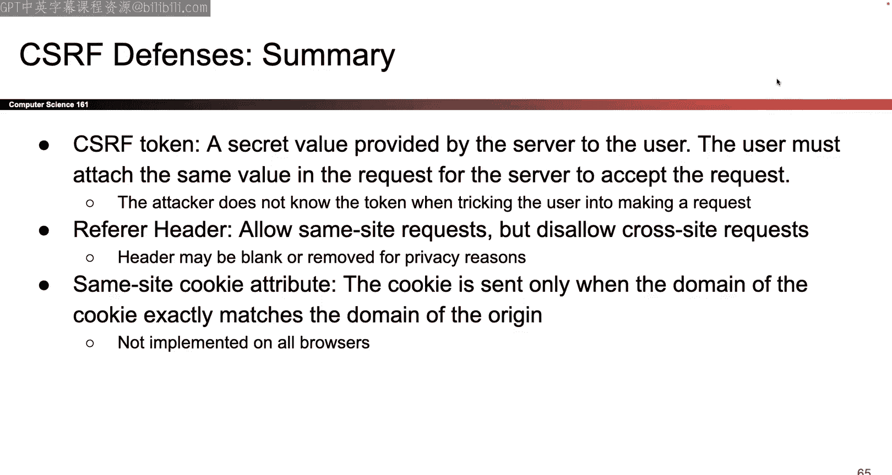

# 014：Cookies 与 CSRF 🍪

在本节课中，我们将要学习网络中的两个核心概念：Cookies 和跨站请求伪造攻击。我们将首先了解什么是 Cookie，它如何帮助网站记住用户状态，然后探讨一种针对 Cookie 的攻击方式——CSRF，以及如何防御它。

---

## 上一节我们介绍了网络的基础知识，本节中我们来看看如何让网络请求“记住”状态。

HTTP 协议的一个特点是，每个请求和响应都是独立的。服务器处理一个请求时，并不知道之前或之后的请求内容。这对于获取静态文件（如 PDF）可能没问题，但对于许多现代网站功能来说，这并不理想。

以下是几个需要“记住”状态的例子：
*   如果我在课程网站上开启了深色模式，我希望之后的所有请求都返回深色背景的页面。
*   如果我登录了银行网站，我希望之后的所有请求都能被识别为来自已登录的我，而无需每次都重新输入密码。

HTTP 本身无法做到这一点。为了将多个 HTTP 请求和响应关联起来，我们引入了 **Cookie**。

Cookie 本质上是一段可以在多个请求之间保持的数据。

### Cookie 的来源与存储

以下是 Cookie 的几种创建方式：
*   **服务器创建**：当你向服务器发送请求时，服务器可以在其响应中附带一个新的 Cookie，要求你的浏览器存储。
*   **JavaScript 创建**：运行在浏览器中的 JavaScript 代码也可以创建新的 Cookie。
*   **手动创建**：用户可以通过浏览器设置手动创建 Cookie（不常见）。

Cookie 存储在**浏览器**端。浏览器负责管理一个“Cookie 罐”，用于存放所有收到的 Cookie。当服务器创建一个新 Cookie 并发送给你时，浏览器负责将其存入罐中。

### Cookie 的内部结构

一个 Cookie 包含多个字段，必须按照特定格式组织，以便各方都能理解。以下是核心字段：

*   **数据**：以 **`name=value`** 的键值对形式存储。例如，`theme=dark` 表示主题设置为深色。
*   **作用域**：
    *   **`domain`**：指定此 Cookie 与哪些网站相关。例如，`domain=cs161.org`。
    *   **`path`**：指定此 Cookie 在网站内的哪个路径下有效。例如，`path=/lectures`。
*   **安全字段**：
    *   **`secure`**：如果设置为 `true`，则此 Cookie **仅**在通过 **HTTPS** 加密连接发起请求时才会被发送。
    *   **`HttpOnly`**：如果设置为 `true`，则 **JavaScript 代码无法读取或修改**此 Cookie。这可以防止恶意脚本窃取敏感的 Cookie 数据。
*   **`expires`**：Cookie 的过期时间戳。过期后，浏览器将不再发送此 Cookie。

---

## 上一节我们了解了 Cookie 的构成，本节中我们来看看浏览器管理 Cookie 的规则。

浏览器需要决定两件事：1）何时接受一个新 Cookie？2）何时发送一个已存储的 Cookie？

制定这些规则（称为 **Cookie 策略**）的目的是为了防止攻击。例如，我们不想让 `evil.com` 能够设置一个影响 `bank.com` 的 Cookie，也不想让浏览器在访问 `evil.com` 时，误将 `bank.com` 的敏感 Cookie 发送过去。

### 规则一：设置 Cookie（何时接受）

当浏览器收到一个新 Cookie 时，需要判断是否将其存入 Cookie 罐。这需要比较两个值：
1.  **请求目标的域名**：你向哪个网站发起了请求（例如 `mail.google.com`）。
2.  **Cookie 中的 `domain` 属性**：服务器在创建 Cookie 时填写的域名（例如 `google.com`）。

**接受规则**：只有当**请求目标的域名**是 **Cookie 中 `domain` 属性**的**后缀**（或者说，目标域名在域层级上等于或比 Cookie 域名更具体）时，浏览器才会接受这个 Cookie。

**示例**：
*   请求 `mail.google.com`，收到 `domain=google.com` 的 Cookie。`mail.google.com` 以 `google.com` 结尾，**接受**。
*   请求 `evil.com`，收到 `domain=google.com` 的 Cookie。`evil.com` 不以 `google.com` 结尾，**拒绝**。这防止了不相关的网站设置影响他人的 Cookie。

**额外限制**：Cookie 的 `domain` 属性不能设置为顶级域（如 `.com`, `.org`），因为这样范围太广，存在安全风险。

### 规则二：发送 Cookie（何时附加）

当浏览器要发起一个 HTTP 请求时，需要从 Cookie 罐中找出所有“相关”的 Cookie 并自动附加到请求中。

判断“相关”需要比较：
1.  **请求的 URL**（例如 `https://cs161.org/lectures/14`）。
2.  **Cookie 中的 `domain` 和 `path` 属性**。

**发送规则**：一个 Cookie 被认为是相关的，必须同时满足：
*   **域名匹配**：请求的域名**以** Cookie 的 `domain` 属性值结尾。
*   **路径匹配**：请求的路径**以** Cookie 的 `path` 属性值开头。

**简单检查法**：将 Cookie 的 `domain` 和 `path` 拼接（如 `cs161.org/lectures`），与请求的 URL 从协议后的 `//` 开始对齐。如果从左（域名）到右（路径）都能匹配，则该 Cookie 相关。

---

## 上一节我们学习了 Cookie 的管理策略，本节中我们来看一个重要的应用：会话认证。

Cookie 的一个关键用途是实现**会话认证**，即让用户登录后保持登录状态。

**类比**：参加音乐会。第一次入场时，你需要出示门票和身份证（**登录**）。检票后，你会得到一个腕带（**会话令牌**）。中途离开再回来时，你只需出示腕带（**发送令牌**），而无需再次检票。

**在 Web 中的实现**：
1.  **登录**：用户向服务器发送用户名和密码。
2.  **颁发令牌**：服务器验证成功后，生成一个**长而随机的字符串**作为**会话令牌**，将其通过 Cookie 发送给浏览器。服务器同时在自己的数据库中记录“用户 A ↔ 令牌 X”。
3.  **保持登录**：此后，用户访问该网站的每个请求，浏览器都会**自动附加**包含该会话令牌的 Cookie。
4.  **验证身份**：服务器收到请求后，检查 Cookie 中的令牌，查找数据库，即可知道是哪个用户发出的请求。

**会话令牌必须保密**，因为它等同于用户的登录凭证。如果攻击者窃取了你的会话令牌，他们就可以冒充你的身份。

**保护会话令牌的 Cookie 设置示例**：
*   `name=session_token`, `value=<长随机字符串>`
*   `domain=mail.google.com` （作用域精确）
*   `secure=true` （仅通过 HTTPS 发送）
*   `HttpOnly=true` （阻止 JavaScript 访问）
*   `expires=...` （设置合理的过期时间）

---

## 上一节我们了解了如何使用 Cookie 进行会话认证，本节中我们来看看针对此机制的一种攻击：跨站请求伪造。

**跨站请求伪造** 的核心是：**攻击者诱骗已登录的用户，在用户不知情的情况下，向目标网站发起一个恶意请求**。

由于浏览器会自动附加相关 Cookie，这个恶意请求会带着用户的合法会话令牌一起发送到服务器。服务器看到有效的令牌，便会执行该请求（如转账、改密码），而无法区分这是用户的真实意图还是被欺骗的结果。

### 攻击者如何诱使用户发起请求？

以下是让用户发起 **GET 请求**的方法：
1.  **诱骗点击链接**：发送钓鱼邮件，内含“恭喜中奖，点击领取”的链接。
2.  **利用 `` 标签**：在网页中嵌入 ``。浏览器为了加载图片，会自动向 `src` 中的 URL 发起 GET 请求。

以下是让用户发起 **POST 请求**的方法（通常更难）：
*   在恶意网站上运行 JavaScript，用代码动态创建并提交一个表单。

---

## 上一节我们了解了 CSRF 攻击的原理，本节中我们来看看如何防御它。

CSRF 防御主要由**服务器端**实施，核心思想是：**增加一个攻击者难以伪造的额外凭证**。

### 防御一：CSRF 令牌

这是最常用且有效的防御方法。
1.  当用户访问需要提交表单的页面时（如转账页面），服务器在返回的页面中嵌入一个**额外的、随机的秘密值**，即 **CSRF 令牌**。这个令牌通常放在一个隐藏的表单字段中。
2.  用户提交表单时，这个 CSRF 令牌会随着表单数据一起提交到服务器。
3.  服务器在处理请求前，会验证提交的 CSRF 令牌是否与之前发给用户的那个匹配。

**为何有效**：攻击者可以诱使用户发起请求，也可以猜到请求的参数，但他们**无法读取或猜到**那个与特定用户会话绑定的 CSRF 令牌（尤其是当会话 Cookie 被标记为 `HttpOnly` 时）。因此，攻击者构造的请求会因缺少有效的 CSRF 令牌而被服务器拒绝。

### 防御二：检查 Referer 头部

HTTP 请求头中有一个可选的 **`Referer`** 字段，它表明了这个请求是从哪个页面链接过来的。
*   **策略**：服务器可以检查 `Referer` 头。如果请求来自同源网站（例如从 `bank.com` 的页面提交到 `bank.com`），则接受；如果来自外部网站（例如从 `evil.com` 提交到 `bank.com`），则拒绝。
*   **局限性**：`Referer` 头可以被浏览器或用户出于隐私原因禁用或篡改。如果该字段为空，服务器就需要决定是采取宽松策略（可能降低安全性）还是严格策略（可能影响正常使用）。

### 防御三：SameSite Cookie 属性

这是一种较新的、由浏览器直接提供的防御机制。在设置 Cookie 时，可以增加一个 **`SameSite`** 属性。
*   **`SameSite=Strict`**：浏览器只会在**当前站点**与 Cookie 的站点**完全一致**时，才发送此 Cookie。这意味着，即使用户在 `evil.com` 上点击了指向 `bank.com` 的链接，浏览器也不会发送 `bank.com` 的会话 Cookie，从而阻止 CSRF 攻击。
*   **`SameSite=Lax`**：一种稍宽松的模式，允许在某些安全的顶级导航（如链接点击）中发送 Cookie，但仍能阻止大多数 CSRF 攻击。

---

## 总结

本节课中我们一起学习了：
1.  **Cookie**：一种用于在多个独立 HTTP 请求间保持状态的数据机制。它包含数据、作用域和安全属性等字段。
2.  **Cookie 策略**：浏览器为确保安全而执行的规则，包括何时接受新 Cookie 以及何时发送已存储的 Cookie，核心是防止不相关的网站互相影响。
3.  **会话认证**：利用 Cookie 实现用户登录状态保持的常见应用。服务器颁发一个随机的会话令牌给浏览器，后续请求通过该令牌来识别用户。
4.  **跨站请求伪造**：一种攻击方式，攻击者诱骗已登录的用户向目标网站发起非本意的请求，由于浏览器自动附加 Cookie，该请求会被服务器信任并执行。
5.  **CSRF 防御**：主要有三种方法：
    *   **CSRF 令牌**：要求请求携带一个攻击者无法获得的额外秘密值。
    *   **检查 Referer 头部**：验证请求来源是否可信。
    *   **SameSite Cookie 属性**：指示浏览器仅在特定条件下发送 Cookie。

理解这些概念对于构建安全的 Web 应用至关重要。