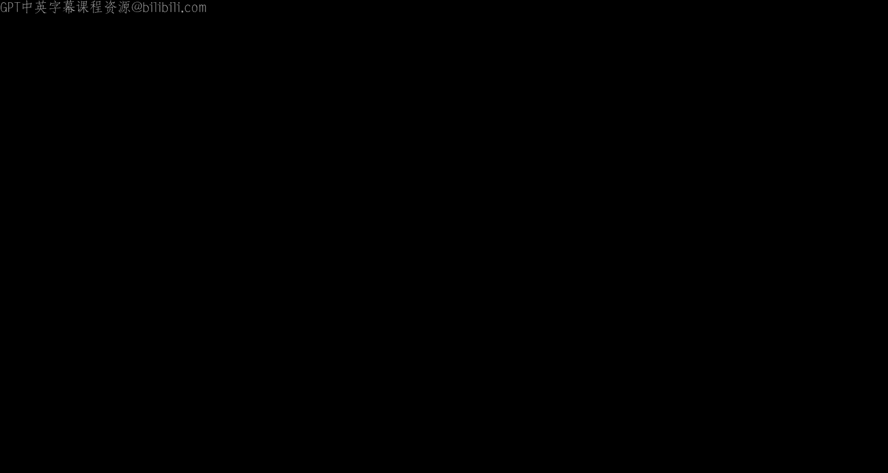

# 015：XSS与UI攻击

在本节课中，我们将学习两种关键的Web安全威胁：跨站脚本攻击和用户界面攻击。我们将探讨它们的工作原理、不同类型以及如何防御这些攻击。

---

## 课程公告

在开始之前，有一些课程公告需要说明。

项目二的设计文档截止日期是本周五。本周没有讨论课，因为我们需要让课程内容赶上进度。下周的讨论课将涵盖XSS和Cookie，以及UI攻击。

如果你已经完成了设计文档并想提交，现在就可以提交。本周可以预约设计评审，这些是早期的设计评审。设计文档的实际截止日期是本周五，设计评审将从下周开始，大部分安排在下周。但本周也有一些早期评审的名额。

需要注意的一点是，你不能预约多次设计评审。如果你选择参加早期评审，就不能再预约其他时间的评审，因为我们需要为所有学生留出名额。

---

## 回顾：Cookie与CSRF

上一节我们介绍了Cookie和跨站请求伪造。本节中我们来看看XSS和UI攻击。

首先，快速回顾一下上周的内容。我们讨论了Cookie，Cookie是存储在浏览器中的一段数据，可以由浏览器或服务器设置，具体取决于上下文。Cookie具有一系列属性。

Cookie策略规定，具有特定域属性的服务器只有在满足某些条件时才能设置Cookie。这些条件是：Cookie的域属性必须是服务器域的后缀；Cookie的路径属性必须是服务器路径的前缀。如果这两个条件都满足，服务器就能为该域属性设置Cookie。

我们还讨论了使用Cookie进行会话认证。当你首次访问某个资源时，会从服务器或浏览器获取一个值，并将其存储在浏览器中。之后，当你再次访问该网站时，你已经缓存了该值，因此可以轻松访问，无需重新登录。

会话令牌由服务器随机生成，并由浏览器存储。如果攻击者获取了你的会话令牌，他们就可以以你的身份登录。

我们还讨论了跨站请求伪造。我们提到了同源策略，它阻止你访问不同源的资源。CSRF则能够利用Cookie在不同源之间跳转。例如，如果用户向`bank.com`进行了身份验证，并在浏览器中存储了相应的Cookie，攻击者试图诱骗受害者向`bank.com`服务器发出恶意请求，服务器不会报错，因为浏览器会将Cookie附加到请求中，服务器认为Cookie有效。

今天讨论的所有攻击的主要特点是，受害者必须执行某种操作。攻击者必须诱骗受害者创建GET或POST请求。GET请求用于获取信息，POST请求则可能导致服务器返回信息或造成损害。

我们还讨论了CSRF的防御措施。其中包括CSRF令牌，这是服务器提供给用户的另一个字节串值，用户每次向服务器发送请求时都应附加该值，这是服务器接受请求的唯一方式。

Referer头是另一种防御措施，它规定只允许来自同一站点的请求。你可以将其设置为`true`或`false`，如果设置为`true`，则只允许来自同一站点的请求。

还有SameSite Cookie属性，这意味着只有当请求的域与我们要访问的站点域相同时，服务器才会设置Cookie。并非所有浏览器都实现了这些防御措施，这可能是由于复杂性或管理问题。

---

## 什么是XSS？

现在我们来谈谈XSS。XSS是跨站脚本攻击的缩写。在2020年，它被评为最危险的软件弱点，到2023年仍位居第二，因此仍然非常重要。

XSS与同源策略有一定关系。两个具有不同源的网页不应能够相互访问。例如，`evil.com`和`bank.com`不应能相互访问，否则将带来问题。如果`evil.com`上运行的JavaScript能够访问你银行账户中的某些信息，那将非常糟糕。

JavaScript是一种编程语言，用于在Web浏览器中运行代码，至今仍在大多数浏览器中使用，非常流行。JavaScript被称为客户端脚本，它在用户的浏览器上运行，而不是在服务器上运行。这是一段可以嵌入HTML中的代码，由服务器发送给客户端，然后由客户端执行。

你可以将客户端和浏览器视为同一实体，将服务器视为获取信息的来源。服务器向浏览器发送一些HTML，当HTML被渲染和执行时，如果其中嵌入了JavaScript，它就会被运行并显示其内容。JavaScript用于操作网页，如今非常普遍。

在本课程中，你不需要了解JavaScript语法，只需要了解我们在讲座和讨论中谈到的最重要的函数，这些函数可以帮助你理解漏洞利用。

以下是一个JavaScript示例。这段名为“happy birthday”的JavaScript代码会创建一个“happy birthday”的警告弹窗，它使用`<script>`标签嵌入在HTML中。当浏览器加载这段HTML时，会生成一个带有“happy birthday”的弹窗警告。

处理器基本上接收来自URL或URL部分的请求，并确定需要对这些特定部分执行什么操作。例如，如果我们的URL是`go to vulnerable.com/hello?name=Ebond`，那么`?`之后的内容就是你要执行的函数的参数。在这种情况下，你想运行`hello`函数，参数是`name`，你希望`name`是`Ebond`。当这个URL被访问时，处理器被调用，`name`被视为字符串，然后传递给`hello`，响应基本上是一个HTML输出，上面写着“hello Ebond”。

如果我们更进一步，输出就是“hello Ebond”。但如果你再进一步，不是只有`Ebond`，而是加上`<b>`标签，这就是HTML加粗标签的工作原理，显示的内容就是`name`中的确切内容。当这个内容被渲染到HTML中时，你会发现`Ebond`没有被加粗。

之后，我们有一个例子，既然我们能够使用`<b>`标签（这是一个HTML标签），为什么不能直接使用`<script>`标签呢？它也是一种将JavaScript放入HTML的方式。这正是我们要做的，它也会被渲染，因为相同的项被放入了`name`参数中。当它运行时，我们会生成一个带有警告的弹窗。

这是一种将JavaScript放入HTML的方式。这不仅仅是一个字符串漏洞。`%s`作为一个格式说明符，不仅适用于该特定格式说明符，也适用于当你拥有HTML并尝试在其中放入带有字面值的字符串时。

---

## XSS攻击原理

跨站脚本攻击背后的主要思想是，攻击者向用户或受害者认为无害的合法网站添加一些恶意JavaScript。这些攻击可以通过多种方式发生，但主要有两种类型：存储型XSS和反射型XSS。

存储型XSS，顾名思义，基本上是存储在某个地方。它存储在哪里？它存储在真实的服务器上。每当向服务器发出请求时，嵌入在HTML中的JavaScript就会被发送到浏览器加载。

正如最后一点所说，存储型XSS利用了服务器端的漏洞。我们知道服务器存在某种漏洞，攻击者设法将一些JavaScript注入到HTML代码中。

举个例子，比如Facebook页面。如果我有一个Facebook账户，并在我的Facebook页面中嵌入了一些JavaScript，任何加载我页面的人都会向服务器发出请求，服务器会找到我的Facebook页面，给他们一些内容来渲染我的Facebook页面，然后当他们这样做时，页面上的JavaScript也会被运行。

再次强调，任何漏洞都意味着受害者必须加载某些内容。在这种情况下，受害者需要加载被注入了JavaScript的页面。这就引出了一个问题：我们如何做到这一点？

回顾之前的例子，攻击者将恶意脚本直接注入`bank.com`。受害者将从`bank.com`请求内容。银行将发送恶意脚本。受害者的浏览器将执行所述恶意脚本，该脚本中嵌入了JavaScript。根据该JavaScript的内容，可能会发生更糟糕的事情。到目前为止，我们只讨论了警告标签和警告消息，但你可以做更多恶意的事情。

例如，攻击者可以从受害者那里窃取有价值的数据，其中一个例子就是会话令牌。如果你有会话令牌，就像之前提到的，你可以以他人的身份登录，这很糟糕。攻击者可以做的另一件事是，获取这个会话令牌并向`bank.com`发出某种请求。如果攻击者决定让受害者向他转账100美元，他就会这样做。

---

## 反射型XSS

现在我们来讨论反射型XSS。反射型XSS基本上是，攻击者需要让受害者向特定站点发出包含JavaScript的特定请求。

然后，服务器输出的任何内容都会反映在浏览器中，因此被称为反射型XSS。这意味着当受害者向服务器发出请求时，服务器没有发送恶意内容，因此服务器在这种情况下不是坏的或被破坏的，而是请求本身被破坏了。

反射型XSS基本上意味着受害者需要发出一个注入了JavaScript的请求。我们如何做到这一点？有多种方式。例如，你可以有一个图像。在HTML中，图像有一个``标签和一个`src`属性，`src`属性运行于特定的源。如果你将`src`设置为例如`google.com`，并传入一些参数，而参数如本例所示是一个`<script>alert`标签，那么这将是一个问题。因此，你会点击这个链接，基本上会访问`google.com`，然后无论你请求什么，在这种情况下是`<script>alert`标签，它可能不存在，但服务器返回的任何内容都会反映给你。

在这种情况下，攻击者直接向受害者发送某些内容，例如一个链接。许多攻击基本上都与社会工程学有关。这些攻击是使坏事发生的方式，但如何将攻击传递给特定的人则是社会工程学。攻击者向受害者发送某种恶意请求或有害链接，受害者点击它，该链接就被污染了。因此，受害者的访问权限都在攻击者的控制之下。受害者会发出某种请求，银行会执行该特定请求所指示的操作，然后浏览器将执行那种恶意脚本，攻击者就能够窃取数据。

在之前的情况下，攻击者还能够发出恶意请求。问题是，我们如何迫使受害者向合法网站发出请求，同时将JavaScript注入其中？一个想法是使用图像源，其中源链接指向某个合法网站，然后你请求的是一个警告标签，这就是将要返回给你的内容。另一件事是，你可以诱骗受害者访问攻击者的网站，然后重定向到某个其他恶意网站。

这涵盖了两种主要类型：存储型XSS和反射型XSS。它们之间的主要区别在于漏洞利用发生的位置。存储型XSS是某种恶意JavaScript存储在服务器上，浏览器对服务器的任何正常请求都会返回被破坏的信息。

反射型XSS基本上是说，受害者向浏览器发出的请求中，特定的URL本身被破坏了，因此它请求的是嵌入了某种JavaScript的内容。我们如何让受害者创建这个链接？因为你肯定不想破坏自己。我们通过向受害者发送一些看起来正常的东西来让他们点击这个链接。

---

## XSS与CSRF的区别

CSRF和XSS不是一回事，它们非常相似。在XSS中，从服务器返回的HTTP响应或从浏览器发送到服务器并作为响应返回的HTTP请求已经嵌入了JavaScript。这只是意味着当JavaScript返回浏览器时，它会被执行，这种执行发生在客户端。因此，XSS在客户端执行，这是XSS的一个主要特点。

另一方面，CSRF基本上是你向服务器发出一个HTTP请求，但你所做的是获取一个Cookie值并将其传入，并确保该Cookie值相同。因此，CSRF依赖于这样一个事实：你试图攻击的人对你试图操纵的某些事物拥有有效的活动会话。

为什么客户端在点击某些恶意链接时是安全的，但在从服务器获得响应后就会发生不好的事情？这个想法是，HTML基本上是在从服务器接收到某些信息后在浏览器中渲染或执行的。因此，如果你点击一个链接，你所做的是向服务器发出一个GET请求。例如，如果是对`google.com`的请求，你是在说：“你好，Google，我想要所述信息。”然后它会说：“好的，这是所述信息。”这就是你从服务器得到的响应。一旦你得到它，基本上就是你收到的HTML信息片段。浏览器会说：“好的，我收到了这个信息片段，我不知道该怎么处理它，但我需要渲染它以查看它实际上是什么。”它会渲染它，在渲染时，JavaScript将被运行。如果JavaScript是我们见过的某种警告标签，那么它就会运行，然后你会看到一些警告。

在深入讨论之前，我将坚持使用警告的例子，因为这是你可以想象的最简单的事情。

---

## 实际案例：Calnet漏洞

让我们看看这在实践中是如何发生的。2021年，一位名叫Rohan的61C学生在Calnet中发现了一些东西。他发现，当你登录Calnet时，在尝试登录时会提交一堆东西。其中一个字段是用户名、密码，然后是`execution`。`execution`基本上是一个状态，它是服务器端该特定用户的代表状态。

如果这个特定的`execution`密钥是错误的，它会显示一条错误消息，说：“看，存在内部服务错误，我们无法处理。”然后，如果你看底部，它会说“格式错误的流执行密钥”，然后`garbage value = something`。

这个想法是，服务器期望`execution`是某种特定格式，但它不是那种格式，它只是说：“看，这是我得到的，这是错误的，修复它。”如果你篡改`execution`会怎样？

`execution`密钥被放入错误消息中，它被放在哪里？它被放在发送给浏览器并渲染的HTML中，你会看到这个“内部服务错误”。现在，如果我们有一个恶意值编码在`execution`密钥中，我们可能能够执行它。因此，如果`execution`密钥是`hello`，那么你会看到返回的`execution`密钥是`hello`。

如果`execution`密钥被更改为嵌入在HTML中的JavaScript，例如你有一个`<script>`标签，里面有`alert(1)`，然后你关闭`<script>`标签，如果那是`execution`密钥，那么你将在`garbage value = something`的位置看到完全相同的代码。

当这在浏览器端接收到时，它会被运行，然后JavaScript指示的任何操作都将被执行。因此，我们讨论如何修复XSS的一种方法是转义字符，但Calnet当时没有转义`execution`密钥。因此，你可以做的是将这个值更改为你想要的任何内容，并以JavaScript的形式放入。

这基本上就是我所描述的。你可以更改`execution`，你可以说名为`execution`的输入将是这个特定的文本，而文本基本上是`alert` XSS类型的JavaScript标签，它被渲染、运行，然后你看到一个警告。

基本上发生的情况是，Calnet没有正确清理其输入，因此它没有转义字符，我们稍后会讨论这一点。这只有在你点击“显示错误”时才会发生。它说这是你收到的错误，如果你不关心，你只需关闭浏览器；如果你关心，你会说：“哦，这是什么错误？”然后你点击它，它将显示正在运行的任何内容。

在这种情况下，我再次谈论`alert(1)`，但你可以做很多事情，你可以窃取某人的凭据。基本上，你正在以他们的身份运行一些恶意代码，这就是你在运行这些漏洞利用时想要的那种想法。

如果你感兴趣，这个漏洞利用的原因写在那里，你可以看一看，这只是旧软件的问题。

---

## XSS防御措施

有哪些防御措施可以用来保护自己免受所有这些恶意攻击？有一种叫做HTML清理的东西。某些字符，例如当你开始一个`<script>`标签时，你有尖括号和`script`。如果你看到这些，你可以直接将其删除，然后你就无法将该特定页面渲染为JavaScript。

如果你使用`&lt;`代替左开括号，使用`&quot;`代替实际的引号，那么你基本上是在转义所有被认为是危险的字符。因此，如果你的HTML中嵌入了JavaScript，它将不会作为JavaScript运行。

所有这些都是在浏览器端采取的安全措施，因为服务器可能给你错误的信息。你可以向服务器发送某种信息，并返回某种会导致反射型XSS的JavaScript。归根结底，一切都是在客户端渲染的，因此你希望在那里拥有保护措施。

另一件事是不要试图重新发明轮子，让受信任的库为你做这件事。

我们将讨论转义字符，这也是你可以做的事情。`html.EscapeString`基本上是一个内置的HTML函数，可以安全地为你转义字符串。所以不要自己做，这就是想法。如果你发送这个名称，也就是这个警告标签，它将转义所有这些内容并清理你的输入，你得到的结果是：代替小于号，你得到`&lt;`；代替大于号，你得到`&gt;`。因此，当这个被渲染时，你在URL中看到的和你在响应中看到的并不相同。在URL中，你看到的是JavaScript；在响应中，你看到的是一些不会被识别为JavaScript且不会运行的奇怪东西。

因此，如果程序员必须为每一件可能出错的事情或每一个可能的漏洞利用或可能发生的字符采取行动，很多事情都可能出错，这只是因为人为因素，对于任何人来说，可能性都太多了。

现在的情况是，你有这些HTML模板，你可以用这些HTML模板做的是，只需放入你想要的任何信息片段，它们将为你转义这些字符并正确清理你的输入，因此你不必自己去做。即使是像`html.EscapeString`这样的函数，你也必须编写它们，而这些模板将为你避免整个事情，并为你清理一切。

这是一个Go HTML模板的例子，你传入`name`或类似`{{.Name}}`的参数，然后该参数被清理。

---

## 内容安全策略

另一个你可以使用的防御措施是内容安全策略。这基本上是在浏览器层面告诉浏览器，这是一个浏览器级别的防御系统。你基本上是在告诉浏览器：“看，所有这些事情都可能出错，但我只对从这些特定地方听到的信息感兴趣。因此，我想告诉我的浏览器，如果我收到来自我不希望来源的任何请求或任何信息片段，我会忽略它。”这有点像黑名单，或者实际上是白名单站点，说这些是我想要听到的站点，任何不在集合中的东西都会被忽略。

你可以做的另一件事是禁止所有内联脚本。基本上，如果你有任何编码在HTML中的JavaScript，你就不能拥有它，这就是重点。另一件事是允许来自特定域的脚本。如果你想要来自`google.com`的东西，并且你认为`google.com`是安全的，那么只允许来自那里的脚本。使用这种特定域的方法，你可以根据需要指定，因此你可以允许更大的域，或者只允许子域等。

这些方法也适用于其他内容，例如iframe和图像。例如，图像总是会运行，并且总是会加载源指定的来源。如果源是`google.com`，它会认为这是可以的，即使请求是从恶意服务器或恶意网页运行的。

因此，你希望清理所有这些输入，并确保所有这些都经过检查。再次强调，这意味着浏览器是唯一用于缓解所有这些漏洞利用并强制执行安全的实体。因此，你希望做的是拥有某种深度防御，就像洋葱一样层层叠加，如果某层被突破，还有多层保护。

---

## UI攻击概述

接下来我们将讨论UI攻击。UI攻击是什么？总的来说，我们基本上是在试图诱骗受害者采取某种恶意行动。我提到了几个例子，说明诱骗受害者采取恶意行动可能导致XSS，但也可能导致其他事情。有时我们想利用我们的用户界面，也就是用户和计算机之间的可信路径。我们已经讨论了很多Web安全方面的事情，这些有助于保护我们免受许多攻击，例如同源策略。但在UI攻击中，我们将更多地考虑人为因素和心理技巧，以诱骗受害者执行某些操作。这都关乎安全原则：考虑人为因素。

今天我们将讨论两种类型的UI攻击。第一种是点击劫持，我们基本上会诱骗受害者点击攻击者的某些内容，这可能导致XSS或其他后果。另一种你可能在现实世界中见过的是钓鱼攻击，即我们试图诱骗受害者向我们发送一些个人信息。这两种攻击都非常相关，希望今天讨论起来会很有趣。

---

## 点击劫持

点击劫持中会发生什么？我们的目标是诱骗受害者点击攻击者的某些内容。这里的漏洞在于，浏览器信任用户，用户通常不是恶意的，或者浏览器没有理由不信任用户。因此，浏览器基本上必须执行用户告诉它做的任何事情。用户点击某物，浏览器会假设用户打算点击它。我们为什么关心点击劫持？有没有人知道通过窃取用户的点击我们可以做什么？

我们可以让他们执行各种操作，比如GET请求。一些例子包括：诱骗他们通过GET请求下载恶意程序；诱骗他们点赞你的Facebook页面或YouTube视频（如果你真的非常渴望点赞）；诱骗他们删除在线账户等等。正如你提到的，只要我们让他们通过点击做某事，我们就可以执行许多操作。

另一件我们可以做的事情是窃取击键。有没有人知道为什么窃取击键可能有用？没错，你可以窃取密码、信用卡号码、任何其他个人信息。因此，作为攻击者，我们可以窃取许多有用的东西。

我们将通过一系列不同网页的例子来了解发生了什么。在这个网页上，谁能告诉我真正的下载按钮在哪里？也许如果你在线看电影，你可能会认出这样的页面，或者它写着“点击这里播放电影”。你无法真正分辨，对吧？到处都是下载按钮。如果我们点击了错误的按钮会发生什么？我们可能会下载恶意程序，或者可能意外点赞某人的YouTube视频等。这就是点击劫持的前提。

现在我们可以通过一个更逐步的例子来了解如何设置点击劫持问题。这里我们有伯克利的页面，我们可以看到我们看不太清楚，因为它在这里真的很小，但我们可以看到，如果你将鼠标悬停在这个蓝色横幅上，它会重定向到`crowdfund.berkeley.edu`，这是伯克利慷慨地要求你捐款的地方。作为好学生，我们喜欢捐款，对吧？但也许我们实际上不想捐款，伯克利会试图诱骗我们捐款。让我们以这个例子为例，伯克利如何诱骗我们学生捐款？

第一步，让我们在iframe中加载这个伯克利页面。记住，iframe是一种特定类型的HTML，它基本上会创建这个网站框架。但作为学生，我仍然会看到这个请求，我不会点击它，因为我不想今天捐款，我是一个穷学生。除此之外，伯克利作为一所学校本身，由于同源策略，无法代表我们生成点击，记住框架是隔离的。因此，伯克利会试图以某种方式让我们学生点击它。他们如何做到这一点？也许他们会制作一些非常诱人的内容。他们会在这里放这段文字，上面写着“你想点击这里！”，非常非常诱人的内容，然后我们把它放在这里。我们现在还看不到它，但它技术上仍然放在我们的框架里，不过它放在我们框架的下面。现在我们仍然看不到我们诱人的内容，我们仍然只看到框架，我们并不倾向于点击任何东西。如果我们让我们的框架稍微透明一点，现在伯克利内容本身变得更加透明了。对于后排的同学，我甚至不知道前排的人是否能真正看到，你可以隐约看到“你想点击这里”出现。我们可以让它更加透明，现在我们肯定看到“你想点击这里”了，而你几乎看不到伯克利的内容了。如果你让它完全透明，你的伯克利框架仍然在那里，只是完全透明了。因此，作为学生，你被告知“你想点击这里”，也许好奇心驱使你，你决定点击这里，最终你仍然点击了那个伯克利捐款横幅，然后你被重定向到这个伯克利众筹捐款页面，然后你可能更倾向于捐款。

这就是所有这些下载按钮的工作原理，以及点击劫持如何运作：基本上是想出某种变体，插入一个不可见的框架，然后将该框架覆盖在用户可能想要点击的实际框架之上、之下或之间。

这里我们讨论了如何将合法站点覆盖在可见的诱人内容之上。这里可见的内容是“你想点击这里”，不可见的东西覆盖在它上面，但它是不可见的。你也可以用不同的方式做：你可以让合法站点在恶意内容之下可见。基本上，受害者会认为他们点击的是某个合法站点，但他们实际上点击的是不合法的东西。例如，我们之前看到的下载按钮，那些非法的私人流媒体网站可能就使用这种技术。例如，这里我们可能有我们的伯克利网站，然后我们有这个“下载X文件”的按钮，它是不可见的。因此，如果你点击伯克利网站的那个大致区域，你实际上会点击下载按钮。

变体三是将恶意内容部分覆盖在站点之上，这样你可以在不破坏同源策略的情况下改变站点的外观。他们在这里做的是，他们实际上使用了这个PayPal页面，这个PayPal页面是合法的，但他们覆盖了你要支付的金额。用户如果不精通技术，可能会认为他们只支付15美分，但我们实际上看不到15美分下面的任何值，所以它可能是1000美元而不是15美分，这将是一个巨大的支付价格变化。

这就是点击劫持中不可见框架的一面。到目前为止有什么问题吗？

---

## 时间攻击与光标劫持

然后让我们进入点击劫持的另一个方面，这个我觉得很有趣，但它仍然是一个问题。时间攻击基本上是利用JavaScript，它可以检测我们光标的位置，并在用户点击某物之前改变我们的网站。因此，我们可以诱骗用户朝着他们想要点击的东西移动，并在他们真正注意到之前非常快速地改变他们点击的东西。这里的例子是，想象一下我们试图点击这个“点击这里”按钮，当我们移动光标去点击这里时，就在我们点击它的瞬间，页面改变了，突然我们授予了点击劫持管理你联系人的权限。这做得非常非常快，这就是为什么这个例子在幻灯片上做时可能看起来有点傻，但它做得非常快，所以用户不会注意到。

这就是时间攻击。然后我们可以在点击劫持方面看到的另一种攻击是光标劫持。CSS，你记得CSS代表什么吗？不，那是XSS。CSS是层叠样式表，是关于HTML样式的，比如让它变得漂亮。有人可以查一下全称是什么，但基本上CSS可以用来改变HTML的外观，让它看起来漂亮。因此，你实际上可以改变光标的外观。由于JavaScript能够跟踪光标的位置，我们基本上可以改变光标的外观，并创建一个假的光标来诱骗用户点击东西。在这个例子中，我们有一个假的光标，我们创建了一些CSS和JavaScript，这里我们有我们真实的光标，由于黑客试图诱骗我们使用这个假的光标，它变得不那么明显了。在这个例子中，我们可能认为我们点击的是“立即播放”，因为这个假的光标悬停在“立即播放”上，但实际上我们那个基本上不可见的光标实际上是悬停在这个“下载Xy文件”上。所以当你按下点击时，你可能认为你实际上点击的是“立即播放”，但事实上你点击的是下载这个恶意文件。

这就是光标劫持。是的，用一点CSS、HTML和JavaScript你能做的事情很疯狂。但这就是光标劫持。

---

## 点击劫持防御

那么让我们讨论一些防御措施。我们如何防御这些点击劫持攻击？我们可以做的第一件事是强制执行视觉完整性。基本上，明确区分什么是浏览器网页，什么是系统提示。例如，在Windows中，每当Windows请求权限或试图通知某些重要更改时，它实际上会使整个屏幕变暗，并使这个弹出窗口非常醒目，这样你可以很容易地分辨出这是Windows通过系统控制或浏览器控制与我通信，而页面上的其他所有内容都是不合法的。

浏览器做这件事的另一种方式是，Firefox实际上决定跨越实际网页和浏览器外部之间的边界，以显示这些信息不是网页的一部分，而是合法浏览器的一部分，因为我将它稍微覆盖在浏览器部分上，而网页实际上无法控制那个部分。这是防止点击劫持的一种方法。

另一种方法是强制执行时间完整性。对于那个页面在你点击之前非常快速变化的例子，Firefox防止这种情况的方式是，当你的弹出窗口弹出时，它实际上会禁用“确定”按钮，直到对话框获得焦点后一秒。由于你有那个延迟，你肯定知道当你点击这个时不会有任何变化，因为你必须等待一秒才能点击“确定”。这就是强制执行时间完整性。

然后，其他一些防止点击劫持的方法只是要求用户确认。有时这有点麻烦，但浏览器可以要求你确认你的点击是有意的，但从用户的角度来看，这并不是最理想的。

另一种防御这些攻击的方法是使用框架破坏技术。只是禁止其他网站嵌入iframe，这基本上会消除我们讨论的不可见iframe攻击。我们也可以通过内容安全策略来做到这一点，就像我之前谈到的ESD一样。我们也可以强制执行X-Frame-Options，它在你的HTTP头中，我们不会深入讨论这个。

这就是点击劫持。关于点击劫持有什么问题吗？或者有什么问题吗？

---

## 钓鱼攻击

钓鱼攻击是另一个我们如今看到的重要的UI攻击。假设我们收到这封电子邮件，说：“你好，你的账户将被关闭，请在此更新你的信息，然后点击‘立即确认我的账户’。”

但当我们点击“立即确认我的账户”时，抱歉文字很小，它说如果我们看看这个，它会把我们带到`universalkids.com.br.php`。`universalkids.com`看起来不像是这个PayPal链接应该重定向到的地方，对吧？那里似乎有点可疑。

假设，嘿，好吧，我没有注意到这个重定向有点可疑，我决定点击这个。现在它要求我输入我的电子邮件，要求我输入我的密码。我会继续这样做，哇，它要求我提供所有这些信息：我的名字、姓氏、出生日期、地址、手机号码、所有这些信息、信用卡信息。是的，当然，我信任PayPal，我会继续添加所有这些信息。但实际上，由于这是官方PayPal页面，我们看到官方PayPal页面的顶部有`paypal.com`，而这个页面的顶部是`eventxi.com`。因此，我刚刚经历了这个整个过程，把我认为的信息提供给了PayPal，但实际上只是提供给了某个攻击者。这就是钓鱼攻击的前提：诱骗受害者发送你的个人信息。

这里的主要漏洞是，人们并不精通技术。你们来对地方了，因为你们正在学习这个，我们在伯克利，他们教我们这个。但有些人不太了解钓鱼攻击，因此他们难以区分什么是真实网站，什么是虚假网站。

那么，我们如何保护自己免受钓鱼攻击？如果我们检查URL，这足够吗？在这个例子中检查URL可能有效，因为它看起来像一个真实的网站，它说`pnc.com.sweup`，图片上这里写着PNC，所以看起来那里有对应关系。但我们真的不知道`pnc.com`是一个合法的网站。有人听说过PNC这家公司吗？它存在吗？我看到有人举手了。是的，好吧，也许它确实存在。但重点是，至少我没有听说过`pnc.com`，作为攻击者，我可以尝试注册一些网站，让它看起来非常官方，并试图诱骗人们发送信息。我猜PNC是一个真实的例子，但这里呢？`apple.com`，也许这个例子更熟悉，人们知道苹果，对吧？那么这是一个真实的苹果URL吗？我们怎么看？

这些字母基本上是西里尔字母，实际上并不对应拉丁字母。因此，如果你真的非常邪恶，你可以想出这个虚假的域名，它在视觉上看起来完全像`apple.com`，但它不是。这真的非常邪恶，但这是人们做的事情，也是需要注意的事情。这基本上是同形异义攻击的前提：我们创建看起来与合法URL相似的恶意URL。如果你从英语的角度考虑同形异义词，你可以想到“我不能没有煎饼”和“我们是金熊”，耶！所以，同样的词，但不同的含义，这基本上就是作为攻击者我们在这里所做的本质。是的，这有点令人沮丧，有时会让你失去希望，因为即使检查URL也不够。

那么，如果我们检查所有东西呢？这个浏览器，我们认为这个浏览器看起来合法吗？是的。抱歉打破你的希望，但这个浏览器实际上是在这个更大的浏览器里面的浏览器，他们基本上修改了CSS和HTML，可以诱骗你认为这是合法的浏览器，而实际上它是一个浏览器中的浏览器。现在，这只是`attacker.com`的一部分框架。因此，你可能会想：“哇，我在Bank of the West，让我输入我所有的信用卡信息和个人详细信息。”而实际上，你仍然只是把它给了`attacker.com`。

我会说这些都是极端情况，我不认为你应该对人类和计算机安全失去希望，但它们确实存在。所以这是一个浏览器中的浏览器攻击：我们基本上用JavaScript模拟了整个Web浏览器。但再次强调，这些作为攻击者来说是非常糟糕的事情，而大多数用户不像你们这样是安全专家。因此，如果你成为这些更复杂的钓鱼骗局的受害者，不要责怪自己。除此之外，攻击并不常见，人们试图看到事物好的一面，不会怀疑恶意行为。正如我们刚才看到的，检测钓鱼攻击可能非常困难。

幸运的是，对我们来说，科技界的大多数人试图训练用户意识到钓鱼攻击。也许你们见过伯克利发来的示例电子邮件，这些电子邮件有时实际上是钓鱼测试，看看你是否会点击电子邮件并上当受骗。有时伯克利，或者如果你有过其他实习或工作，你会收到IT部门的电子邮件，说：“嘿，我看到你成为了我们钓鱼骗局的受害者，这里有一些资源可以了解更多关于钓鱼攻击的信息。”希望你不会再次上当。因此，社会正在试图训练每个人更加意识到钓鱼攻击。

---

## 双因素认证

但好吧，让我们在这里暂停一下，关于所有这些钓鱼攻击有什么问题吗？不，我们在时间上怎么样？哦，我们时间很好。那么，我们来谈谈如何保护自己免受一些钓鱼攻击，也许是一些点击劫持攻击。

对于钓鱼攻击，问题在于我们允许攻击者学习所有这些敏感数据。例如，密码可能是最常见的，它通常是进入你认证过程的第一步。双因素认证，我想这里的每个人可能都有Duo Mobile，我认为这是伯克利的要求。

这个想法是，在认证之前，你需要用多种方式证明你的身份。有三种方式可以做到这一点。首先，你知道一些东西，比如密码、安全问题。然后你可以使用你拥有的东西，比如手机。我想对于我们大多数人来说，Duo Mobile就是这样工作的：我们手机上有应用程序，输入密码，他们要求我们在手机上确认，然后我们就登录了Calnet。你也可以使用安全密钥，我们将在后面讨论。然后你也可以通过你固有的东西来确认，比如指纹、Face ID。我认为苹果的一些功能有类似Face ID的双因素认证。因此，即使你最终窃取了这三样东西中的一样，他们也无法访问第二个因素。通常窃取密码或安全问题很容易，因为数据库泄露，但窃取物理物品有点困难，然后窃取你身体固有的东西就更难了。这就是我们如何使用双因素认证，并防御用户密码被泄露的其他攻击。

例如，如果我们有一个窃取了密码文件的攻击者，并决定执行字典攻击，如果我们的用户在多个网站上重复使用密码（希望现在每个人都知道不要这样做），如果攻击者能够入侵一个网站，然后尝试在其他网站上重复使用该密码，有了双因素认证，攻击者基本上无法将一个网站上找到的密码尝试用于所有其他网站，这是额外的保护层。

这就是关于双因素认证以及它为什么很棒。不幸的是，由于这是一门安全课程，我也会谈谈我们如何颠覆它，以及它为什么不那么完美。一种方法是中继攻击。我们基本上试图在一次钓鱼攻击中窃取两个认证因素。例如，我首先说服用户发送给我，让我们这样做：是的，我们有两个因素：密码和发送到用户手机的代码。作为攻击者，我们能做什么？首先，让用户输入他们的密码，然后我们立即在攻击者后台尝试以用户身份登录实际网站，然后实际网站将向用户返回一个代码，说：“嘿，你的认证代码是1234。”然后我们的钓鱼网站会要求我们的用户输入代码，用户会将代码输入钓鱼网站，然后我们作为攻击者可以将其输入合法网站。也许图表能更好地解释。

我们会说：“嘿，登录。”受害者给我们密码，我们非常快速地转到Google，输入那个密码，Google然后说：“嘿，这是你的双因素认证代码。”我们也说：“输入安全代码。”因为受害者不知道他们不是在和Google对话，他们只是在和我们对话。然后受害者会给我们代码，我们会非常快速地转到Google并输入那个代码。然后我们就以受害者的身份登录了Google。明白了吗？酷，是的。

这是颠覆双因素认证的一种方式。许多双因素认证方案通过一次性代码到手机号码工作。还有其他方法可以通过社会工程学颠覆它。例如，攻击者可以打电话给你的手机提供商，告诉他们激活SIM卡，这样他们基本上就能收到你的短信，这非常离谱，但可能发生。所以故事的寓意是，短信非常实用，我认为如今大多数应用程序都使用短信进行双因素认证，但仍然有方法颠覆它。攻击者也可以打电话给你的手机提供商客服或公司的客服，要求他们代表你停用双因素认证。但希望如果是一家合法的公司，并且他们工作做得好，他们会在你这样做之前要求你验证身份，因此黑客可能在这个任务上失败。但基本上，故事的寓意是，双因素认证相当不错。我认为我们拥有的所有这些应用程序或我们稍后将讨论的所有这些安全密钥都非常酷。短信有用，但有一些缺点。

我认为有方法可以模拟电话号码，我不太确定，但我认为有方法基本上让一张SIM卡与多个电话号码关联，如果我理解正确的话。他们基本上再次诱骗别人说：“嘿，也使用这张SIM卡处理这个电话号码。”或者实际上他们可能直接接管，他们可以打电话给手机提供商说：“嘿，我有一张新的SIM卡，但这是我想保留的旧电话号码，你能把它转移到这里吗？”我认为是的，那可能是更正确的答案。但这非常过分，但我想如果攻击者真的非常绝望，他们会经历这个过程。

---

## 认证令牌与安全密钥

双因素认证的另一个例子是认证令牌。这将是一个生成第二因素认证代码的物理设备。例如RSA SecureID或Google Authenticator。这是如何工作的？

我们的令牌和我们试图认证的服务器将共享一个共同的秘密密钥K。当我们想要登录时，令牌将使用我们的秘密密钥和时间生成一个HMAC。为了可用性目的，时间将被截断，代码也可能被截断，因此有一些余地。但基本上，我们的用户将向网站提交代码，该网站将使用秘密密钥来验证HMAC。希望我们对HMAC感到熟悉和舒适。

我们可以看到，基本上，是的，这个过程我们能够确保一些真实性。一个缺点是，我们可能容易受到中继攻击，就像我们几页前所做的那样。然后它也可能容易受到在线暴力攻击，因为所有这些值都被截断，减少了我们暴力破解的范围。但这是你可能使用过的工具类型，如果你曾经有过实习，他们给你公司笔记本电脑或U盘密钥，那正是那种工具。所以你试图认证到公司服务器。

是的，我想处理在线暴力攻击的一种方法是添加超时，以减少你可以尝试暴力破解的时间。

但你可以做的另一件事，或者代替令牌使用的是安全密钥。安全密钥旨在防御钓鱼攻击，它也是你使用的东西。基本上，当你注册一个网站时，安全密钥将生成一些公钥-私钥对，它将公钥给网站，你将私钥保存在物理设备上。当你想登录时，服务器将向安全密钥发送一些随机数，安全密钥将用私钥签名该随机数、网站名称和密钥ID，然后将签名给服务器。由于它是公钥-私钥对，服务器可以验证签名是否符合预期。这是确保真实性的一种方式，对于钓鱼攻击非常有用，因为在钓鱼攻击中，安全密钥将使用攻击者的网站名称生成签名，而不是合法网站名称。因此，攻击者不能再在合法网站上使用这个安全密钥输出，因为攻击者的网站名称和合法网站名称之间会不匹配。

这很好，因为它解决了我们之前讨论的中继攻击问题。

这就是所有关于双因素认证的内容。关于双因素认证有什么问题吗？没有？好的。

---

## 课程总结

让我们快速总结一下我们今天看到的所有内容。我们讨论了XSS，在XSS中，我们基本上能够将一些不受信任的内容插入到我们的HTML中。XSS有两种类型，存储型XSS实际上存储在服务器上，可能就像我们在这里看到的例子，我们有HTML，然后我们在这里插入一些脚本。一个非常常见的例子是，如果我们在社交媒体上有一个带有JavaScript的帖子，我们可以修改存储在这个社交媒体站点上的JavaScript，然后完成一些恶意操作。我们也有反射型XSS，反射型XSS会导致我们向特定请求输入JavaScript。

这通常通过URL完成。例如，我们在这里讨论的经典例子是，如果你有一个搜索引擎查询的链接，其中包含JavaScript，你可以修改该链接，并在实际链接中插入一些脚本来执行恶意脚本。但反射型XSS的唯一要求是，你实际上需要诱骗受害者点击