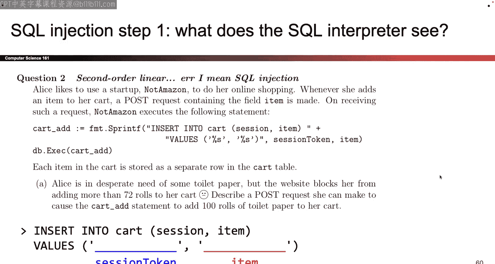

# 016：SQL注入与验证码


在本节课中，我们将要学习两种重要的网络安全概念：SQL注入攻击和验证码（CAPTCHA）。首先，我们会深入探讨SQL注入的工作原理、其危害以及如何防御。随后，我们将了解验证码的设计目的、面临的挑战以及其在安全领域中的作用。

## SQL注入攻击

上一节我们回顾了跨站脚本攻击（XSS），本节中我们来看看另一种常见的服务器端漏洞：SQL注入。SQL注入攻击利用了应用程序在处理用户输入时的不严谨，使得攻击者能够执行非预期的SQL命令。

### 数据库与Web服务器交互模型

为了理解SQL注入，我们需要先了解一个典型的Web应用架构。Web服务器通常不直接存储海量数据（如用户信息、商品详情），而是依赖一个独立的数据库服务器。当用户通过浏览器（客户端）发送请求时，Web服务器会解析请求，并根据需要向数据库服务器查询或修改数据。两者之间使用SQL语言进行通信。

### SQL语法快速回顾

以下是SQL的核心操作，用于从数据库中检索和操作数据：

*   **SELECT**: 用于从数据库表中查询数据。
    ```sql
    SELECT name, age FROM users;
    ```
*   **WHERE**: 用于过滤记录，只返回满足条件的行。
    ```sql
    SELECT * FROM products WHERE price > 100;
    ```
*   **INSERT INTO**: 用于向表中插入新记录。
    ```sql
    INSERT INTO students (id, name) VALUES (1, 'Alice');
    ```
*   **UPDATE**: 用于更新表中已存在的记录。
    ```sql
    UPDATE accounts SET balance = 0 WHERE user = 'attacker';
    ```
*   **DELETE**: 用于从表中删除记录。
    ```sql
    DELETE FROM logs WHERE date < '2023-01-01';
    ```
*   **注释**: SQL中使用双连字符 `--` 来注释后续文本。

### SQL注入原理

漏洞的核心在于，Web服务器在构造SQL语句时，直接将用户输入的数据（例如搜索关键词）拼接进查询字符串中。如果用户输入的内容包含了特殊的SQL语法，那么整个拼接后的字符串就会被数据库解释并执行。

例如，一个登录查询的原始语句可能是：
```sql
SELECT * FROM users WHERE username = '[用户输入]' AND password = '[用户输入]';
```
如果用户在用户名字段输入 `admin' --`，那么最终的查询语句会变成：
```sql
SELECT * FROM users WHERE username = 'admin' --' AND password = '[用户输入]';
```
由于 `--` 是注释符，其后的密码检查部分被忽略，攻击者可能无需密码就能以管理员身份登录。

更严重的攻击可能包括插入 `DROP TABLE users;` 等语句来删除整个数据表。

### 盲SQL注入

在实际攻击中，攻击者可能无法直接看到查询结果或数据库结构。这种场景下的SQL注入称为“盲注”。攻击者需要通过观察应用程序的响应（如页面加载时间、错误信息、真/假状态）来推断注入是否成功以及数据库的详细信息。这通常需要结合猜测和自动化工具。

### 防御SQL注入

以下是两种主要的防御策略：

1.  **输入验证与转义**：对用户输入进行严格的检查，过滤或转义可能被解释为SQL命令的特殊字符（如单引号、分号、注释符）。然而，手动实现完善的转义逻辑非常复杂且容易出错，因此推荐使用经过严格测试的库函数来完成此任务。

2.  **参数化查询（预编译语句）**：这是最有效、最根本的防御手段。其原理是将SQL语句的结构与数据分离。首先，使用占位符（如 `?`）定义查询模板。然后，数据库引擎会**先编译**这个模板，确定其执行计划。最后，再将用户输入的数据作为**纯数据参数**绑定到占位符上。由于在编译阶段语句结构已经固定，后续传入的数据无论如何都不会被当作SQL代码执行。
    ```python
    # 伪代码示例：使用参数化查询
    cursor.execute("SELECT * FROM users WHERE username = ? AND password = ?", (username, password))
    ```

参数化查询如果正确实施，可以近乎100%地防御SQL注入攻击。

### 命令注入的泛化

SQL注入是“命令注入”攻击的一种特定形式。命令注入的广义概念是：**任何将用户输入未经充分处理就直接拼接进系统命令、脚本或查询语言中并执行的情况**。这可以发生在操作系统命令（如通过`system()`调用）、LDAP查询、XPath查询等多种场景。其防御思路与SQL注入一致：避免拼接，使用安全的API将数据与命令分离。

## 验证码

现在，让我们从技术性较强的SQL注入转向一个更偏向人机交互的话题：验证码。

### 验证码的目的

验证码的全称是“全自动区分计算机和人类的公开图灵测试”。它的核心目标是：**提出一个对人类来说容易解决，但对计算机（当前）来说难以解决的问题**，从而区分访问者是真实用户还是自动化程序（机器人）。

### 验证码的常见类型与挑战

以下是几种常见的验证码形式：

*   **识别扭曲文本**：要求用户输入图片中显示的扭曲字母或数字。
*   **图像分类**：例如，“选择所有包含交通灯的图片”。
*   **音频挑战**：听取一段语音并输入听到的内容。

验证码面临的主要挑战包括：
1.  **人工智能的进步**：随着机器学习，特别是深度学习的发展，许多曾经对人类简单的任务（如字符识别、图像分类）对机器来说已不再困难。
2.  **可用性问题**：为了难住机器，验证码可能变得对部分用户（如视障用户）或所有用户都过于复杂或令人沮丧。
3.  **无法区分“好”机器人与“坏”机器人**：验证码会阻止所有自动化访问，包括有益的机器人，如搜索引擎的爬虫、网站存档工具等。

### 针对验证码的攻击

从安全角度看，验证码并不能完全阻止恶意自动化攻击：

*   **人工打码农场**：攻击者可以将需要解决的验证码发送到廉价的在线人工服务（“打码农场”），由真人代为解决。这使得攻击变成了一个经济成本问题：发动攻击需要支付每验证码几分钱的费用。
*   **自动化破解**：针对某些类型的验证码，攻击者可能利用专门的OCR软件或机器学习模型进行自动化破解。

因此，验证码的主要作用是**提高自动化攻击的成本和复杂度**，而非彻底杜绝。

## 总结

本节课中我们一起学习了两个关键主题。

首先，我们深入探讨了**SQL注入攻击**。我们了解了其原理：当Web应用程序将用户输入不经验证地拼接到SQL语句中时，攻击者可以注入恶意SQL代码，从而窃取、篡改或破坏数据库数据。我们介绍了两种核心防御方法：对输入进行严格的验证与转义，以及更有效的**参数化查询（预编译语句）**。我们还提到了“盲注”攻击以及将SQL注入泛化理解的“命令注入”概念。

其次，我们探讨了**验证码**。验证码旨在区分人类用户和自动化程序。我们讨论了其常见类型、面临的技术与可用性挑战，以及其安全局限性——它主要通过增加经济成本来阻碍自动化攻击，而非提供绝对防护。



通过理解这些攻击和防御机制，我们可以更好地构建和维护安全的Web应用程序。