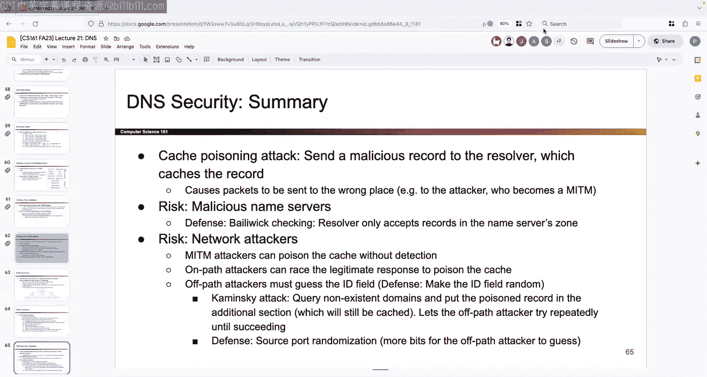

# 021：DNS

## 概述

在本节课中，我们将要学习域名系统（DNS）。DNS是互联网运行的关键协议，负责将人类可读的域名（如 `www.google.com`）翻译成机器可读的IP地址（如 `8.8.8.8`）。我们将从DNS的基本工作原理开始，了解其协议格式，并最终探讨其面临的安全威胁，特别是缓存投毒攻击。

---

## 项目二提醒与调试建议

上一节我们介绍了网络层的一些概念，本节我们来看看与当前课程项目相关的一些建议。

在开始深入DNS之前，需要提醒大家，项目二正处于紧张的编码阶段。如果你还没有开始编写代码，那么进度已经落后了。这个项目需要编写和调试大量代码，建议你立即开始。

以下是关于高效调试的一些建议：

*   **使用调试器**：我们首次提供了详细的调试器设置指南。调试器允许你检查变量、单步执行函数、设置断点，这比反复添加打印语句或仅靠肉眼检查代码要高效得多。
*   **增量编码与测试**：不要试图在截止日期前一次性编写数百行代码并祈祷它能通过测试。边写边测试、编写辅助函数并进行单元测试是更可取的方法。现在投入时间进行测试，可以避免后期陷入调试的困境。

关于项目二的测试，需要明确以下几点：

*   我们提供的基础测试是功能测试，例如存储和加载文件是否能得到正确结果。
*   我们**没有**提供任何边界情况或攻击场景的测试。检查这些情况是你的责任。
*   攻击者不会提前告知他们的攻击方式，因此你需要主动思考并设计防御方案。
*   测试覆盖率指标（coverage flags）可以提示你是否考虑了与我们（课程设计者）相同的测试点，但达到100%覆盖率并不保证你的实现是完美的。

项目二难度很高，不需要获得满分也能通过本课程。历史上得分分布也表明，获得满分非常困难。请保持信心，这是本课程最具挑战性的部分之一。

---

## TLS握手回顾与DNS引入

在上一节课中，我们详细介绍了TLS握手协议。TLS为我们提供了通信的**保密性**和**完整性**，其核心目标可以总结如下：

*   **保密性与完整性**：客户端和服务器通过RSA或Diffie-Hellman交换共享密钥，并利用该密钥和随机数生成加密和MAC密钥，从而加密和验证消息。
*   **服务器身份验证**：服务器发送包含其公钥的证书。通过成功解密预主密钥（RSA）或对Diffie-Hellman参数进行签名，服务器证明自己拥有对应的私钥。
*   **防止重放攻击**：连接中的随机数防止了不同连接间的重放攻击；加密消息中的记录号（或时间戳）防止了同一连接内的重放攻击。

TLS提供了端到端的安全，但它不提供匿名性，也无法防止攻击者丢弃消息（可用性攻击）。更重要的是，如果通信的另一端本身就是攻击者，那么所有安全措施都将失效。

至此，我们已经完成了对传统OSI/TCP-IP协议栈模型（上世纪70年代）主要层次的讨论。接下来的主题，如DNS，对于互联网运行至关重要，但无法清晰地归入该模型的某一层。今天，我们将重点学习DNS。

---

## DNS基础：为何需要它？

计算机通过IP地址进行寻址，例如 `192.0.2.1`。这种数字格式对机器路由数据包非常有用，但对人类来说难以记忆和使用。

相反，当我们在浏览器中访问网站时，我们输入的是**域名**，例如 `www.berkeley.edu`。这种格式对人类友好，但对机器没有直接意义。

这就产生了一个根本性的不匹配：人类使用域名，机器使用IP地址。**DNS的作用就是充当翻译协议**，将人类可读的域名转换为机器可读的IP地址。这个过程称为**查询**或**查找**。

---

## DNS架构：名称服务器与层次结构

显然，我们的个人电脑不可能记住所有域名到IP地址的映射。这个任务由互联网上专门的服务器——**名称服务器**——来完成。名称服务器的唯一职责就是接收DNS查询数据包，进行翻译，并返回包含IP地址的响应数据包。

如果只有一个名称服务器，会面临**可扩展性**问题：它需要存储所有映射、处理所有查询，并且一旦宕机会导致整个互联网瘫痪。这与之前证书系统中单一可信源的问题类似。

因此，DNS采用了分布式设计，由**多个名称服务器**共同承担职责。这引出了两个核心设计思想：

1.  **不放弃原则**：如果一个名称服务器不知道答案，它**不能**直接回复“不知道”。它必须要么知道答案，要么将查询者**重定向**到另一个可能知道答案的服务器。
2.  **层次化组织**：所有名称服务器被组织成一个**树形层次结构**。结合第一个思想，查询可以沿着这棵树向下进行，直到找到能给出最终答案的服务器。

这个树形结构基于域名本身的层级关系。例如，`eecs.berkeley.edu` 是 `berkeley.edu` 的子域，而 `berkeley.edu` 又是 `.edu` 的子域。

在这个层次结构中：
*   每个节点（方框）代表一个独立的名称服务器。
*   节点内的标签（如 `.edu`, `berkeley.edu`）表示该服务器**负责管辖**的域名区域（称为“区”）。

---

## DNS查询流程示例

让我们通过一个查询 `eecs.berkeley.edu` 的IP地址的例子，来 walkthrough 整个流程：

1.  **询问根服务器**：查询通常从**根名称服务器**开始。每个设备都预先知道根服务器的IP地址（硬编码）。我们向根服务器发送查询：“`eecs.berkeley.edu` 的IP地址是什么？”
2.  **根服务器的响应**：根服务器负责整个 `.`（根）区。它不知道 `eecs.berkeley.edu` 的具体IP，但它知道 `.edu` 区由哪些服务器负责。因此，它回复：“我不知道，但你去问 `.edu` 名称服务器吧，这是它的域名和IP地址。”
3.  **询问 .edu 服务器**：我们接着向 `.edu` 名称服务器发送同样的查询。
4.  **.edu 服务器的响应**：`.edu` 服务器负责 `.edu` 区，但不知道 `berkeley.edu` 子域的具体IP。它回复：“我不知道，但你去问 `berkeley.edu` 名称服务器吧，这是它的域名和IP地址。”
5.  **询问 berkeley.edu 服务器**：我们最后向 `berkeley.edu` 名称服务器发送查询。
6.  **获得最终答案**：`berkeley.edu` 名称服务器负责 `berkeley.edu` 区，它知道 `eecs.berkeley.edu` 的IP地址，并最终将这个答案返回给我们。

在整个过程中，我们的问题（查询内容）没有改变，只是询问了不同层级的、更专业的服务器。

---

## 递归解析器与缓存

在实际应用中，我们的个人电脑（存根解析器）通常不会亲自完成上述所有查询步骤，因为这样效率低下。相反，我们会将查询任务**外包**给一个**递归解析器**（通常由ISP或公共DNS服务如8.8.8.8提供）。

工作流程变为：
1.  你的电脑向递归解析器发送查询。
2.  递归解析器代表你执行上述完整的迭代查询过程（询问根 -> .edu -> berkeley.edu）。
3.  递归解析器获得最终答案后，将其返回给你的电脑。

这种模式带来了一个关键优势：**缓存**。

递归解析器会**缓存**它收到的所有DNS记录。如果后续有用户查询相同的域名（如 `eecs.berkeley.edu`），或者查询同一区内的其他域名（如 `cs.berkeley.edu`），解析器可以直接从缓存中提供答案，而无需再次进行完整的查询链。这极大地提升了DNS的响应速度，并减轻了根服务器和各级名称服务器的负载。

缓存的有效期由记录中的 **TTL（生存时间）** 字段决定。

---

## DNS协议细节

### 传输层协议：为何选择UDP？

DNS主要使用**UDP**协议，目的端口号为**53**。选择UDP而非TCP，主要出于**速度**考虑。DNS查询非常频繁，每次网页访问前几乎都需要进行DNS查询，因此必须尽可能快。

UDP能够满足需求，是因为典型的DNS查询和响应都可以封装在**单个UDP数据包**内。如果包丢失，重新发送查询即可，无需TCP复杂的连接建立和可靠性保障机制。

### DNS报文格式

一个DNS报文在UDP载荷中具有固定的格式，主要包含以下部分：

*   **事务ID**：一个16位的随机数，用于匹配查询和响应。
*   **标志字段**：包含一些控制信息（如查询/响应标识、递归期望等）。
*   **计数字段**：分别指出后续四个章节中各有多少条记录。

DNS报文的核心是**资源记录**。所有数据都以RR的形式存储和传输。每个RR包含：
*   **名称** 和 **值**：存储实际数据（如域名和IP地址）。
*   **类型**：定义记录中数据的种类。最重要的两种类型是：
    *   **A记录**：将域名映射到IPv4地址。`名称=域名`, `值=IP地址`。
    *   **NS记录**：指定负责某个区的权威名称服务器。`名称=区名`, `值=该名称服务器的域名`。
*   **TTL**：该记录在缓存中有效的秒数。

### DNS报文的四个章节

创建的资源记录会被放入以下四个章节之一，这取决于记录的作用：

1.  **问题章节**：包含要查询的问题。例如，一个类型为A、名称为 `eecs.berkeley.edu`、值留空的记录。
2.  **答案章节**：包含对查询问题的直接回答。例如，一个类型为A、名称为 `eecs.berkeley.edu`、值为其IP地址的记录。
3.  **权威机构章节**：当服务器不能直接回答，但知道谁可以回答时，它会在这里放置NS记录，将查询者引向下一级权威名称服务器。
4.  **附加信息章节**：通常包含一些“粘合记录”，例如，在权威机构章节指出下一个名称服务器的域名后，附加信息章节会提供该名称服务器对应的IP地址（A记录），从而避免查询者为了找这个IP地址而发起另一次DNS查询。

---

## DNS安全与攻击

DNS协议设计之初并未考虑安全性，没有加密、完整性校验或身份验证。因此，它面临多种攻击。

### 攻击目标：缓存投毒

所有攻击的核心目标都是**DNS缓存投毒**。攻击者试图向递归解析器的缓存中注入**错误的域名-IP映射**。一旦成功，所有后续查询该域名的用户都会被引导到攻击者控制的IP地址，从而使攻击者能够进行中间人攻击。

### 威胁模型与攻击方式

1.  **恶意名称服务器**：如果攻击者攻陷了一个权威名称服务器，该服务器可以直接返回错误的答案。防御措施是**管辖检查**：解析器只接受与所查询名称服务器管辖范围相关的记录。例如，`.edu` 服务器返回 `google.com` 的记录就会被拒绝。
2.  **中间人攻击者**：能够拦截并修改链路上数据的攻击者。由于DNS没有完整性保护，他们可以篡改任何查询或响应。对此基本无解。
3.  **路径上的攻击者**：可以窃听但不一定修改流量的攻击者。他们可以**伪造响应**并与合法响应**竞争**。谁先到达解析器，解析器就接受谁的答案。
4.  **路径外的攻击者**：无法窃听流量的攻击者。他们也可以尝试伪造响应，但面临一个挑战：必须猜对DNS报文中的**事务ID**（以及可能的**源端口号**，如果启用了源端口随机化）。这增加了攻击难度。

### 卡明斯基攻击

这是DNS缓存投毒中一种巧妙且影响深远的攻击，由Dan Kaminsky发现。它改变了攻击的游戏规则。

*   **传统攻击的局限**：攻击者尝试毒化一个真实域名（如 `google.com`）的缓存。如果失败（猜错ID或响应慢），正确的记录会被缓存，攻击者必须等待TTL过期（可能几天或几周）才能再次尝试。
*   **卡明斯基攻击的创新**：
    1.  **查询不存在的子域**：诱使受害者查询大量随机的、不存在的子域，例如 `random123.google.com`。这些域名没有真实的权威记录。
    2.  **在附加信息中投毒**：攻击者伪造对这些不存子域查询的响应。在响应中，除了回答这个不存子域（答案可能为空或错误），攻击者还在**附加信息章节**插入他们真正想毒化的目标域名（如 `www.google.com`）的错误IP映射。
    3.  **利用管辖检查**：由于查询是针对 `*.google.com`，响应来自（或声称来自）`google.com` 的权威服务器，因此附加信息中关于 `www.google.com` 的记录能通过管辖检查。
    4.  **无限重试**：如果攻击失败（猜错ID），对于 `random123.google.com` 这个不存子域，要么没有答案被缓存，要么缓存了一个“不存在”的记录。这**不会**影响攻击者对 `www.google.com` 的下一次投毒尝试。攻击者可以立即利用下一个不存子域查询（`random456.google.com`）再次发起攻击。

**关键点**：卡明斯基攻击将“一次失败，等待TTL”的模式，转变为“失败后可以立即重试”，只要受害者持续产生新的不存子域查询。这使得即使ID和端口号有32位（约40亿种可能）的熵，在攻击者能够发起海量攻击请求的情况下，也变得可能被暴力破解。

### 防御措施

*   **源端口随机化**：在事务ID之外，随机化UDP源端口，增加攻击者需要猜测的熵。
*   **DNSSEC**：DNS安全扩展，为DNS响应提供密码学上的来源验证和数据完整性保护，从根本上解决伪造问题。但部署复杂，普及率有限。
*   **验证粘合记录**：对附加信息章节中的记录进行额外的独立验证。

---

## 总结

本节课我们一起学习了域名系统（DNS）。

*   我们首先理解了DNS作为互联网“电话簿”的核心作用，即完成域名到IP地址的翻译。
*   我们探讨了DNS的分布式、层次化架构，以及递归解析器和缓存机制如何使其高效运行。
*   我们深入分析了DNS协议格式，包括其使用UDP传输、报文结构、资源记录类型和四个核心章节。
*   最后，我们重点研究了DNS的安全性问题，特别是**缓存投毒攻击**。我们分析了不同威胁模型下的攻击方式，并详细剖析了极具代表性的**卡明斯基攻击**。该攻击通过查询不存子域并利用附加信息章节，实现了对目标域名缓存的无限次重试攻击，凸显了原始DNS协议在安全上的根本缺陷。

理解DNS的工作原理和安全挑战，对于构建和维护安全的网络应用至关重要。