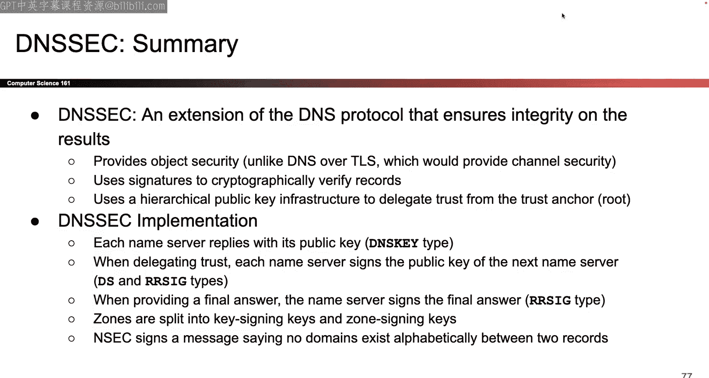

# 022：DNSSEC

## 概述

在本节课中，我们将学习如何为DNS协议添加安全性。DNS本身没有内置加密，容易受到网络攻击者和恶意域名服务器的攻击。我们将设计一个名为DNSSEC的协议扩展，通过数字签名和证书链来确保DNS记录的完整性，防止缓存投毒攻击。我们将从设计目标开始，逐步构建协议，并最终了解其实现细节。

## 从回顾DNS开始

上一节我们介绍了DNS的工作原理。DNS的核心思想是：存在许多分布式的域名服务器。当你向一个域名服务器查询某个域名的IP地址时，如果它不知道答案，它会将你重定向到其他服务器。遍历这些服务器的方式是通过树形结构组织它们：从根服务器开始，如果它不知道答案，就重定向到树中更下层的服务器，直到找到知道答案的服务器。

我们还讨论了如何实际实现DNS。为了获得良好的缓存性能，所有信息都被组织成**记录**。每个记录都有一个数据类型，并被归类到四个区段之一。这样，返回的每个记录都可以被缓存，从而避免重复查询，提高速度并减轻服务器负担。最后，我们提到DNS的设计初衷是追求速度，因此缓存至关重要。然而，我们之前讨论的DNS完全没有使用密码学，这使得它容易受到攻击。

## 面临的威胁与设计目标

上一节我们介绍了DNS的弱点，本节中我们来看看如何修复它。我们需要保护DNS免受两类攻击者的侵害：
1.  **恶意域名服务器**：它们可以发送错误的答案。DNS通过授权检查来部分防止这种情况，例如，一个`.edu`域名服务器只能发送`.edu`域内的恶意记录，但不能发送`google.com`的恶意记录。
2.  **网络攻击者**：类似于TCP攻击，如果攻击者位于路径上（中间人攻击），他们可以随意攻击DNS，因为没有保护措施。如果攻击者不在路径上，他们需要猜测一些信息，但Kaminsky攻击使得这种猜测变得更加可行。

因此，我们的目标是修复DNS，为其添加额外的密码学机制，使其变得安全。这非常巧妙，因为它结合了密码学单元的知识和DNS协议本身。

## 尝试一：使用TLS保护DNS？

我们之前已经见过一个解决网络攻击者问题的协议：TLS。TLS提供端到端的安全性，只要连接安全建立，路径上的攻击者就无法干扰。那么，我们是否可以直接使用TLS来保护DNS呢？例如，让解析器与服务器之间、递归解析器与根服务器之间都建立TLS连接。

这种方法在一定程度上可行，但存在几个问题：
1.  **性能问题**：DNS要求极快的速度，但TLS握手过程冗长。每次连接都需要完成完整的TLS握手，然后才能发送一条消息，这会增加显著的延迟。
2.  **缓存问题**：TLS保护的是通信**通道**本身（通道安全）。即使你通过安全的TLS连接收到了一个受保护的记录并将其存入缓存，之后如果有人篡改了缓存中的数据，TLS无法检测到这一点，因为连接早已关闭。
3.  **无法阻止恶意服务器**：TLS的端到端安全属性要求你与可信方通信。如果你与一个恶意的域名服务器建立了TLS连接，它仍然可以向你提供垃圾或恶意记录。同样，如果递归解析器本身被攻破，它也可以提供错误信息。

因此，虽然DNS over TLS在现实中有应用（例如某些Firefox浏览器），但它并不完美。我们需要为DNS量身定制一个新的安全协议。

## DNSSEC的核心设计理念

我们需要设计一个专门针对DNS的安全扩展（DNSSEC）。我们的设计目标很明确：**我们主要需要完整性，而不是机密性**。DNS记录（如域名到IP的映射）是公开信息，不需要保密。我们关心的是防止攻击者篡改记录并毒化我们的缓存。

以下是两个核心设计理念，它们将指导我们的协议构建：

### 核心理念一：使用数字签名确保记录完整性

我们需要一种密码学协议来保证记录的完整性。在众多协议中，我们可以排除那些提供机密性的（如AES），只考虑提供完整性的。剩下两个主要选择：**消息认证码（HMAC）** 和 **数字签名**。

*   **HMAC**：使用共享密钥，所有需要生成和验证MAC的实体都必须知道这个秘密。
*   **数字签名**：使用公钥/私钥对。只有持有私钥的一方可以签名，任何人都可以使用公钥进行验证。

对于DNS，我们更倾向于**数字签名**。因为我们希望**由域名服务器使用其私钥对记录进行签名**，而**世界上任何其他人都可以使用对应的公钥来验证**签名。这样，只有记录发送者（域名服务器）可以签名，而所有人都可以验证，这符合DNS的公开查询特性。

**具体流程设想**：
1.  当递归解析器查询一个域名时，权威域名服务器不仅返回记录（如A记录），还会返回**该记录的签名**。
2.  同时，服务器需要提供用于验证签名的**公钥**。
3.  解析器收到记录、签名和公钥后，使用公钥验证签名。如果验证通过，则说明记录在传输过程中未被篡改。

这解决了网络攻击者（中间人）的问题，因为他们不知道私钥，无法伪造有效的签名。同时，这也实现了**对象安全**：签名与记录绑定在一起，无论记录存储在缓存中还是通过任何不安全的通道传输，只要签名有效，记录就是可信的。

### 核心理念二：利用DNS层次结构构建公钥基础设施（PKI）/证书链

上面的方案还有一个关键问题：**如何确保收到的公钥本身是可信的？** 攻击者可以拦截响应，用自己的私钥签名一个假记录，并附上自己的公钥。解析器无法区分这是真正的公钥还是攻击者的公钥。

我们之前已经解决过公钥分发问题：使用**证书**。证书的本质是某个实体的公钥，由另一个你信任的实体签名。

巧妙之处在于，DNS本身就是一个树形层次结构（根 -> 顶级域 -> 二级域...）。我们可以**将这个DNS层次结构直接用作证书链（信任链）**。
*   **信任根**：我们隐式地信任根域名服务器。
*   **委托信任**：每个父域名服务器使用自己的私钥，为其子域名服务器的公钥签名，生成一个证书。例如，根服务器为`.edu`服务器的公钥签名。
*   **信任传递**：如果你信任根服务器，并且根服务器签名证明了`.edu`服务器的公钥，那么你现在就可以信任`.edu`服务器。`.edu`服务器再为`berkeley.edu`服务器的公钥签名，以此类推。

这样，我们就建立了一条从信任根（根服务器）到最终目标服务器的证书链。通过验证这一系列签名，我们可以确信最终用于验证记录签名的公钥是真实可信的。

## DNSSEC协议工作流程（高层视角）

结合以上两个理念，让我们看看一次完整的DNSSEC查询是如何工作的。我们以查询 `eecs.berkeley.edu` 的IP地址为例：

1.  **查询根服务器**：解析器问根服务器：“`eecs.berkeley.edu`的IP是什么？”
    *   根服务器回答：“我不知道，去问`.edu`服务器吧（提供NS和A记录）。**此外，这是`.edu`服务器的公钥，由我（根）签名（这是一个证书）。这是我的公钥，供你验证我的签名。**”
    *   解析器现在拥有了`.edu`服务器的可信公钥（因为根签名了它）。

2.  **查询`.edu`服务器**：解析器用刚得到的可信地址去问`.edu`服务器同样的问题。
    *   `.edu`服务器回答：“我不知道，去问`berkeley.edu`服务器吧（提供NS和A记录）。**此外，这是`berkeley.edu`服务器的公钥，由我（`.edu`）签名。这是我的公钥，供你验证。**”
    *   解析器现在拥有了`berkeley.edu`服务器的可信公钥。

3.  **查询`berkeley.edu`服务器**：解析器去问`berkeley.edu`服务器。
    *   `berkeley.edu`服务器回答：“`eecs.berkeley.edu`的IP是X.X.X.X（A记录）。**这是该A记录的签名，由我（`berkeley.edu`）的私钥生成。这是我的公钥，供你验证。**”
    *   解析器使用`berkeley.edu`的公钥验证A记录的签名。如何确信这个公钥是真的？因为它被`.edu`服务器签名了，而`.edu`的公钥又被根签名了。解析器可以沿着证书链一路验证回根，而根是隐式信任的。

**自底向上验证**：解析器最终收到答案后，可以这样验证：
*   用`berkeley.edu`的公钥验证A记录的签名。
*   用`.edu`的公钥验证`berkeley.edu`公钥的证书签名。
*   用根的公钥验证`.edu`公钥的证书签名。
*   信任根的公钥。

通过这种方式，DNSSEC确保了从根到最终答案的整个链条的完整性，有效防御了路径上的网络攻击和缓存投毒。

## 实现细节：在DNS记录中编码DNSSEC

DNSSEC必须向后兼容原始的DNS协议。我们不能改变DNS数据包的基本格式，只能在现有框架内添加新的记录类型来承载签名、公钥等信息。

以下是引入的新记录类型：

*   **RRSIG（资源记录签名）**：这种记录类型用于存储**数字签名**。它可以对单个记录或一组记录进行签名。
*   **DNSKEY**：这种记录类型用于存储**公钥**。域名服务器使用它来分发自己的公钥，以便验证者验证签名。
*   **DS（委托签名者）**：这种记录类型用于在信任链中**委托信任**。它包含子域名服务器公钥的哈希值（稍后解释为什么是哈希）。**DS记录本身需要由父服务器的私钥签名（通过RRSIG记录）**，这两条记录共同构成一个证书，证明“如果信任我（父），则应该信任这个子服务器”。

**一个重要的实现技巧**：由于DNS头部标志位有限且已固定，为了添加DNSSEC特有的标志（如“支持DNSSEC”），设计者采用了一种“伪区段”的方法，将额外的标志信息放在“附加信息”区段的一个特殊记录中。这体现了向后兼容设计带来的挑战。

**为什么DS记录存储的是公钥哈希？** 在DNSSEC中，DS记录不直接存储子服务器的公钥，而是存储其公钥的哈希值。具体原因没有明确说明，可能出于减少签名数据量或设计上的考虑。验证时，验证者需要先获取子服务器的DNSKEY记录（包含公钥），计算其哈希值，然后与DS记录中的哈希值比对，再验证DS记录上的签名。

## 进阶概念：KSK与ZSK（密钥分离）

在实际的DNSSEC部署中，每个域名服务器通常管理两对密钥，而不是一对：
1.  **密钥签名密钥（KSK， Key Signing Key）**：用于对**区域签名密钥（ZSK）** 进行签名。KSK使用频率较低，可以离线保存，安全性要求更高。
2.  **区域签名密钥（ZSK， Zone Signing Key）**：用于对域内的**所有资源记录（如A， NS， MX等）** 进行日常签名。ZSK使用频繁，在线保存。

**工作流程**：
*   服务器的KSK公钥由其父服务器通过DS记录认证。
*   服务器用自己的KSK私钥对自己的ZSK公钥进行签名（通过RRSIG记录），建立自身KSK到ZSK的信任链接。
*   服务器用ZSK私钥对所有的DNS资源记录进行签名。
*   验证时，验证者先通过父的DS记录验证该服务器的KSK公钥，再用KSK公钥验证其ZSK公钥，最后用ZSK公钥验证具体的资源记录签名。

**优点**：
*   **安全**：KSK可以离线存储，极大降低了被窃取的风险。即使在线ZSK泄露，也只需更换ZSK，而KSK保持不变，无需父服务器重新签发证书。
*   **灵活**：ZSK可以更频繁地轮换，而不影响整个信任链。

## 处理不存在的域名：NSEC与NSEC3

如何安全地证明一个域名不存在？简单地返回“未找到”并不安全，因为攻击者可以用它替换掉一个有效的已签名响应。

DNSSEC的解决方案是**NSEC（下一代安全记录）**：
*   权威服务器预先对其拥有的所有域名进行排序。
*   当查询一个不存在的域名时，服务器返回一个NSEC记录，指出**按字母顺序，该不存在的域名位于哪两个存在的域名之间**，并对这个NSEC记录进行签名。
*   例如，假设服务器拥有`a.example.com`和`c.example.com`。查询`b.example.com`时，返回签名的NSEC记录，声明“在`a.example.com`和`c.example.com`之间没有域名”。验证者可以确信`b.example.com`确实不存在。

**NSEC的问题**：它会**暴露域内所有有效的域名**，因为攻击者可以通过反复查询不存在的域名来“遍历”出所有存在的域名。

**NSEC3** 作为改进：
*   它不是对域名本身排序，而是先对域名进行**哈希**，然后对哈希值排序。
*   返回的NSEC3记录指出查询域名的哈希值位于哪两个哈希值之间。
*   由于哈希函数的单向性，从哈希值反推原始域名非常困难，从而减缓了域名枚举攻击。不过，如果域名是常见词汇，仍可能被暴力破解。

## 重要实践要点

1.  **离线签名生成**：为了提高安全性和效率，域名管理员可以在离线、安全的环境中用私钥（尤其是ZSK）预先生成所有记录的签名（RRSIG）。然后，只需将这些签名部署到在线的域名服务器上。这样，即使在线服务器被入侵，攻击者也拿不到私钥，无法伪造新的签名。
2.  **必须进行末端验证**：使用DNSSEC时，**最终客户端必须自己验证签名链**，而不能完全依赖递归解析器。如果客户端只是请求递归解析器进行DNSSEC查询并返回“已验证”的结果，那么递归解析器本身可能成为攻击点（提供假结果但声称已验证）。客户端需要获取完整的DNSSEC响应数据（记录、签名、公钥链）并自行验证，或使用一个本地可信的、执行验证的解析器。

## 总结

本节课中，我们一起学习了DNSSEC，这是一个为DNS协议添加安全性的扩展。我们从分析原始DNS的安全缺陷出发，确立了确保记录完整性（而非机密性）的核心目标。通过引入**数字签名**来保护单个记录，并巧妙地利用DNS固有的**树形层次结构作为证书链**来安全地分发公钥，我们构建了DNSSEC的基本框架。

我们深入探讨了其实现细节，包括新的记录类型（RRSIG， DNSKEY， DS）、向后兼容的挑战，以及密钥分离（KSK/ZSK）的进阶设计。我们还了解了如何安全地证明域名不存在（NSEC/NSEC3），并强调了**离线签名**和**末端验证**等重要实践原则。

DNSSEC是一个将密码学原理与现有网络协议深度融合的典范，它展示了在不破坏向后兼容性的前提下，为庞大而基础的系统添加安全层的复杂性与巧妙设计。