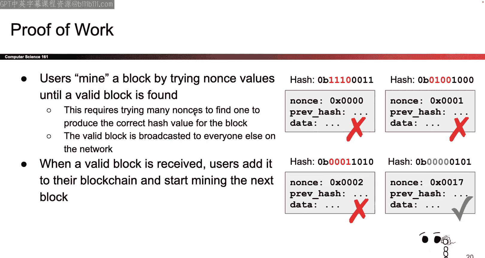

# 026：Tor与比特币基础

在本节课中，我们将学习两种重要的网络安全技术：Tor匿名网络和比特币的基础原理。我们将首先深入探讨Tor如何通过多层加密和多个中继节点来保护用户身份，然后介绍比特币如何在没有中央机构的情况下实现去中心化的交易记录。

## Tor匿名网络

上一节我们介绍了代理服务器的基本概念，本节中我们来看看如何扩展这个想法，构建一个更强大的匿名系统——Tor。

### Tor的基本原理

Tor的设计理念是使用多个代理（在Tor中称为“中继”）来转发网络流量，而不是依赖单一代理。通过这种方式，没有任何单个中继能同时知道通信的发起者和接收者。

以下是Tor网络的基本组成部分：
*   **中继节点**：网络中负责接收和转发数据包的服务器。
*   **Tor浏览器**：专门用于运行Tor协议的浏览器。
*   **目录服务**：用于发现可用中继节点的方式（本节课不深入讨论）。

### Tor协议的工作方式

Tor协议的核心思想是建立一条由多个中继节点组成的加密路径（称为“电路”）。数据在这条路径上传输时，会被层层加密，就像洋葱一样。

#### 方法一：嵌套的TLS连接

首先，用户（Alice）会与第一个中继节点建立标准的TLS安全连接。然后，Alice会通过这个连接，请求第一个中继帮她与第二个中继建立另一个TLS连接。这个过程会重复，直到与第三个（出口）节点建立连接。最终，通过这条加密路径，Alice可以与目标服务器（Bob）通信。

#### 方法二：洋葱式加密

另一种理解方式是“洋葱路由”。Alice想要发送给Bob的消息（例如“Hello World”）会被多层加密包裹。
1.  首先，用出口节点（第三个中继）的密钥加密，指令为“发送给Bob：Hello World”。
2.  然后，用中间节点（第二个中继）的密钥加密整个包，指令为“发送给中继3”。
3.  最后，用入口节点（第一个中继）的密钥再次加密，指令为“发送给中继2”。

消息发送后，每个中继依次解密自己那一层，看到“转发给下一个节点”的指令，并将内层的加密数据包继续传递。出口节点解密最后一层后，将原始消息发送给Bob。

#### 方法三：层层剥离

这个过程也可以看作是每个中继节点“剥开”属于自己的一层加密。入口节点剥开外层，看到“转发给中继2”；中继2剥开自己那层，看到“转发给中继3”；出口节点剥开最后一层，看到“发送给Bob：Hello World”，并执行操作。

### 每个中继知道什么？

理解Tor匿名性的关键在于了解每个中继节点掌握的信息是有限的。

*   **入口节点**：知道消息来自Alice，并需要转发给中继2。不知道最终目的地是Bob，也不知道消息内容。
*   **中间节点**：知道消息来自中继1，并需要转发给中继3。既不知道原始发送者Alice，也不知道最终接收者Bob。
*   **出口节点**：知道消息来自中继2，并需要发送给Bob。如果Alice和Bob之间没有使用额外的加密（如TLS），出口节点还能看到消息内容（如“Hello World”）。但它不知道原始发送者是Alice。

因此，没有任何单个节点能同时知道“谁在和谁通信”。这比单一代理提供了更强的匿名性。

### Tor的弱点与权衡

尽管Tor很强大，但它也存在一些固有的弱点和设计上的权衡。

#### 1. 全局敌手与计时攻击

Tor主要防范的是“局部敌手”，即只能监控网络部分路径的攻击者。一个能够监控整个互联网流量的“全局敌手”可能通过**计时攻击**来破坏匿名性。例如，攻击者可能观察到Alice发送消息进入Tor网络后，大约一秒后Bob收到了一个消息；反之亦然。通过分析这种发送与接收的时间相关性，攻击者可能推断出Alice和Bob正在通信。完全防御这种攻击需要引入随机延迟，但这会严重损害Tor的可用性，因此Tor选择不在此方面提供强保障。

#### 2. 节点合谋

如果一条电路上的多个中继节点互相串通、共享信息，它们就能拼凑出完整的通信路径，从而破坏匿名性。攻击者可以通过自己运行大量中继节点来增加这种风险。为了降低合谋风险，用户可以增加电路中节点的数量（例如从默认的3个增加到6个或10个），但这会以牺牲速度为代价。

#### 3. 流量特征明显

使用Tor本身就会产生可识别的网络流量模式。网络监控者可以观察到用户正在与已知的Tor中继通信，从而知道该用户正在使用Tor。**匿名性只在人群中有效**——如果只有一个人在使用Tor，那么他的匿名行为本身就非常显眼。

#### 4. 出口节点的威胁

出口节点能看到未加密的流量内容，并可能对其进行篡改。因此，为了隐私和完整性，强烈建议在通过Tor访问网站时使用HTTPS（TLS）连接。

### Tor的用途

Tor主要有两类用途：
*   **抵抗审查**：帮助用户绕过网络封锁，访问被屏蔽的信息或服务。
*   **提供强匿名性**：这也被用于进行非法活动，例如访问“暗网”市场。需要注意的是，运行出口节点可能会因为转发非法内容而面临法律风险。

### 本节总结

本节中我们一起学习了Tor匿名网络。Tor通过将流量在多个中继节点间跳转，并对消息进行多层加密（洋葱路由），有效地隐藏了用户的身份和通信关系。它的核心优势在于没有单一实体能掌握完整的通信信息。然而，Tor也存在弱点，如难以抵御全局敌手的计时攻击、节点可能合谋、以及流量模式可被识别。此外，出口节点可能看到未加密的内容。Tor被用于抵抗审查，但也常与非法活动相关联。

---

## 比特币基础原理

上一节我们探讨了如何实现网络通信的匿名性，本节中我们来看看如何在没有中央权威（如银行）的情况下，创建一个可信的、去中心化的数字货币系统——比特币。

### 比特币要解决的问题

比特币旨在创建一个电子现金系统，它需要实现传统银行的功能（记录余额、处理转账），但**不依赖任何中心化的可信机构**。所有规则由密码学和分布式共识来保证。

### 身份问题：公钥即身份

在去中心化系统中，验证“Bob”的真实身份非常困难。比特币采用了一个巧妙的简化：**直接用公钥来代表一个身份**。我们不再关心公钥背后的人是谁（“Bob”），只关心谁拥有对应的私钥。发送货币就是向某个公钥发送。如果私钥丢失或被盗，相应的资金也就丢失了。

### 交易记录：全局账本

我们需要一个所有人都能访问和验证的公共账本（区块链的雏形）来记录所有历史交易。这个账本必须是：
*   **公开可读**：每个人都能查看。
*   **仅可追加**：可以添加新记录，但不能修改旧记录。
*   **防篡改**：确保历史记录不可更改。

### 构建安全的交易

#### 问题1：防止伪造支付

攻击者Mallory不能冒充Alice向自己转账。解决方案是**数字签名**。每一笔交易都必须由支付者用自己的私钥签名。只有拥有私钥的人才能授权花销该地址的资金。

#### 问题2：防止超额支付（双花）

需要确保支付者确实拥有他想要花费的金额。解决方案是**交易引用**。每一笔新交易必须明确引用其资金来源（即之前收到的某笔交易）。这就像在论文中引用参考文献一样。
*   例如，Dave要支付Alice 3个币和Bob 4个币，他必须在交易中注明：“这笔钱的来源是交易#2（我收到5币）和交易#3（我收到5币）”。
*   系统通过检查被引用的交易是否已经被花费过，来验证支付的合法性。
*   如果输入金额大于输出金额（比如10个币输入，7个币输出），差额可以作为“找零”支付回给自己。

通过这种方式，无需维护一个总余额表，只需跟踪每笔“未花费的交易输出”（UTXO）的状态即可。

### 确保账本不可篡改：哈希链

如何实现那个“仅可追加、不可更改”的公共账本？这里需要引入**哈希链**的概念。
*   将账本分成按时间顺序排列的“区块”。
*   每个区块包含一批交易数据，以及**前一个区块的哈希值**。
*   哈希函数具有“雪崩效应”，任何区块内容的微小改动，都会导致其哈希值彻底改变。
*   由于每个区块都包含前驱区块的哈希，改动一个历史区块会导致从该区块之后所有区块的哈希值都失效，这种改动会被轻易发现。

哈希链技术为创建不可篡改的历史记录提供了基础。

### 核心挑战：分布式共识与工作量证明

哈希链解决了数据结构的完整性，但最关键的问题依然存在：**在去中心化的环境中，由谁来负责将新区块添加到链上？如何防止攻击者创建不同的历史版本（分叉）来进行双花攻击？**

这就是**双花攻击**的本质：如果网络参与者对“哪条链是正统历史”没有共识，攻击者就可以对不同的受害者展示不同的交易历史，从而将同一笔钱花费两次。

解决方案不能是简单的“一人一票”，因为攻击者可以伪造大量身份（女巫攻击）。比特币的划时代创新是引入了**工作量证明**机制。
*   投票权与计算能力挂钩。想要添加新区块（即“记账”），必须完成一个耗时的密码学难题（通常是寻找一个满足特定条件的哈希值）。
*   这个计算过程需要消耗真实的CPU时间和电力，这就是“工作量证明”。
*   网络中最长的、累积工作量最大的那条链，被大家公认为有效链。
*   这种机制使得攻击者想要篡改历史或制造分叉，需要拥有超过全网诚实节点总和的计算力，这在实际中极其困难。

工作量证明是比特币实现无需信任的分布式共识的基石。

### 本节总结

本节中我们一起学习了比特币系统的基础构建模块。我们首先看到比特币用公钥代替真实身份，解决了去中心化下的身份问题。然后，通过数字签名和交易引用（UTXO模型），确保了支付授权和防止超额花费。接着，哈希链技术为交易记录提供了不可篡改的数据结构。最后，我们指出了系统的核心挑战——在无中心环境下达成共识、防止双花攻击，并引出了比特币的革命性解决方案：工作量证明机制。下一讲我们将深入探讨工作量证明的具体原理和比特币的完整运作流程。