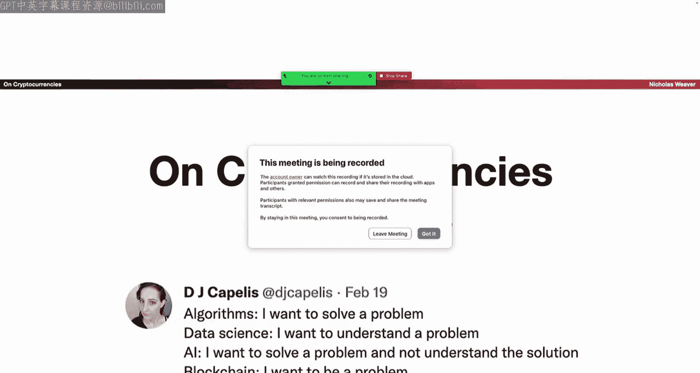
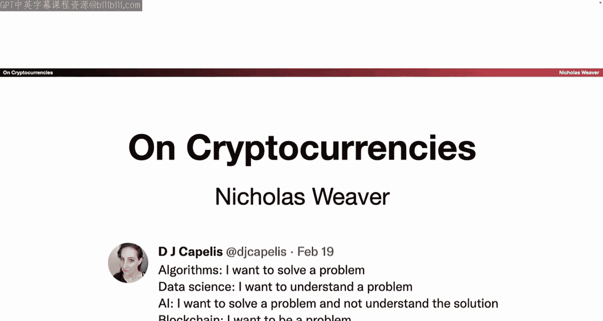

# 027：比特币 🪙

在本节课中，我们将学习比特币和区块链技术的基本概念、工作原理及其在现实世界中的应用与问题。我们将从技术基础开始，逐步探讨其设计、局限性以及引发的社会和经济问题。

---

## 什么是区块链？🔗

上一节我们介绍了课程背景，本节中我们来看看区块链的核心概念。区块链本质上是一个**仅可追加**的数据结构，可以将其理解为一个特殊的链表。

### 哈希链

哈希链是一个革命性的想法，起源于1980年。其核心思想如下：

我们有一个数据块。在该数据块中，包含前一个数据块的密码学哈希值。我们知道这个哈希值实际上是唯一且不可变的。

因此，如果我通过某种方式知道最后一个数据块（块N）是有效的，我就可以通过遍历链表、验证每个块是否具有正确的哈希值，从而以O(N)的操作验证所有历史记录。

这也使得添加新区块变得容易。这就是为什么它是一个优秀的仅可追加数据结构。你只需创建一个新块，将其放在前面，对前一个块进行哈希处理即可。

你的网络浏览器就经常使用哈希链来验证证书。如今，证书颁发机构有一个特性，即维护他们曾经颁发的每个证书的哈希链。

这是一个很好的结构，易于验证。证书撤销列表也是哈希链。

### 默克尔树

我们听过比特币支持者说，默克尔树是一项伟大的发明。默克尔树就是一个哈希树。这是一个来自1979年的非常出色的数据结构。

假设你有很多元素（L1, L2, L3, L4...），并且你想计算所有元素的密码学哈希值。传统方法是将它们全部连接起来，进行一次密码学哈希，但这意味着如果你想轻松添加更多元素，就必须重新哈希所有数据。

如果你想使这个哈希易于更新，只需将其构建为一棵树。你对元素进行哈希处理，然后对哈希值的组合再进行哈希，依此类推。要生成N个元素的树，你需要进行N log N次哈希计算。更新一个元素时，你只需要沿着树向上重新计算哈希。

这是一个很棒的小结构，可以快速进行密码学哈希并更新所有数据。它也在1979年获得了专利。

---

## 构建一个简单的私有区块链 🛡️

上一节我们介绍了哈希链和默克尔树，本节中我们来看看如何构建一个简单的私有区块链。

我们可以构建一个简单的私有区块链：
*   我们有一个具有公钥和私钥的单一服务器S。
*   我们有一个Git存档，我们将其修复为使用SHA-256。

所以，这是一个61B（课程编号）难度的项目。我们修复Git以使用真正的哈希函数。

每当发出拉取请求时，服务器会验证该拉取请求是否符合允许的标准，查看标准，接受拉取请求，并对修订版头部的哈希值进行签名。就这样。

你的私有区块链实现完成了。Git本身就被设计为一个仅可追加的数据结构。因此，通过对新的头部进行签名，我们能够验证整个存档。因为哈希值一个接一个地链接回去。

这就是为什么任何谈论私有区块链革命的人都是在胡说八道。我所说的“胡说八道”是从技术角度定义的，指那些不在乎自己所说真假的人。因为任何能从仅限特定写入者的仅可追加数据存储中受益的系统，都已经拥有了它。我们几十年前就知道如何构建这些了。

---

## 什么是加密货币？💰

上一节我们构建了一个私有区块链，本节中我们来看看什么是加密货币。加密货币是一种可交易的加密代币，其目标是创建无需中心化信任的、不可逆转的电子现金。

例如，假设有一种货币“夸脱鲁”（Quatlu）。如果爱丽丝想支付鲍勃200夸脱鲁来偿还赌输的绿色奴隶，那么应该没有其他人能够阻止或逆转这笔交易。

因此，它基本上是一个公共账本。有一个公共的、全球共享的文档，一个巨大的谷歌表格，记录了每个人的余额。这个神奇的谷歌表格有一个特性：我们只能向其中添加内容，不能删除。

所以，基本思路是：给定这个巨大的谷歌电子表格，爱丽丝写一张支票：“我，爱丽丝，支付鲍勃200夸脱鲁”，对其进行加密签名，然后将其添加到账本中。现在爱丽丝减少了200夸脱鲁，鲍勃增加了200夸脱鲁。

这个想法很简单：爱丽丝发送给鲍勃一张支票。鲍勃在公共账本中检查以确保爱丽丝的余额充足（根据账本细节，可能是查看旧的支票或查看余额）。鲍勃确认爱丽丝余额充足后，这张支票被添加到公共账本中，鲍勃的余额增加，爱丽丝的余额减少。

---

## 什么是（公共无许可）区块链？🌐

那么，什么是公共无许可区块链呢？其理念是：每个人收集未确认支票的副本。对于每张支票，你验证其有效性（资金是否充足）。我们将所有支票捆绑成一个“区块”，用前一个区块的哈希值将它们“钉”在一起。

现在，每个人只是做大量无用的工作，基本上就是：改变一个数字，检查哈希值；改变数字，检查哈希值；改变数字，检查哈希值...如果你足够幸运（哈希值满足特定条件），这个区块就会被添加到链上。然后你发布这叠新的支票。现在，每个人都知道这些新支票已经过验证，于是他们开始处理下一个区块。

这就是你获得这种去中心化、仅可追加数据结构的方式。基本上，每个人都创建一张支付给自己的支票，不断调整支票直到哈希值匹配。一旦有一个人幸运成功，他就发布这个区块，然后其他人开始基于这个新区块继续工作。

---

## 比特币是什么？₿

比特币只是这个理念第一次广泛的发展。之前还有很多其他尝试。

比特币钱包并不存储加密货币。它们只是加密私钥的存储器。你拥有私钥和公钥。花费比特币 simply就是写一张支票（交易）并广播它。

这是一笔真实的比特币交易：支付给罗斯·乌布利希（丝路创始人）的法律辩护基金，由这个比特币地址签名。这个地址是我创建的，当时我有一台需要磨合的16核处理器，我让它生成任意的比特币地址，然后得到了一个以特定文本开头的地址。

确实，你可以在公共账本中查找到这笔比特币交易，也有很好的服务可以让你查询。你可以看到这是我，支付给罗斯·乌布利希法律辩护基金。哦，这发生在他刚被定罪之后，因为我为他的母亲感到难过。

---

## 比特币挖矿 ⛏️

比特币挖矿只是比特币保护历史记录的方式。有很多方法可以做到，但比特币只是使用SHA-256。

比特币作为一个系统，全球范围内每秒只支持3到7笔交易。是的，未来的货币每秒只能处理3笔交易。如果这个教室里的每个人都想做一笔比特币交易，那将需要一分钟。

然后你进行工作量证明计算，基本上就是不断创建SHA哈希，直到得到一个足够低的值（即哈希值以足够多的零开头）。因为如果SHA哈希以足够多的零比特开头，很明显你必须进行大约2^N次哈希计算才能找到一个，但验证起来很容易。然后你广播它。

记住，工作量证明：SHA-256看起来是随机的，所以我稍微改变一下输入的一个小位，输出看起来就完全不同。因此，如果我向你展示一个以N个零开头的字符串，我（或尝试这样做的集体意识）必须进行大约2^N次哈希计算。所以，通过一次哈希计算（数据，哈希值有足够的零），你可以验证我或一组眼睛浪费了如此多的资源。

---

## 比特币的问题 ❌

不幸的是，这带来了一些问题。

### 数据膨胀与容量问题

首先，这导致数据膨胀。为了验证爱丽丝有余额，你可能需要检查自创世以来的每一笔交易。因此你必须维护完整的历史记录。这非常低效。每个完整的比特币节点都可能需要访问整个交易历史。轻量级节点仍然需要区块头和查询能力。这是所有区块链的通病。所有区块链都遭受巨大的膨胀问题。你可以尝试修剪，但这并不奏效。

这也意味着，如果有一万个人都在维护区块链，你不仅拥有这个巨大的多太字节数据结构，而且还有成千上万个这个多太字节数据结构的副本。这不是运行一个系统的高效方式，对吧？

但还有容量问题。为了将比特币的增长限制在每10分钟仅1兆字节的区块，全球范围内每秒只有3到7笔交易。这意味着任何比特币取代货币的设想都需要可信的、中心化的实体来维护一个包含每个人余额的中心化数据库。我们几十年前就知道如何构建这个了，它叫做银行。

### 实际应用案例：萨尔瓦多

有多少人听说过萨尔瓦多使用比特币作为货币？嗯，那是个谎言。你看，萨尔瓦多的独裁者是个疯子。但他脑子里想的一件事是：哦，比特币，这是货币的未来。萨尔瓦多实际上没有自己的货币，萨尔瓦多使用美元，以确保政府中的疯子不会印钞并导致经济崩溃。

所以他宣布比特币将成为与美元并行的允许使用的货币。我们要推出一个新应用“Chivo钱包”，每个人都可以在手机上安装。当你安装时，你会得到价值20美元的免费比特币来消费。结果，每个人都花掉了他们的比特币，然后就再也不碰它了。但有趣的部分是：实际上没有人为此使用比特币，他们只是在Chivo钱包到Chivo钱包之间转移一个中心化数据库中的余额。

### 价格冲击与能源问题

另一件事是，比特币有价格冲击问题。当交易量低于区块容量时，交易费用便宜；当交易量超过区块容量时，价格会螺旋式上升。有人为了取乐而故意引发价格螺旋。以太坊也遭受同样的问题。以太坊，费用便宜，便宜，便宜，突然有人进行“变异猿”或“ slurp juices”交易，接下来一天的费用飙升，除非人们愿意支付比之前多五倍的费用，否则无法交易。

比特币尤其存在能源问题。它波动不定，我想它现在又回升到荷兰国家级的耗电量了，但基本上比特币消耗了全球约2%的电力，以在全球范围内实现每秒3到7笔交易。这是因为工作量证明创造了这种“红皇后竞赛”设计：只要有潜在利润可图，算力就会增加。

所以，如果我打个响指，突然地球上所有计算机的耗电量都变为原来的1/100，杰夫·贝佐斯会非常高兴，因为突然他的数据中心运行成本几乎为零。但如果我对比特币矿工这样做会发生什么？突然所有比特币矿工现在会购买100倍多的矿机，然后一切又回到原来的状态。在不降低比特币价格、减少区块奖励或改变验证方式为“权益证明”模型（基本上就是“谁有黄金谁制定规则”）的情况下，无法减少比特币的能耗。

确实，是能源的浪费保护了比特币吗？比特币的安全性纯粹基于消耗相当于泰国一个国家的能源。但之所以这么糟糕，是因为女巫攻击问题。

### 女巫攻击与共识

加密货币领域有很多关于“共识”的讨论，即系统如何就共同的历史观达成一致。但很多问题不是共识，而是女巫攻击预防：有人只是启动无数个节点说：“我有无数票。”

加密货币领域提出的解决方案并不好。要么消耗一个主要国家的能源量，要么就明文规定一个“谁拥有加密货币，谁就运行加密货币”的系统。有一个更简单的方法来处理女巫攻击：你不处理。这被称为预防女巫攻击的“身份”方法。

以人类为基础的协议为例：确定M个可信赖的个人。最终，只需要其中超过一半加一个人是诚实的。他们聚在一起，共同维护中心账本。你基本上可以在M个树莓派计算机上做一个类似比特币的系统，消耗的能源少九个数量级。

为什么加密货币不这样做呢？首先，其中不少是在撒谎，实际上在幕后就是这么做的。任何时候你在设计中看到“可信验证者”之类的东西，你就有这些隐藏的、可信赖的个人。但加密货币不这样做的原因是，如果你想成为一个货币传输者（即将价值从一个人传输给另一个人），有一大堆烦人的法律，比如你不应该为毒品交易付款，不应该允许向俄罗斯勒索软件付款，不应该给钱资助朝鲜核武器计划，所有这些烦人的法律。而加密货币人士真正关心的，就是避开这些烦人的法律。

### 不可逆性与盗窃风险

另一个问题是加密货币不可逆转，没有补救方法。所以我向人们提出一个挑战：现在购买价值1500美元的比特币或以太坊。将其转移到一个你控制的公钥。你无法在不投入1500美元现金、转账给个人并让他们承担风险，或与交易所有现有业务关系的情况下做到这一点。

PayPal说你可以用PayPal购买比特币，对吧？你做不到。你登录，购买比特币，他们会持有它，不允许你实际占有比特币。这是因为现代电子金融的一切都设计为可逆的。这样，你可以进行补救，可以进行检测和响应。没有这个，你只能进行预防。

因此，比特币的卖家，即卖给你比特币的人，必须要么接受不可逆的付款（只收现金。是的，未来的货币，你想买就得带现金。），要么与买家有已建立的关系以便安全地提供信贷（所以如果你在交易所有现有账户，也许可以购买加密货币并立即转出），要么接受买家的存款并等待几天。

例如，我相信Soda Hall有一个以他命名的房间的这个人，损失了7万美元，因为他没有遵守这些规则。他很久以前得到了一些免费比特币，然后决定卖掉它，他卖给了某个使用PayPal的人，结果那是一张被盗的信用卡，他转移了比特币，被骗走了7万美元。我想Wass（可能指捐款人）能负担得起，但我们其他人负担不起。

但这也很容易被盗。你泄露了私钥，就很容易被拿走。大约8年前我写过一篇很棒的文章《通过比特币赚钱的10个简单步骤》（实际上有11步，因为差一错误）。结果是，你不能将加密货币存储在联网的计算机上。事实上，我们发现实践中一个非常有效的方法来知道是否有人入侵了你的某台计算机，就是在周围放一些小的、未受保护的比特币钱包，然后监控它们的余额。如果余额变为零，恭喜你，你发现你的电脑刚刚被入侵了。这不是开玩笑，我们实际上用这个方法来发现我们研究小组的一次入侵，因为我们有一些比特币零钱放在那里监控，一个研究生的账户被入侵，比特币被偷了，我们立刻就知道了。

所以你不能把比特币存在自己的电脑上。如果你把它存在硬件设备里，那么如果那个硬件设备坏了怎么办？嗯，那就永远没了。如果你有硬件设备和密码或种子短语（基本上是256位的随机垃圾）放在保险箱里，那么如果这些丢失了，比特币也就丢失了。但同时，你不能信任任何其他人来存储你的比特币。因为，让我们面对现实，有多少人认为老好人Sam（指Sam Bankman-Fried，FTX创始人）是那么值得信赖？嘿，他的父母是斯坦福法学教授，他妈妈实际上是专门研究伦理学的，我知道我们可以把加密货币交给Sam，我们可以信任Sam。这实际上是一个大问题。你不能可靠地将加密货币存储在别人那里，也不能存储在自己这里。安全专家都无法处理这个问题。你指望普通人怎么做？

### 用户体验与诈骗

更糟糕的是，有多少人听说过一个叫MetaMask的程序？对于那些没听说过的人，感谢你们的幸运星，因为这是有史以来最糟糕的程序之一。它是一个浏览器扩展，将你的加密货币账户（或你的加密货币密钥）连接到互联网。这样你就可以做一些事情，比如购买一张丑陋的猿猴JPEG图片的收据。MetaMask处理货币交易。

不幸的是，MetaMask的用户界面最好被描述为糟糕。如果有人点击钓鱼链接，告诉你点击错误的东西，你点击了“确定”，现在你所有的加密货币就永远消失了。数百万美元就这样没了。事实上，每天可能至少有10万，甚至100万美元从那些使用MetaMask点击错误东西的人那里被偷走。

然而，有很好的技术支持。如果你在Twitter（他称之为“Shitter”）上提到MetaMask，你会得到很多有用的建议，比如“提供你的种子短语，我们会帮你解决”等等，太神奇了。

---

## 那么这些东西有什么好处？✅

加密货币有一个好处：抗审查。也就是说，据称没有中央权威可以说“你不应该”或“你不准”。嗯，实际上，它们确实存在，只是这些中央权威实际上不想履行他们的职责，也不关心你的毒品交易。

如果你认为支付不应该有中央权威，那么加密货币是唯一的选择。如果你真心相信这一点，加密货币是提供电子支付的唯一途径。因此，大多数在这个领域工作并支持加密货币的教职员工（我不支持）让我感到不快。但确实有一些人真正相信这种理念。对于那些相信的人来说，这是唯一的解决方案。

但问题是，这助长了毒品交易、洗钱、犯罪支付、赌博、试图雇佣杀手（试图雇佣杀手的美元价值达数百万）。它们很容易被偷，这就是为什么加密货币如此容易被偷，因为银行不会说：“哦，不，我不会转账。”

### 勒索软件

勒索软件和敲诈每年造成数十亿美元的损失，完全由加密货币支付促成。勒索软件的工作原理是：俄罗斯的坏人入侵企业的计算机，用公钥加密所有数据，然后说：付钱给我，否则你再也看不到你的数据了。

现在，如果你是俄罗斯的坏人，并且你想从，比如说，殖民管道公司或某个医疗网络那里得到500万美元。你有三个选择：银行转账、现金或加密货币。你无法进行银行转账，因为银行不可能允许一笔500万美元的付款给俄罗斯罪犯，并且备注行写着“用于敲诈勒索”。这不会发生。好吧，那么坏人可以收取现金。但问题是，现金很重。500万美元的百元美钞是一团重50公斤的东西。这是两个满载的国际行李箱。所以，俄罗斯坏人不仅要把这两个行李箱从兑换点拖走，而且，嘿，你看到那边那座山了吗？你会得到一份额外的小礼物：一颗来自海军陆战队的.308口径子弹，因为你惹恼了我们。所以坏人只有加密货币可选。而这仅仅是因为抗审查性。

### 波动性与实际使用

有一些次要的好用途，比如向维基解密和后页（哦，等等，那是俄罗斯背景的犯罪企业）付款。但除非你需要抗审查性，否则它们不起作用。

任何波动的加密货币都需要两个货币交易步骤，因为这是消除波动风险的唯一方法。价格上下波动。有多少人见过X公司自豪地说我们接受比特币？然后，六个月后，他们悄悄地突然取消了接受比特币的提议？但在那六个月期间，他们实际上从未接受过比特币。相反，除了少数由完全疯子经营的公司的偶尔例外，他们不使用比特币。相反，他们使用一项服务，该服务接收加密货币，立即将其出售换取真实货币，然后交付真实货币。事实上，加州体育系与FTX自豪地谈判达成的那个大型体育场命名权交易，用加密货币支付，星号注明：加密货币将转移给负责命名权的中介机构，并立即转变为真正的货币供橄榄球队输掉。

但如果你相信加密货币，你实际上绝不能花掉你的加密货币。比特币的经济学最好被描述为比计算机科学更疯狂。它被设计成通缩的。现在，如果你不相信比特币，你永远不会想用它。如果你相信比特币，你也永远不会想用它，因为价格在未来只会上升。所以每年，加密货币社区都会庆祝比特币披萨日，当时有人用比特币买了两个披萨（我想是棒约翰的）。当然，他们并没有直接用比特币支付给棒约翰，他们把比特币转给了另一个人，那个人实际上是用信用卡支付的。问题是，那份披萨伴随着相当多的后悔，因为那些比特币现在值数百万美元了。当然，任何持有它的人都会导致价格崩溃什么的。但基本模式是：如果你拥有比特币和另一件东西，如果你不相信比特币，你为什么持有比特币？如果你相信比特币，不要花掉你的比特币。你无法以这种方式创造一个可行的货币。因此，所有承诺的金融应用、廉价汇款等，在波动的加密货币中永远无法实现。

如果加密货币不与美元或日元等真实货币锚定，它将永远无法真正运作，而且，哦，我们已经有电子货币两代人的时间了。所以比特币只适合购买毒品、支付杀手、发现你支付了假杀手、发现你支付了假扮杀手的FBI等等。否则，你使用PayPal、Venmo、Zelle、M-Pesa、Square等等，因为这些更好用。

### 稳定币的困境

但抗审查性是犯罪的燃料。所以在比特币之前，他们有Liberty Reserve，坏人有WebMoney。WebMoney只在俄罗斯有效，所以美国无法关闭它，但美国罪犯也无法使用。而Liberty Reserve被关闭了，被起诉了。所以，正如我所说，唯一的选择是现金。因此，加密货币是唯一的选择。

毒品交易者在2013年丝路刚出现时讨厌比特币。有一个对一名正在逃避联邦调查局追捕的人的电话采访，描述他如何不得不飞往拉斯维加斯，将他的比特币兑换成装满现金的行李箱。你在赌场做这件事，因为那是最安全的地方。

现在，有了“稳定币”这个概念。这需要消除波动性，而不是降低波动性。所以基本上，你需要一个实体，它接收美元，将其转换为代币，并可以反向转换。我们几十年前就知道如何构建这个了。这 literally 就是一家银行。拿出你口袋里的那张纸，你看到它实际上叫做“银行券”，因为在过去，银行会拿走你的硬币并为此印纸。好吧，所以我们有一个中心化实体，负责将资金在美元和加密代币之间转移。那么我们为什么需要区块链？我知道我们可以让这个中心化实体维护一个SQL数据库（我听说它们叫这个），然后只更新人们的条目，忘记所有这些区块链的东西，是的。

你看到的另一类东西叫做“算法稳定币”。这些基本上是庞氏骗局，会以滑稽的方式崩溃。但对于一家银行来说，有一个选择：要么你变得像PayPal和Venmo一样受到监管，那样的话，你的加密货币废话还有什么意义？要么你成为一家“野猫银行”，银行发行无支持的银行券。要么你最终像经营Liberty Reserve的人一样进监狱，因为你运营的货币传输系统将被罪犯利用。选择你的毒药。

最大的稳定币Tether，基本上是个骗局。Alameda Research（FTX欺诈性加密货币交易所的交易部门）不知怎么地，随着时间的推移，借了价值400到500亿美元的Tether。他们从哪里弄来的钱？可能他们借了Tether，买了比特币。现在Tether由借给持有比特币的Alameda Research的贷款支持。基本上，比特币的唯一价值是投机性的。未来会有其他人支付比你今天支付的更多的钱。有供给和需求。新比特币的进入与新美元和新假美元相匹配。泡沫总是由假钱驱动。2013年，第一次比特币泡沫是由Mt. Gox交易所的假钱创造的（对于琐事爱好者来说，第一个引人注目、 spectacularly 内爆的大型比特币交易所是“魔法风云会在线交易所”）。2017年，Tether吹大了加密货币泡沫。2022年，又是Tether，直到FTX把事情搞砸。这简直就是一个明目张胆的骗局。但印钞机一直在运转。所以，嘿。

---

## 其他加密货币与“Web3” 🌐

实际上，其他所有加密货币都是模仿者，带有一些变化。有很多加密货币，它们基本上工作原理相同。

我最喜欢的是莱特币：比特币加上一个朗朗上口的口号，最早的主要竞争币之一。“莱特币是白银，比特币是黄金。”这不是一个很棒的口号吗？

狗狗币：比特币加上一个曾经很酷的笑话。狗狗币的两位创始人之一说，整个加密货币领域都很糟糕，应该烧掉，他现在甚至比我批评得更厉害。

瑞波币：基本上是中心化的比特币，附带无关的结算和作为业务的安全欺诈。

IOTA是一个有趣的例子。这是一个中心化的比特币，曾经一度使用自己设计的哈希函数。Perrin（可能指课程讲师）告诉过你关于自己设计密码学算法的事吧？他们做了。更妙的是，出于某种原因，他们认为三进制。世界上有10种人：那些理解三进制的，那些不理解三进制的，那些只理解二进制的，以及那些理解二进制的。出于某种原因，他们认为基于1，0，-1的数字系统 somehow 更好。我们最终将建造运行在三进制上的计算机。哦，它应该用于物联网，因为当你要求灯泡打开时，你希望它向中央服务进行微支付，不是吗？这就是你一直渴望的，对吧，对吧？

门罗币：比特币加上更好的假名性。他们进行混合交易。

Zcash：一种加密货币，其首要特性 literally 就是洗钱。这就是电子支付中的匿名性，就是洗钱。

以太坊：比特币加上未经许可的证券和百万美元的漏洞赏金。它们很棒，我们会讲到那个。但是，这个领域有一个梦想：去中心化，不信任任何人。整个系统是可信的，但每个参与者都不可信。首先，这要求永远不能有一个可以改变事物的小团体。现在，去中心化是好事，这是加密货币倡导者的信条。我不同意，因为我喜欢中央权威带来的便利。但去中心化带来的唯一真正好处是，中央权威基本上没有法律义务。但现实是，它们去中心化的程度大概和一块石头差不多。

代码不可避免地由一个或几个团体开发，他们会随意更改它。所以以太坊社区喜欢喊“代码即法律”，即程序所说的就是具有约束力的合同。直到以太坊早期，10%的以太坊被一个糟糕的代码困住，有人走过去说：“嘿，代码，把你所有的钱给我。”代码说：“好嘞。”你会认为“代码即法律”意味着你会尊重那位走到智能合约前并索取它的高尚黑客的诚实。当然，他们没有。得了吧，你在开玩笑吗？他们反而通过更改以太坊的底层代码把钱偷了回来。

奖励挖矿导致中心化。基本上，矿工是敌对的。所以以太坊网络故意与用户作对。而且有几件事根本不是去中心化的。你有可信的协调者。如果你有能力覆盖或冻结资产，那就不是去中心化的。

但是，等等，我听到你说，那所有的风险投资呢？首先，过去六个月它们已经消失了。原因是SEC（美国证券交易委员会）已经觉醒。因为，过去的情况是：如果你是一家风险投资公司，你要做的是投资几家公司。其中一两家最终会成功，你卖掉它们。大多数会失败，但这是做生意的成本。但由Andreessen Horowitz（A16Z）开创的新模式是：将证券欺诈作为业务。你投资几家区块链初创公司，比如那家承诺在区块链上进行隐私保护机器学习的区块链初创公司。这家初创公司发行一种代币，承诺这些以花命名的代币有一天将可用于区块链上的隐私保护机器学习。我知道你实际上并不想在区块链上进行隐私保护机器学习，但其他人会。所以现在购买我们以花为主题的代币吧。然后当它升值时，你可以把它卖给真正想要这项服务的其他人。这是证券欺诈。A16Z也获得了大量这些代币，他们也抛售给散户。如果SEC ever 觉醒，这是基于已有近一个世纪历史的证券法的潜在证券欺诈。

如果SEC ever 觉醒，嗯，A16Z还不会有大麻烦，因为他们不是实施证券欺诈的人。是创始人和初创公司实施了证券欺诈，A16Z只是建议他们：“嘿，为区块链上的隐私保护机器学习发行你的代币。”所以，这就是为什么所有的风险投资都涌入加密货币领域。不是因为他们相信这些胡说八道，也不是因为这些胡说八道有什么好处，而是这些胡说八道让他们创造了一个证券欺诈的零工经济，是别人在实施实际的犯罪，如果SEC不醒，他们就脱身；如果SEC醒了，哦，是那边的初创公司在犯罪，我们只是建议他们，我们帮助他们，我们拿了...但我们像纯洁的雪一样无辜。

---

## 非加密货币应用与智能合约 🤖

那么非加密货币应用呢？给它加上区块链。私有或许可区块链，正如我们已经提到的，是20多年前的想法。说“区块链”的唯一价值是让傻瓜说：“拿走我的钱。”

商业私有区块链的东西 exactly 分为两类：
1.  顾问掠夺公司，因为，嘿，这听起来不错。
2.  好吧，老板，我需要500万美元来重做我们的后端基础设施。我们需要新的数据库服务器、新数据库、一堆软件，等等等等。老板会怎么反应？呃。然而，如果你走到老板面前说：嘿，老板，我需要500万美元，为我们的工作流程提供一个比特币和/或区块链增强的解决方案。然后，你花掉499.9万美元用于之前列出的所有无聊的东西。取出输出日志，进行加密签名，扔进你的Git存档，然后说“区块链！”，现在你得到了进行所需后端基础设施改造的资金。这就是它的好处。

另一件事是，那些承诺区块链的人实际上并不了解这个领域。解决投票、电子医疗记录、食品安全...说出你心中的问题，用区块链解决。他们从不说是什么数据、如何做、什么格式、什么诚实性、什么执行、如何纠正、涉及什么传感...他们...这完全超出了他们的理解。

这是一个具体的例子。有一件事让我感到沮丧。伯克利这里曾经反复开设区块链课程？我参加过一次其中一节课，做了一个简短的反驳。那是在2017、2018年，当时我对它还没有这么敌视，因为还有更多的娱乐价值。两位外部专家介绍了他们如何用区块链做事，他们是 delusional。

具体例子：其中一位客座讲师自信地说，你可以用区块链解决印度疫苗的冷链问题。所以，这些天我们都知道疫苗的冷链。你必须让疫苗保持低温，不能太热等等。但你可以原谅一个在2019年的人不知道这个。然后他说，嗯，如果疫苗变得太热，它就失效了。所以我们可以用区块链解决这个问题。我内心的反应是：不，你这个白痴。你用这些东西解决所有问题。这叫做ShockWatch的温敏标签。它基本上是一个你贴在包装上的标签。如果它 ever 变得太热，它会变色。这就是你解决疫苗供应链问题的方法：你在盒子上贴上ShockWatch标签。不涉及区块链。

这就是我形成我的“铁律区块链”的时候：区块链 exactly 解决一个问题。当有人说你可以用区块链解决X时，他们根本不知道如何解决X，你可以安全地忽略他们。永远不要低估拥有一个零误报、零漏报的胡说八道检测器的价值。这是一个100%无误报、无漏报的胡说八道检测器。当有人说这个时，你知道他们在胡说八道。

### 智能合约

有一个创新的新愚蠢事物：智能合约。有多少人听说过智能合约？好吧。那么开始吧，想法：合同很昂贵。说这话的人从未签过合同。

让我们拿用形式语言写的东西来说。合同是用形式语言写的。它叫做法律术语。它看起来 vaguely 像英语。但如果你试图把它当作英语对待，你会陷入一个痛苦的世界。让我们用一种可怕的语言来替换它，这种语言看起来 vaguely 像JavaScript，只有256位整数。这些合同是固定的，发布后就不能改。那么，这怎么 supposed 让事情一开始就更便宜呢？标准合同便宜，因为它们是标准的。哦，让我们去掉异常处理机制。标准合同有一个非常健壮的异常处理机制。它叫做法庭。

但是，如果你能从智能合约中偷钱，你实际上是在实施盗窃吗？它实际上在合同里。合同说你可以这样做。如果你问任何负责智能合约的人，他们会说：钱是谁的？如果是你的，就不是盗窃；如果是我的，就是盗窃。这种方式有点奇怪。但这些区块链上不可变的合同程序的想法来自Vitalik Buterin，因为《魔兽世界》削弱了他的法术施放者（血之契约，我想是）。如果《魔兽世界》没有削弱他的法术施放者血之契约，会节省多少悲伤和金钱？世界的恐怖。让你想知道如果你有一台时间机器，你会做什么？你是回去杀死希特勒，还是回去改变《魔兽世界》让他们不削弱血之契约？并杀了他。更多资金。

但现实是，它们基本上是金融机器人。运行在货币上的小程序。我们几十年来，基本上两代人的时间，一直有金融机器人。例如，我是一个精明的投资者。我的意思是，我把钱投入指数基金，然后几十年不理它。我的投资由金融机器人运行，基本上是作用于货币的小程序。区别是：智能合约是运行在公共场合的金融机器人。而且它们不是分布式的。所以可预测的结果是：百万美元的漏洞赏金。

所以，10%的以太坊在一个智能合约中被盗，然后他们又偷了回来。Parity多重签名钱包。由于一个编码错误（实际上是两个编码错误），造成了数百万美元的损失。第一个编码错误是：有人可以走到钱包前说：你现在属于我了。哦，把你所有的钱给我。然后它就会照做。这并没有消灭所有人，因为另一个白帽黑客说：把你所有的钱给我，把你所有的钱给我，把你所有的钱给我。好吧，我现在要把钱还给大家。然后大约一周后又出现了另一个错误，嘿，运行每个人钱包的智能合约，你现在属于我了。哦你不，哦糟糕，智能合约，自毁，不，不，不，自毁，现在没人能再访问他们的钱了。写这个的人，首席开发人员，是发明了Solidity编程语言的人。

我最喜欢的是明确的庞氏骗局。然后我们有这些去中心化自治组织。嘿，让我们聚在一起创建一个组织，每个人都投资，每个人都有投票权。是的，这是五个世纪前在中国发明的东西。它叫做股份公司。但让我们在区块链上做吧。所以如果 anything 搞砸了，哦，好吧。而且我们实际上不要做成为公司的文书工作。所以，一个 literally 做文书的去中心化自治组织，就是一个公司。一个不做文书的DAO，是一个非法人普通合伙。这有一个概念叫做“连带责任”，意思是每个人都要为DAO的搞砸负责。所以，比如说，你的DAO负责一个像Tornado Cash这样的洗钱操作。Tornado Cash DAO的所有参与者都是潜在的罪犯。这对你有意义吗？对我来说没有意义。做好你的文书工作。其他一切都是对半个世纪糟糕经济学的速通。

---

## 总结 📝

本节课中我们一起学习了比特币和区块链技术。我们从区块链的基本数据结构（哈希链和默克尔树）开始，探讨了如何构建简单的私有区块链。然后我们深入了解了加密货币的概念，特别是比特币的工作原理，包括挖矿和交易验证。

我们详细分析了比特币和类似技术存在的诸多问题：数据膨胀与有限的交易容量、巨大的能源消耗、价格波动性、不可逆性导致的盗窃风险和缺乏消费者保护、以及糟糕的用户体验。我们还讨论了加密货币在现实世界中的主要应用——抗审查支付，及其带来的社会危害，如助长勒索软件、毒品交易和其他非法活动。

此外，我们审视了其他加密货币变体、所谓的“Web3”愿景、智能合约的局限性与风险，以及整个生态系统中普遍存在的欺诈、证券违规和庞氏骗局现象。

最终，我们认识到，尽管底层密码学（如零知识证明）有其技术价值，但当前的加密货币和区块链应用，在解决其声称要解决的问题方面，往往效率低下、存在严重缺陷，或已被更成熟、更高效的现有技术所解决。对于大多数声称能用区块链“革命性”解决某问题的说法，都需要持高度怀疑的态度。