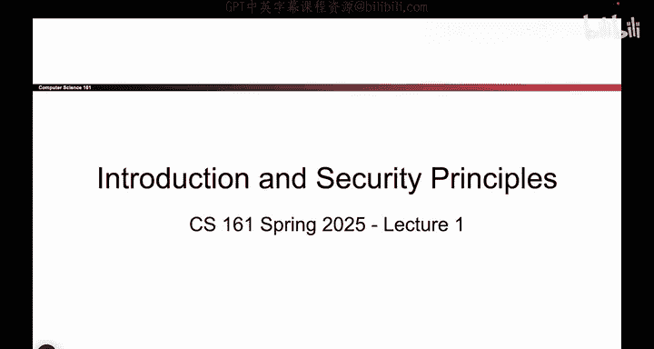
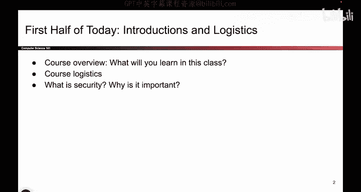
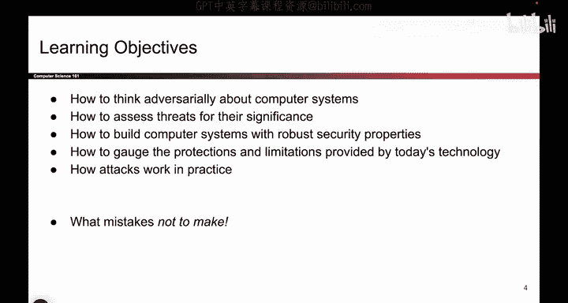
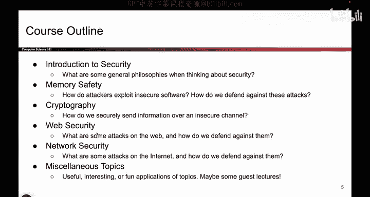
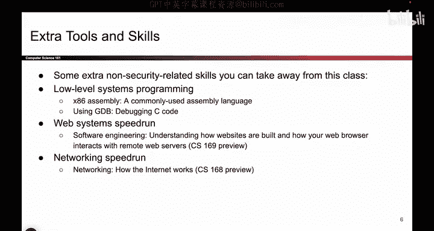
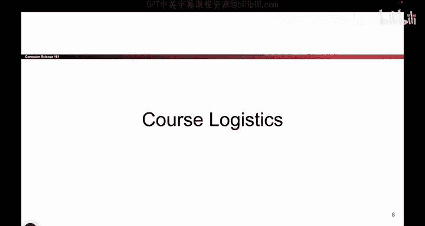

# 001：课程概述 📚

在本节课中，我们将要学习CS 161计算机安全课程的总体框架、学习目标以及课程结构。课程分为两部分：第一部分是课程介绍，第二部分将探讨一些安全原则。

---

## 课程学习目标 🎯

上一节我们介绍了课程的基本安排，本节中我们来看看通过这门课程你将学到什么。

你将会学习如何以对抗性的视角思考计算机系统。这可能与你之前的学习经历不同。例如，在之前的编程课程中，你的目标是让代码正常运行。只要代码能工作，就是好的。

但在本课程中，我们将思考代码在面对攻击者时的表现。攻击者是指那些故意试图破坏你代码的人。我们将学习如何评估威胁，并判断哪些威胁是重要的，哪些不是。我们将思考如何构建能够抵御攻击者的安全计算机系统。同时，我们也会探讨当前技术尚无法做到的事情。

这有望让你成为一个更明智的消费者。当你未来尝试购买不同的安全工具时，能够做出更好的判断。最终，课程将展示多年来人们犯下的一些安全错误，希望你们能避免重蹈覆辙。

---

## 课程结构 📂

了解了学习目标后，接下来我们详细看看课程是如何组织的。

课程包含四个主要单元。首先是今天将要进行的“安全简介”，我们将讨论安全思维背后的一些哲学理念。

然后进入第一个单元：**内存安全**。这部分内容严重依赖于CS 62和C语言知识。我们将思考C语言软件的不安全性，以及如何防御针对这些弱点的攻击。这部分将持续大约三到四周。

之后，我们将进入**密码学**单元。这是数学爱好者最喜欢的部分。我们将探讨如何在攻击者试图读取或篡改数据的情况下安全地传输信息。这部分同样将持续三到四周，之后会有一场期中考试。

期中考试后，我们将学习**Web安全**，思考针对网络的攻击。接着是**网络安全**，研究针对互联网的攻击。

如果课程时间允许，最后我们会介绍一些随机的专题内容。以上就是课程的基本设置。

---

## 课程的额外价值 💡

在介绍了核心单元后，本节我们来看看这门课程能带来的额外技能。

我认为161课程的酷炫之处在于，你不仅能学到安全知识，即使你未来不从事安全领域的工作，而是进行其他软件开发，你也能从中学到许多可以在现实世界中使用的实用工具。

例如，在讨论内存安全时，我们将大量使用**GDB**（GNU调试器）来调试C代码。这有望让你成为一个比现在更出色的调试者。

当我们讨论Web安全时，在讲解如何攻破它之前，我们会快速概述Web的工作原理。这会让你对CS 169（软件工程）课程有一个初步了解。

当我们讨论网络安全时，你会得到一个关于网络工作原理的快速概览。这为你未来选修CS 168（计算机网络）课程做了铺垫。

这就是我认为161课程的魅力所在：即使你从不从事安全工作，也能带走这些宝贵的技能。

---

## 总结 📝

本节课中我们一起学习了CS 161计算机安全课程的概述。我们明确了课程的学习目标，即培养对抗性思维、评估威胁和构建安全系统。我们梳理了课程的四单元结构：内存安全、密码学、Web安全和网络安全。最后，我们还了解了学习本课程所能获得的、适用于更广泛软件开发领域的额外实用技能，如使用GDB调试、理解Web和网络基础等。课程的第一部分介绍到此结束。