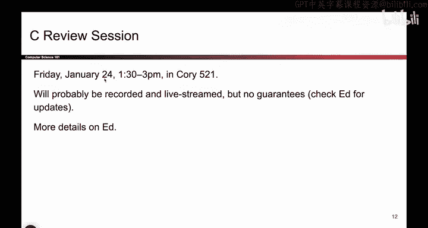
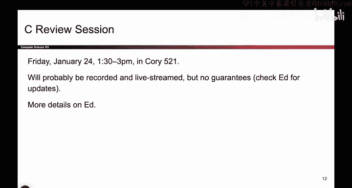
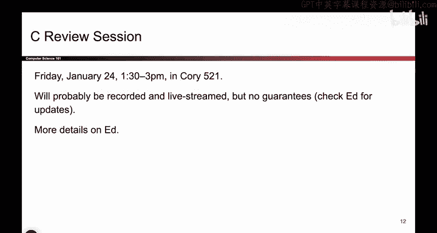
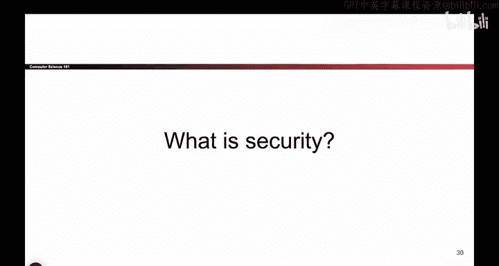

# 002：课程管理与须知 📋

在本节课中，我们将了解本课程的管理规定、重要日期、支持资源以及一些课堂惯例。这些信息将帮助你顺利开始并完成课程学习。

---

## 课程规定与常见问题

我不会逐条朗读所有管理规定，因为网站上已有详细的“政策”页面和“常见问题”页面供你自行查阅。因此，我建议你抽时间仔细阅读这些页面。以下是从这些页面中提取的几个快速提醒事项。

如果你目前尚未被加入课程，请给我们几天时间，我们可能会自动添加你，无需你发邮件询问。

如果你有并修课程的待处理申请，或者你刚刚完成注册，也适用上述情况。

---

## 讨论课与办公时间

讨论课和办公时间将于下周开始，而非本周。我们不记录出勤，你可以参加任意你感兴趣的小组。

---

## 考试日期与安排

考试日期已公布在网站上。补考日期同样在网站上，它安排在正式考试之后，并且仅限线下参加。

如果你有文件证明的考试冲突（例如另一场考试），可以申请安排。请注意，睡过头不属于文件证明的冲突。

---

## 压力管理与支持

我们承认这门课程有时会有些繁重，尤其是在讲解项目2的中期阶段。我们想强调，你的身心健康远比这门课程重要。

请不要为了这门课程连续熬夜。我们随时准备提供帮助。网站上有一个申请延期的表格链接。

如果你在残障学生项目注册，请将你的住宿安排信函发送给我们，以便我们为你提供协助。我们在此为你提供支持。

---

## 课程团队介绍

以下是我们的全体工作人员。他们非常出色，基本上负责整个课程的运行。没有他们，我无法完成这项工作。你可以看到他们，去打个招呼吧。

---

## C语言复习课安排

本周五将举行一场C语言复习课。我相当确定是这个时间，如果时间有误，我们会在Ed上通知你，但我有90%的把握这是正确的时间。如果你在这个时间前往指定地点，会有人为你详细讲解C语言基础知识。如果你觉得自己的C语言基础不太牢固，可以去参加。

---

## 关于课堂蓝色幻灯片

最后一点关于讲座的说明：如果你看到屏幕像现在这样闪烁蓝色，这通常意味着我们将讲述一个故事，为接下来要展示的内容做铺垫。

当我们讲述这些故事时，我并不关心你是否记住了故事的具体细节（例如，我不会考你“1985年的莫里斯蠕虫是什么”）。我关心的是故事带来的**特定启示或要点**。因此，每当你看到这些蓝色幻灯片，就意味着：我不关心确切的故事内容，但我关心你从中获得的启示。现在你明白了。

---

## 总结

本节课我们一起了解了课程的基本运行规则、重要日期、可用的学术与健康支持资源，以及课堂中蓝色幻灯片的特殊含义。请务必查阅课程网站获取完整信息。接下来，我们将正式进入课程的技术内容学习。