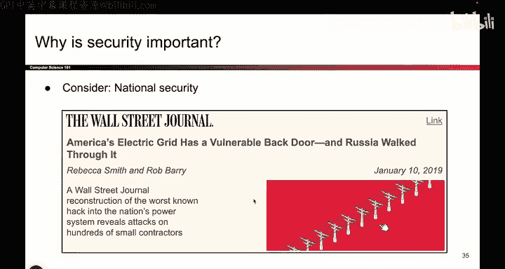
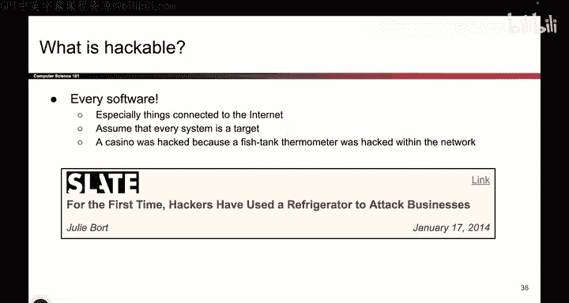
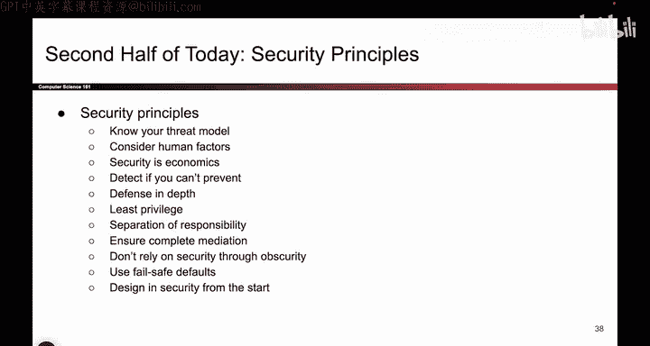

# 003：什么是安全？🔒

在本节课中，我们将要学习“安全”在计算机科学中的核心定义，理解其重要性，并初步了解一系列指导安全设计的基本原则。

## 什么是安全？

安全是指在存在攻击者的情况下，系统仍能保持我们期望的特定属性。正如之前提到的，仅仅让代码正常运行已经不够了。代码必须在面对那些蓄意破坏它的人时，依然能够正常工作。我们将看到，即使攻击者试图破坏，我们也希望强制执行各种不同的安全属性。

## 为什么安全很重要？

安全的重要性不言而喻，它几乎无处不在，与安全、隐私、商业、组织乃至政治都息息相关。

以下是几个体现安全重要性的新闻头条实例：

*   一辆被黑客入侵的汽车。
*   一个可能被远程操控的心脏起搏器。
*   可能被黑客攻击的飞机。

这些例子表明，安全具有物理层面的影响，如果处理不当，确实可能造成人身伤害。因此，正确地实现安全至关重要。

此外，隐私保护同样重要。大量公司遭遇黑客攻击，导致社会安全号码、银行信息等敏感数据被盗，这些都是我们必须警惕的。国家安全和政治领域也是如此，国家间可能出于政治原因相互攻击，这也是我们需要防范的。

## 什么可以被攻击？

基本上，任何包含计算机的设备都需要保护。如今，计算机被嵌入到几乎所有事物中。因此，我们需要保护的对象非常多。

以下是需要保护的对象示例：

*   我们的电脑和手机。
*   我们的鱼缸和冰箱。

几乎所有嵌入计算机的设备都需要我们考虑安全问题。我们不希望有人通过入侵鱼缸来闯入赌场，这听起来像电影情节，但也许真的会发生。

## 安全设计原则

既然我们了解了什么是安全以及它的重要性，接下来我将介绍大约10到11条安全原则。这些原则并非高度技术性的，今天不会深入技术细节。它们是一系列贯穿本课程始终的思考方式，可以说是本课程的总体主题。

随着课程深入，我们会看到许多涉及密码学数学或编程的具体例子，这些原则将反复出现。因此，在整个学习过程中，将这些原则牢记在心是非常有益的。

以下是这些原则的列表，我们将通过小故事来阐释每条原则：

1.  **最小权限原则**
2.  **权限分离原则**
3.  **纵深防御原则**
4.  **失效安全原则**
5.  **心理可接受性原则**
6.  **完全仲裁原则**
7.  **开放设计原则**
8.  **最小公共机制原则**
9.  **机制经济性原则**
10. **记录所有安全事件**

本节课中，我们一起学习了安全的定义，认识到其在物理世界和数字世界中的极端重要性，并初步接触了指导安全系统设计的十大核心原则。在后续课程中，我们将结合具体案例，深入理解并应用这些原则。