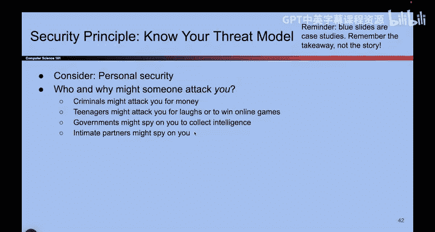
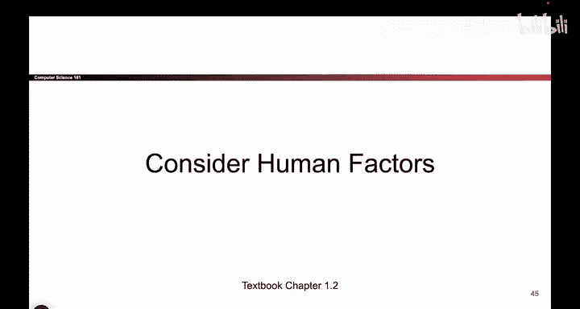

# 004：了解你的威胁模型 🐻

在本节课中，我们将要学习计算机安全中的一个核心概念：威胁模型。我们将通过一个故事来理解为什么需要分析攻击者，并介绍“可信计算基”这一重要概念。

## 故事：两只徒步者和一只熊

我们来看一个故事。故事里有两位徒步者，他们在森林里露营。一天，一只熊突然出现，非常吓人。

两位徒步者立刻跳了起来，他们心想：“熊会吃掉我们。”

其中一位徒步者迅速起身，系好鞋带，开始逃跑。而另一位徒步者则显得很悠闲，他先伸了个懒腰，看了看手机，还吃了点东西。

第一位徒步者喊道：“你在干什么？有熊！它会吃掉我们。你为什么这么悠闲？”

第二位徒步者回答说：“我不需要跑赢熊，我只需要跑赢你就行了。”

这个故事想告诉我们什么？它告诉我们，当我们面对一个攻击者（比如这只可怕的大熊）时，也许我们不需要彻底击败它，而只需要让它去攻击别人就够了。

## 故事背后的安全原理

这个故事试图教导我们，当我们考虑攻击者时，必须建立一个模型来分析：攻击者是谁、他们能做什么、以及他们不能做什么。我们必须推理攻击者的特征，以便了解我们面对的是什么，以及如何防御他们。

例如，对于攻击者，我们可能需要思考他们攻击我们的原因。就像这只熊，它为什么想攻击我们？在现实生活中，人们攻击他人的原因多种多样。

以下是人们可能发起攻击的一些原因：
*   他们可能想偷我们的钱。
*   可能有政治原因促使他们攻击我们。
*   他们可能只是为了报复。
*   他们可能只是觉得好玩。

思考人们攻击我们的原因是有帮助的，因为也许我们可以通过消除他们攻击的动机来让他们放弃。

## 思考你自己的威胁模型

现在，让我们想想你自己。你是一个使用电脑的人，可能会有人想攻击你和你的电脑。

以下是针对个人的一些攻击动机示例：
*   如果你在网上玩游戏，有人对你非常生气，他们可能会为了报复而试图入侵你。
*   如果你是一名顶级秘密间谍，政府可能想窃取你的情报。
*   如果你最近分手了，而你的前任对你不太满意，他们可能会试图拿走你的东西或入侵你。

因此，作为一个使用电脑的人，你也需要考虑你的威胁模型：哪些攻击者可能想攻击你？例如，我不是顶级秘密间谍，所以政府可能不会试图窃取我的私人信息。但如果你非常富有，也许就会有人为了钱而攻击你。在现实生活中，思考你自己的威胁模型是很有帮助的。

## 本课程中的攻击者假设

这听起来有点哲学。让我给你举一些本课程中会看到的攻击者例子。

在本课程中，我们将考虑那些知道自己在做什么的攻击者。我们不能简单地假设所有攻击者都很笨，然后就不管他们了。当我们思考攻击时，必须考虑那些聪明且愿意付出努力攻击者。

我们必须假设攻击者了解我们的系统。这一点我们会在后续的安全原则中深入探讨。例如，你必须假设攻击者知道你使用什么软件、什么版本。

还有一个有趣的点：攻击者可能会走运。这是什么意思？也许你设计了一个防御，攻击只有百万分之一的概率成功。你可能会想，谁会这么走运，能碰上这百万分之一的机会？但如果攻击者出现并尝试了一百万次呢？那么他们很可能就会“走运”成功。因此，我们不能依赖攻击者不走运，他们实际上可能会走运。

以上都是我们在构建威胁模型时可能需要假设的情况。随着课程的深入，在展示不同攻击时，我们心里要始终清楚我们面对的是哪种类型的攻击者。这就是威胁模型。

## 可信计算基

在思考威胁模型时，我们还会考虑一个叫做“可信计算基”的东西。这基本上是一个专业术语，意思是：当我构建一个系统时，系统的某些部分是安全敏感的，而其他部分则不是。

例如，如果我构建一个大型网站应用，可能有很多东西并不是真正的安全敏感。比如提供猫咪视频的代码，这可能不是超级安全敏感的。但是，让用户登录并输入密码的代码，我们必须保护它免受攻击者的侵害。

因此，当我构建系统时，思考系统的哪些部分提供了所有人都依赖的安全保障是很有用的。例如，让人们登录的代码。我们称之为“可信计算基”。确保我们的可信计算基是正确的、无法被绕过或绕过，并且没有人能破坏它，这一点非常重要。

一般来说，保持可信计算基的规模较小是有益的。因为如果代码量小，就更容易审计并确保其安全性。而如果我有成千上万行的安全关键代码，那么我很难确切知道它有多安全，因为有太多的代码需要编写、调试和跟踪。因此，拥有一个简单小巧的可信计算基是很有用的。

这算是一个哲学观点，但值得我们牢记。

## 总结

本节课中，我们一起学习了计算机安全的基础——威胁模型。我们通过“徒步者与熊”的故事理解了分析攻击者动机和能力的重要性。我们还介绍了“可信计算基”的概念，即系统中必须被重点保护的核心安全部分，并强调了保持其小巧简洁的好处。记住，了解你的对手是构建有效防御的第一步。