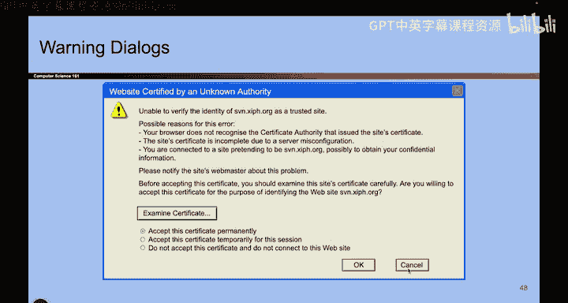
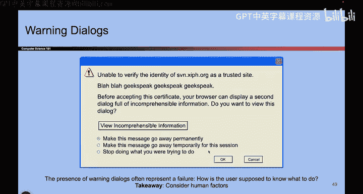

# 005：考虑人的因素

在本节课中，我们将探讨一个在构建安全系统时至关重要的方面：人的因素。我们将看到，无论一个系统在技术上多么安全，如果它难以被普通人理解和使用，其安全性就可能被削弱。

## 理解用户行为

上一节我们讨论了安全的基本概念，本节中我们来看看用户在实际操作中的行为模式。安全系统最终是由人来使用的，因此我们必须理解他们的习惯和动机。

设想一个场景：你正在浏览网页，屏幕上弹出一个对话框，内容如下：

> 当您向互联网发送信息时，其他人可能看到该信息。是否继续？

对于大多数用户而言，他们的思考过程可能并非逐字阅读，而是类似于：

1.  看到了一个弹窗。
2.  点击“是”让它消失。
3.  勾选“不再显示”复选框，以免未来被打扰。

用户的核心目标往往是**继续浏览**（例如观看视频），而非仔细评估安全风险。如果安全提示过于频繁或难以理解，用户就会倾向于绕过它。

## 技术术语的障碍

接下来，我们看看另一个常见的例子。当遇到类似下面的错误信息时，用户会如何反应？

> 无法验证受信任站点的身份。此错误的可能原因：您的浏览器无法识别颁发站点证书的证书颁发机构……（后续为技术性描述）。

对于普通用户，甚至许多技术人员，阅读此类信息时的真实感受是：

1.  看到大量难以理解的“技术黑话”。
2.  不知道应该点击哪个选项。
3.  唯一明确的目标是：**如何让这个窗口消失，以便继续上网**。

请想象一位不熟悉互联网的老年用户，他们将完全无法应对这样的信息。这凸显了设计可读、易懂的安全提示的重要性。

## 核心原则：考虑人的因素

从以上例子中，我们可以得出一个核心结论：**我们必须考虑人的因素**。

我们的安全系统是为人类建造和使用的。因此，设计时必须考虑真实用户的使用模式和行为逻辑。

以下是几个关键点：

*   **易用性与安全性的平衡**：用户喜欢简单易用的系统。如果一个安全机制（如确认弹窗）导致操作繁琐，用户可能会直接禁用该机制，从而使系统失去保护。公式可以表示为：`实际安全性 = 技术安全性 × 用户采纳率`。如果用户采纳率为零，实际安全性即为零。
*   **故意或意外的削弱**：用户可能为了便利而故意关闭安全功能，也可能因为不理解提示而意外地削弱安全。
*   **社会工程学攻击**：攻击者常常利用人的信任心理进行“社会工程学”攻击，诱骗用户执行危险操作。因此，最终的安全防线在于人本身。

## 对开发者的启示

这个原则不仅适用于终端用户，也适用于我们开发者自身。我们也是人，也会犯错。

因此，选择开发工具至关重要：
*   使用类似C语言这样的工具时，它通常不会自动捕获许多常见错误，这增加了引入安全漏洞的风险。
*   我们应优先选用能帮助我们发现错误的、“防呆”的工具和编程语言。

简而言之，我们希望使用的工具和设计的系统都应该是**易于正确使用，难于错误使用**的。如果系统难以使用，用户就不会正确使用它。

## 优秀的设计案例：安全密钥

最后，我们来看一个正面例子——安全密钥（Security Key）。它是一个用于增强登录安全性的物理设备。

你可能会好奇它的外形设计。它为什么设计成一块特定形状的塑料？它本可以是任何形状。

实际上，它被刻意设计成**钥匙的形状**。这是因为，在人类共有的认知里，“钥匙”象征着重要性和需要被妥善保管。当用户拿到一个钥匙形状的物体时，会本能地意识到需要保护它。

这是一个绝佳的“考虑人的因素”的设计案例。程序员通过利用人们已有的心智模型，让安全设备的用途和使用方法变得不言而喻，从而降低了用户的学习成本和使用错误。

## 总结

本节课中，我们一起学习了在安全设计中“考虑人的因素”这一核心原则。我们了解到：
1.  用户倾向于选择便利而非安全，因此系统必须易于正确使用。
2.  晦涩难懂的技术提示会迫使用户盲目操作，从而绕过安全机制。
3.  开发者应选用能辅助避免错误的工具。
4.  优秀的设计应贴合用户直觉，利用已有的认知模型（如将安全密钥设计为钥匙形状）来引导正确行为。

记住，最坚固的技术防线，也可能被一个困惑的用户点击而瓦解。因此，将人的因素置于设计中心，是构建真正有效安全系统的关键。