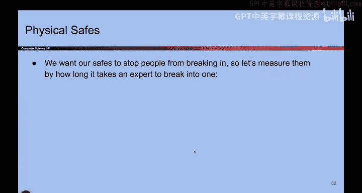
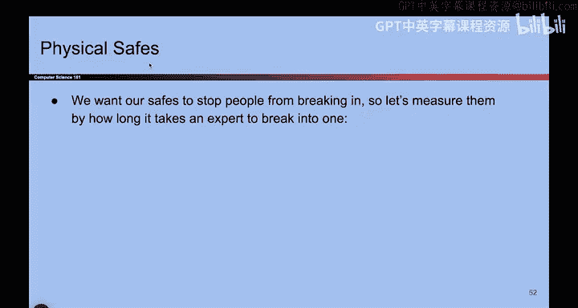
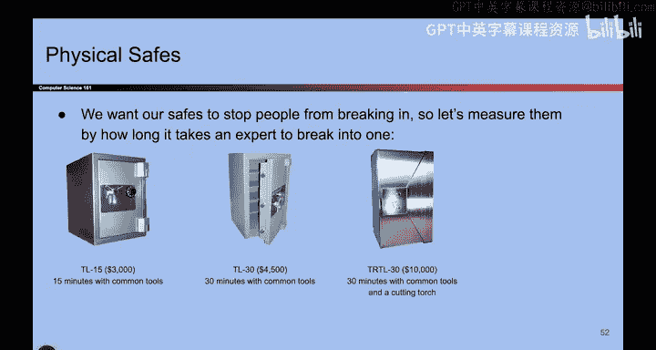

# 006：安全即经济学 🛡️💰

在本节课中，我们将通过一个购买保险箱的故事，来理解安全的核心本质——经济学。我们将看到，更高的安全级别通常意味着更高的成本，并且安全决策本质上是一种成本效益分析。

## 前往保险箱商店 🏪

上一节我们讨论了安全的基本概念，本节中我们来看看一个具体的例子。假设我们现在要去一家保险箱商店，准备购买一个物理保险箱。

商店提供了不同型号的保险箱供我们选择。

以下是可供选择的型号列表：
*   **TL 15**：售价 **$3000**。如果攻击者使用常见工具，此保险箱能抵抗攻击 **15** 分钟。
*   **TL 30**：售价 **$4500**。此型号能抵抗攻击者 **30** 分钟。
*   **TR TL 30**：售价 **$10,000**。如果攻击者使用切割火炬，需要 **30** 分钟才能侵入。
*   **TX TL 60**：售价 **$50,000**。即使攻击者使用常见工具、切割火炬和炸药，此保险箱也能抵抗他们 **60** 分钟。

## 安全需要付出代价 💸

你注意到这些保险箱价格标签的变化规律了吗？它们随着安全级别的提升而显著上涨。这个故事试图向我们展示一个核心道理：**想要获得更多安全，就必须为之付费。安全不是免费的。**

当我们去保险箱商店时，我们学到了一个教训：**安全即经济学**。这其中涉及大量的成本效益分析。理想情况下，当我们考虑攻击时，也必须同时考虑：
*   防御攻击的成本是多少？
*   从攻击中恢复的成本是多少？

总的来说，**更高的安全性意味着更高的成本**。

## 更多经济学案例 📊

安全即经济学的理念不仅适用于保险箱，还体现在许多其他场景中。

以下是另一个简单的例子：
假设我有一块价值 **$1** 的石头。我是否会为这块石头配一把 **$10** 的锁？很可能不会。因为如果石头被偷，我只需再花 **$1** 买一块新的。这是一个安全经济学的例子——花费 **$10** 去保护一个只值 **$1** 的东西，通常没有意义，除非那是一块绝密石头。

让我们再看一个例子：
假设有人给了你一个全世界其他人都不知道的全新攻击方法。换句话说，我向你保证，这个攻击方法对任何你尝试的目标都会奏效。

那么，你会选择谁作为目标呢？你拥有这个对地球上任何人都有效的宝贵攻击方法。你会仅仅用它来攻击你旁边的人吗？很可能不会。你可能会去攻击总统或某个非常富有的人，因为这是一个全新的、必定成功的攻击。所以，我会尝试以某个非常重要的人物为目标。这是安全即经济学的另一个例子——我不会将价值 **$100万** 的新攻击，浪费在一个只值 **$10** 的人身上，这很不划算。

## 总结 📝

本节课中，我们一起学习了安全的核心原则之一：**安全即经济学**。我们通过选择保险箱的案例看到，安全级别与成本直接相关。同时，我们也了解到，任何安全决策都应进行成本效益分析，权衡保护对象的价值与所需投入的防御成本。理解这一点，是做出明智安全决策的基础。