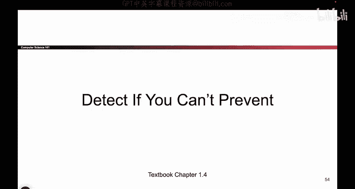

# 007：当无法阻止时，学会检测 🚨



在本节课中，我们将要学习网络安全中一个核心的防御理念：并非所有攻击都能被预先阻止，因此，检测攻击的发生并做出响应至关重要。我们将通过生活中的类比来理解“威慑”、“预防”、“检测”和“响应”这几个关键概念。

---


上一节我们讨论了安全的基本目标，本节中我们来看看应对攻击的不同策略。想象一下你走在社区里看到的这些标志。


这些标志表明此房屋受安保公司保护，若有人试图闯入，警报就会响起。这是一个防盗警报器。

这个例子已经揭示了一些问题。一个问题是，如果你只是不小心打开了门，警报也可能误响。另一个有趣的想法是：攻击者看到这个标志后，可能会选择其他目标。那么，与其花费大量金钱安装真正的警报系统，不如只在前院插上这样一个标志，而不安装实际系统。


这或许仍然能让攻击者转向别处。这个故事给我们的启示不是去偷邻居的院子标志，而是说明了我们应对攻击的不同方式：有时我们**预防**攻击，有时我们**威慑**攻击，有时我们**检测**攻击。

以下是阻止攻击的几种不同方式：


*   **威慑攻击**：在攻击发生之前就阻止它。
*   **预防攻击**：攻击正在进行中，但我们成功击败并阻止了它。
*   **检测攻击**：攻击已经发生，系统已被侵入，但至少我们注意到了它的发生。
*   **响应攻击**：在攻击发生后，我们需要采取行动，例如恢复丢失的数据或报警。

我们有时需要区分这些方式。例如，可能存在一种情况，我们**无法威慑**攻击，攻击注定会发生。那么，也许我们可以尝试**预防**它。或者，可能存在一种情况，我们**无法预防**攻击，攻击必将成功。那么，在这种情况下，我们至少应该能够**检测**它并**响应**它。因此，在思考如何阻止攻击时，所有这些方面都是我们必须考虑的重要因素。


接下来，我们看一个现实生活中的例子：地震。你能**威慑**地震吗？你能阻止地震发生吗？恐怕不能。你能**预防**地震吗？你能在地震开始摇晃时阻止它吗？很可能也不行。但你可以**检测**到地震正在发生，并且可以**响应**地震，例如准备食物储备，以便地震发生后有食物可用。

再想想勒索软件。什么是勒索软件？就是有人控制你的电脑，加密上面的所有数据，然后说：“给我一大笔钱，否则我就永久删除数据。”你如何阻止它？你可以尝试**预防**它，但也可以通过保持备份来**响应**它。这样，即使电脑被锁，你也有备份数据，损失不大。

最后，我们看一个能检测但难以响应的例子：比特币。这里你只需要知道，比特币交易是**不可逆**的。换句话说，如果你把比特币转给了别人，除非对方主动归还，否则你将永远失去这些比特币。用代码表示这个特性就是：
```plaintext
交易状态 = “已确认” -> “不可撤销”
```
这意味着，如果有人窃取了你的比特币，你或许能够**检测**到（这很好），但你能**恢复**吗？除非窃贼愿意归还（这不太可能），否则不能。你永久失去了比特币。所以，你检测到了攻击，但无法有效响应。你注意到钱不见了，但钱拿不回来了。这是一个**检测但无法响应**的例子，这并不理想。

---

本节课中我们一起学习了网络安全防御的四种策略：**威慑、预防、检测、响应**。我们明白了并非所有攻击都能被预先阻止，因此在无法预防时，检测攻击的发生就显得尤为重要，而有效的响应能帮助我们减少损失。记住这个完整的防御链条对于构建健壮的安全体系至关重要。