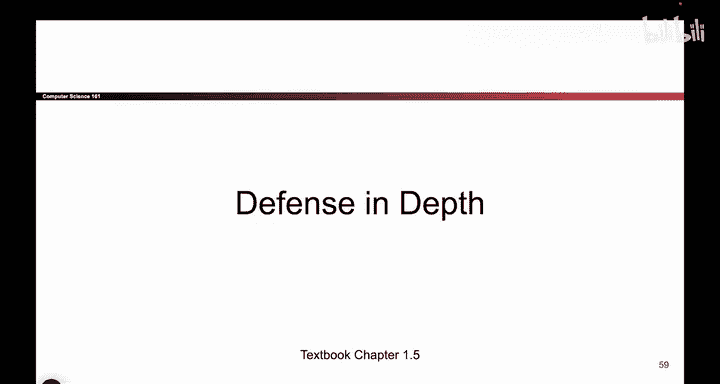

# 008：纵深防御

在本节课中，我们将要学习一个重要的网络安全概念——**纵深防御**。我们将通过一个历史故事来理解其核心思想，并探讨它在实际应用中的权衡。

## 概述

纵深防御是一种通过部署多层安全措施来保护系统或资产的安全策略。其核心理念是，即使一层防御被突破，后续的防御层仍能提供保护，从而增加攻击者的入侵难度和成本。

## 从历史故事看纵深防御

上一节我们提到了网络安全的基本挑战，本节中我们来看看一个源自历史的经典防御思想。

想象一下我们回到历史上的君士坦丁堡。这是一座古城，后来曾被更名。如果你去到那里，会看到为了阻止攻击者进入而修建的城墙。穿过这道城墙后，你会遇到一条护城河。越过护城河，又会遇到另一道城墙。再越过这道墙，还有一条养着鳄鱼的护城河。最后，还有一道更巨大的城墙，以及会在你试图进入时倾泻火焰的塔楼。

这个故事展示了什么？它展示了第一道墙固然不错，但我们又修建了第二道墙、护城河、另一道墙、鳄鱼以及火焰塔。这种策略被称为**纵深防御**。我们针对同一种攻击（即人们试图进入城市）部署了多重防御措施。

## 纵深防御的核心思想

那么，城墙的故事告诉我们什么？它告诉我们，我们可以将防御措施层层叠加。这样一来，如果攻击者想要侵入我们的系统，就必须突破所有的防御层：他们必须突破城墙、护城河、鳄鱼和火焰塔。

因此，纵深防御是一种我们可以采用的思路：**通过增加多层防御来阻止攻击者**。

以下是其核心优势：
*   **增加攻击复杂度**：攻击者需要连续突破多个障碍。
*   **提供冗余保护**：单一防御措施的失效不意味着系统完全失守。
*   **延缓攻击进度**：为防御方争取检测和响应的时间。

## 经济性的权衡

但是，为什么不直接修建上百道墙呢？请记住，我们还必须考虑**经济性**。修建城墙并非没有成本。

每一道你修建的墙都需要额外的花费。举例来说，如果我有一道墙，再修建第二道，这很不错，或许值得去做。但如果我已经有100道墙了，我真的还需要修建第101道墙吗？这额外的成本所带来的收益是否值得？这很难说。你必须思考其中的权衡。

所以，纵深防御虽然有效，但它受到**经济性**的限制。

## 总结

本节课中，我们一起学习了**纵深防御**的概念。我们了解到，它通过部署多层安全措施来增强保护，其核心优势在于增加攻击者的入侵难度和成本。同时，我们也认识到，在实际应用中，部署多少层防御需要与成本进行权衡，并非层数越多越好。在后续课程中，我们将看到这一原则如何应用于现代网络安全架构中。