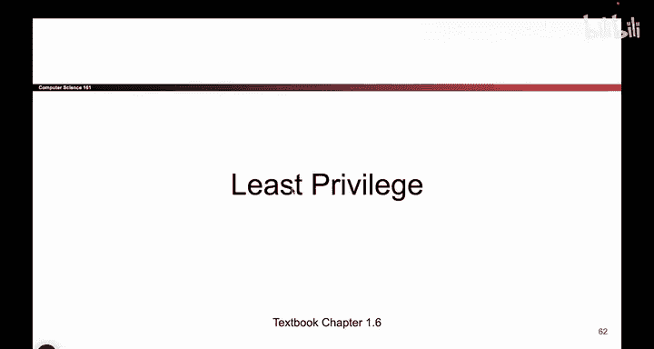
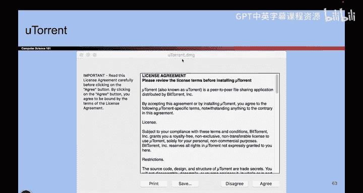
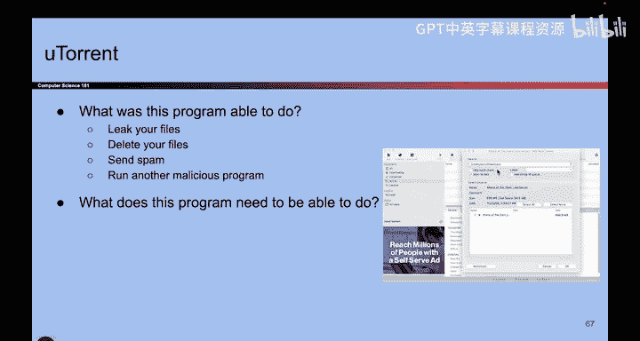
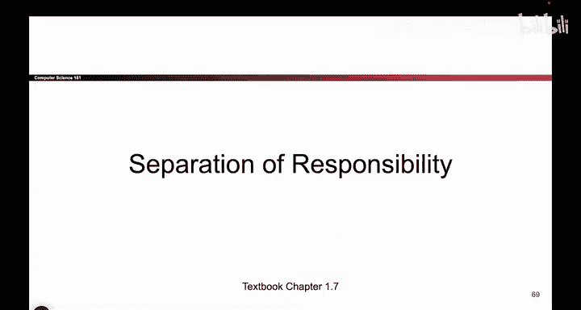

# 009：最小权限原则

在本节课中，我们将要学习计算机安全中的一个核心概念——**最小权限原则**。我们将通过日常生活中的例子来理解，为什么只给程序或用户完成其任务所必需的最小权限是至关重要的。

---

## 从下载电影说起

上一节我们介绍了权限的基本概念，本节中我们来看看一个具体的场景：下载电影。

假设我们访问一个流媒体网站，并合法地下载一部名为《巨型水蛭的攻击》的电影。在这个过程中，我们运行的下载程序需要获得我们计算机系统的某些权限才能完成任务。

那么，当我们同意下载时，我们实际上授予了这个程序哪些权限呢？这个程序需要能够将电影文件写入我们的硬盘，也需要能够从互联网接收数据。因此，我们不得不赋予这个程序相当多的权力。

以下是该程序可能获得的权限列表：
*   写入文件系统（保存电影）。
*   读取文件系统（可能用于检查存储空间）。
*   访问互联网（下载数据）。
*   可能还包括运行其他程序、发送网络请求等。

## 潜在的风险与不必要的权限

如果这个下载程序是恶意的，拥有这些广泛的权限会带来什么后果？一个恶意程序可以利用这些权限读取你的私人文件、删除重要数据、甚至以你的名义发送邮件。

这里的关键问题在于：我们授予了应用程序完成其功能所需的全部权限，但其中一些权限它可能根本不需要。例如，一个电影下载程序不需要访问存储密码的文件，它只需要访问存放电影的特定文件夹。

因此，我们需要仔细思考我们赋予程序的权限。理想情况下，我们应该只赋予程序刚好足够其正常运行所需的权限，避免授予它过多的权限。如果程序是恶意的，过多的权限会导致它对我们计算机造成更多不必要的损害。

我们需要思考程序正确运行所必需的条件，并尽量避免赋予任何非必要的权限。因为如果程序是恶意的，它可能会利用这些多余的权限来攻击我们。通过谨慎地分配权限，我们本可以防范这类攻击。

## 另一个现实世界的例子：考试保密

让我们通过另一个现实世界的例子来巩固对最小权限原则的理解。假设我们正在编写一份绝密的期中考试试卷。

我们有两种方式来管理试卷的访问权限：
1.  将试卷分发给所有助教。但如果其中有恶意者，试卷就可能被泄露。
2.  只将试卷分发给那些真正参与编写、校对工作的助教。

显然，第二种方法是更安全的选择。它遵循了最小权限原则：如果某位助教不参与考试相关工作，就不需要授予他访问试卷的权限，因为他根本不需要它。

---

本节课中我们一起学习了**最小权限原则**。其核心思想是：任何程序、用户或进程都应该只拥有完成其合法任务所必需的**最小权限**集合。这就像在生活中，你只会把家门钥匙交给需要进屋的人，而不是给所有人。在计算机安全中，遵循这一原则可以显著减少因权限过度而带来的潜在风险，是构建安全系统的基础。