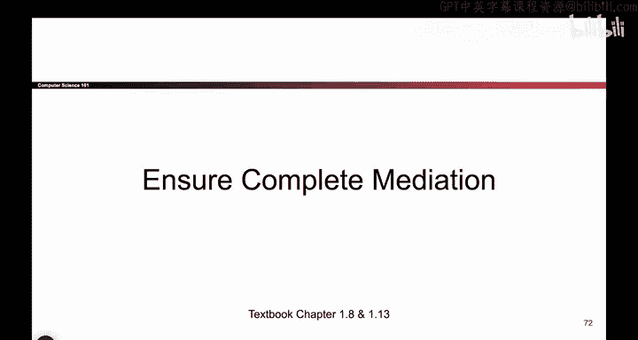
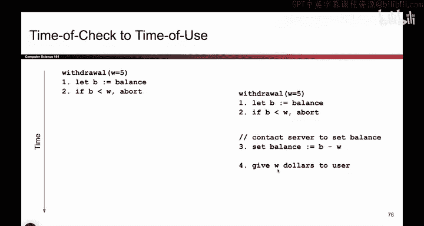

# 011：确保完全仲裁与检查时间到使用时间




在本节课中，我们将学习两个重要的安全设计原则：**确保完全仲裁**和**检查时间到使用时间**问题。我们将通过生动的例子来理解这些概念，并学习如何避免相关的安全漏洞。

## 🚧 确保完全仲裁

上一节我们讨论了安全设计的基础。本节中我们来看看**确保完全仲裁**原则。

请看这张图片。它存在什么问题。

图片有些模糊。这里有一个小型安全闸门。

这个闸门能阻止车辆通过吗。不能。车辆在做什么。

车辆正在绕行。问题在于我们设置了障碍，但车辆可以简单地绕过它。因此我们必须确保检查点没有可供用户绕过的路径。

我们称此原则为**确保完全仲裁**。所有访问点都应受到保护，并且不应存在绕过访问点的途径。

有时人们会使用一个专业术语**引用监视器**，来指代所有访问都必须经过的那个点。

例如，当你去机场时，必须通过安检。所有人都必须通过金属探测器。这是所有乘客都必须经过的单一节点。据我所知，没有方法可以绕过机场安检。

另一个例子是进入宿舍时，只有一个入口，每个人都必须刷卡才能进入。这是一个单一的访问点，每个人都必须通过它，无法绕过。

在本课程后面，我们还会看到防火墙，这也是一个所有人都必须经过单一访问点的例子。

对于这个引用监视器，我们必须确保监视器本身是正确的。无法绕过它，也无法破坏它。另一种表述是，引用监视器应成为**可信计算基**的一部分。

这是一个未确保完全仲裁的例子。我们必须确保如果有人想访问我们的程序，他们必须通过单一的、安全的访问点。

## ⏳ 一个更复杂的例子：银行取款

理解了空间上的仲裁问题后，现在让我们看一个更复杂的关于时间仲裁的例子。

以下是模拟从银行取款的代码。我们将在展示例子后讨论它。

```python
# 假设的用户余额
B = 10  # 用户有10美元

# 用户想要提取的金额
W = 20  # 用户想提取20美元

# 检查余额是否足够
if W > B:
    print("错误：余额不足")
    abort()
else:
    # 扣减余额
    B = B - W
    # 给用户现金
    give_user_cash(W)
```

代码逻辑如下：如果用户想取钱，首先检查用户有多少钱。如果用户只有10美元，却想提取20美元，这是不允许的。程序将中止并显示错误信息。

然而，如果用户有足够的钱可以提取，那么银行将减少余额，然后给用户相应金额的现金。

可以想象，许多不同的ATM机都在运行这段代码来处理用户取款。


## 🎯 利用竞态条件攻击

现在，让我展示一种巧妙利用这段代码的方法。假设用户只有5美元，但他们想要超过5美元。他们如何利用这段代码获得超过5美元。

假设有两台机器。我将绘制一个时间线来说明我的操作。

我走到第一台机器前，按下按钮提取5美元。记住，用户银行账户总共只有5美元。他按下提取5美元的按钮，代码开始检查：用户银行里有多少钱？5美元。用户想要多少？5美元。这没问题，用户有足够的钱。因此，这个检查通过了。

在这段代码继续运行之前，我迅速切换到第二台机器，并在第二台机器上按下取款按钮。现在我在第二台机器上。第一台机器的代码仍在运行。

我跑到第二台机器，按下按钮，代码再次运行。它检查用户有多少钱。余额仍然是5美元，因为第一台机器的代码尚未完成扣款。

当用户有5美元时，他能提取5美元吗？可以。所以第二台机器将执行：去银行将余额设为0，并给用户5美元。

稍后，右边第一台机器的代码继续运行。它也将余额设为零，并吐出5美元。

于是出现了这种情况：我原本只有5美元，但通过在非常特定的时间点按下取款按钮，我成功提取了10美元。

这很危险。这里到底发生了什么。仔细审视这个过程，这实际上也是一个**未能确保完全仲裁**的例子。



但与汽车绕行的空间仲裁失败不同，这里我们是在**时间**上未能确保仲裁。因为这里有一个检查我是否有足够钱的步骤。但在检查成功后、余额更新之前，我去了另一台机器并成功完成了另一次取款。

这是一个虽然实施了检查，但由于人们可以利用竞态条件，实际上并未确保完全仲裁的例子。我未能阻止所有人提取超过其拥有的金额。

这是另一个未确保完全仲裁的案例。我们利用竞态条件提取了超过我们拥有的钱。

## 🔄 检查时间到使用时间

有时我们称此为**检查时间到使用时间**问题。因为这是进行检查的时间点，而这是实际使用（即向用户吐出现金）的时间点。如果这两件事没有原子性地一起发生，就可能出现这种奇怪的竞态条件。

这个概念需要一些时间来理解。请随时再多思考一下。


## 📝 总结

本节课中我们一起学习了两个核心安全原则。

首先，我们学习了**确保完全仲裁**原则，它要求所有对受保护资源的访问都必须通过一个不可绕过的、单一的**引用监视器**。无论是物理上的闸门，还是数字系统的入口，都必须杜绝旁路。

其次，我们深入探讨了**检查时间到使用时间**问题。这是一个特殊的时间上的仲裁失败案例，发生在安全检查与实际操作之间存在时间差时，攻击者可以利用这个间隙（竞态条件）绕过安全策略。我们通过银行取款的代码示例，清晰地看到了这种攻击是如何发生的。


理解并避免这些漏洞，对于设计健壮、安全的系统至关重要。