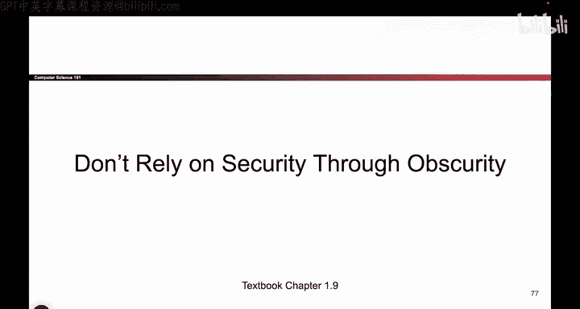
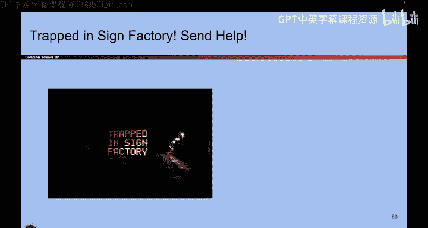
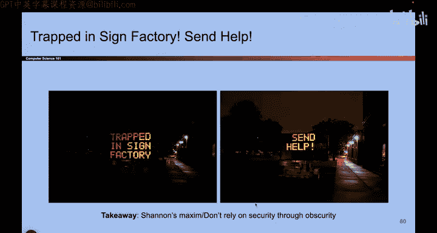
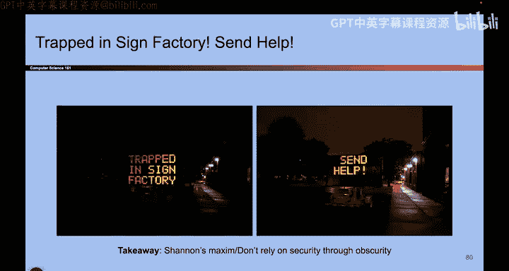

# 012：不要依赖“隐匿式安全”

在本节课中，我们将要学习一个重要的安全原则：不要依赖“隐匿式安全”。我们将通过一个高速公路可变信息标志的实例，来理解为何仅仅依靠信息或机制的隐蔽性无法提供真正的安全保障。

## 实例分析：高速公路信息标志

上一节我们介绍了安全设计的基本原则，本节中我们来看看一个常见的错误实践。

你或许在高速公路上见过可变信息标志。这些标志内部实际上有一个小型计算机，用于控制显示的信息。

如果打开这个标志，你会发现一个控制面板，用于输入要显示的信息。在更新信息前，需要输入密码。

问题在于，如果你在网上搜索这些设备的使用手册，会发现一个默认密码：**DOTS**。如果设备管理员没有修改这个默认密码，那么任何人都可以使用它。

以下是使用默认密码可能进行的操作：
*   输入“前方有僵尸”。
*   输入“快跑，僵尸来了”。

当然，请不要真的这样做。这属于违法行为，可能导致严重的法律后果。

## 核心原则：香农箴言

这个例子揭示了一个根本问题：依赖“隐匿式安全”。这种想法是：“密码虽然是默认的，但谁会特地上网去搜呢？这很难被发现，所以应该没问题。”

这是一种错误的假设，即攻击者不具备相关知识或找不到关键信息。实际上，攻击者完全可以通过网络搜索找到控制面板的位置、设备手册以及默认密码。

所有这些都可以归结为一个被称为 **香农箴言** 的核心安全准则。其基本思想是：

**必须假设攻击者完全了解你的系统。**

这意味着：
*   攻击者知道机器的工作原理。
*   攻击者知道控制台在哪里。
*   攻击者知道密码是什么以及默认密码是什么。

因此，不能依赖隐藏或增加寻找难度来保障安全。**“难以发现”不等于“安全”**。一个真正安全的系统，即使攻击者知晓其所有细节，也无法被攻破。

## 生活中的类比

另一个经典的例子可以帮助我们理解这个原则。

你是否曾把备用钥匙放在门垫下面？这安全吗？不。
钥匙难找吗？是的。
但“难找”不等于“安全”。如果攻击者知道人们习惯把钥匙藏在门垫下，他们就会去检查你的门垫，拿到钥匙，然后进入你的房子。这将导致严重的后果。

这个类比再次强调了香农箴言：**不要依赖事物的隐蔽性来获得安全。必须始终假设攻击者了解你系统的每一个细节。**

## 总结

本节课中我们一起学习了“隐匿式安全”的谬误。我们通过高速公路信息标志和门垫下藏钥匙的例子，理解了为何不能将安全建立在信息或机制的隐蔽性之上。核心要点是牢记 **香农箴言**：在设计安全系统时，必须假定攻击者拥有系统的全部知识。真正的安全性意味着即使在这种情况下，系统依然能够抵御攻击。