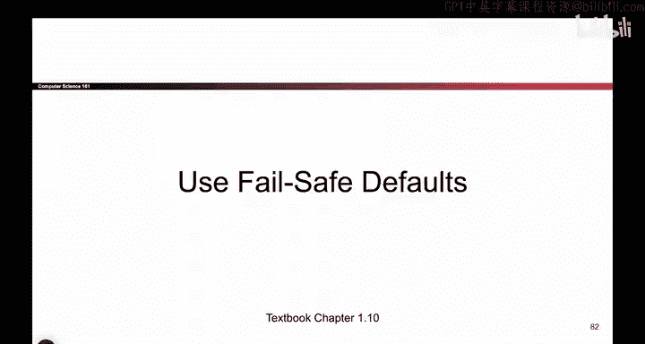

**安全设计原则课程：013：使用故障安全默认值**

在本节课中，我们将学习一个重要的安全设计原则：故障安全默认值。我们将探讨在系统发生故障时，应如何设置默认行为以平衡安全性与可用性。

---

上一节我们介绍了安全设计中的多个原则，本节中我们来看看“故障安全默认值”这一具体概念。

假设你前往苏达楼，房间门使用钥匙卡扫描器控制。扫描钥匙卡后，门才会打开。

现在有一个问题：如果停电了，你认为这些门默认应该锁上还是解锁？请记住，停电意味着钥匙卡扫描器无法工作。

以下是两种选择的考量：

*   **默认锁门（故障关闭）**：停电时，所有门自动锁闭。这样任何人都无法进出。
*   **默认开门（故障开放）**：停电时，所有门自动解锁。这样任何人都可以打开这些门，访问门后的空间。

哪种方式更好？这取决于具体的门及其保护的对象。

*   如果门后存放昂贵设备，或许默认锁门更安全。
*   如果是紧急出口的门，则很可能应该默认解锁。

这里的要点是：当系统故障时，采取何种行动并非总是显而易见。你必须思考系统故障时应该回退到何种状态。有时“故障关闭”更好，有时“故障开放”更好。这完全取决于你的系统和威胁模型。

因此，核心原则是：**你必须为你的系统选择一个安全的默认设置。** 这通常涉及权衡。你需要在安全性（即故障关闭、锁住一切以提供保护）和可用性（即系统宕机时，你可能需要某些门保持开放以便访问内部或从紧急出口逃生）之间进行权衡。有时做出正确选择相当困难，默认锁闭还是默认开放并非总是显而易见的。

所以，**选取故障安全默认值可能很棘手。**

---

本节课中，我们一起学习了“故障安全默认值”原则。我们了解到，在系统设计时，需要预先定义故障发生时的默认行为，并在安全性与可用性之间做出明智的权衡，选择最适合当前场景的默认安全状态。