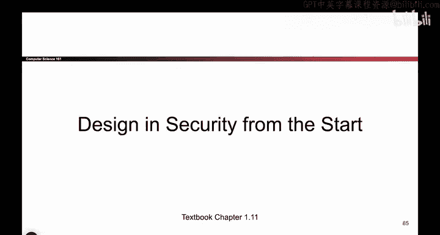
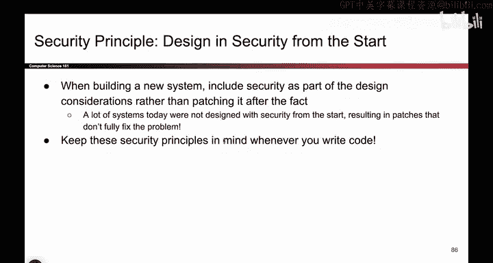

# 014：从设计之初就考虑安全 🔐

在本节课中，我们将学习一个至关重要的安全原则：在系统设计之初就考虑安全性。我们将探讨为何这一原则如此重要，以及忽视它可能带来的后果。

## 概述

上一节我们讨论了“故障安全默认值”原则。本节中，我们来看看最后一个核心原则：从设计之初就考虑安全。这个原则强调，安全不应是事后补救，而应是系统设计的基础。

## 从设计之初就考虑安全

当你构建系统时，很容易陷入一种冲动：我有一个很棒的新想法要构建，我要立刻开始疯狂地写代码。你写了500行代码，整个系统运行起来，然后你就发布了它，认为工作完成了。

接着，人们开始攻击它，并且攻击持续不断，这显然不是好事。因此，如果你想构建一个新系统，从设计之初就考虑安全至关重要。

如果你不从设计之初考虑安全，会发生以下情况：你构建了一个漂亮而复杂的系统，但它没有安全性。任何人都可以攻击它。现在你必须回过头去修复它，而这些修复可能会非常笨拙。你不得不在一个地方插入一个安全补丁，在另一个地方再插入一个，这里打个小补丁，那里再打一个。

**结果**：如果你不从设计之初考虑安全，你的系统将变得非常臃肿、丑陋且难以使用，因为你必须去修补所有出现的小漏洞。这更像是维护，而不是构建。与其先构建、再使用、然后等它坏了再修复，也许在构建时，你就应该安全地构建它，让它从一开始就不容易出问题。

## 互联网的教训

这个原则在我们讨论网络和互联网单元时经常出现。网络和互联网实际上并非从一开始就考虑了安全性。

当人们最初构建互联网时，是研究人员在构建它。他们并没有真正考虑安全问题。他们认为：“我们只是用互联网来交换研究论文，谁在乎安全呢？”然而，后来互联网逐渐发展壮大。因此，我们现在必须在互联网上构建安全性。

你会发现，我们学习了所有这些不同的补丁，你可能会想：为什么这些代码如此糟糕？为什么我要学习这些不协调的插入式修补？原因就在于，互联网在设计之初并未考虑安全。因此，互联网的很多设计确实很糟糕。

**核心建议**：如果你想避免写出非常糟糕的代码，就应该从最开始就考虑安全。

## 实践指南

以下是应用此原则的关键步骤：

*   **在开始编写代码时，时刻牢记所有安全原则**：将之前学到的所有安全原则（如最小权限、纵深防御等）作为设计时的指导方针，而不是编码完成后的检查清单。

## 总结

本节课中，我们一起学习了“从设计之初就考虑安全”这一原则。我们了解到，将安全作为事后的附加功能会导致系统臃肿、脆弱且难以维护。通过借鉴互联网发展的历史教训，我们明白了在项目启动时就将安全理念融入设计过程的重要性。记住，安全的设计是构建健壮、可靠系统的基石。

---
*课程内容回顾：在本系列课程中，我们探讨了约11个安全设计原则。这些是我们在设计安全代码时需要思考的哲学理念，它们将在本课程中反复出现。我们讨论了：理解攻击者、考虑人为因素、安全即经济学、检测与响应、分层防御与纵深防御、最小权限、职责分离、完全仲裁、香农箴言（假设敌人了解系统）、故障安全默认值，以及本节课的“从设计之初就考虑安全”。请在后续课程和构建系统时思考所有这些原则。*