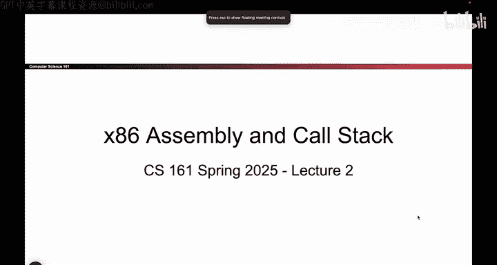
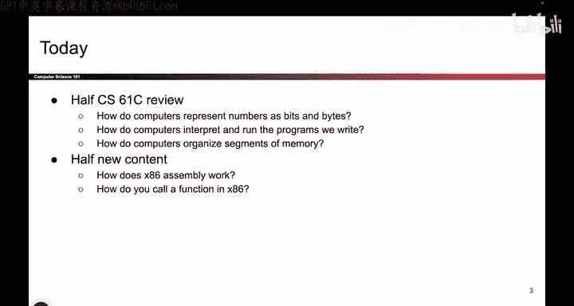
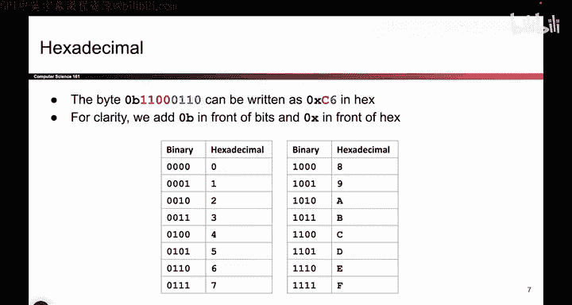
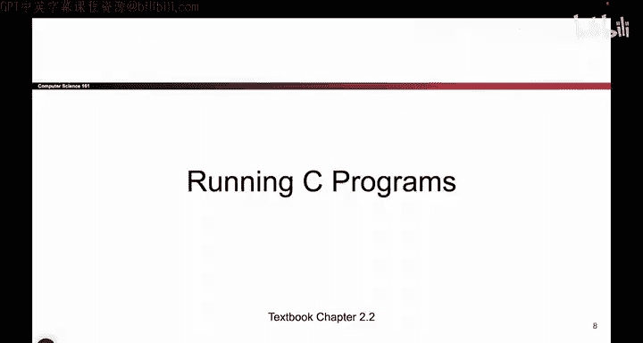

# 015：数字表示

在本节课中，我们将学习计算机如何表示代码和数据。首先，我们会回顾数字在计算机中的表示方式，然后介绍X86汇编语言的基础知识，特别是函数调用的机制。

## 数字表示

上一节我们介绍了课程的安全原则。本节中，我们来看看计算机如何表示所有数据。

所有数据最终都以比特（bits）的形式表示。无论是数字、图片还是字符串，一切最终都由1和0构成。

### 比特与字节

就像测量距离有不同的单位（如米、千米、厘米）一样，测量比特数量也有不同的方式。

*   一个二进制数字称为一个**比特（bit）**。
*   一组8个比特称为一个**字节（byte）**。

例如，一个16比特的字符串，等价于2个字节。这只是测量同一比特数量的两种不同方式。

### 十六进制表示法

直接写出一长串的0和1会非常繁琐且难以阅读。因此，我们发明了一种简写方式：十六进制。

十六进制是基数为16的系统，其数字范围从0到F（0-9和A-F）。我们将每4个二进制位映射为一个唯一的十六进制数字，这样可以使长串的二进制数更易于阅读。

以下是二进制到十六进制的映射示例：

*   `1100` 映射为 `C`
*   `0110` 映射为 `6`

因此，二进制数 `11000110` 可以简洁地表示为十六进制数 `0xC6`。

**表示法约定：**
*   二进制数前缀：`0b`（例如 `0b11000110`）
*   十六进制数前缀：`0x`（例如 `0xC6`）

这仅仅是为了清晰而使用的简写，其代表的底层比特值是相同的。

本节课中，我们一起学习了数据在计算机中的基本表示形式：比特和字节，以及如何使用更简洁的十六进制来表示二进制数据。理解这些是后续学习汇编语言和内存安全的基础。下一节，我们将开始探索X86汇编语言。