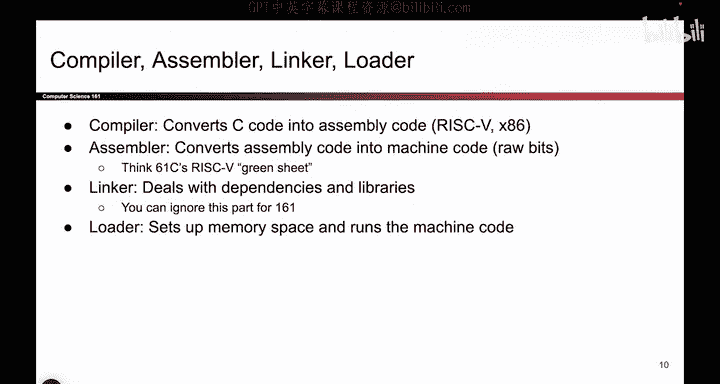
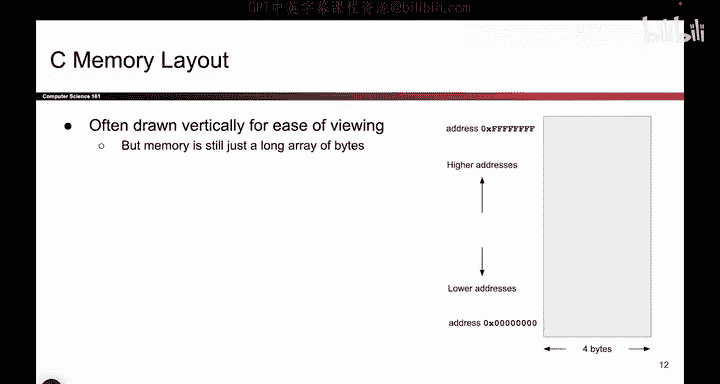

# 016：运行C程序

在本节课中，我们将要学习C程序是如何在计算机上实际运行的。我们将从编写好的C代码开始，一步步了解它如何被转换为计算机能够理解和执行的机器指令。同时，我们也会探讨程序运行时，操作系统为其分配的内存空间是什么样子的。

## 从C代码到机器指令

上一节我们介绍了数字在内存中的表示。本节中我们来看看如何运行一个C程序。


假设你已经写好了一段C程序，你的计算机会采取哪些步骤来运行它呢？以下是运行C程序的基本流程：

1.  **编写C代码**：你从编写C语言源代码开始。
2.  **编译**：编译器会将你的C代码翻译成一种更低级的语言，称为**汇编代码**。汇编语言有多种，例如RISC-V或x86。本课程将使用x86汇编语言。
3.  **汇编**：汇编器会接收汇编代码，并将其转换为**机器码**。机器码完全由原始的比特位（0和1）组成，是计算机CPU能够直接理解和执行的指令。

这个过程可以用以下伪代码流程表示：
```
C源代码 -> 编译器 -> 汇编代码 -> 汇编器 -> 机器码（0和1）
```


在CS61C等课程中，你可能还见过一个叫做**链接器**的步骤，它负责处理程序间的依赖关系。但在本课程中，我们暂时不涉及链接器。

最后，**加载器**会为你的程序设置好可用的内存空间，用于存储数据和变量，并开始执行你生成的机器码。

## 程序的内存空间布局



如果加载器会设置内存空间，那么这个空间具体是什么样子的呢？如果程序需要存储变量和代码，内存空间是如何组织的？

当程序启动并准备执行时，操作系统会分配一大块内存给你的程序。你可以把它想象成一个巨大的字节数组。这个数组中的每个“格子”恰好能存放1个字节的数据，并且每个格子都有一个唯一的索引，我们称之为**内存地址**。

因此，内存就像一个巨大的字节数组：最低地址（例如全0）位于数组起始处，最高地址（例如全1）位于数组末尾。本课程中，我们使用32位系统，这意味着每个地址的长度是32位（4字节）。由于每个字节都有一个唯一的32位地址，所以总共可以寻址 `2^32` 个字节的内存空间。

## 内存的可视化表示

虽然从计算机的角度看，内存就是一个从全0地址到全1地址的一维大数组，但这样画图对我们人类来说不太直观。


因此，在本课程中，为了便于理解和阅读，我们将内存绘制成一个二维网格。请注意，这只是为了我们看图方便，计算机本身并不知道什么行和列，它依然将其视为一个连续的一维数组。

我们绘制内存的约定如下：
*   最低地址位于网格的**左下角**。
*   最高地址位于网格的**右上角**。
*   地址从左到右、从下到上增长。
*   每一行代表4个字节。

这种可视化方式能让我们更轻松地理解内存布局图。

---



本节课中我们一起学习了C程序从源代码到可执行文件的转换过程，包括编译、汇编等关键步骤。同时，我们也了解了程序运行时内存空间的基本模型——一个巨大的、可按字节寻址的数组，并学习了如何用二维网格来直观地表示它，为后续深入理解内存操作打下了基础。